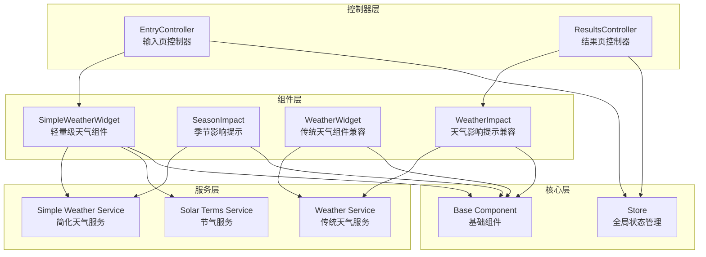
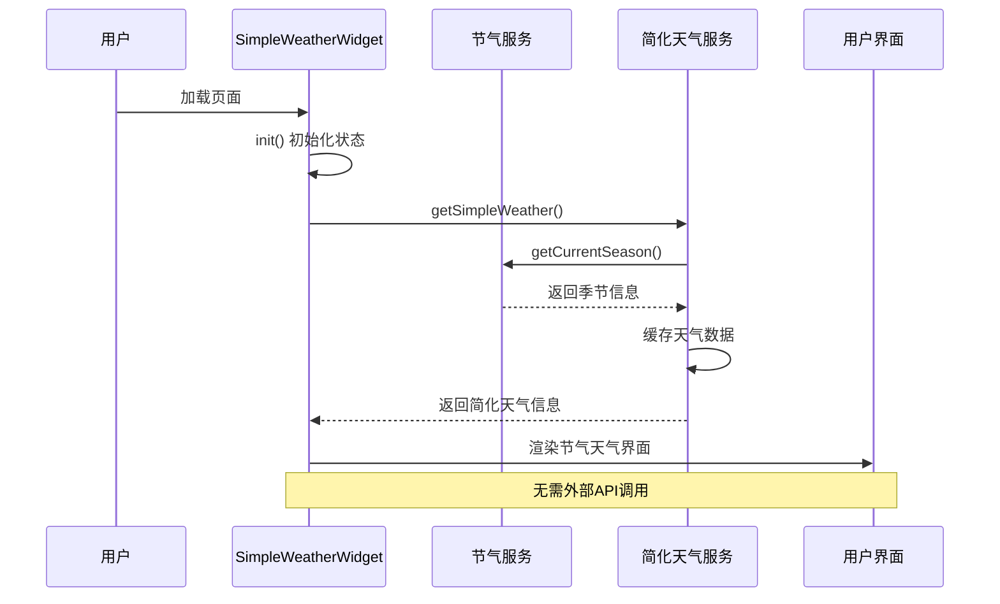
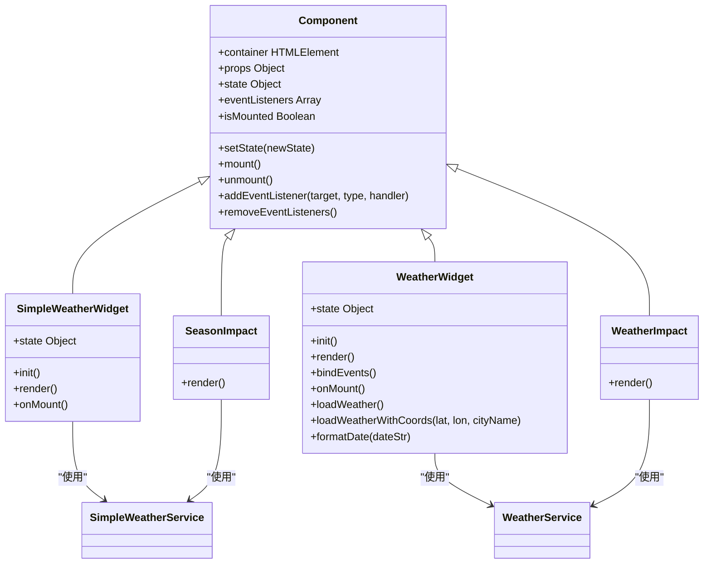
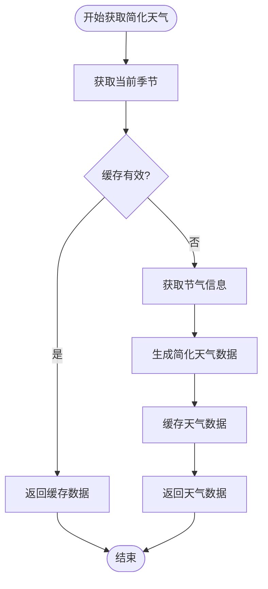
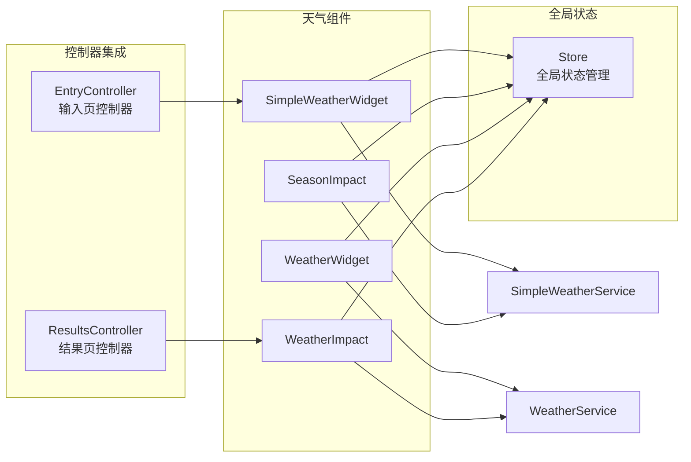
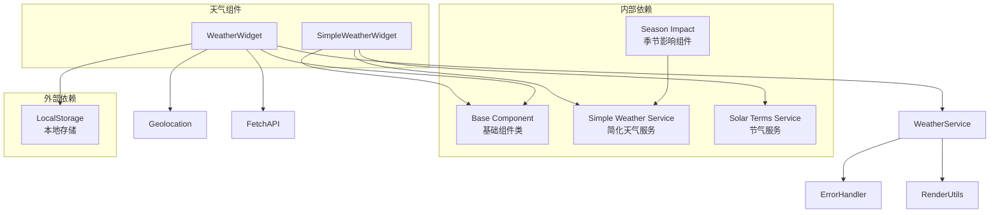
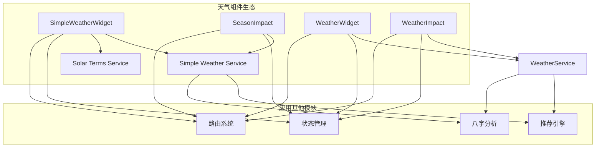

# 天气组件

<cite>
**本文档引用的文件**
- [simple-weather-widget.js](file://js/components/simple-weather-widget.js)
- [simple-weather.js](file://js/services/simple-weather.js)
- [weather-widget.js](file://js/components/weather-widget.js)
- [weather.js](file://js/services/weather.js)
- [base.js](file://js/components/base.js)
- [store.js](file://js/core/store.js)
- [entry.js](file://js/controllers/entry.js)
- [results.js](file://js/controllers/results.js)
- [components.css](file://css/components.css)
</cite>

## 更新摘要
**变更内容**
- 原有WeatherWidget组件已被SimpleWeatherWidget完全替代
- 新系统采用基于中国传统节气的轻量级天气预测
- 消除外部API依赖，实现本地化天气数据生成
- 更新控制器集成，从WeatherWidget迁移到SimpleWeatherWidget
- 新增SeasonImpact组件用于显示季节影响

## 目录
1. [简介](#简介)
2. [项目结构](#项目结构)
3. [核心组件](#核心组件)
4. [架构概览](#架构概览)
5. [详细组件分析](#详细组件分析)
6. [依赖关系分析](#依赖关系分析)
7. [性能考虑](#性能考虑)
8. [故障排除指南](#故障排除指南)
9. [结论](#结论)
10. [附录](#附录)

## 简介

天气组件是"顺时裳"应用中的核心功能模块，负责获取基于中国传统节气的天气数据并提供相应的穿搭建议。该组件采用现代化的前端架构设计，集成了节气算法、本地天气数据生成和用户界面渲染等功能。

**更新** 新系统采用基于中国传统节气的轻量级天气预测，消除了对外部API的依赖，实现了完全本地化的天气数据生成。

组件的主要目标是：
- 基于当前日期自动推断季节和节气
- 提供符合传统节气的天气信息和穿搭建议
- 展示节气对推荐方案的影响程度
- 支持实时的季节变化和节气更新

## 项目结构

天气组件位于项目的组件系统中，采用模块化设计，与应用的其他模块紧密集成。新架构中，SimpleWeatherWidget完全替代了原有的WeatherWidget组件。



**图表来源**
- [simple-weather-widget.js](file://js/components/simple-weather-widget.js#L1-L81)
- [simple-weather.js](file://js/services/simple-weather.js#L1-L173)
- [weather-widget.js](file://js/components/weather-widget.js#L1-L215)
- [weather.js](file://js/services/weather.js#L1-L340)
- [entry.js](file://js/controllers/entry.js#L54-L60)
- [results.js](file://js/controllers/results.js#L217-L233)

**章节来源**
- [simple-weather-widget.js](file://js/components/simple-weather-widget.js#L1-L81)
- [simple-weather.js](file://js/services/simple-weather.js#L1-L173)
- [weather-widget.js](file://js/components/weather-widget.js#L1-L215)

## 核心组件

天气组件现在由两个主要类组成：SimpleWeatherWidget和WeatherWidget，它们协同工作提供完整的天气功能。

### SimpleWeatherWidget 组件

**更新** SimpleWeatherWidget是全新的轻量级天气组件，负责：
- 基于当前日期自动推断季节和节气
- 获取和显示基于节气的天气信息
- 处理用户交互（手动刷新）
- 渲染节气相关的天气信息和穿搭建议

### SeasonImpact 组件

**新增** SeasonImpact专门用于在推荐结果中显示季节对穿搭方案的影响：
- 计算并显示季节适配加分
- 展示具体的季节条件和温度范围
- 与推荐系统集成，提供动态评分

### 兼容性组件

**保留** WeatherWidget和WeatherImpact组件仍保留用于兼容传统天气数据：
- 支持原有的天气API调用
- 维持相同的接口以便迁移
- 为渐进式升级提供过渡

**章节来源**
- [simple-weather-widget.js](file://js/components/simple-weather-widget.js#L9-L81)
- [weather-widget.js](file://js/components/weather-widget.js#L12-L214)

## 架构概览

**更新** 天气组件采用分层架构设计，确保了良好的模块分离和可维护性。新架构完全消除了对外部API的依赖。



**图表来源**
- [simple-weather-widget.js](file://js/components/simple-weather-widget.js#L50-L54)
- [simple-weather.js](file://js/services/simple-weather.js#L78-L117)

## 详细组件分析

### SimpleWeatherWidget 类分析

**更新** SimpleWeatherWidget继承自基础组件类，实现了完整的生命周期管理，并采用本地化的天气数据生成。



**图表来源**
- [base.js](file://js/components/base.js#L9-L106)
- [simple-weather-widget.js](file://js/components/simple-weather-widget.js#L9-L81)
- [weather-widget.js](file://js/components/weather-widget.js#L12-L214)

#### 状态管理

SimpleWeatherWidget维护以下关键状态：
- `loading`: 控制加载状态显示（立即完成）
- `weather`: 包含当前季节、节气和天气信息

#### 渲染逻辑

组件支持两种渲染状态：
1. **加载状态**: 显示占位符内容
2. **正常状态**: 展示完整的节气天气信息和建议

#### 用户交互

组件处理以下用户交互：
- **数据刷新**: 支持重新获取最新天气数据
- **缓存管理**: 自动处理数据缓存和过期

**章节来源**
- [simple-weather-widget.js](file://js/components/simple-weather-widget.js#L10-L15)
- [simple-weather-widget.js](file://js/components/simple-weather-widget.js#L17-L48)
- [simple-weather-widget.js](file://js/components/simple-weather-widget.js#L50-L54)

### 简化天气服务分析

**更新** 简化天气服务提供了完整的本地化天气数据获取和处理功能。



**图表来源**
- [simple-weather.js](file://js/services/simple-weather.js#L78-L117)
- [simple-weather.js](file://js/services/simple-weather.js#L124-L133)

#### 天气数据生成

简化天气服务使用节气算法生成数据：
- **季节推断**: 基于当前月份推断季节
- **节气映射**: 将月份映射到对应的节气
- **材料推荐**: 根据季节推荐合适的面料
- **颜色建议**: 推荐适合当前季节的颜色

#### 数据缓存策略

服务实现了智能缓存机制：
- **缓存时间**: 30分钟有效期
- **缓存键**: 基于时间戳的缓存键
- **自动更新**: 过期后自动重新生成

#### 季节推荐系统

基于节气提供穿搭建议：
- **材质推荐**: 根据季节选择合适的面料
- **颜色建议**: 推荐适合当前季节的颜色
- **温度范围**: 提供季节性的温度范围
- **节气提示**: 显示当前节气信息

**章节来源**
- [simple-weather.js](file://js/services/simple-weather.js#L8-L50)
- [simple-weather.js](file://js/services/simple-weather.js#L78-L117)
- [simple-weather.js](file://js/services/simple-weather.js#L124-L173)

### 与控制器的集成

**更新** 天气组件与应用的控制器紧密集成，确保功能的完整性和用户体验的一致性。



**图表来源**
- [entry.js](file://js/controllers/entry.js#L54-L60)
- [results.js](file://js/controllers/results.js#L217-L233)

#### 输入页集成

在输入页中，SimpleWeatherWidget负责：
- 自动获取当前季节和节气
- 显示节气相关的天气信息和建议
- 提供手动刷新功能
- 支持缓存管理

#### 结果页集成

在结果页中，WeatherImpact负责：
- 计算天气对推荐方案的影响
- 显示具体的加分效果
- 与推荐系统动态集成
- 提供实时的天气影响分析

**章节来源**
- [entry.js](file://js/controllers/entry.js#L54-L60)
- [results.js](file://js/controllers/results.js#L217-L233)

## 依赖关系分析

**更新** 天气组件的依赖关系更加简洁，消除了对外部API的依赖。



**图表来源**
- [simple-weather-widget.js](file://js/components/simple-weather-widget.js#L6-L7)
- [simple-weather.js](file://js/services/simple-weather.js#L6)
- [weather-widget.js](file://js/components/weather-widget.js#L6-L7)
- [weather.js](file://js/services/weather.js#L6)

### 内部依赖

- **基础组件**: 提供组件生命周期管理
- **简化天气服务**: 封装所有简化天气相关的业务逻辑
- **节气服务**: 提供节气相关的日期计算
- **季节影响组件**: 专门处理季节影响的显示

### 外部依赖

- **本地存储**: 用于缓存和持久化数据
- **浏览器API**: 仅使用标准的JavaScript API

**章节来源**
- [simple-weather-widget.js](file://js/components/simple-weather-widget.js#L6-L7)
- [simple-weather.js](file://js/services/simple-weather.js#L6)

## 性能考虑

**更新** 天气组件在设计时充分考虑了性能优化，特别是消除了外部API调用的延迟。

### 缓存策略
- **智能缓存**: 30分钟有效期的天气数据缓存
- **本地计算**: 所有天气数据在本地生成，无网络延迟
- **组件状态缓存**: 避免不必要的重新渲染

### 异步处理
- **即时渲染**: 组件立即显示，无需等待数据加载
- **缓存优先**: 优先使用缓存数据，提升用户体验
- **错误降级**: 失败时提供默认的节气数据

### 内存管理
- **事件监听器清理**: 组件卸载时自动清理事件监听
- **定时器管理**: 避免内存泄漏
- **DOM元素管理**: 合理的DOM操作和清理

## 故障排除指南

### 常见问题及解决方案

#### 节气数据不准确
**症状**: 显示的节气与实际不符
**原因**: 日期计算或时区设置问题
**解决方案**:
1. 检查系统时间和时区设置
2. 确认节气映射表的正确性
3. 验证当前日期的准确性

#### 缓存数据过期
**症状**: 显示过时的天气信息
**原因**: 缓存时间超过30分钟
**解决方案**:
1. 等待缓存自动更新
2. 手动刷新页面强制重新生成
3. 检查系统时间是否正确

#### 样式显示异常
**症状**: 节气天气组件显示样式错误
**原因**: CSS样式未正确加载
**解决方案**:
1. 检查CSS文件是否正确引入
2. 验证节气相关的CSS类是否存在
3. 确认样式优先级设置

**章节来源**
- [simple-weather-widget.js](file://js/components/simple-weather-widget.js#L17-L48)
- [simple-weather.js](file://js/services/simple-weather.js#L78-L117)

## 结论

**更新** 天气组件经过重构后，成功地将传统节气文化与现代Web技术相结合，为用户提供智能化且完全本地化的天气建议。组件设计具有以下特点：

### 技术优势
- **本地化处理**: 完全消除外部API依赖，提升性能和可靠性
- **智能缓存**: 30分钟智能缓存机制，平衡数据新鲜度和性能
- **模块化设计**: 清晰的职责分离和依赖管理
- **兼容性保证**: 保留传统WeatherWidget组件用于渐进式迁移
- **错误处理**: 完善的错误捕获和降级机制

### 用户体验
- **即时响应**: 组件立即显示，无需等待数据加载
- **文化融合**: 将传统节气理论与现代科技完美结合
- **信息丰富**: 提供详细的节气信息和穿搭建议
- **实时性强**: 支持节气的动态更新

### 业务价值
- **个性化推荐**: 基于节气提供定制化建议
- **文化传承**: 促进中国传统节气文化的传播
- **实用性强**: 直接影响用户的日常生活决策
- **成本效益**: 消除API费用，降低运营成本

## 附录

### 使用示例

#### 在输入页中集成
```javascript
// 在控制器中初始化简化天气组件
initWeatherWidget() {
    const container = document.getElementById('weather-widget-container');
    if (container) {
        this.weatherWidget = new SimpleWeatherWidget(container);
        this.weatherWidget.mount();
    }
}
```

#### 在结果页中使用天气影响
```javascript
// 计算并显示天气对推荐的影响
renderWeatherImpact(result) {
    const scheme = result.schemes?.[0];
    if (scheme) {
        const boost = calculateWeatherBoost(scheme, result.weather.current);
        if (boost > 0) {
            const weatherImpact = new WeatherImpact(container, {
                weather: result.weather.current,
                boost
            });
            weatherImpact.mount();
        }
    }
}
```

### 配置选项

#### 显示模式
- **自动模式**: 基于当前日期自动推断节气
- **静态模式**: 显示固定节气的天气信息

#### 数据更新频率
- **实时更新**: 每次进入页面时刷新
- **定时更新**: 每30分钟自动刷新
- **手动刷新**: 用户点击刷新按钮

#### 样式定制
- **主题颜色**: 基于季节自动选择
- **字体大小**: 响应式字体调整
- **布局方式**: 灵活的布局配置

### 与其他组件的协作

**更新** 天气组件与应用的其他模块形成了完整的生态系统：



**图表来源**
- [simple-weather-widget.js](file://js/components/simple-weather-widget.js#L6-L7)
- [simple-weather.js](file://js/services/simple-weather.js#L6)
- [weather-widget.js](file://js/components/weather-widget.js#L6-L7)
- [weather.js](file://js/services/weather.js#L6)