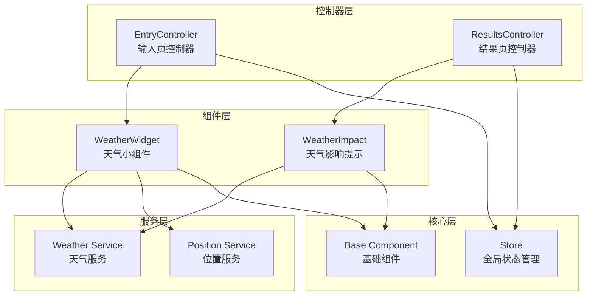
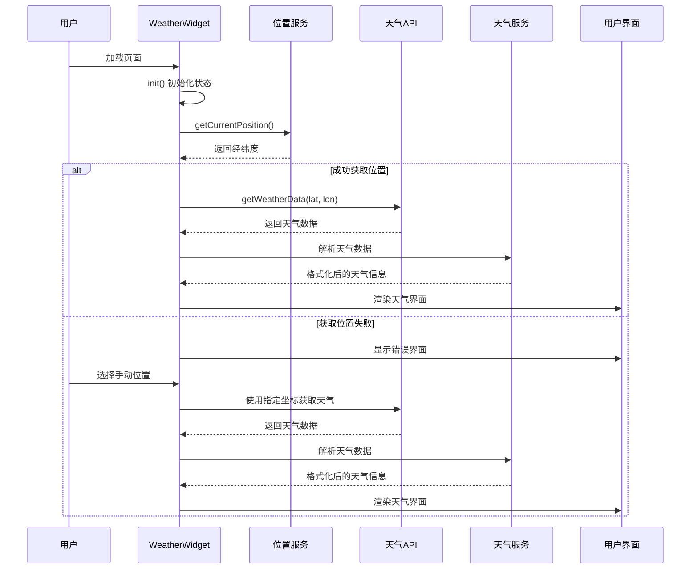
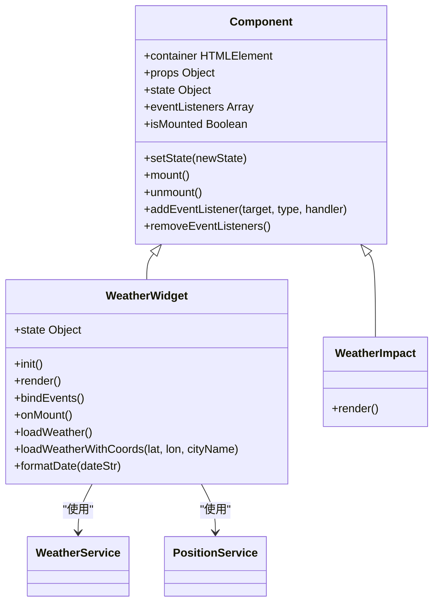
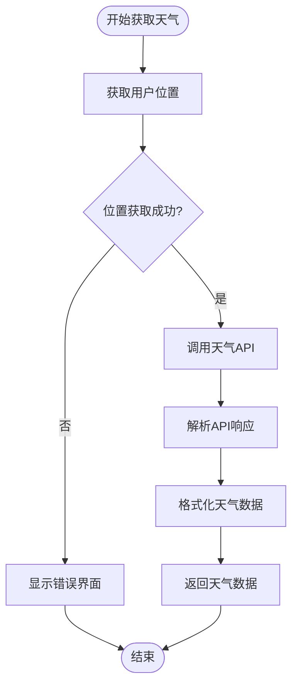
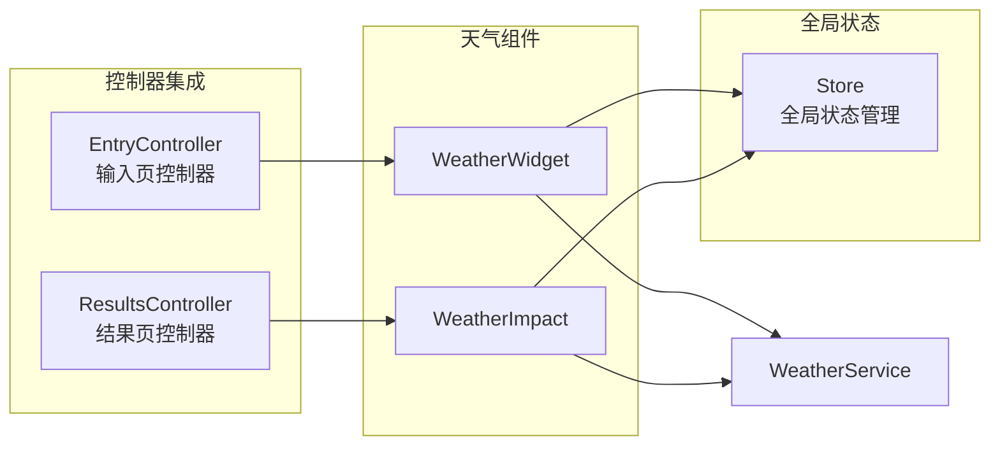
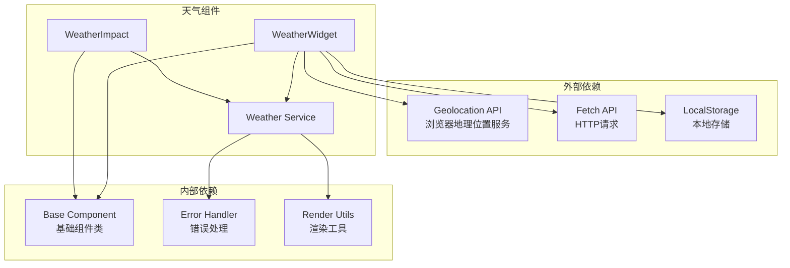
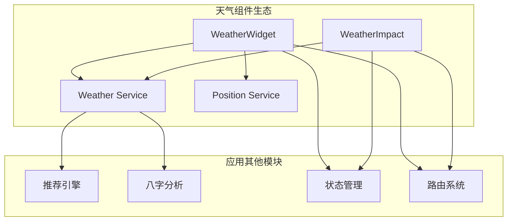

# 天气组件

<cite>
**本文档引用的文件**
- [weather-widget.js](file://js/components/weather-widget.js)
- [weather.js](file://js/services/weather.js)
- [base.js](file://js/components/base.js)
- [store.js](file://js/core/store.js)
- [entry.js](file://js/controllers/entry.js)
- [results.js](file://js/controllers/results.js)
- [components.css](file://css/components.css)
</cite>

## 目录
1. [简介](#简介)
2. [项目结构](#项目结构)
3. [核心组件](#核心组件)
4. [架构概览](#架构概览)
5. [详细组件分析](#详细组件分析)
6. [依赖关系分析](#依赖关系分析)
7. [性能考虑](#性能考虑)
8. [故障排除指南](#故障排除指南)
9. [结论](#结论)
10. [附录](#附录)

## 简介

天气组件是"顺时裳"应用中的核心功能模块，负责获取实时天气数据并提供基于天气的穿搭建议。该组件采用现代化的前端架构设计，集成了地理位置服务、天气API调用、数据格式化和用户界面渲染等功能。

组件的主要目标是：
- 自动获取用户当前位置的天气信息
- 提供基于天气条件的个性化穿搭建议
- 展示天气对推荐方案的影响程度
- 支持手动位置选择和数据刷新功能

## 项目结构

天气组件位于项目的组件系统中，采用模块化设计，与应用的其他模块紧密集成。



**图表来源**
- [weather-widget.js](file://js/components/weather-widget.js#L12-L194)
- [weather.js](file://js/services/weather.js#L87-L138)
- [entry.js](file://js/controllers/entry.js#L14-L60)
- [results.js](file://js/controllers/results.js#L13-L46)

**章节来源**
- [weather-widget.js](file://js/components/weather-widget.js#L1-L215)
- [weather.js](file://js/services/weather.js#L1-L340)

## 核心组件

天气组件由两个主要类组成：WeatherWidget和WeatherImpact，它们协同工作提供完整的天气功能。

### WeatherWidget 组件

WeatherWidget是天气组件的核心，负责：
- 管理组件状态（加载、错误、天气数据、位置信息）
- 获取和显示实时天气数据
- 处理用户交互（位置选择、手动刷新）
- 渲染天气信息和穿搭建议

### WeatherImpact 组件

WeatherImpact专门用于在推荐结果中显示天气对穿搭方案的影响：
- 计算并显示天气适配加分
- 展示具体的天气条件和温度信息
- 与推荐系统集成，提供动态评分

**章节来源**
- [weather-widget.js](file://js/components/weather-widget.js#L12-L194)
- [weather-widget.js](file://js/components/weather-widget.js#L200-L214)

## 架构概览

天气组件采用分层架构设计，确保了良好的模块分离和可维护性。



**图表来源**
- [weather-widget.js](file://js/components/weather-widget.js#L137-L181)
- [weather.js](file://js/services/weather.js#L87-L138)

## 详细组件分析

### WeatherWidget 类分析

WeatherWidget继承自基础组件类，实现了完整的生命周期管理。



**图表来源**
- [base.js](file://js/components/base.js#L9-L106)
- [weather-widget.js](file://js/components/weather-widget.js#L12-L194)
- [weather-widget.js](file://js/components/weather-widget.js#L200-L214)

#### 状态管理

WeatherWidget维护以下关键状态：
- `loading`: 控制加载状态显示
- `error`: 存储错误信息
- `weather`: 包含当前天气和未来几天预报
- `location`: 当前位置信息

#### 渲染逻辑

组件支持三种渲染状态：
1. **加载状态**: 显示旋转指示器和加载文本
2. **错误状态**: 显示错误信息和手动位置选择
3. **正常状态**: 展示完整的天气信息和建议

#### 用户交互

组件处理以下用户交互：
- **重试定位**: 当自动定位失败时，用户可以点击重试
- **手动位置选择**: 通过下拉菜单选择预设城市
- **数据刷新**: 支持重新获取最新天气数据

**章节来源**
- [weather-widget.js](file://js/components/weather-widget.js#L13-L20)
- [weather-widget.js](file://js/components/weather-widget.js#L22-L117)
- [weather-widget.js](file://js/components/weather-widget.js#L119-L135)

### 天气服务分析

天气服务提供了完整的天气数据获取和处理功能。



**图表来源**
- [weather.js](file://js/services/weather.js#L119-L129)
- [weather.js](file://js/services/weather.js#L145-L177)

#### 天气数据获取

天气服务使用Open-Meteo API获取数据：
- **当前天气**: 温度、湿度、天气代码
- **未来预报**: 最高温度、最低温度、天气代码
- **时间范围**: 未来7天的数据

#### 数据格式化

服务将原始API数据转换为应用可用的格式：
- **天气代码映射**: 将数值代码转换为中文名称和图标
- **温度处理**: 四舍五入到整数
- **类型分类**: 根据天气条件分类（晴天、多云、雨天等）

#### 天气推荐系统

基于天气条件提供穿搭建议：
- **材质推荐**: 根据天气选择合适的面料
- **颜色建议**: 推荐适合当前天气的颜色
- **温度调整**: 根据具体温度提供额外建议
- **雨具提示**: 雨天时提醒携带雨具

**章节来源**
- [weather.js](file://js/services/weather.js#L8-L85)
- [weather.js](file://js/services/weather.js#L119-L177)
- [weather.js](file://js/services/weather.js#L184-L260)

### 与控制器的集成

天气组件与应用的控制器紧密集成，确保功能的完整性和用户体验的一致性。



**图表来源**
- [entry.js](file://js/controllers/entry.js#L54-L60)
- [results.js](file://js/controllers/results.js#L217-L233)

#### 输入页集成

在输入页中，WeatherWidget负责：
- 自动获取用户当前位置
- 显示天气信息和基本建议
- 提供手动位置选择功能
- 支持数据刷新

#### 结果页集成

在结果页中，WeatherImpact负责：
- 计算天气对推荐方案的影响
- 显示具体的加分效果
- 与推荐系统动态集成
- 提供实时的天气影响分析

**章节来源**
- [entry.js](file://js/controllers/entry.js#L54-L60)
- [results.js](file://js/controllers/results.js#L217-L233)

## 依赖关系分析

天气组件的依赖关系清晰明确，遵循单一职责原则。



**图表来源**
- [weather-widget.js](file://js/components/weather-widget.js#L6-L7)
- [weather.js](file://js/services/weather.js#L6)

### 内部依赖

- **基础组件**: 提供组件生命周期管理
- **天气服务**: 封装所有天气相关的业务逻辑
- **错误处理**: 统一的错误捕获和处理机制

### 外部依赖

- **地理位置服务**: 浏览器原生的Geolocation API
- **网络请求**: Fetch API进行HTTP通信
- **本地存储**: 用于缓存和持久化数据

**章节来源**
- [weather-widget.js](file://js/components/weather-widget.js#L6-L7)
- [weather.js](file://js/services/weather.js#L6)

## 性能考虑

天气组件在设计时充分考虑了性能优化：

### 缓存策略
- **位置缓存**: 用户位置信息在一定时间内缓存
- **天气数据缓存**: 最近获取的天气数据进行短期缓存
- **组件状态缓存**: 避免不必要的重新渲染

### 异步处理
- **非阻塞加载**: 天气数据获取不影响页面其他功能
- **超时控制**: 设置合理的请求超时时间
- **错误降级**: 失败时提供备用方案

### 内存管理
- **事件监听器清理**: 组件卸载时自动清理事件监听
- **定时器管理**: 避免内存泄漏
- **DOM元素管理**: 合理的DOM操作和清理

## 故障排除指南

### 常见问题及解决方案

#### 位置获取失败
**症状**: 显示错误界面，无法获取天气数据
**原因**: 浏览器不支持地理位置服务或用户拒绝授权
**解决方案**:
1. 检查浏览器地理位置权限设置
2. 确保使用HTTPS协议访问
3. 提示用户手动选择位置

#### 天气API调用失败
**症状**: 请求超时或返回错误状态码
**原因**: 网络连接问题或API服务不可用
**解决方案**:
1. 检查网络连接状态
2. 查看API服务状态
3. 实施重试机制

#### 数据格式化错误
**症状**: 天气数据显示异常或缺失
**原因**: API响应格式变化或数据解析错误
**解决方案**:
1. 检查API响应格式
2. 实施数据验证
3. 提供默认值处理

**章节来源**
- [weather-widget.js](file://js/components/weather-widget.js#L141-L162)
- [weather.js](file://js/services/weather.js#L87-L111)

## 结论

天气组件是"顺时裳"应用的重要组成部分，它成功地将现代Web技术与传统五行理论相结合，为用户提供智能化的穿搭建议。组件设计具有以下特点：

### 技术优势
- **模块化设计**: 清晰的职责分离和依赖管理
- **异步处理**: 良好的用户体验和性能表现
- **错误处理**: 完善的错误捕获和降级机制
- **可扩展性**: 易于添加新功能和修改现有逻辑

### 用户体验
- **自动化程度高**: 自动获取位置和天气数据
- **交互友好**: 直观的手动位置选择和刷新功能
- **信息丰富**: 提供详细的天气信息和穿搭建议
- **实时性强**: 支持数据的动态更新

### 业务价值
- **个性化推荐**: 基于天气条件提供定制化建议
- **文化融合**: 将传统五行理论与现代科技结合
- **实用性强**: 直接影响用户的日常生活决策

## 附录

### 使用示例

#### 在输入页中集成
```javascript
// 在控制器中初始化天气组件
initWeatherWidget() {
    const container = document.getElementById('weather-widget-container');
    if (container) {
        this.weatherWidget = new WeatherWidget(container);
        this.weatherWidget.mount();
    }
}
```

#### 在结果页中使用天气影响
```javascript
// 计算并显示天气对推荐的影响
renderWeatherImpact(result) {
    const scheme = result.schemes?.[0];
    if (scheme) {
        const boost = calculateWeatherBoost(scheme, result.weather.current);
        if (boost > 0) {
            const weatherImpact = new WeatherImpact(container, {
                weather: result.weather.current,
                boost
            });
            weatherImpact.mount();
        }
    }
}
```

### 配置选项

#### 显示模式
- **自动模式**: 自动获取位置和天气数据
- **手动模式**: 用户手动选择位置
- **静态模式**: 显示固定位置的天气信息

#### 数据更新频率
- **实时更新**: 每次进入页面时刷新
- **定时更新**: 每30分钟自动刷新
- **手动刷新**: 用户点击刷新按钮

#### 样式定制
- **主题颜色**: 基于天气类型自动选择
- **字体大小**: 响应式字体调整
- **布局方式**: 灵活的布局配置

### 与其他组件的协作

天气组件与应用的其他模块形成了完整的生态系统：



**图表来源**
- [weather-widget.js](file://js/components/weather-widget.js#L6-L7)
- [weather.js](file://js/services/weather.js#L1-L340)