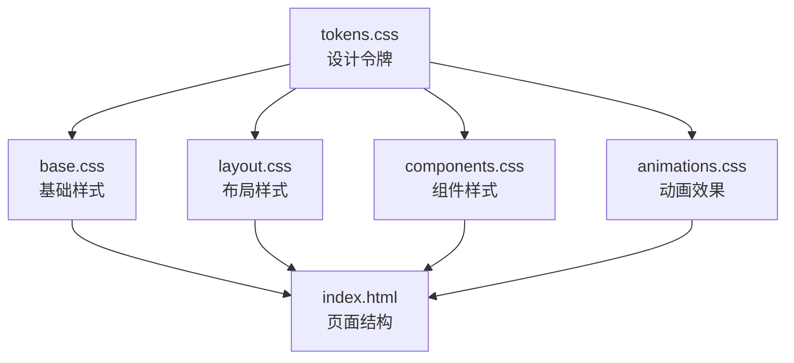
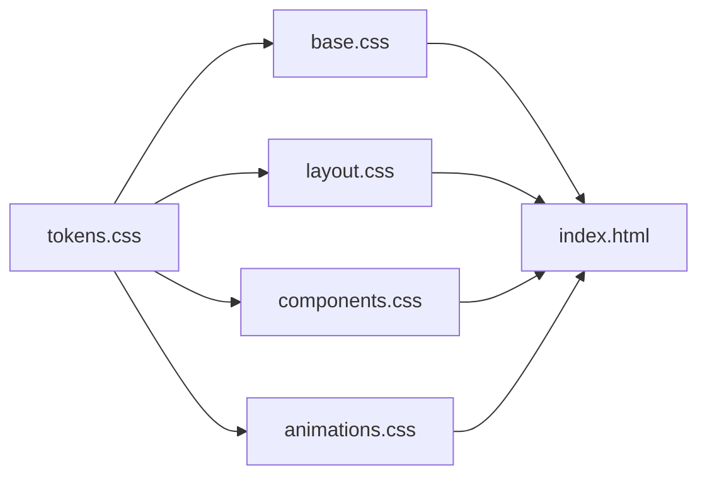
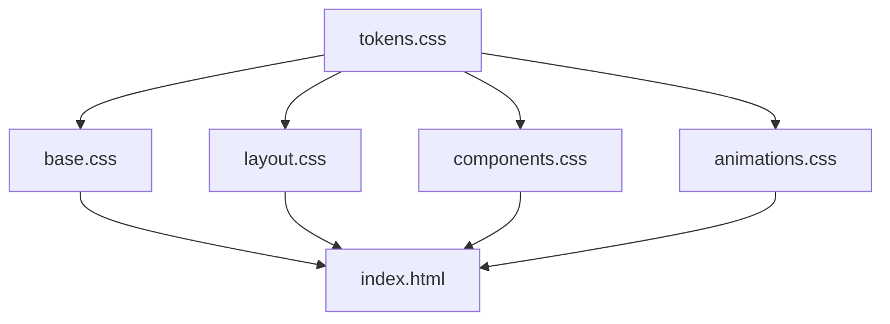

# 样式系统

<cite>
**本文引用的文件**
- [tokens.css](file://css/tokens.css)
- [base.css](file://css/base.css)
- [layout.css](file://css/layout.css)
- [components.css](file://css/components.css)
- [animations.css](file://css/animations.css)
- [index.html](file://index.html)
</cite>

## 目录
1. [简介](#简介)
2. [项目结构](#项目结构)
3. [核心组件](#核心组件)
4. [架构总览](#架构总览)
5. [详细组件分析](#详细组件分析)
6. [依赖关系分析](#依赖关系分析)
7. [性能考虑](#性能考虑)
8. [故障排查指南](#故障排查指南)
9. [结论](#结论)
10. [附录](#附录)

## 简介
本样式系统围绕“五行穿搭建议”项目构建，采用分层模块化组织：设计令牌(tokens.css)定义全局设计变量；基础样式(base.css)提供重置与通用排版；布局样式(layout.css)负责页面结构与响应式网格；组件样式(components.css)实现按钮、卡片、模态框等交互组件；动画样式(animations.css)提供过渡与交互动效。该系统强调一致性、可维护性与可扩展性，并通过 CSS 变量与原子化类名提升主题定制能力。

## 项目结构
样式系统由五个独立的 CSS 文件组成，按功能域划分职责：
- tokens.css：设计令牌（颜色、字体、间距、圆角、阴影、动画、Z-Index、断点）
- base.css：CSS 重置、通用组件样式、基础排版、无障碍与滚动条
- layout.css：页面整体布局、容器设计、视图系统、响应式网格
- components.css：按钮、标签、卡片、上传区、模态框、骨架屏
- animations.css：关键帧动画、视图切换、组件动效、减少运动偏好

图表来源
- [tokens.css](file://css/tokens.css#L5-L108)
- [base.css](file://css/base.css#L5-L167)
- [layout.css](file://css/layout.css#L5-L251)
- [components.css](file://css/components.css#L5-L337)
- [animations.css](file://css/animations.css#L5-L206)
- [index.html](file://index.html#L13-L18)

章节来源
- [index.html](file://index.html#L13-L18)

## 核心组件
本节概述各样式文件的核心职责与关键特性，便于快速定位与使用。

- 设计令牌(tokens.css)
  - 定义五行为主的色彩系统与中性色、功能色
  - 提供字体族、字号、行高、间距网格、圆角、阴影、动画时长与缓动曲线
  - 定义 Z-Index 层级与参考断点
- 基础样式(base.css)
  - 全局重置与排版基线
  - 表单控件统一风格与焦点状态
  - 无障碍焦点可见性、滚动条美化、文本选择样式
  - 常用工具类（隐藏、不可见、居中、次级文字）
- 布局样式(layout.css)
  - 视图系统(view)与页面容器(app-container)
  - 欢迎页、输入页、结果页、上传页的结构与间距
  - 响应式网格（平板与桌面端）
  - 固定免责声明与隐私徽章
- 组件样式(components.css)
  - 按钮变体（主/次/幽灵）、尺寸、图标按钮
  - 心愿标签（激活态动效）
  - 方案卡片（悬停提升、阴影变化、关键词标签）
  - 上传区域（拖拽态、占位提示、预览、移除按钮）
  - 模态框（背景遮罩、内容区、头部/主体/关闭按钮）
  - 骨架屏（渐变扫描动画）
- 动画效果(animations.css)
  - 关键帧：淡入、上浮、缩放、滑入左右、脉冲、旋转、闪烁
  - 视图切换与卡片交错入场
  - 按钮波纹、心愿标签弹跳、上传区域脉冲
  - 加载指示器（旋转）
  - 工具类动画类名
  - 减少运动偏好媒体查询

章节来源
- [tokens.css](file://css/tokens.css#L5-L108)
- [base.css](file://css/base.css#L5-L167)
- [layout.css](file://css/layout.css#L5-L251)
- [components.css](file://css/components.css#L5-L337)
- [animations.css](file://css/animations.css#L5-L206)

## 架构总览
下图展示样式系统在页面中的装配关系与依赖顺序，确保变量先于使用、基础样式先于布局与组件、动画在最后生效。

图表来源
- [tokens.css](file://css/tokens.css#L5-L108)
- [base.css](file://css/base.css#L5-L167)
- [layout.css](file://css/layout.css#L5-L251)
- [components.css](file://css/components.css#L5-L337)
- [animations.css](file://css/animations.css#L5-L206)
- [index.html](file://index.html#L13-L18)

## 详细组件分析

### 设计令牌系统(tokens.css)
- 颜色体系
  - 五行为一组主色与明暗变体，配合中性色与功能色（成功/警告/错误/信息）
  - 适用于按钮、标签、边框、阴影等组件状态映射
- 字体与排版
  - 显示字体用于标题，正文/等宽字体用于正文与代码
  - 多级字号与行高，适配不同语境
- 间距系统
  - 基于 4px 网格的离散间距变量，保证对齐与视觉节奏一致
- 视觉修饰
  - 圆角、阴影、动画时长与缓动曲线，统一组件过渡与交互反馈
- 层级与断点
  - Z-Index 分层，避免层级冲突
  - 断点注释作为参考，便于扩展响应式策略

变量使用示例（路径）
- 颜色：[base.css](file://css/base.css#L46-L53)、[components.css](file://css/components.css#L19-L26)
- 字体：[base.css](file://css/base.css#L30-L43)、[layout.css](file://css/layout.css#L58-L62)
- 间距：[layout.css](file://css/layout.css#L15-L32)、[components.css](file://css/components.css#L11-L16)
- 圆角/阴影：[components.css](file://css/components.css#L90-L102)
- 动画：[animations.css](file://css/animations.css#L96-L124)

章节来源
- [tokens.css](file://css/tokens.css#L5-L108)

### 基础样式(base.css)
- 重置与排版
  - 统一盒模型、去除默认内外边距
  - 文档与正文设置字体、字号、行高与背景色
  - 标题系列使用显示字体与紧凑行高
- 链接与列表
  - 链接颜色与悬停过渡
  - 列表样式重置
- 图片与媒体
  - 图片与 SVG 最大宽度自适应
- 表单控件
  - 输入/选择/文本域继承字体与行高
  - 聚焦态强调色与阴影
  - 下拉箭头通过背景 SVG 实现
  - 文本域允许纵向调整
- 无障碍与滚动条
  - :focus-visible 强调焦点轮廓
  - 自定义滚动条颜色与圆角
- 工具类
  - 隐藏/不可见/居中/次级文字

类名说明（路径）
- 链接：[base.css](file://css/base.css#L45-L53)
- 输入聚焦：[base.css](file://css/base.css#L90-L94)
- 下拉箭头：[base.css](file://css/base.css#L96-L102)
- 焦点可见：[base.css](file://css/base.css#L110-L113)
- 工具类：[base.css](file://css/base.css#L152-L167)

章节来源
- [base.css](file://css/base.css#L5-L167)

### 布局样式(layout.css)
- 页面容器与视图系统
  - app-container 最小高度与底部留白
  - view 视图容器最小高度、内边距与弹性布局
- 欢迎页
  - 居中布局、标题/副标题、节气横幅（元素标签）
- 输入页/结果页/上传页
  - 头部与主体结构、段落提示、心愿标签容器
  - 生辰八字表单网格布局
- 结果页方案卡片
  - 卡片容器、操作区、详情按钮
- 上传页
  - 上传区域最大宽度与纵横比、占位提示、预览与移除按钮
- 固定元素
  - 免责声明栏与隐私徽章，固定定位与层级控制
- 响应式
  - 平板：视图最大宽度与间距增大
  - 桌面：方案卡片网格三列布局

类名说明（路径）
- 视图容器：[layout.css](file://css/layout.css#L12-L22)
- 欢迎页标题/副标题/横幅：[layout.css](file://css/layout.css#L24-L70)
- 输入页结构：[layout.css](file://css/layout.css#L72-L96)
- 生辰八字网格：[layout.css](file://css/layout.css#L120-L139)
- 结果页卡片：[layout.css](file://css/layout.css#L155-L166)
- 上传区域：[layout.css](file://css/layout.css#L168-L177)
- 固定免责声明：[layout.css](file://css/layout.css#L184-L201)
- 固定隐私徽章：[layout.css](file://css/layout.css#L203-L223)
- 响应式视图与网格：[layout.css](file://css/layout.css#L225-L251)

章节来源
- [layout.css](file://css/layout.css#L5-L251)

### 组件样式(components.css)
- 按钮
  - 主/次/幽灵变体、大号尺寸、图标按钮
  - 悬停/按下状态与过渡
- 心愿标签
  - 边框/背景/文字颜色，悬停高亮，激活态强调
- 方案卡片
  - 背景/圆角/阴影，悬停提升与阴影增强
  - 关键词标签、注释与来源说明、操作区
- 上传区域
  - 虚线边框、悬停/聚焦/拖拽态高亮
  - 占位图标/提示/预览图片与移除按钮
- 模态框
  - 背景遮罩、内容区、头部/主体/关闭按钮
- 骨架屏
  - 渐变扫描动画、标题/文本占位高度

类名说明（路径）
- 按钮变体与尺寸：[components.css](file://css/components.css#L6-L61)
- 心愿标签：[components.css](file://css/components.css#L67-L87)
- 方案卡片：[components.css](file://css/components.css#L89-L153)
- 上传区域：[components.css](file://css/components.css#L155-L223)
- 模态框：[components.css](file://css/components.css#L230-L284)
- 骨架屏：[components.css](file://css/components.css#L315-L337)

章节来源
- [components.css](file://css/components.css#L5-L337)

### 动画效果(animations.css)
- 关键帧
  - 淡入、上浮、缩放、滑入左右、脉冲、旋转、闪烁
- 视图与组件动效
  - 视图进入淡入、卡片交错上浮
  - 按钮波纹、心愿标签弹跳、上传区域脉冲
- 加载与骨架屏
  - 旋转加载指示器、骨架屏渐变扫描
- 减少运动偏好
  - 媒体查询降低动画与过渡时长

类名说明（路径）
- 视图动画：[animations.css](file://css/animations.css#L95-L98)
- 卡片交错：[animations.css](file://css/animations.css#L100-L115)
- 模态框动画：[animations.css](file://css/animations.css#L117-L124)
- 按钮波纹：[animations.css](file://css/animations.css#L126-L146)
- 心愿标签弹跳：[animations.css](file://css/animations.css#L148-L155)
- 上传区域脉冲：[animations.css](file://css/animations.css#L157-L160)
- 加载指示器：[animations.css](file://css/animations.css#L162-L170)
- 工具类动画：[animations.css](file://css/animations.css#L172-L195)
- 减少运动偏好：[animations.css](file://css/animations.css#L197-L206)

章节来源
- [animations.css](file://css/animations.css#L5-L206)

## 依赖关系分析
样式系统遵循“令牌 → 基础 → 布局 → 组件 → 动画”的加载顺序，确保变量优先可用，基础样式覆盖全局，布局与组件在基础之上叠加，动画最后生效以避免覆盖。

图表来源
- [tokens.css](file://css/tokens.css#L5-L108)
- [base.css](file://css/base.css#L5-L167)
- [layout.css](file://css/layout.css#L5-L251)
- [components.css](file://css/components.css#L5-L337)
- [animations.css](file://css/animations.css#L5-L206)
- [index.html](file://index.html#L13-L18)

章节来源
- [index.html](file://index.html#L13-L18)

## 性能考虑
- 变量复用与原子化
  - 使用 CSS 变量统一颜色、间距、圆角、阴影与动画参数，减少重复计算与维护成本
- 选择器简洁
  - 采用扁平类名与组合类（如 btn-primary），避免深层嵌套与复杂选择器
- 动画优化
  - 仅对必要属性启用过渡与动画（如 transform、opacity），避免频繁触发重排
  - 在减少运动偏好下自动降级，保障可访问性与性能
- 响应式策略
  - 使用媒体查询在关键断点处调整布局与间距，避免过度碎片化
- 资源加载
  - 字体通过 CDN 引入并使用预连接，减少阻塞
- 可维护性
  - 将设计令牌集中管理，便于主题切换与品牌更新

## 故障排查指南
- 颜色/间距不一致
  - 检查是否正确引用了设计令牌变量，避免硬编码颜色或像素值
  - 参考：[tokens.css](file://css/tokens.css#L5-L108)
- 表单聚焦无效
  - 确认 :focus-visible 是否被其他样式覆盖
  - 参考：[base.css](file://css/base.css#L110-L113)
- 模态框无法关闭
  - 检查隐藏类名与事件绑定，确认 backdrop 与 close 按钮交互
  - 参考：[components.css](file://css/components.css#L230-L284)
- 动画卡顿
  - 优先使用 transform/opacity，避免对布局敏感属性做动画
  - 在减少运动偏好下验证降级效果
  - 参考：[animations.css](file://css/animations.css#L197-L206)
- 响应式布局错乱
  - 核对媒体查询断点与容器最大宽度
  - 参考：[layout.css](file://css/layout.css#L225-L251)

章节来源
- [tokens.css](file://css/tokens.css#L5-L108)
- [base.css](file://css/base.css#L110-L113)
- [components.css](file://css/components.css#L230-L284)
- [animations.css](file://css/animations.css#L197-L206)
- [layout.css](file://css/layout.css#L225-L251)

## 结论
该样式系统通过清晰的分层与统一的设计令牌，实现了从基础到组件再到动画的完整视觉体系。其模块化结构便于扩展与维护，同时兼顾可访问性与性能。建议在后续迭代中持续完善主题切换机制与响应式断点策略，以进一步提升用户体验。

## 附录

### 主题定制方法
- 修改设计令牌
  - 在 tokens.css 中调整颜色、字体、间距、圆角、阴影与动画参数
  - 示例路径：[tokens.css](file://css/tokens.css#L5-L108)
- 组件变体扩展
  - 在 components.css 中新增类名或修改现有样式，保持与令牌一致
  - 示例路径：[components.css](file://css/components.css#L5-L337)
- 动画定制
  - 在 animations.css 中添加关键帧或调整现有动画时长与缓动
  - 示例路径：[animations.css](file://css/animations.css#L5-L206)

### 浏览器兼容性说明
- CSS 变量与媒体查询在现代浏览器中广泛支持
- 无障碍焦点可见性与滚动条自定义依赖浏览器支持
- 减少运动偏好的媒体查询可自动降级动画与过渡

### 最佳实践
- 优先使用 tokens.css 中的变量，避免硬编码
- 使用原子化类名组合，保持样式简洁与可复用
- 对交互元素提供明确的视觉反馈与可访问性提示
- 在移动端优先的前提下，逐步增强桌面端体验