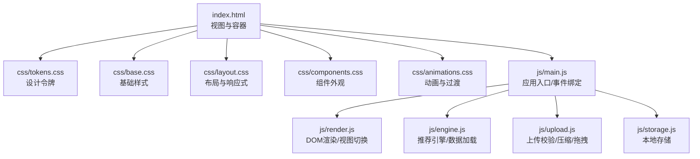
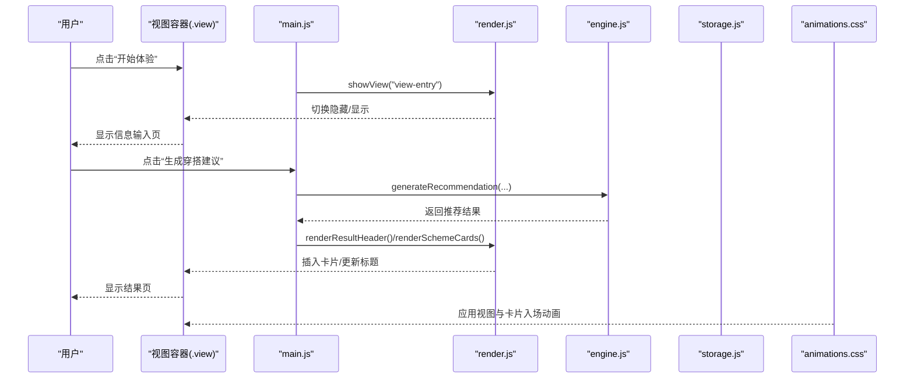
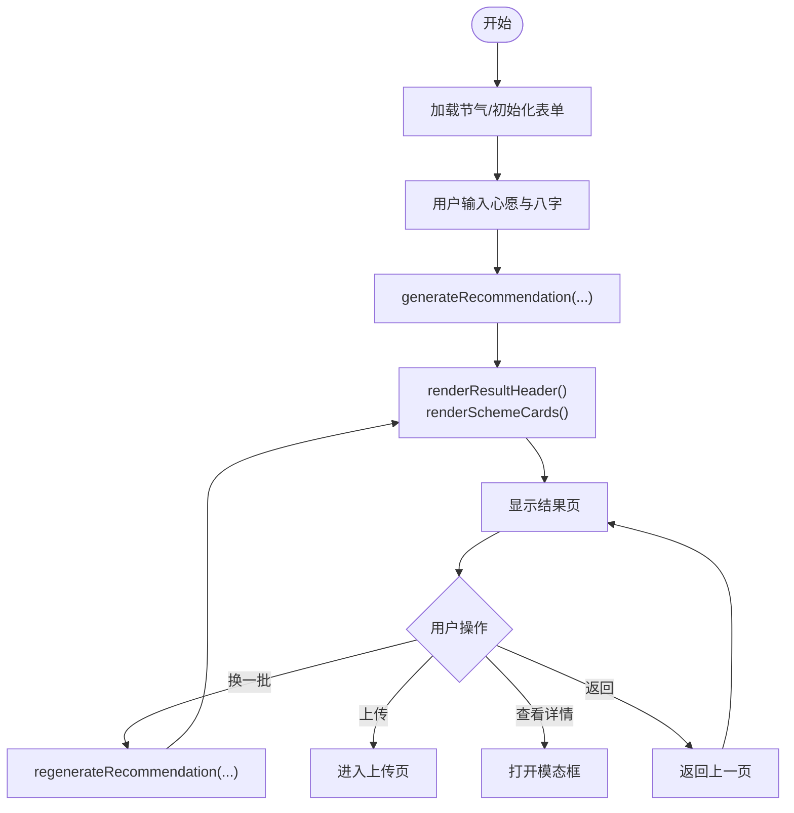
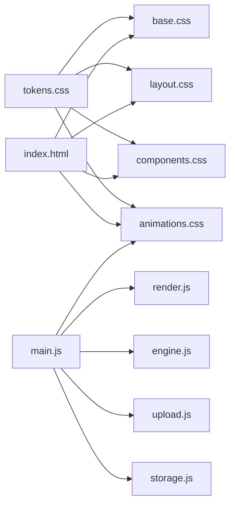

# 用户界面组件

<cite>
**本文引用的文件列表**
- [index.html](file://index.html)
- [tokens.css](file://css/tokens.css)
- [base.css](file://css/base.css)
- [layout.css](file://css/layout.css)
- [components.css](file://css/components.css)
- [animations.css](file://css/animations.css)
- [main.js](file://js/main.js)
- [render.js](file://js/render.js)
- [engine.js](file://js/engine.js)
- [upload.js](file://js/upload.js)
- [storage.js](file://js/storage.js)
</cite>

## 目录
1. [简介](#简介)
2. [项目结构](#项目结构)
3. [核心组件](#核心组件)
4. [架构总览](#架构总览)
5. [详细组件分析](#详细组件分析)
6. [依赖关系分析](#依赖关系分析)
7. [性能考量](#性能考量)
8. [故障排查指南](#故障排查指南)
9. [结论](#结论)
10. [附录](#附录)

## 简介
本文件面向“五行穿搭建议”项目，系统化梳理并说明所有用户界面元素的视觉设计、交互行为与使用方式。文档覆盖视图层次（欢迎页、信息输入页、结果展示页、上传页）的设计理念与交互流程；组件样式系统（设计令牌、颜色系统、字体规范）、基础样式、布局样式、组件样式与动画效果的使用方法与定制选项；以及无障碍访问支持、跨浏览器兼容性与性能优化建议。每个组件均给出 HTML 结构示例、CSS 类名说明、JavaScript 交互逻辑与自定义样式指南，帮助开发者与设计师快速理解与扩展。

## 项目结构
该项目采用“样式分层 + 视图模块”的组织方式：
- 样式层：tokens.css（设计令牌）、base.css（基础重置与通用）、layout.css（页面结构与响应式）、components.css（组件外观与状态）、animations.css（过渡与反馈）
- 视图层：index.html 定义四大视图与对话框、骨架与占位
- 逻辑层：main.js（应用入口与事件绑定）、render.js（DOM 渲染与视图切换）、engine.js（推荐算法与数据加载）、upload.js（上传校验与压缩）、storage.js（本地持久化）

图表来源
- [index.html](file://index.html#L1-L236)
- [tokens.css](file://css/tokens.css#L1-L109)
- [base.css](file://css/base.css#L1-L168)
- [layout.css](file://css/layout.css#L1-L252)
- [components.css](file://css/components.css#L1-L338)
- [animations.css](file://css/animations.css#L1-L207)
- [main.js](file://js/main.js#L1-L317)
- [render.js](file://js/render.js#L1-L272)
- [engine.js](file://js/engine.js#L1-L335)
- [upload.js](file://js/upload.js#L1-L145)
- [storage.js](file://js/storage.js#L1-L116)

章节来源
- [index.html](file://index.html#L1-L236)
- [main.js](file://js/main.js#L1-L317)

## 核心组件
本项目的核心 UI 组件包括：
- 视图系统：欢迎页、信息输入页、结果展示页、上传页
- 导航与头部：返回按钮、标题栏
- 表单组件：心愿标签、生辰八字选择器
- 卡片组件：推荐方案卡片、详情模态框
- 上传组件：拖拽上传区、预览与反馈
- 动画与提示：视图切换、骨架加载、Toast 提示

章节来源
- [index.html](file://index.html#L24-L214)
- [components.css](file://css/components.css#L5-L338)
- [animations.css](file://css/animations.css#L95-L207)

## 架构总览
下图展示了从用户操作到 DOM 更新与动画反馈的端到端流程。

图表来源
- [main.js](file://js/main.js#L72-L153)
- [render.js](file://js/render.js#L8-L17)
- [engine.js](file://js/engine.js#L268-L310)
- [animations.css](file://css/animations.css#L95-L124)

## 详细组件分析

### 设计令牌与样式系统
- 设计令牌（tokens.css）集中定义了：
  - 五行色彩系统（木、火、土、金、水）及其明暗变体
  - 中性色（背景、表面、边框、文本）
  - 功能色（成功、警告、错误、信息）
  - 字体族（标题、正文、等宽）
  - 文本字号、行高、间距网格、圆角半径、阴影、动画时长与缓动、z-index 层级
- 使用方式：
  - 在基础样式、布局样式、组件样式中统一引用变量，确保风格一致
  - 自定义时仅需修改 tokens.css 对应变量，即可全局生效

章节来源
- [tokens.css](file://css/tokens.css#L5-L108)

### 基础样式（base.css）
- 重置与排版：统一盒模型、字体、字号、行高、链接颜色与悬停过渡
- 表单控件：按钮、输入、选择、文本域的基础样式与焦点态
- 可访问性：:focus-visible 的高亮轮廓，.sr-only 辅助类
- 滚动条与选择高亮：自定义滚动条与选中文本配色
- 工具类：隐藏、不可见、居中、柔和文本色

章节来源
- [base.css](file://css/base.css#L5-L168)

### 布局样式（layout.css）
- 应用容器与视图系统：.app-container、.view、.view.hidden 控制视图切换
- 欢迎页：.welcome-content、.welcome-title、.welcome-subtitle、.solar-banner（节气横幅）
- 信息输入页：.entry-header/.entry-body、心愿区与八字区的栅格与标签
- 结果页：.results-header/.results-body、方案卡片容器 .scheme-cards、操作按钮
- 上传页：.upload-body、上传区 .upload-zone、反馈区 .feedback-section
- 固定底部：免责声明栏 .disclaimer-bar、隐私徽章 .privacy-badge
- 响应式：在不同断点下调整视图宽度、标题字号与卡片布局

章节来源
- [layout.css](file://css/layout.css#L6-L252)

### 组件样式（components.css）
- 按钮：.btn、.btn-primary、.btn-secondary、.btn-ghost、.btn-large、.btn-icon 及 hover/active 状态
- 心愿标签：.wish-tag、.wish-tag.active（选中态与选中动画）
- 方案卡片：.scheme-card、.scheme-color-bar、.scheme-keywords、.scheme-annotation、.scheme-source、.scheme-actions、.scheme-detail-btn
- 上传区：.upload-zone、.upload-placeholder、.upload-preview、.upload-hint、.upload-preview 内的移除按钮
- 反馈区：.feedback-textarea
- 模态框：.modal、.modal-backdrop、.modal-content、.modal-header、.modal-body、.modal-close、详情区块 .detail-section
- 加载态：.skeleton、.skeleton-text、.skeleton-title

章节来源
- [components.css](file://css/components.css#L5-L338)

### 动画效果（animations.css）
- 关键帧：fadeIn、fadeInUp、fadeInScale、slideInRight、slideInLeft、shimmer、pulse、spin、bounce
- 视图过渡：.view 应用淡入
- 卡片交错：.scheme-card 及 nth-child 延迟
- 模态框：.modal-backdrop 淡入、.modal-content 缩放进入
- 按钮波纹：伪元素实现点击扩散
- 选中标签：.wish-tag.active 的弹跳动画
- 上传区：.upload-zone.dragover 的脉冲动画
- 加载旋转：.spinner
- 减少动画偏好：prefers-reduced-motion 下禁用动画

章节来源
- [animations.css](file://css/animations.css#L5-L207)

### 视图层次与交互流程

#### 欢迎页（view-welcome）
- 结构要点：标题、副标题、节气横幅（动态渲染）、开始体验按钮
- 交互：点击“开始体验”切换到信息输入页
- 动画：视图淡入，卡片入场动画

章节来源
- [index.html](file://index.html#L24-L36)
- [animations.css](file://css/animations.css#L95-L124)

#### 信息输入页（view-entry）
- 结构要点：返回按钮、标题、心愿区（.wish-tags）、八字区（.bazi-form/.bazi-row/.bazi-field）、生成按钮
- 交互：选择心愿标签（.wish-tag），输入八字（年、月、日、时），点击“生成穿搭建议”
- 数据持久化：心愿与八字保存到本地存储

章节来源
- [index.html](file://index.html#L39-L125)
- [main.js](file://js/main.js#L92-L97)
- [storage.js](file://js/storage.js#L109-L115)

#### 结果展示页（view-results）
- 结构要点：返回按钮、标题（含节气名称与五行名）、方案卡片容器、换一批、上传照片按钮
- 交互：点击“换一批”重新生成推荐；点击“上传照片”进入上传页；点击“查看详解”打开详情模态框
- 渲染：render.js 动态生成卡片与标题

章节来源
- [index.html](file://index.html#L127-L155)
- [render.js](file://js/render.js#L114-L154)
- [main.js](file://js/main.js#L102-L136)

#### 上传页（view-upload）
- 结构要点：返回按钮、标题、上传区（.upload-zone）、预览与反馈区
- 交互：点击或拖拽上传图片；点击移除图片；填写反馈并保存
- 上传处理：validateFile、compressImage、本地存储当日穿搭

章节来源
- [index.html](file://index.html#L157-L196)
- [upload.js](file://js/upload.js#L12-L82)
- [storage.js](file://js/storage.js#L79-L89)

#### 详情模态框（modal-detail）
- 结构要点：遮罩、内容区、标题、关闭按钮、详情区块（色彩、材质、感受、五行解读、典籍出处）
- 交互：点击卡片“查看详解”打开；ESC、遮罩点击关闭

章节来源
- [index.html](file://index.html#L198-L214)
- [render.js](file://js/render.js#L158-L193)
- [main.js](file://js/main.js#L138-L152)

### 组件交互与状态变化

#### 按钮系统
- 类型：主按钮（.btn-primary）、次按钮（.btn-secondary）、幽灵按钮（.btn-ghost）、图标按钮（.btn-icon）、大按钮（.btn-large）
- 状态：hover、active（按下缩放）、禁用（由父容器控制）
- 动画：波纹扩散伪元素、点击扩散

章节来源
- [components.css](file://css/components.css#L6-L66)
- [animations.css](file://css/animations.css#L126-L146)

#### 心愿标签
- 选中态：.wish-tag.active（背景与边框变为五色主题色）
- 动画：选中时弹跳（.wish-tag.active -> bounce）

章节来源
- [components.css](file://css/components.css#L67-L88)
- [animations.css](file://css/animations.css#L148-L155)

#### 方案卡片
- 外观：白色表面、圆角、阴影、悬停提升与阴影增强
- 动画：入场淡入+向上滑入，带交错延迟
- 详情：点击“查看详解”打开模态框

章节来源
- [components.css](file://css/components.css#L89-L154)
- [animations.css](file://css/animations.css#L100-L124)

#### 上传区
- 状态：默认、悬停（.dragover）、聚焦
- 动画：拖拽时脉冲（pulse）、波纹扩散
- 预览：显示图片与移除按钮

章节来源
- [components.css](file://css/components.css#L155-L223)
- [animations.css](file://css/animations.css#L157-L160)

#### 模态框
- 打开：.modal.hidden -> 移除 hidden，body overflow 隐藏
- 关闭：ESC、遮罩点击、关闭按钮
- 动画：backdrop 淡入、content 缩放进入

章节来源
- [components.css](file://css/components.css#L230-L284)
- [animations.css](file://css/animations.css#L117-L124)
- [render.js](file://js/render.js#L197-L215)

### 数据流与渲染

图表来源
- [main.js](file://js/main.js#L202-L244)
- [engine.js](file://js/engine.js#L268-L310)
- [render.js](file://js/render.js#L104-L154)

## 依赖关系分析

图表来源
- [index.html](file://index.html#L13-L18)
- [tokens.css](file://css/tokens.css#L1-L109)
- [base.css](file://css/base.css#L1-L168)
- [layout.css](file://css/layout.css#L1-L252)
- [components.css](file://css/components.css#L1-L338)
- [animations.css](file://css/animations.css#L1-L207)
- [main.js](file://js/main.js#L5-L15)

章节来源
- [main.js](file://js/main.js#L5-L15)

## 性能考量
- 图片压缩：上传前压缩到目标大小，减少带宽与存储占用
- 本地存储：使用 localStorage 存储用户选择与结果，避免重复请求
- 动画优化：在 prefers-reduced-motion 下禁用动画，降低资源消耗
- DOM 操作：批量插入卡片，避免频繁回流
- 资源加载：字体通过 CDN 预连接，减少阻塞

章节来源
- [upload.js](file://js/upload.js#L31-L82)
- [storage.js](file://js/storage.js#L1-L116)
- [animations.css](file://css/animations.css#L197-L207)
- [render.js](file://js/render.js#L114-L154)

## 故障排查指南
- 上传失败
  - 检查文件类型与大小限制（JPG/PNG，≤5MB）
  - 确认压缩流程是否成功返回 DataURL
- 生成失败
  - 确认网络可访问 data/*.json
  - 检查 generateRecommendation 返回值与异常日志
- 视图切换异常
  - 确认 showView 是否正确移除/添加 hidden 类
- 模态框无法关闭
  - 检查 ESC 键盘事件与 backdrop 点击事件绑定
- 无障碍问题
  - 确保键盘可达（Enter/Space 触发上传区）
  - 确保焦点可见（:focus-visible）

章节来源
- [upload.js](file://js/upload.js#L12-L26)
- [main.js](file://js/main.js#L274-L292)
- [render.js](file://js/render.js#L8-L16)
- [main.js](file://js/main.js#L138-L152)
- [base.css](file://css/base.css#L109-L125)

## 结论
本项目通过“设计令牌 + 分层样式 + 模块化脚本”的架构，实现了风格统一、交互流畅、可扩展的 UI 组件体系。视图切换、卡片渲染、上传处理与本地存储均围绕 tokens.css 的设计语言展开，配合 animations.css 的过渡与反馈，形成完整的用户体验闭环。建议在后续迭代中持续完善无障碍细节与性能监控，保持组件的可维护性与一致性。

## 附录

### 组件使用与自定义指南
- 修改颜色系统：仅需调整 tokens.css 中的 --color-* 变量
- 调整字号与间距：修改 --text-* 与 --space-* 变量，影响全站排版
- 新增按钮变体：在 components.css 中新增类，继承 .btn 基础样式
- 新增视图：在 index.html 添加新 section 并在 main.js 中绑定切换逻辑
- 自定义动画：在 animations.css 中新增关键帧并在组件类上应用

章节来源
- [tokens.css](file://css/tokens.css#L5-L108)
- [components.css](file://css/components.css#L5-L66)
- [index.html](file://index.html#L24-L214)
- [main.js](file://js/main.js#L72-L153)