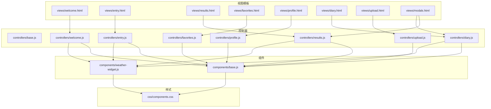
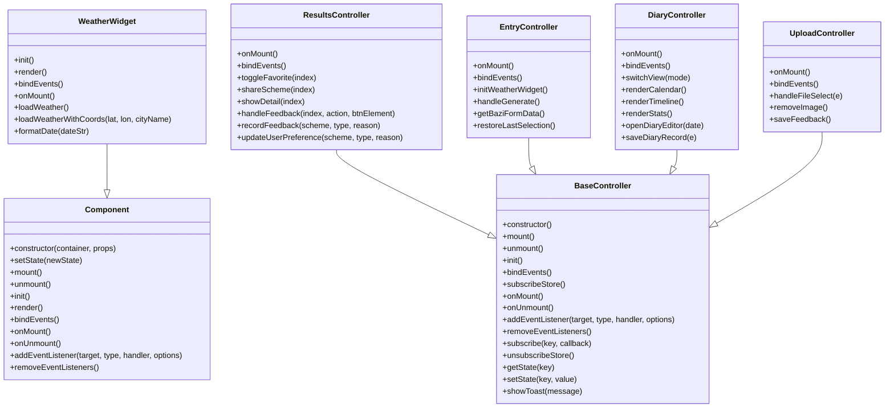
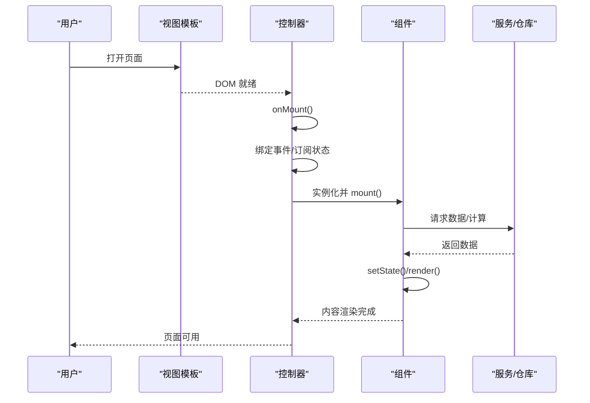
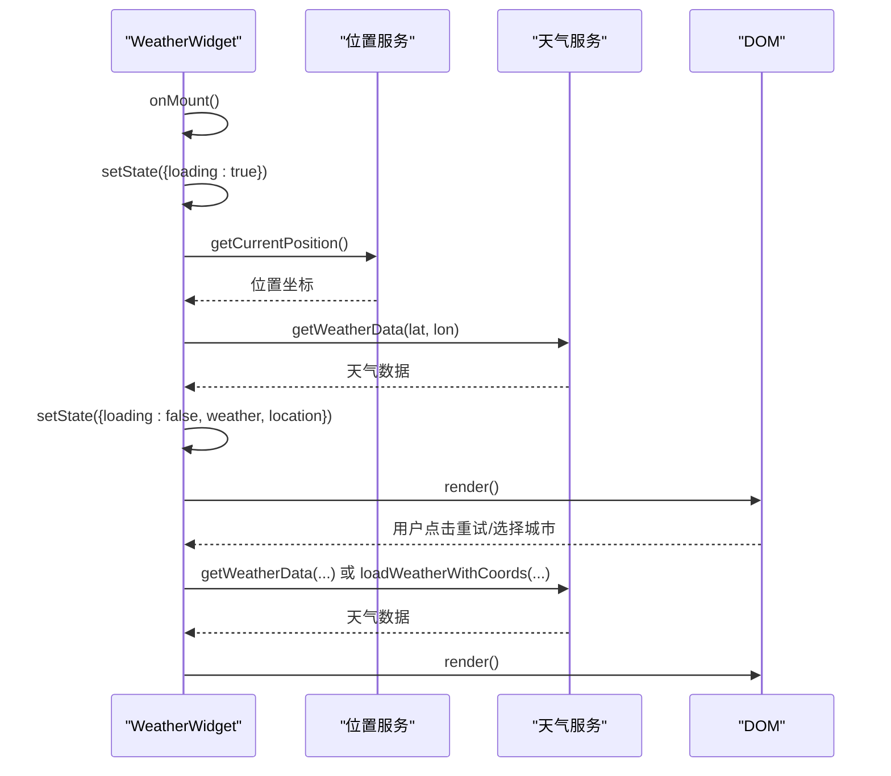
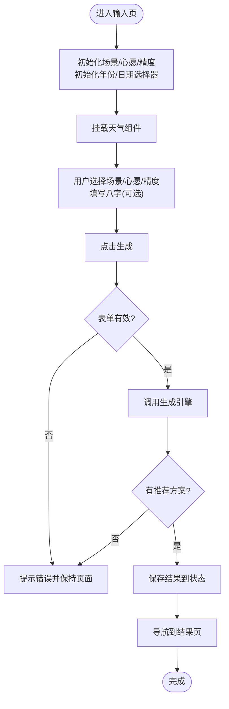
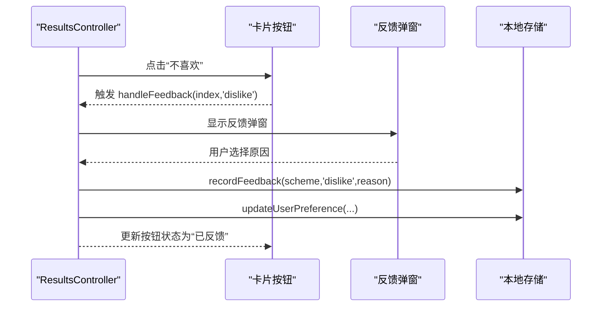
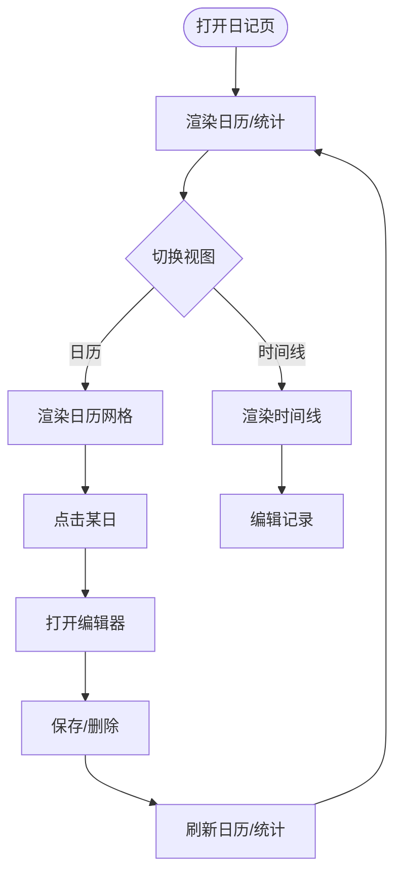
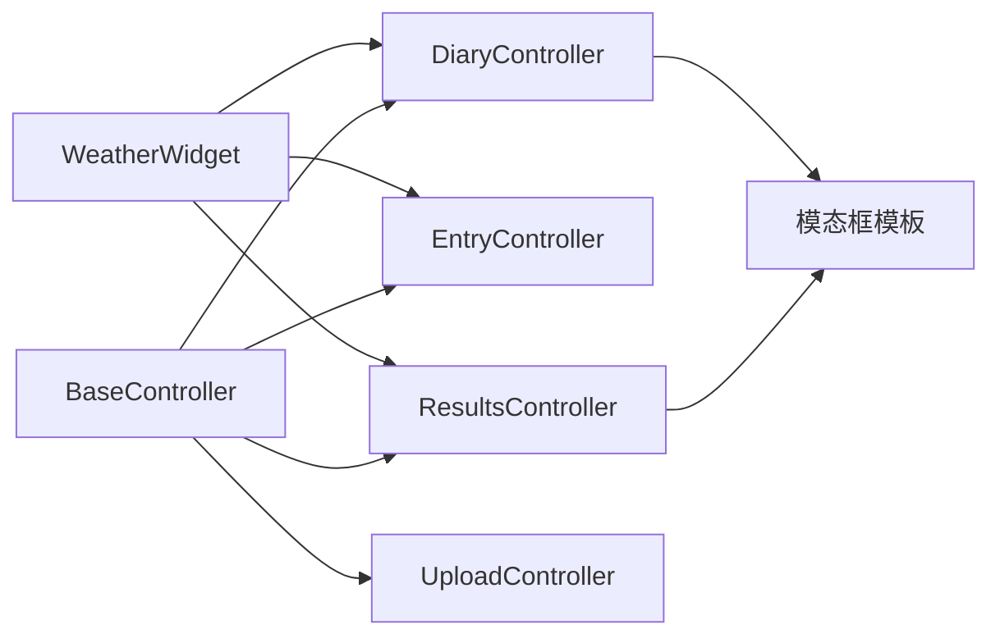

# 用户界面组件

<cite>
**本文引用的文件**
- [js/components/base.js](file://js/components/base.js)
- [js/components/weather-widget.js](file://js/components/weather-widget.js)
- [js/controllers/base.js](file://js/controllers/base.js)
- [js/controllers/welcome.js](file://js/controllers/welcome.js)
- [js/controllers/entry.js](file://js/controllers/entry.js)
- [js/controllers/results.js](file://js/controllers/results.js)
- [js/controllers/favorites.js](file://js/controllers/favorites.js)
- [js/controllers/profile.js](file://js/controllers/profile.js)
- [js/controllers/diary.js](file://js/controllers/diary.js)
- [js/controllers/upload.js](file://js/controllers/upload.js)
- [views/welcome.html](file://views/welcome.html)
- [views/entry.html](file://views/entry.html)
- [views/results.html](file://views/results.html)
- [views/favorites.html](file://views/favorites.html)
- [views/profile.html](file://views/profile.html)
- [views/diary.html](file://views/diary.html)
- [views/upload.html](file://views/upload.html)
- [views/modals.html](file://views/modals.html)
- [css/components.css](file://css/components.css)
</cite>

## 目录
1. [简介](#简介)
2. [项目结构](#项目结构)
3. [核心组件](#核心组件)
4. [架构总览](#架构总览)
5. [详细组件分析](#详细组件分析)
6. [依赖关系分析](#依赖关系分析)
7. [性能考量](#性能考量)
8. [故障排查指南](#故障排查指南)
9. [结论](#结论)
10. [附录](#附录)

## 简介
本文件面向“五行穿搭建议”项目的用户界面组件体系，系统性梳理基础组件、页面控制器、页面模板与模态框系统，重点解析以下方面：
- BaseComponent 基础组件的设计与生命周期、属性与事件管理
- WeatherWidget 天气组件的数据渲染、实时更新与用户交互
- 各页面视图模板的结构与功能：欢迎页、表单页、结果页、收藏页、个人资料页、穿搭日记页、上传页
- 模态框系统：全局模态框、对话框管理与用户反馈机制
- 组件复用指南、样式定制方法与响应式设计实践
- HTML 结构示例、CSS 样式说明与 JavaScript 交互代码路径

## 项目结构
项目采用“视图模板 + 控制器 + 组件”的前端分层组织方式：
- 视图模板：位于 views/ 下，定义页面结构与占位区
- 控制器：位于 js/controllers/ 下，负责页面挂载、事件绑定、状态订阅与导航
- 组件：位于 js/components/ 下，封装可复用 UI 与业务逻辑（如天气小组件）
- 样式：位于 css/ 下，提供通用组件样式与主题变量

图表来源
- [views/welcome.html](file://views/welcome.html#L1-L37)
- [views/entry.html](file://views/entry.html#L1-L234)
- [views/results.html](file://views/results.html#L1-L128)
- [views/favorites.html](file://views/favorites.html#L1-L18)
- [views/profile.html](file://views/profile.html#L1-L21)
- [views/diary.html](file://views/diary.html#L1-L159)
- [views/upload.html](file://views/upload.html#L1-L41)
- [views/modals.html](file://views/modals.html#L1-L18)
- [js/controllers/base.js](file://js/controllers/base.js#L1-L131)
- [js/controllers/welcome.js](file://js/controllers/welcome.js#L1-L134)
- [js/controllers/entry.js](file://js/controllers/entry.js#L1-L241)
- [js/controllers/results.js](file://js/controllers/results.js#L1-L614)
- [js/controllers/favorites.js](file://js/controllers/favorites.js#L1-L89)
- [js/controllers/profile.js](file://js/controllers/profile.js#L1-L91)
- [js/controllers/diary.js](file://js/controllers/diary.js#L1-L440)
- [js/controllers/upload.js](file://js/controllers/upload.js#L1-L118)
- [js/components/base.js](file://js/components/base.js#L1-L107)
- [js/components/weather-widget.js](file://js/components/weather-widget.js#L1-L215)
- [css/components.css](file://css/components.css#L1-L800)

章节来源
- [views/welcome.html](file://views/welcome.html#L1-L37)
- [views/entry.html](file://views/entry.html#L1-L234)
- [views/results.html](file://views/results.html#L1-L128)
- [views/favorites.html](file://views/favorites.html#L1-L18)
- [views/profile.html](file://views/profile.html#L1-L21)
- [views/diary.html](file://views/diary.html#L1-L159)
- [views/upload.html](file://views/upload.html#L1-L41)
- [views/modals.html](file://views/modals.html#L1-L18)
- [js/controllers/base.js](file://js/controllers/base.js#L1-L131)
- [js/controllers/welcome.js](file://js/controllers/welcome.js#L1-L134)
- [js/controllers/entry.js](file://js/controllers/entry.js#L1-L241)
- [js/controllers/results.js](file://js/controllers/results.js#L1-L614)
- [js/controllers/favorites.js](file://js/controllers/favorites.js#L1-L89)
- [js/controllers/profile.js](file://js/controllers/profile.js#L1-L91)
- [js/controllers/diary.js](file://js/controllers/diary.js#L1-L440)
- [js/controllers/upload.js](file://js/controllers/upload.js#L1-L118)
- [js/components/base.js](file://js/components/base.js#L1-L107)
- [js/components/weather-widget.js](file://js/components/weather-widget.js#L1-L215)
- [css/components.css](file://css/components.css#L1-L800)

## 核心组件
本项目通过两个核心基类实现组件化与控制器化：
- 组件基类 Component：提供构造、状态管理、生命周期、事件绑定与卸载
- 控制器基类 BaseController：提供页面级生命周期、事件绑定、状态订阅与导航

图表来源
- [js/components/base.js](file://js/components/base.js#L9-L106)
- [js/components/weather-widget.js](file://js/components/weather-widget.js#L12-L194)
- [js/controllers/base.js](file://js/controllers/base.js#L11-L130)
- [js/controllers/results.js](file://js/controllers/results.js#L13-L613)
- [js/controllers/entry.js](file://js/controllers/entry.js#L14-L240)
- [js/controllers/diary.js](file://js/controllers/diary.js#L19-L439)
- [js/controllers/upload.js](file://js/controllers/upload.js#L11-L117)

章节来源
- [js/components/base.js](file://js/components/base.js#L1-L107)
- [js/components/weather-widget.js](file://js/components/weather-widget.js#L1-L215)
- [js/controllers/base.js](file://js/controllers/base.js#L1-L131)
- [js/controllers/results.js](file://js/controllers/results.js#L1-L614)
- [js/controllers/entry.js](file://js/controllers/entry.js#L1-L241)
- [js/controllers/diary.js](file://js/controllers/diary.js#L1-L440)
- [js/controllers/upload.js](file://js/controllers/upload.js#L1-L118)

## 架构总览
页面从视图模板加载到 DOM 后，由对应的控制器接管：
- 控制器在 onMount 中获取容器、绑定事件、渲染内容、订阅状态
- 组件在控制器内实例化与挂载，负责局部 UI 的渲染与交互
- 模态框通过全局事件或工具函数进行显示/隐藏与内容渲染

图表来源
- [views/welcome.html](file://views/welcome.html#L1-L37)
- [views/entry.html](file://views/entry.html#L1-L234)
- [views/results.html](file://views/results.html#L1-L128)
- [views/diary.html](file://views/diary.html#L1-L159)
- [js/controllers/welcome.js](file://js/controllers/welcome.js#L19-L35)
- [js/controllers/entry.js](file://js/controllers/entry.js#L23-L43)
- [js/controllers/results.js](file://js/controllers/results.js#L20-L46)
- [js/controllers/diary.js](file://js/controllers/diary.js#L25-L38)
- [js/components/weather-widget.js](file://js/components/weather-widget.js#L137-L194)

## 详细组件分析

### 基础组件：Component
- 设计要点
  - 构造函数接收容器与属性，初始化状态、事件监听数组与挂载标志
  - setState 合并新状态并在已挂载状态下触发 re-render
  - 生命周期：init → render → bindEvents → onMount；卸载时执行 onUnmount、清理事件与容器内容
  - 事件管理：统一 addEventListener/add/removeEventListeners，避免内存泄漏
- 适用场景
  - 天气小组件 WeatherWidget
  - 天气影响提示 WeatherImpact
  - 任意局部 UI 组件

章节来源
- [js/components/base.js](file://js/components/base.js#L9-L106)

### 天气组件：WeatherWidget
- 功能概览
  - 初始化状态：loading、error、weather、location
  - 渲染：加载中、错误、正常天气卡片、未来三天预报、推荐材质/颜色
  - 事件：重试定位、手动选择城市
  - 生命周期：挂载时自动加载天气数据
  - 辅助组件：WeatherImpact 用于展示天气对推荐的加成分数
- 数据流
  - 位置获取 → 天气数据请求 → 推荐与风格计算 → 渲染 UI
- 交互流程

图表来源
- [js/components/weather-widget.js](file://js/components/weather-widget.js#L137-L194)
- [js/components/weather-widget.js](file://js/components/weather-widget.js#L141-L181)
- [js/components/weather-widget.js](file://js/components/weather-widget.js#L22-L117)

章节来源
- [js/components/weather-widget.js](file://js/components/weather-widget.js#L1-L215)

### 欢迎页：WelcomeController
- 职责
  - 获取容器、绑定事件、渲染节气卡片（图标、名称、描述、五行与宜穿颜色）
  - 点击“开始今日穿搭”跳转至输入页
- 关键点
  - 使用状态存储中的节气信息进行渲染
  - 防止重复绑定事件

章节来源
- [js/controllers/welcome.js](file://js/controllers/welcome.js#L13-L134)
- [views/welcome.html](file://views/welcome.html#L1-L37)

### 输入页：EntryController
- 职责
  - 初始化场景与心愿选择、精度切换、八字表单
  - 实例化天气组件并挂载
  - 生成推荐：收集表单数据、调用引擎生成方案、导航到结果页
  - 恢复上次八字输入
- 交互流程

图表来源
- [js/controllers/entry.js](file://js/controllers/entry.js#L23-L43)
- [js/controllers/entry.js](file://js/controllers/entry.js#L131-L189)
- [views/entry.html](file://views/entry.html#L1-L234)

章节来源
- [js/controllers/entry.js](file://js/controllers/entry.js#L1-L241)
- [views/entry.html](file://views/entry.html#L1-L234)

### 结果页：ResultsController
- 职责
  - 渲染页面副标题、结果头部、方案卡片
  - 渲染今日运势卡片（场景、心愿、幸运色、解析、Tip）
  - 渲染天气影响提示（若存在天气数据）
  - 渲染八字提示（若无八字）
  - 收藏、分享、查看详情、反馈（采纳/不喜欢）
- 反馈流程

图表来源
- [js/controllers/results.js](file://js/controllers/results.js#L394-L462)
- [js/controllers/results.js](file://js/controllers/results.js#L464-L525)
- [views/results.html](file://views/results.html#L94-L127)

章节来源
- [js/controllers/results.js](file://js/controllers/results.js#L1-L614)
- [views/results.html](file://views/results.html#L1-L128)

### 收藏页：FavoritesController
- 职责
  - 渲染收藏列表
  - 支持取消收藏、查看详情（预留）

章节来源
- [js/controllers/favorites.js](file://js/controllers/favorites.js#L1-L89)
- [views/favorites.html](file://views/favorites.html#L1-L18)

### 个人资料页：ProfileController
- 职责
  - 渲染画像与数据管理区域
  - 导入/导出/清空数据（预留）

章节来源
- [js/controllers/profile.js](file://js/controllers/profile.js#L1-L91)
- [views/profile.html](file://views/profile.html#L1-L21)

### 穿搭日记页：DiaryController
- 职责
  - 日历视图：渲染当月日历、记录点位、切换月份
  - 时间线视图：按时间倒序展示记录
  - 统计：连续记录天数、总记录数、颜色分布
  - 编辑器：日期、心情、颜色、材质、照片、备注
- 交互流程

图表来源
- [js/controllers/diary.js](file://js/controllers/diary.js#L143-L161)
- [js/controllers/diary.js](file://js/controllers/diary.js#L163-L206)
- [js/controllers/diary.js](file://js/controllers/diary.js#L208-L250)
- [views/diary.html](file://views/diary.html#L1-L159)

章节来源
- [js/controllers/diary.js](file://js/controllers/diary.js#L1-L440)
- [views/diary.html](file://views/diary.html#L1-L159)

### 上传页：UploadController
- 职责
  - 图片上传区域、预览、移除
  - 今日反馈输入与保存
  - 若已有当日图片则直接预览

章节来源
- [js/controllers/upload.js](file://js/controllers/upload.js#L1-L118)
- [views/upload.html](file://views/upload.html#L1-L41)

### 模态框系统
- 全局模态框
  - 详情模态框：渲染方案详情内容
  - 反馈弹窗：选择不喜欢原因并记录
  - 日记编辑器：记录穿搭详情
- 对话框管理
  - 通过类名 hidden 控制显隐
  - 点击遮罩或关闭按钮关闭
- 用户反馈机制
  - 通过本地存储记录采纳/不喜欢反馈
  - 更新用户偏好权重以优化后续推荐

章节来源
- [views/modals.html](file://views/modals.html#L1-L18)
- [views/results.html](file://views/results.html#L94-L127)
- [views/diary.html](file://views/diary.html#L74-L157)
- [js/controllers/results.js](file://js/controllers/results.js#L420-L462)
- [js/controllers/diary.js](file://js/controllers/diary.js#L287-L311)

## 依赖关系分析
- 控制器依赖
  - BaseController：提供统一生命周期与事件管理
  - 组件：WeatherWidget/WeatherImpact 依赖天气服务与推荐服务
  - 视图：各控制器依赖对应 HTML 模板
- 样式依赖
  - 组件样式集中于 css/components.css，提供按钮、标签、卡片、解释面板等通用样式

图表来源
- [js/controllers/base.js](file://js/controllers/base.js#L11-L130)
- [js/controllers/results.js](file://js/controllers/results.js#L13-L613)
- [js/controllers/entry.js](file://js/controllers/entry.js#L14-L240)
- [js/controllers/diary.js](file://js/controllers/diary.js#L19-L439)
- [js/controllers/upload.js](file://js/controllers/upload.js#L11-L117)
- [js/components/weather-widget.js](file://js/components/weather-widget.js#L12-L194)
- [views/modals.html](file://views/modals.html#L1-L18)

章节来源
- [js/controllers/base.js](file://js/controllers/base.js#L1-L131)
- [js/components/weather-widget.js](file://js/components/weather-widget.js#L1-L215)
- [views/modals.html](file://views/modals.html#L1-L18)

## 性能考量
- 组件渲染
  - setState 合并状态，避免频繁重绘
  - 组件卸载时清理事件监听，防止内存泄漏
- 天气组件
  - 首次挂载自动获取位置与天气，错误时提供手动选择城市入口
  - 渲染中/错误状态使用骨架屏与提示，改善感知性能
- 控制器
  - 事件绑定防重复，onUnmount 清理订阅与事件
- 视图渲染
  - 大量列表渲染（方案卡片、日历、时间线）建议采用虚拟滚动或分页策略（当前版本为一次性渲染）

## 故障排查指南
- 组件未渲染
  - 检查控制器是否正确获取容器并调用 mount
  - 确认组件 render 是否被调用且未抛错
- 事件无效
  - 确认事件绑定发生在 onMount 之后
  - 检查事件委托目标是否存在
- 天气组件异常
  - 检查位置权限与网络请求
  - 查看错误状态提示并引导用户手动选择城市
- 反馈无法保存
  - 检查本地存储可用性
  - 确认 recordFeedback/updateUserPreference 调用链路

章节来源
- [js/components/base.js](file://js/components/base.js#L36-L56)
- [js/controllers/base.js](file://js/controllers/base.js#L21-L42)
- [js/components/weather-widget.js](file://js/components/weather-widget.js#L141-L181)
- [js/controllers/results.js](file://js/controllers/results.js#L464-L525)

## 结论
本项目通过清晰的组件与控制器分层，实现了高内聚、低耦合的 UI 架构。基础组件提供一致的生命周期与事件管理，天气组件承担了数据获取与渲染职责，控制器负责页面级逻辑与状态协调。模态框系统与用户反馈机制完善，配合统一的样式规范，形成了可维护、可扩展的前端体系。

## 附录

### 组件复用指南
- 复用组件
  - 使用 Component 基类封装局部 UI，提供 setState/render/bindEvents
  - 在控制器中实例化并 mount/unmount，确保资源回收
- 复用控制器
  - 通过 BaseController 统一生命周期与事件管理
  - 在 onMount 中只做初始化与绑定，复杂逻辑拆分到工具函数

章节来源
- [js/components/base.js](file://js/components/base.js#L9-L106)
- [js/controllers/base.js](file://js/controllers/base.js#L11-L130)

### 样式定制方法
- 主题变量
  - 使用 CSS 变量控制颜色、间距、圆角、阴影等，便于主题切换
- 组件样式
  - 按组件划分命名空间（如 .scheme-*、.weather-*），避免冲突
  - 使用 :hover/:active 等伪类增强交互反馈
- 响应式设计
  - 使用 flex/grid 布局，配合媒体查询适配移动端

章节来源
- [css/components.css](file://css/components.css#L1-L800)

### HTML 结构示例与交互代码路径
- 欢迎页
  - 结构：品牌区、节气卡片、CTA、运势提示
  - 交互：点击“开始今日穿搭”跳转输入页
  - 代码路径：[views/welcome.html](file://views/welcome.html#L1-L37)，[js/controllers/welcome.js](file://js/controllers/welcome.js#L116-L128)
- 输入页
  - 结构：天气组件容器、场景标签、心愿标签、八字输入、生成按钮
  - 交互：场景/心愿选择、精度切换、生成推荐
  - 代码路径：[views/entry.html](file://views/entry.html#L1-L234)，[js/controllers/entry.js](file://js/controllers/entry.js#L62-L103)
- 结果页
  - 结构：头部导航、运势卡片、天气影响、方案卡片、反馈弹窗
  - 交互：收藏、分享、查看详情、反馈
  - 代码路径：[views/results.html](file://views/results.html#L1-L128)，[js/controllers/results.js](file://js/controllers/results.js#L255-L359)
- 收藏页
  - 结构：头部返回、收藏列表
  - 交互：取消收藏、查看详情
  - 代码路径：[views/favorites.html](file://views/favorites.html#L1-L18)，[js/controllers/favorites.js](file://js/controllers/favorites.js#L32-L67)
- 个人资料页
  - 结构：头部返回、画像与数据管理
  - 交互：导入/导出/清空数据（预留）
  - 代码路径：[views/profile.html](file://views/profile.html#L1-L21)，[js/controllers/profile.js](file://js/controllers/profile.js#L30-L54)
- 穿搭日记页
  - 结构：日历/时间线视图、统计、编辑器
  - 交互：切换视图、添加记录、编辑/删除
  - 代码路径：[views/diary.html](file://views/diary.html#L1-L159)，[js/controllers/diary.js](file://js/controllers/diary.js#L143-L161)
- 上传页
  - 结构：上传区域、预览、反馈输入
  - 交互：上传/移除图片、保存反馈
  - 代码路径：[views/upload.html](file://views/upload.html#L1-L41)，[js/controllers/upload.js](file://js/controllers/upload.js#L35-L78)
- 模态框
  - 结构：详情、反馈、日记编辑
  - 交互：遮罩关闭、按钮关闭、内容渲染
  - 代码路径：[views/modals.html](file://views/modals.html#L1-L18)，[views/results.html](file://views/results.html#L94-L127)，[views/diary.html](file://views/diary.html#L74-L157)