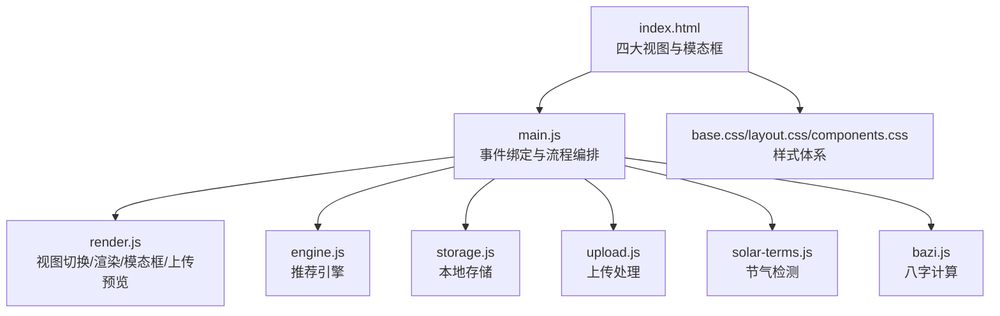
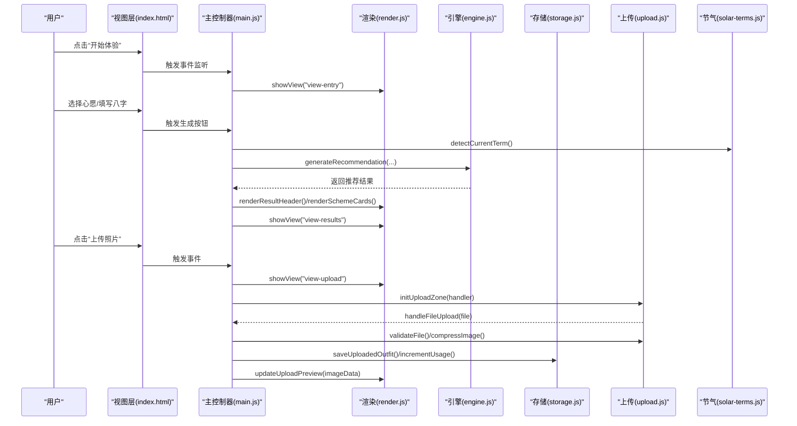
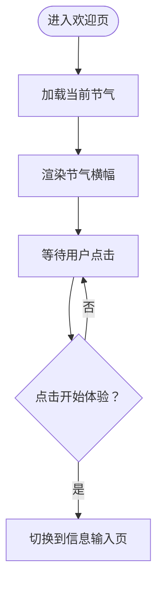
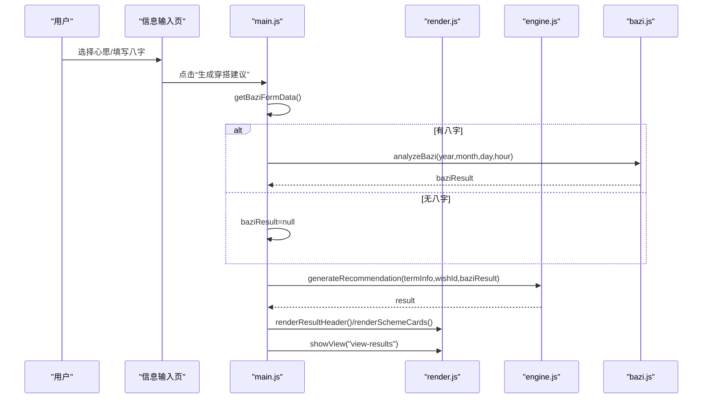
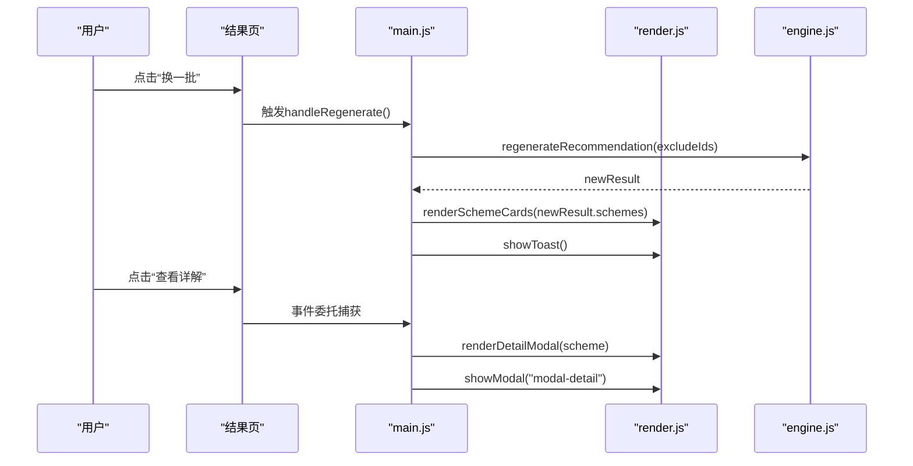
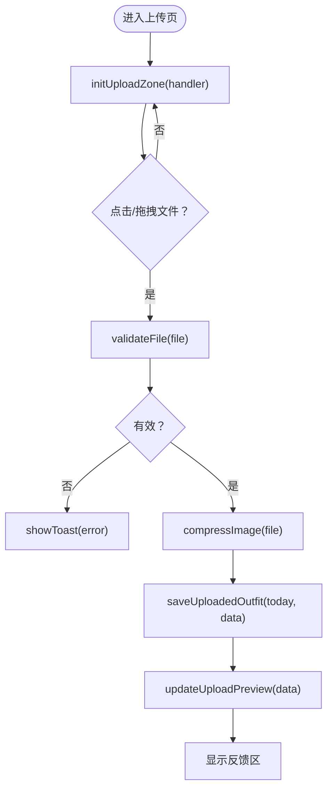
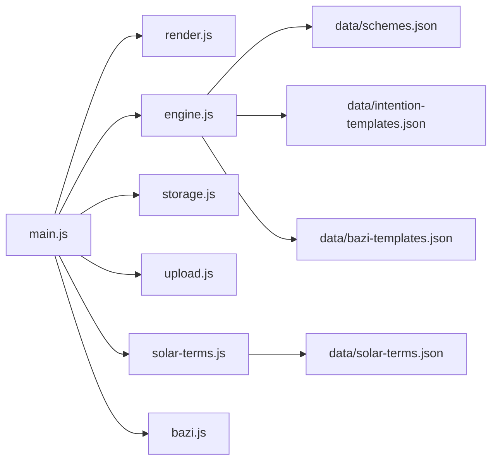

# 视图组件

<cite>
**本文引用的文件列表**
- [index.html](file://index.html)
- [main.js](file://js/main.js)
- [render.js](file://js/render.js)
- [engine.js](file://js/engine.js)
- [storage.js](file://js/storage.js)
- [bazi.js](file://js/bazi.js)
- [upload.js](file://js/upload.js)
- [solar-terms.js](file://js/solar-terms.js)
- [base.css](file://css/base.css)
- [layout.css](file://css/layout.css)
- [components.css](file://css/components.css)
</cite>

## 目录
1. [简介](#简介)
2. [项目结构](#项目结构)
3. [核心组件](#核心组件)
4. [架构总览](#架构总览)
5. [详细组件分析](#详细组件分析)
6. [依赖关系分析](#依赖关系分析)
7. [性能考量](#性能考量)
8. [故障排查指南](#故障排查指南)
9. [结论](#结论)
10. [附录](#附录)

## 简介
本文件为“五行穿搭建议”项目的视图组件文档，聚焦于四大核心视图页面：欢迎页(view-welcome)、信息输入页(view-entry)、推荐结果页(view-results)、上传页(view-upload)。文档从HTML结构、CSS类名、JavaScript交互逻辑、视图切换机制、导航流程、状态管理、无障碍访问与响应式设计等维度进行系统性梳理，并提供可视化图示帮助理解。

## 项目结构
应用采用单页多视图模式，通过隐藏/显示不同<section>实现视图切换。核心文件组织如下：
- HTML：定义四大视图及通用模态框、免责声明与隐私徽章
- JS：
  - main.js：应用入口、事件绑定、业务流程编排
  - render.js：DOM渲染、视图切换、模态框控制、上传预览更新
  - engine.js：推荐引擎（数据加载、上下文构建、评分与选择）
  - storage.js：本地存储封装（偏好、历史、统计）
  - bazi.js：八字计算（简化版）
  - upload.js：文件验证、压缩、拖拽上传
  - solar-terms.js：节气检测与颜色映射
- CSS：基础样式、布局、组件样式

图表来源
- [index.html](file://index.html#L20-L236)
- [main.js](file://js/main.js#L1-L317)
- [render.js](file://js/render.js#L1-L272)
- [engine.js](file://js/engine.js#L1-L335)
- [storage.js](file://js/storage.js#L1-L116)
- [upload.js](file://js/upload.js#L1-L145)
- [solar-terms.js](file://js/solar-terms.js#L1-L118)
- [base.css](file://css/base.css#L1-L168)
- [layout.css](file://css/layout.css#L1-L252)
- [components.css](file://css/components.css#L1-L338)

章节来源
- [index.html](file://index.html#L20-L236)
- [main.js](file://js/main.js#L1-L317)
- [layout.css](file://css/layout.css#L1-L252)

## 核心组件
- 视图容器与切换
  - 视图容器：.view，初始隐藏，通过切换显示对应视图
  - 切换函数：render.showView(viewId)，统一隐藏所有视图后显示目标视图
- 导航与返回
  - 各视图内均提供返回按钮，返回上一视图
  - 结果页提供“换一批”、“上传照片”按钮
- 数据流
  - 节气：solar-terms.detectCurrentTerm → render.renderSolarBanner
  - 输入：wish-tags选择、bazi-form表单
  - 推荐：engine.generateRecommendation → render.renderSchemeCards
  - 上传：upload.initUploadZone → render.updateUploadPreview
  - 存储：storage封装持久化

章节来源
- [render.js](file://js/render.js#L8-L16)
- [main.js](file://js/main.js#L72-L153)
- [layout.css](file://css/layout.css#L12-L22)

## 架构总览
下图展示从用户交互到最终渲染的关键调用链路与模块职责。

图表来源
- [index.html](file://index.html#L24-L196)
- [main.js](file://js/main.js#L26-L317)
- [render.js](file://js/render.js#L8-L272)
- [engine.js](file://js/engine.js#L268-L335)
- [storage.js](file://js/storage.js#L51-L116)
- [upload.js](file://js/upload.js#L87-L145)
- [solar-terms.js](file://js/solar-terms.js#L36-L103)

## 详细组件分析

### 欢迎页(view-welcome)
- 设计理念
  - 展示节气横幅，突出“顺应节气，以色养身”的主题
  - 使用“开始体验”主按钮引导进入信息输入页
- HTML结构要点
  - 容器：#view-welcome.view
  - 节气横幅：.solar-banner，包含节气名称与五行元素标签
  - 主按钮：#btn-start.btn-primary.btn-large
- CSS类名
  - .welcome-content、.welcome-title、.welcome-subtitle、.solar-banner、.solar-term-name、.solar-term-element
- JavaScript交互
  - 绑定“开始体验”点击事件，调用showView('view-entry')
  - 初始化节气信息并渲染横幅
- 无障碍与响应式
  - 视图容器含aria-label
  - 响应式布局在大屏下调整字体与间距

图表来源
- [index.html](file://index.html#L24-L36)
- [main.js](file://js/main.js#L26-L67)
- [render.js](file://js/render.js#L55-L71)

章节来源
- [index.html](file://index.html#L24-L36)
- [main.js](file://js/main.js#L26-L67)
- [render.js](file://js/render.js#L55-L71)
- [layout.css](file://css/layout.css#L24-L71)
- [base.css](file://css/base.css#L109-L125)

### 信息输入页(view-entry)
- 心愿选择组件(wish-tags)
  - 角色：role="radiogroup"，按钮集合：.wish-tag，激活态：.active
  - 交互：点击切换激活态，保存到storage.selected_wish
- 八字输入表单(bazi-form)
  - 年份选择：自动填充年份选项
  - 月份/日期/时辰：标准select
  - 交互：恢复上次输入、校验必填项
- 生成按钮
  - 触发generateRecommendation，保存结果并切换到结果页
- CSS类名
  - .entry-header、.entry-body、.wish-section、.wish-tags、.bazi-section、.bazi-form、.bazi-row、.bazi-field、.bazi-label、.bazi-select
- JavaScript交互
  - 绑定返回、生成、心愿选择事件
  - 收集bazi表单数据，调用analyzeBazi，生成推荐并渲染
- 无障碍与响应式
  - 表单字段具备aria-label，键盘可访问
  - 响应式网格布局

图表来源
- [index.html](file://index.html#L39-L125)
- [main.js](file://js/main.js#L202-L244)
- [render.js](file://js/render.js#L104-L127)
- [engine.js](file://js/engine.js#L268-L310)
- [bazi.js](file://js/bazi.js#L182-L193)

章节来源
- [index.html](file://index.html#L39-L125)
- [main.js](file://js/main.js#L92-L100)
- [render.js](file://js/render.js#L21-L50)
- [layout.css](file://css/layout.css#L72-L140)
- [components.css](file://css/components.css#L67-L88)

### 推荐结果页(view-results)
- 方案卡片展示(scheme-cards)
  - 容器：#scheme-cards，动态渲染多个.card
  - 卡片内容：色彩条、关键词、注解、出处、查看详情按钮
- 操作按钮布局
  - “换一批”：调用regenerateRecommendation，避免重复方案
  - “上传照片”：跳转上传页，恢复当日上传图片
- CSS类名
  - .results-header、.results-body、.scheme-cards、.scheme-card、.scheme-keywords、.scheme-annotation、.scheme-source、.scheme-actions、.scheme-detail-btn
- JavaScript交互
  - 详情按钮事件委托，打开模态框并渲染详情
  - ESC键、模态框遮罩点击关闭
- 无障碍与响应式
  - 模态框role="dialog"，aria-modal=true，标题aria-labelledby
  - 大屏下卡片网格布局

图表来源
- [index.html](file://index.html#L127-L155)
- [main.js](file://js/main.js#L125-L153)
- [render.js](file://js/render.js#L159-L193)
- [engine.js](file://js/engine.js#L315-L334)

章节来源
- [index.html](file://index.html#L127-L155)
- [render.js](file://js/render.js#L114-L154)
- [layout.css](file://css/layout.css#L141-L167)
- [components.css](file://css/components.css#L89-L154)

### 上传页(view-upload)
- 拖拽上传区域(upload-zone)
  - 容器：#upload-zone，支持点击、Enter/Space触发、拖拽进入/离开/放下
  - 预览：.upload-preview隐藏/显示切换，.upload-placeholder提示
  - 移除：.btn-remove-image，删除本地存储并清空预览
- 图片预览与反馈
  - 预览图片：#preview-image
  - 反馈区：.feedback-section，文本域与保存按钮
- CSS类名
  - .upload-zone、.upload-placeholder、.upload-hint、.upload-preview、.feedback-section、.feedback-textarea
- JavaScript交互
  - initUploadZone绑定事件，回调handleFileUpload
  - validateFile检查类型与大小，compressImage压缩到目标大小
  - 保存图片到storage，更新预览，显示反馈区
- 无障碍与响应式
  - 上传区域role="button"、tabindex="0"、aria-label
  - 响应式宽度与居中布局

图表来源
- [index.html](file://index.html#L157-L196)
- [upload.js](file://js/upload.js#L87-L145)
- [render.js](file://js/render.js#L220-L237)
- [storage.js](file://js/storage.js#L79-L89)

章节来源
- [index.html](file://index.html#L157-L196)
- [upload.js](file://js/upload.js#L12-L82)
- [layout.css](file://css/layout.css#L168-L183)
- [components.css](file://css/components.css#L155-L229)

## 依赖关系分析
- 模块耦合
  - main.js作为编排者，依赖render、engine、storage、upload、solar-terms、bazi
  - render.js负责UI层，被main.js调用
  - engine.js依赖data目录JSON，独立于UI
  - storage.js提供统一键空间，被各模块共享
- 视图间导航
  - 通过render.showView(viewId)集中切换
  - 返回按钮与业务按钮分别绑定不同逻辑
- 数据流
  - 节气→推荐→渲染→存储→上传→反馈

图表来源
- [main.js](file://js/main.js#L5-L15)
- [engine.js](file://js/engine.js#L39-L79)
- [solar-terms.js](file://js/solar-terms.js#L18-L29)

章节来源
- [main.js](file://js/main.js#L5-L15)
- [engine.js](file://js/engine.js#L39-L79)
- [solar-terms.js](file://js/solar-terms.js#L18-L29)

## 性能考量
- 图片压缩
  - 压缩目标：200KB左右，最大边1200px，逐步降低质量
  - 体积过大时循环降低质量，避免超时
- 推荐算法
  - 异步加载模板数据，Promise并发
  - 评分与选择过程避免重复计算，必要时过滤已排除方案
- DOM操作
  - 批量渲染卡片时一次性写入容器
  - 模态框显示时锁定body滚动，避免抖动

章节来源
- [upload.js](file://js/upload.js#L31-L82)
- [engine.js](file://js/engine.js#L270-L310)
- [render.js](file://js/render.js#L114-L127)

## 故障排查指南
- 无法切换视图
  - 检查目标视图ID是否存在，确认render.showView调用
  - 确认返回按钮事件绑定是否正确
- 节气横幅不显示
  - 检查solar-terms数据加载与detectCurrentTerm返回值
  - 确认renderSolarBanner参数与DOM元素存在
- 推荐结果为空
  - 检查generateRecommendation返回值与schemes数据完整性
  - 排查excludeIds是否导致可用方案不足
- 上传失败
  - 检查validateFile错误信息与compressImage异常
  - 确认storage.saveUploadedOutfit调用与updateUploadPreview更新
- 模态框无法关闭
  - 检查ESC事件与遮罩点击事件绑定
  - 确认modal的hidden类切换

章节来源
- [render.js](file://js/render.js#L8-L16)
- [main.js](file://js/main.js#L138-L153)
- [upload.js](file://js/upload.js#L12-L26)

## 结论
本项目以清晰的视图分层与模块化JS实现，提供了从节气展示、心愿与八字输入、智能推荐到穿搭上传与反馈的完整闭环。通过统一的视图切换与渲染接口、完善的本地存储与图片处理能力，确保了良好的用户体验与可维护性。建议后续可扩展更多心愿模板与八字模板，进一步提升个性化程度。

## 附录
- 无障碍最佳实践
  - 为交互元素提供aria-label或aria-labelledby
  - 模态框设置role="dialog"与aria-modal="true"
  - 确保键盘可达性（Tab顺序、Enter/Space触发）
- 响应式设计要点
  - 视图容器在大屏下限制最大宽度并居中
  - 结果页卡片在桌面端采用网格布局
  - 上传区域保持宽高比，适配移动端点击与拖拽