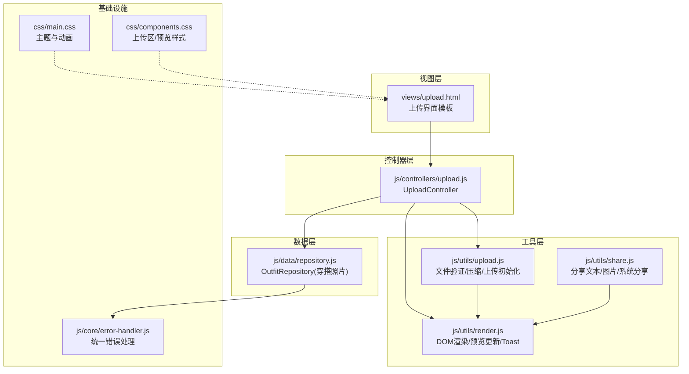
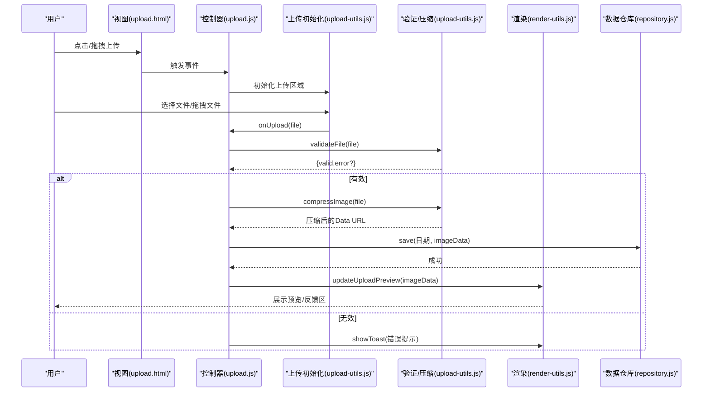
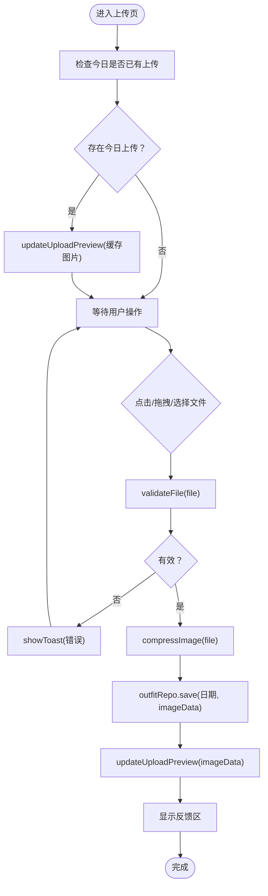
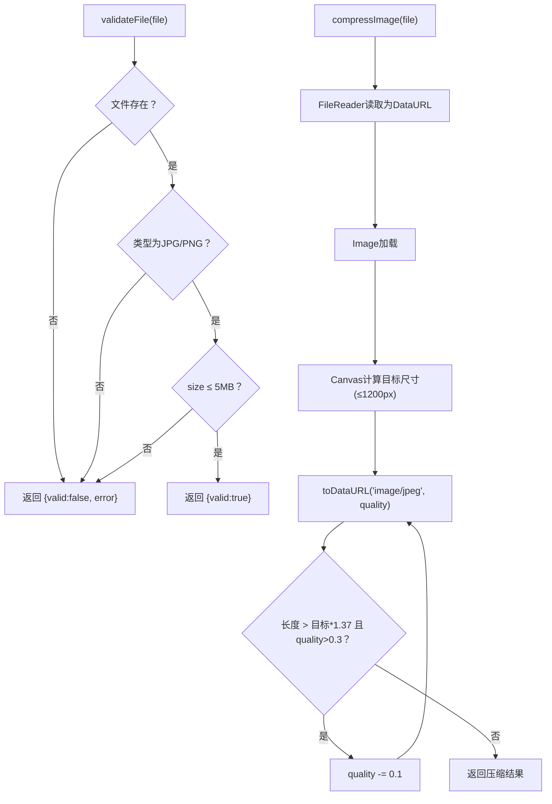
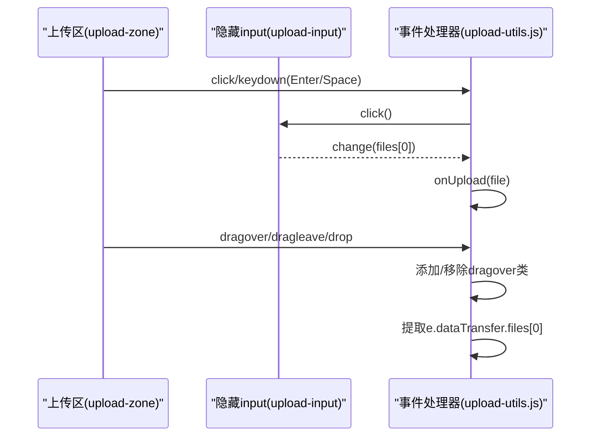
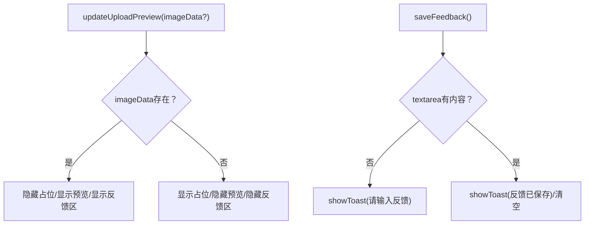
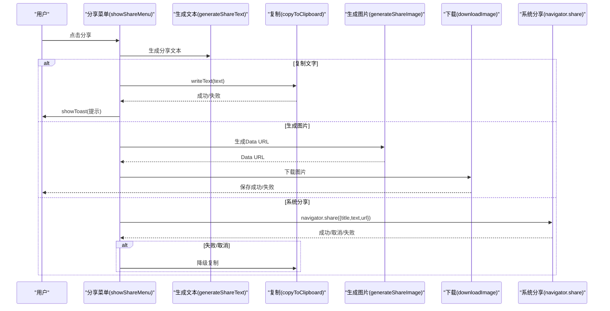
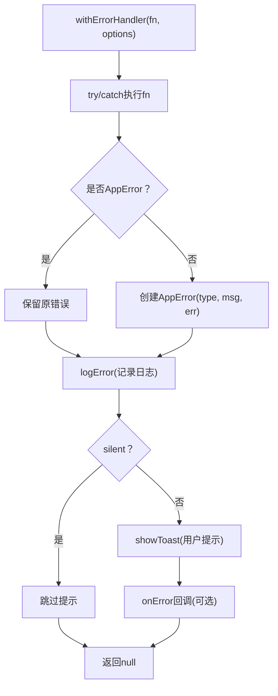
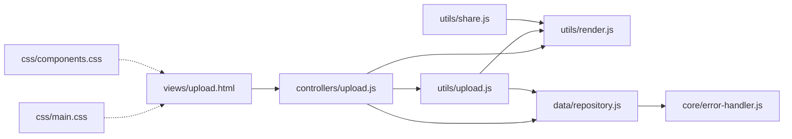

# 上传界面页面 (Upload Interface)

<cite>
**本文档引用的文件**
- [upload.html](file://views/upload.html)
- [upload.js](file://js/controllers/upload.js)
- [upload-utils.js](file://js/utils/upload.js)
- [render-utils.js](file://js/utils/render.js)
- [repository.js](file://js/data/repository.js)
- [error-handler.js](file://js/core/error-handler.js)
- [share.js](file://js/utils/share.js)
- [main.css](file://css/main.css)
- [components.css](file://css/components.css)
</cite>

## 目录
1. [简介](#简介)
2. [项目结构](#项目结构)
3. [核心组件](#核心组件)
4. [架构总览](#架构总览)
5. [详细组件分析](#详细组件分析)
6. [依赖关系分析](#依赖关系分析)
7. [性能考虑](#性能考虑)
8. [故障排除指南](#故障排除指南)
9. [结论](#结论)

## 简介
本文件面向上传界面页面（Upload.html），系统性梳理照片上传与分享功能的实现机制。重点覆盖：
- 文件选择、拖拽上传、预览与移除
- 图片处理（验证、压缩、尺寸调整）
- 上传状态管理与错误处理
- 分享功能（复制文本、生成图片、系统分享）
- 安全检查与质量控制
- 进度反馈与交互优化

## 项目结构
上传界面由视图模板、控制器、工具模块、数据仓库与样式组成，采用“视图-控制器-工具-数据”的分层设计，确保职责清晰、可维护性强。

图表来源
- [upload.html](file://views/upload.html#L1-L41)
- [upload.js](file://js/controllers/upload.js#L1-L118)
- [upload-utils.js](file://js/utils/upload.js#L1-L145)
- [render-utils.js](file://js/utils/render.js#L405-L425)
- [repository.js](file://js/data/repository.js#L340-L377)
- [error-handler.js](file://js/core/error-handler.js#L1-L190)
- [main.css](file://css/main.css#L454-L457)
- [components.css](file://css/components.css#L804-L871)

章节来源
- [upload.html](file://views/upload.html#L1-L41)
- [upload.js](file://js/controllers/upload.js#L1-L118)
- [upload-utils.js](file://js/utils/upload.js#L1-L145)
- [render-utils.js](file://js/utils/render.js#L405-L425)
- [repository.js](file://js/data/repository.js#L340-L377)
- [error-handler.js](file://js/core/error-handler.js#L1-L190)
- [main.css](file://css/main.css#L454-L457)
- [components.css](file://css/components.css#L804-L871)

## 核心组件
- 视图模板：提供上传区域、占位提示、预览区与反馈区。
- 控制器：负责事件绑定、文件选择处理、预览更新、反馈保存与导航。
- 工具模块：
  - 文件验证与压缩：限制格式、大小，按目标尺寸压缩。
  - 上传初始化：支持点击与键盘激活、拖拽进入/离开/放下。
  - 渲染工具：更新上传预览、显示Toast提示。
  - 分享工具：生成分享文本、复制到剪贴板、生成分享图片、系统分享。
- 数据仓库：基于localStorage封装的OutfitRepository，按日期存取穿搭照片。
- 错误处理：统一错误类型、日志记录、用户提示与静默处理策略。
- 样式：上传区、预览区、占位提示、拖拽高亮、按钮与反馈输入框。

章节来源
- [upload.html](file://views/upload.html#L12-L39)
- [upload.js](file://js/controllers/upload.js#L11-L118)
- [upload-utils.js](file://js/utils/upload.js#L5-L144)
- [render-utils.js](file://js/utils/render.js#L405-L486)
- [repository.js](file://js/data/repository.js#L340-L377)
- [error-handler.js](file://js/core/error-handler.js#L7-L190)
- [components.css](file://css/components.css#L804-L871)

## 架构总览
上传流程从视图开始，经控制器协调工具与数据仓库完成文件处理与状态更新；分享功能独立于上传，通过工具模块生成文本或图片并调用系统能力。

图表来源
- [upload.html](file://views/upload.html#L13-L29)
- [upload.js](file://js/controllers/upload.js#L35-L93)
- [upload-utils.js](file://js/utils/upload.js#L12-L82)
- [render-utils.js](file://js/utils/render.js#L405-L425)
- [repository.js](file://js/data/repository.js#L358-L366)

## 详细组件分析

### 上传区域与预览
- 上传区域支持点击、键盘激活与拖拽上传，拖拽时添加高亮样式，离开时移除。
- 预览区在存在图片时显示，并提供移除按钮，移除后隐藏反馈区。
- 占位提示包含图标、文案与格式/大小说明。

图表来源
- [upload.html](file://views/upload.html#L13-L29)
- [upload.js](file://js/controllers/upload.js#L18-L99)
- [upload-utils.js](file://js/utils/upload.js#L12-L82)
- [render-utils.js](file://js/utils/render.js#L405-L425)
- [repository.js](file://js/data/repository.js#L358-L366)

章节来源
- [upload.html](file://views/upload.html#L13-L29)
- [upload.js](file://js/controllers/upload.js#L18-L99)
- [components.css](file://css/components.css#L804-L871)
- [main.css](file://css/main.css#L454-L457)

### 文件验证与压缩
- 验证规则：必选、格式限制（JPG/PNG）、大小上限（5MB）。
- 压缩策略：按最大边1200px缩放，目标大小约200KB，循环降低JPEG质量直至满足阈值。
- 错误处理：文件读取失败、图片加载失败均抛出错误，交由上层统一处理。

图表来源
- [upload-utils.js](file://js/utils/upload.js#L12-L82)

章节来源
- [upload-utils.js](file://js/utils/upload.js#L5-L82)

### 上传初始化与事件绑定
- 点击/键盘激活：点击上传区或按回车/空格触发文件选择。
- 拖拽支持：dragover/dragleave/drop事件控制高亮与文件提取。
- 重复选择：每次选择后重置input值，允许再次选择同一文件。

图表来源
- [upload-utils.js](file://js/utils/upload.js#L87-L136)
- [upload.html](file://views/upload.html#L13-L14)

章节来源
- [upload-utils.js](file://js/utils/upload.js#L87-L136)
- [upload.html](file://views/upload.html#L13-L14)

### 预览与反馈
- 预览更新：当存在图片时隐藏占位、显示预览与移除按钮，并显示反馈区。
- 反馈保存：校验输入非空后提示保存成功并清空输入框。
- 移除图片：删除本地缓存并恢复占位与隐藏反馈区。

图表来源
- [render-utils.js](file://js/utils/render.js#L405-L425)
- [upload.js](file://js/controllers/upload.js#L101-L113)

章节来源
- [render-utils.js](file://js/utils/render.js#L405-L425)
- [upload.js](file://js/controllers/upload.js#L72-L113)

### 分享功能
- 文本分享：生成包含节气、颜色、材质、感受、解读与出处的分享文本。
- 复制到剪贴板：优先使用Clipboard API，失败时降级到临时textarea复制。
- 生成分享图片：使用Canvas绘制，包含装饰条、标题、节气信息、颜色块、材质、感受、解读、出处与底部标识，最终下载为PNG。
- 系统分享：优先调用navigator.share，失败或取消时降级到复制。

图表来源
- [share.js](file://js/utils/share.js#L14-L91)
- [share.js](file://js/utils/share.js#L99-L191)
- [share.js](file://js/utils/share.js#L226-L233)
- [share.js](file://js/utils/share.js#L240-L332)

章节来源
- [share.js](file://js/utils/share.js#L14-L332)

### 错误处理与安全检查
- 统一错误类型：网络、超时、数据解析、验证、存储、未知。
- 错误包装：withErrorHandler统一捕获异常，记录日志并显示Toast。
- 安全存储：safeStorage包装localStorage，处理配额不足等异常。
- 网络请求：safeFetch支持超时控制与HTTP状态检查。
- 输入验证：前端严格限制格式与大小，避免无效数据进入后续流程。

图表来源
- [error-handler.js](file://js/core/error-handler.js#L45-L79)
- [error-handler.js](file://js/core/error-handler.js#L84-L92)
- [error-handler.js](file://js/core/error-handler.js#L153-L163)

章节来源
- [error-handler.js](file://js/core/error-handler.js#L7-L190)

## 依赖关系分析
- 视图依赖控制器与样式；控制器依赖渲染工具与数据仓库；上传工具依赖验证与压缩；分享工具依赖渲染工具；数据仓库依赖错误处理进行安全存储。

图表来源
- [upload.html](file://views/upload.html#L1-L41)
- [upload.js](file://js/controllers/upload.js#L1-L118)
- [upload-utils.js](file://js/utils/upload.js#L1-L145)
- [render-utils.js](file://js/utils/render.js#L405-L486)
- [repository.js](file://js/data/repository.js#L340-L377)
- [error-handler.js](file://js/core/error-handler.js#L1-L190)
- [share.js](file://js/utils/share.js#L1-L333)
- [main.css](file://css/main.css#L454-L457)
- [components.css](file://css/components.css#L804-L871)

章节来源
- [upload.js](file://js/controllers/upload.js#L1-L118)
- [upload-utils.js](file://js/utils/upload.js#L1-L145)
- [render-utils.js](file://js/utils/render.js#L405-L486)
- [repository.js](file://js/data/repository.js#L340-L377)
- [error-handler.js](file://js/core/error-handler.js#L1-L190)
- [share.js](file://js/utils/share.js#L1-L333)
- [main.css](file://css/main.css#L454-L457)
- [components.css](file://css/components.css#L804-L871)

## 性能考虑
- 压缩策略：先按最大边缩放，再按目标大小循环降低质量，兼顾体积与清晰度。
- 本地存储：使用localStorage按日期键值存储，避免跨域与服务端依赖。
- UI反馈：通过Toast与预览即时反馈，减少用户等待感知。
- 拖拽高亮：仅在视觉层面提示，避免频繁DOM变更。

## 故障排除指南
- 无法选择文件：确认input元素可见且未被遮挡；检查事件绑定是否重复。
- 拖拽无效：确保dragover/leave/drop事件正确阻止默认行为并切换样式类。
- 预览不显示：检查updateUploadPreview调用与DOM节点存在性。
- 分享失败：优先检查Clipboard API可用性，必要时降级复制；系统分享失败时自动降级。
- 存储异常：当出现配额不足或隐私模式，错误会被包装为存储错误类型并提示用户清理空间或调整设置。

章节来源
- [upload-utils.js](file://js/utils/upload.js#L87-L136)
- [render-utils.js](file://js/utils/render.js#L405-L425)
- [share.js](file://js/utils/share.js#L36-L59)
- [error-handler.js](file://js/core/error-handler.js#L153-L163)

## 结论
上传界面页面通过清晰的分层设计实现了完整的照片上传与分享能力：从前端验证与压缩、本地预览与反馈，到统一错误处理与安全存储，再到灵活的分享策略。现有实现具备良好的扩展性与可维护性，建议后续可在以下方面持续优化：
- 增强上传进度反馈（如结合实际网络上传场景）。
- 在控制器中集成压缩与上传流程的统一入口，减少重复逻辑。
- 对分享菜单增加二维码生成与社交平台直连选项。
- 引入更细粒度的错误分类与用户引导提示。