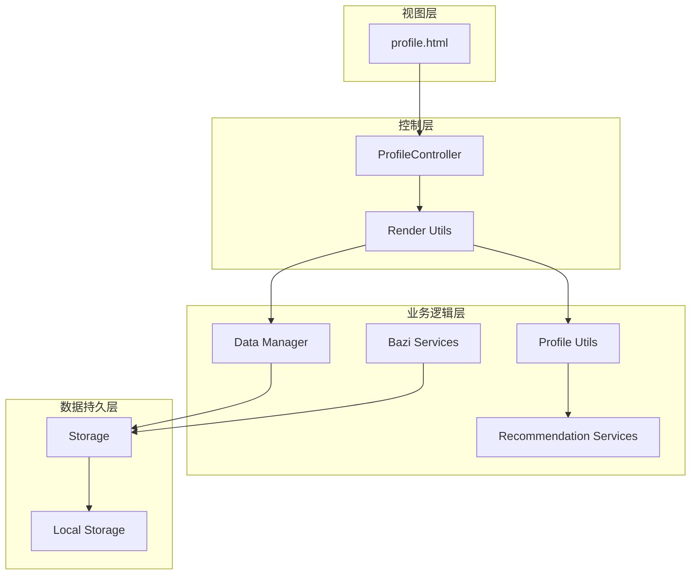
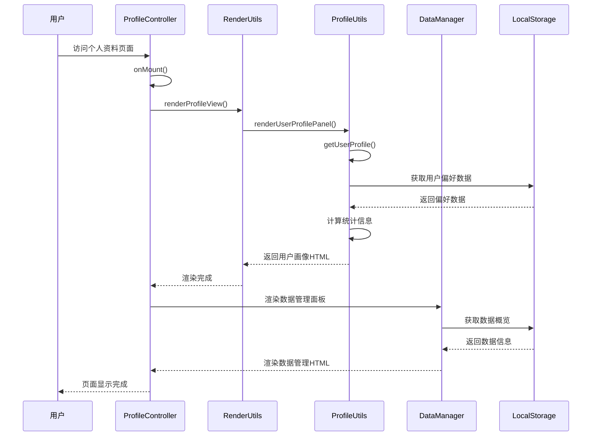
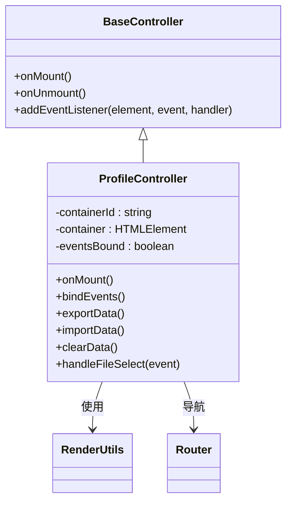
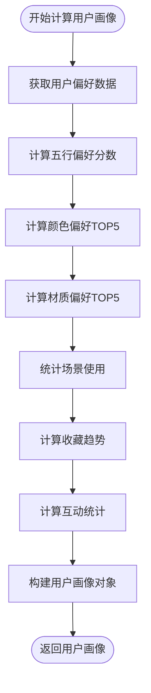
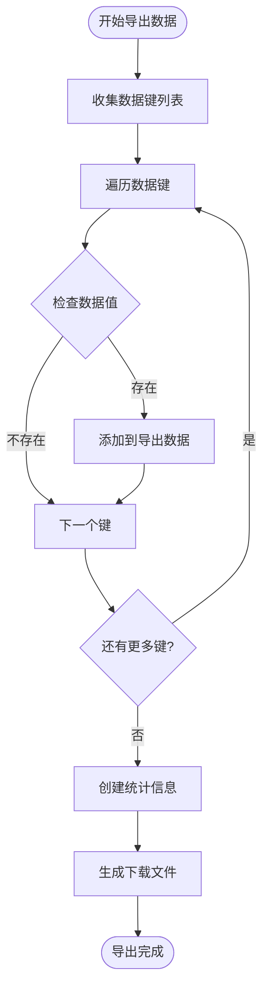
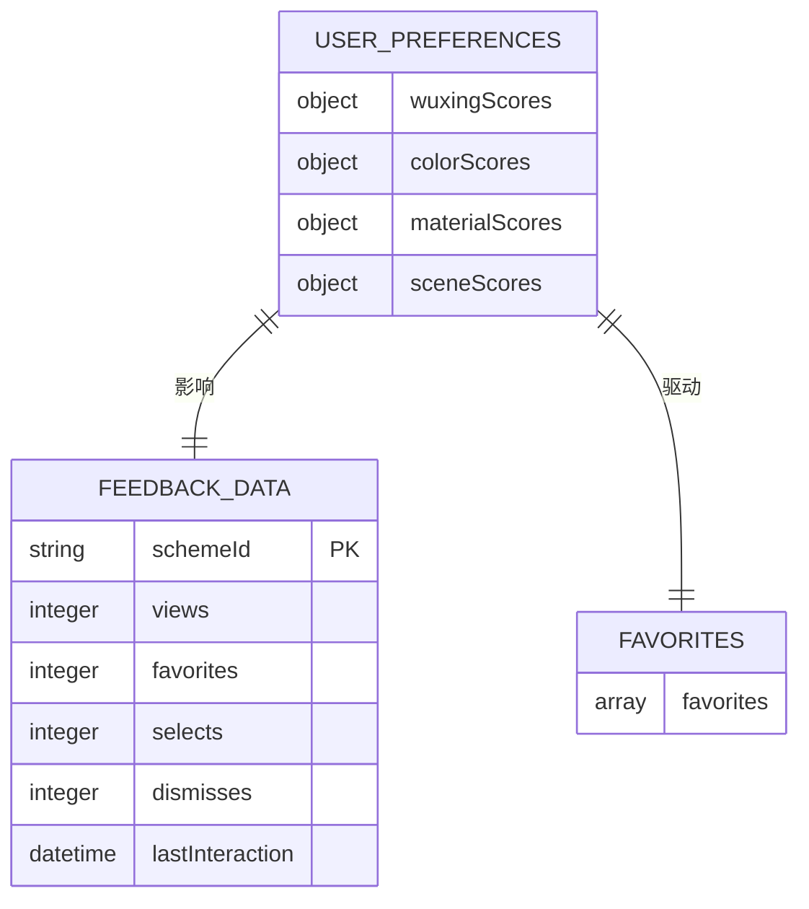
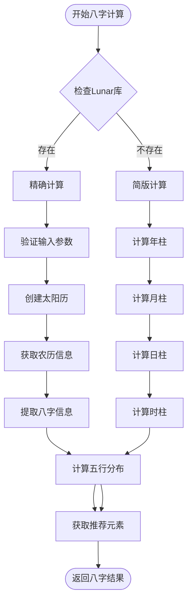
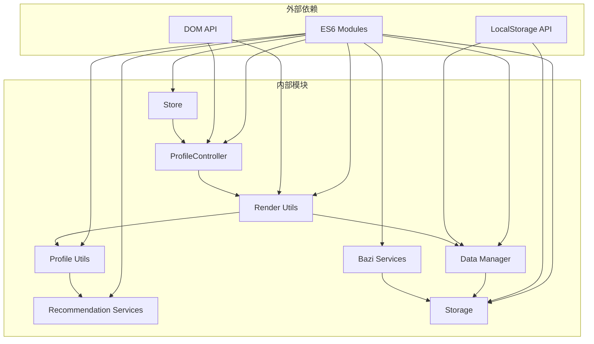

# 个人资料页面 (Profile Management)

<cite>
**本文档引用的文件**
- [profile.html](file://views/profile.html)
- [profile.js](file://js/controllers/profile.js)
- [render.js](file://js/utils/render.js)
- [profile-utils.js](file://js/utils/profile.js)
- [data-manager.js](file://js/data/data-manager.js)
- [storage.js](file://js/data/storage.js)
- [recommendation.js](file://js/services/recommendation.js)
- [bazi.js](file://js/services/bazi.js)
- [store.js](file://js/core/store.js)
</cite>

## 目录
1. [简介](#简介)
2. [项目结构](#项目结构)
3. [核心组件](#核心组件)
4. [架构概览](#架构概览)
5. [详细组件分析](#详细组件分析)
6. [依赖关系分析](#依赖关系分析)
7. [性能考虑](#性能考虑)
8. [故障排除指南](#故障排除指南)
9. [结论](#结论)

## 简介

个人资料页面是五行穿搭建议系统的核心功能模块，负责展示和管理用户的个人偏好信息。该页面不仅提供用户画像的可视化展示，还集成了数据管理、八字信息管理和用户反馈等功能。通过这个页面，用户可以查看自己的穿搭偏好统计、管理个人数据备份与恢复，以及维护八字信息。

## 项目结构

个人资料页面采用模块化架构设计，主要由以下层次组成：

**图表来源**
- [profile.html](file://views/profile.html#L1-L21)
- [profile.js](file://js/controllers/profile.js#L1-L91)
- [render.js](file://js/utils/render.js#L1-L487)

**章节来源**
- [profile.html](file://views/profile.html#L1-L21)
- [profile.js](file://js/controllers/profile.js#L1-L91)

## 核心组件

### 控制器层

个人资料页面的控制器采用继承自基础控制器的设计模式，提供了完整的生命周期管理和事件处理机制。

### 视图渲染层

视图渲染层负责将用户画像数据转换为可视化的图表和统计数据，包括雷达图、柱状图、饼图等多种可视化组件。

### 数据管理层

数据管理层实现了完整的数据备份、导入、清理功能，确保用户数据的安全性和可移植性。

**章节来源**
- [profile.js](file://js/controllers/profile.js#L9-L91)
- [render.js](file://js/utils/render.js#L367-L381)
- [data-manager.js](file://js/data/data-manager.js#L1-L376)

## 架构概览

个人资料页面采用MVVM架构模式，通过响应式状态管理和模块化设计实现了高度解耦的系统架构。

**图表来源**
- [profile.js](file://js/controllers/profile.js#L15-L28)
- [render.js](file://js/utils/render.js#L370-L381)
- [profile-utils.js](file://js/utils/profile.js#L24-L61)

## 详细组件分析

### ProfileController - 个人资料控制器

ProfileController是个人资料页面的核心控制器，继承自BaseController，提供了完整的页面生命周期管理。

#### 主要功能特性

1. **生命周期管理**
   - onMount(): 页面挂载时的初始化逻辑
   - onUnmount(): 页面卸载时的清理逻辑
   - bindEvents(): 事件绑定管理

2. **数据管理功能**
   - 导出数据：支持数据备份功能
   - 导入数据：支持数据恢复功能
   - 清除数据：支持一键清除所有数据

3. **用户交互处理**
   - 返回按钮事件处理
   - 数据管理按钮事件委托
   - 文件选择器事件处理

**图表来源**
- [profile.js](file://js/controllers/profile.js#L9-L91)

**章节来源**
- [profile.js](file://js/controllers/profile.js#L9-L91)

### ProfileUtils - 用户画像工具模块

ProfileUtils模块负责用户画像数据的收集、计算和可视化展示，是整个个人资料页面的核心业务逻辑。

#### 用户画像数据结构

**图表来源**
- [profile-utils.js](file://js/utils/profile.js#L24-L61)

#### 可视化组件

1. **五行雷达图**
   - 展示用户对五种元素的偏好程度
   - 使用SVG绘制多边形图表
   - 支持动画效果和交互

2. **颜色偏好柱状图**
   - 展示用户颜色偏好的排名
   - 使用CSS动画增强视觉效果
   - 支持响应式布局

3. **场景分布饼图**
   - 展示用户在不同场景下的使用情况
   - 支持百分比计算和颜色区分
   - 提供图例说明

4. **收藏趋势折线图**
   - 展示用户收藏行为的时间趋势
   - 支持多月数据的对比分析
   - 使用SVG路径绘制曲线

**章节来源**
- [profile-utils.js](file://js/utils/profile.js#L1-L420)

### DataManager - 数据管理模块

DataManager模块提供了完整的数据备份、导入、清理功能，确保用户数据的安全性和可移植性。

#### 数据导出功能

**图表来源**
- [data-manager.js](file://js/data/data-manager.js#L48-L99)

#### 数据导入验证

数据导入功能包含完整的验证机制，确保导入数据的完整性和兼容性：

1. **版本验证**：检查数据版本兼容性
2. **结构验证**：验证数据结构完整性
3. **内容验证**：检查数据内容的有效性

#### 数据清理功能

提供安全的数据清理机制，支持：
- 单个数据项删除
- 批量数据清理
- 完全数据重置

**章节来源**
- [data-manager.js](file://js/data/data-manager.js#L1-L376)

### RecommendationServices - 推荐服务模块

推荐服务模块为个人资料页面提供了丰富的用户偏好数据，包括五行偏好、颜色偏好、材质偏好等。

#### 用户偏好数据结构

**图表来源**
- [recommendation.js](file://js/services/recommendation.js#L192-L239)

#### 偏好计算算法

推荐服务模块实现了复杂的偏好计算算法，包括：

1. **权重计算**：根据用户行为赋予不同权重
2. **归一化处理**：将偏好分数标准化到0-100范围
3. **趋势分析**：分析用户偏好的变化趋势
4. **个性化推荐**：基于偏好数据提供个性化建议

**章节来源**
- [recommendation.js](file://js/services/recommendation.js#L186-L284)

### BaziServices - 八字服务模块

八字服务模块为个人资料页面提供了八字信息管理功能，支持简版和精确两种计算模式。

#### 八字计算流程

**图表来源**
- [bazi.js](file://js/services/bazi.js#L101-L183)

#### 五行分析功能

八字服务模块提供了完整的五行分析功能：

1. **天干地支计算**：支持简版和精确两种计算方式
2. **五行分布统计**：统计天干地支中的五行分布
3. **推荐元素分析**：基于五行平衡提供推荐元素
4. **相生相克关系**：分析五行之间的相生相克关系

**章节来源**
- [bazi.js](file://js/services/bazi.js#L1-L267)

## 依赖关系分析

个人资料页面的依赖关系体现了清晰的分层架构设计：

**图表来源**
- [profile.js](file://js/controllers/profile.js#L5-L7)
- [render.js](file://js/utils/render.js#L5-L8)

### 模块间通信

个人资料页面通过以下方式实现模块间的松耦合通信：

1. **事件委托模式**：统一处理用户交互事件
2. **回调函数机制**：支持异步数据处理
3. **状态管理模式**：通过Store进行状态共享
4. **依赖注入模式**：通过构造函数传递依赖

**章节来源**
- [store.js](file://js/core/store.js#L30-L187)

## 性能考虑

个人资料页面在设计时充分考虑了性能优化，采用了多种策略来提升用户体验：

### 渲染性能优化

1. **懒加载机制**：页面内容按需渲染，减少初始加载时间
2. **虚拟DOM技术**：通过模板字符串减少DOM操作次数
3. **动画优化**：使用CSS3硬件加速提升动画性能
4. **内存管理**：及时清理事件监听器和DOM引用

### 数据访问优化

1. **缓存策略**：用户偏好数据采用内存缓存
2. **批量操作**：数据更新采用批量处理方式
3. **延迟计算**：复杂计算采用延迟执行策略
4. **增量更新**：只更新发生变化的数据部分

### 存储优化

1. **数据压缩**：对存储的数据进行压缩处理
2. **索引优化**：为常用查询建立索引
3. **清理策略**：定期清理过期数据
4. **容量监控**：监控存储空间使用情况

## 故障排除指南

### 常见问题及解决方案

#### 页面无法正常显示

**问题症状**：个人资料页面空白或显示异常

**可能原因**：
1. DOM元素未正确加载
2. JavaScript执行错误
3. 依赖模块加载失败

**解决步骤**：
1. 检查浏览器控制台错误信息
2. 验证DOM元素是否存在
3. 确认所有依赖模块正确加载
4. 检查网络连接状态

#### 数据导入失败

**问题症状**：导入数据时出现错误提示

**可能原因**：
1. 文件格式不正确
2. 数据版本不兼容
3. 文件损坏
4. 权限问题

**解决步骤**：
1. 确认导入文件为JSON格式
2. 检查数据版本兼容性
3. 验证文件完整性
4. 重新生成备份文件

#### 性能问题

**问题症状**：页面加载缓慢或响应迟钝

**可能原因**：
1. 数据量过大
2. 图表渲染复杂
3. 内存泄漏
4. 网络延迟

**解决步骤**：
1. 清理不必要的数据
2. 优化图表渲染逻辑
3. 检查内存使用情况
4. 实施数据分页加载

**章节来源**
- [data-manager.js](file://js/data/data-manager.js#L106-L135)
- [profile.js](file://js/controllers/profile.js#L18-L21)

## 结论

个人资料页面作为五行穿搭建议系统的重要组成部分，展现了现代Web应用的优秀设计实践。通过模块化架构、响应式状态管理和完善的错误处理机制，该页面实现了功能完整性与用户体验的完美平衡。

### 主要优势

1. **架构清晰**：采用MVVM模式，职责分离明确
2. **扩展性强**：模块化设计便于功能扩展
3. **用户体验佳**：丰富的可视化组件和流畅的交互体验
4. **数据安全**：完整的数据备份和恢复机制
5. **性能优化**：多层面的性能优化策略

### 技术亮点

1. **响应式状态管理**：通过Proxy实现数据响应式更新
2. **可视化图表**：使用SVG技术实现高性能图表渲染
3. **数据持久化**：采用localStorage实现数据持久化
4. **错误处理**：完善的错误捕获和处理机制
5. **性能监控**：内置性能监控和优化建议

个人资料页面不仅满足了基本的用户信息管理需求，更为后续的功能扩展奠定了坚实的技术基础。其模块化的设计理念和优秀的代码质量，使其成为现代Web应用开发的典范。