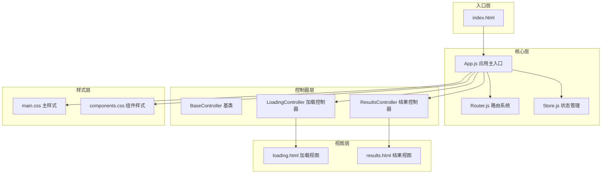
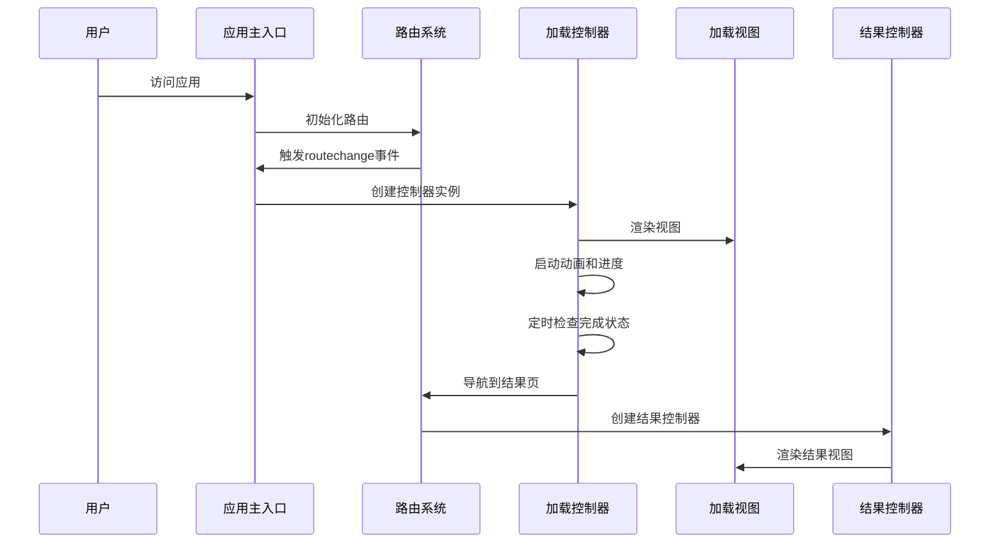
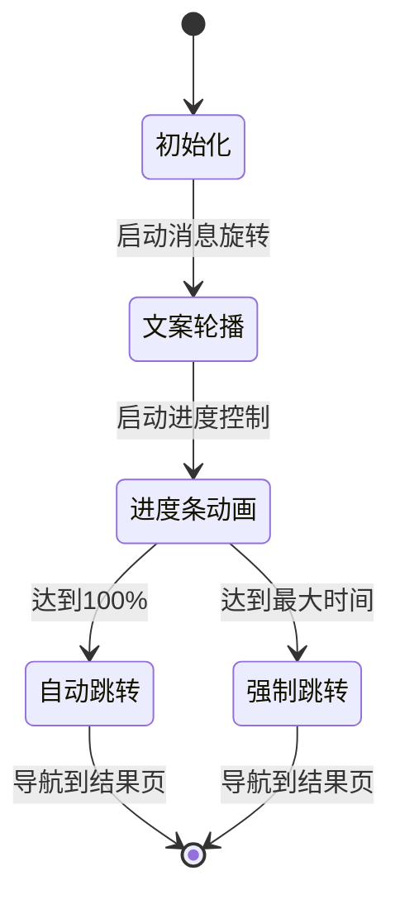
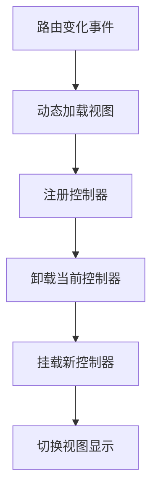
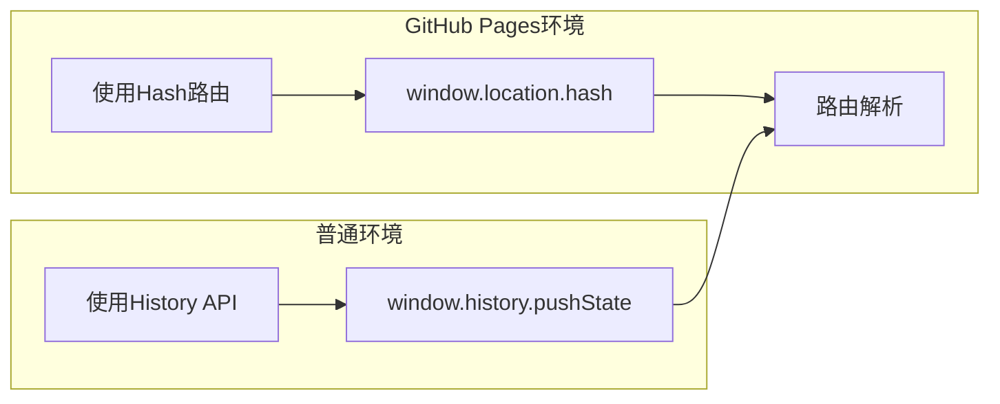
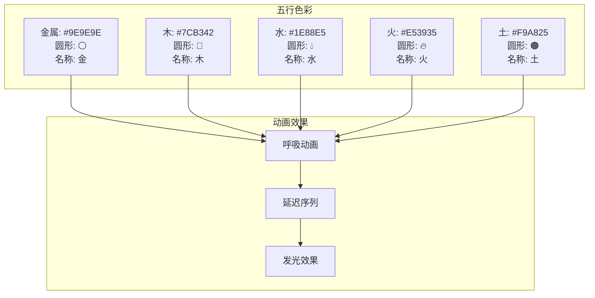
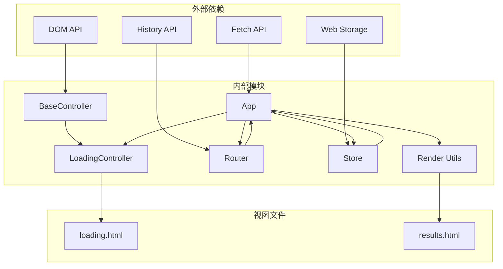

# 加载页面系统

<cite>
**本文档引用的文件**
- [index.html](file://index.html)
- [loading.html](file://views/loading.html)
- [loading.js](file://js/controllers/loading.js)
- [app.js](file://js/core/app.js)
- [router.js](file://js/core/router.js)
- [base.js](file://js/controllers/base.js)
- [render.js](file://js/utils/render.js)
- [store.js](file://js/core/store.js)
- [main.css](file://css/main.css)
- [components.css](file://css/components.css)
- [results.html](file://views/results.html)
</cite>

## 目录
1. [简介](#简介)
2. [项目结构](#项目结构)
3. [核心组件](#核心组件)
4. [架构概览](#架构概览)
5. [详细组件分析](#详细组件分析)
6. [依赖关系分析](#依赖关系分析)
7. [性能考虑](#性能考虑)
8. [故障排除指南](#故障排除指南)
9. [结论](#结论)

## 简介

加载页面系统是"五行穿搭建议"应用中的关键组件，负责在用户完成八字信息输入和心愿选择后，展示一个精心设计的加载动画界面，模拟"五行能量计算"过程，为用户提供沉浸式的体验。该系统采用现代前端架构，结合了模块化设计、响应式状态管理和流畅的动画效果。

## 项目结构

该项目采用模块化的前端架构，主要分为以下几个层次：

**图表来源**
- [index.html](file://index.html#L1-L102)
- [app.js](file://js/core/app.js#L1-L237)
- [router.js](file://js/core/router.js#L1-L172)

**章节来源**
- [index.html](file://index.html#L1-L102)
- [app.js](file://js/core/app.js#L1-L237)

## 核心组件

加载页面系统的核心组件包括：

### 1. 应用主入口 (App.js)
负责整个应用的初始化、路由协调和视图管理。实现了单例模式，确保应用只有一个实例运行。

### 2. 路由系统 (Router.js)
支持GitHub Pages部署的Hash路由，处理浏览器前进后退功能，拦截链接点击事件。

### 3. 控制器基类 (BaseController)
提供统一的生命周期管理，包括挂载、卸载、事件绑定和状态订阅。

### 4. 加载控制器 (LoadingController)
专门处理加载页面的业务逻辑，包括动画控制、进度管理和自动跳转。

### 5. 视图模板 (loading.html)
定义加载页面的HTML结构，包含五行能量动画、文案轮播和进度条。

**章节来源**
- [app.js](file://js/core/app.js#L38-L85)
- [router.js](file://js/core/router.js#L9-L19)
- [base.js](file://js/controllers/base.js#L11-L42)
- [loading.js](file://js/controllers/loading.js#L9-L29)
- [loading.html](file://views/loading.html#L1-L42)

## 架构概览

加载页面系统采用MVVM架构模式，通过控制器-视图分离实现清晰的关注点划分：

**图表来源**
- [app.js](file://js/core/app.js#L176-L199)
- [loading.js](file://js/controllers/loading.js#L31-L60)
- [router.js](file://js/core/router.js#L82-L109)

## 详细组件分析

### 加载控制器 (LoadingController)

加载控制器是整个加载页面系统的核心，负责处理所有与加载相关的业务逻辑：

#### 核心功能特性

1. **动态文案轮播系统**
   - 支持Fisher-Yates洗牌算法随机排列文案
   - 每600ms自动切换一次，确保用户体验流畅
   - 文案包括"分析八字"、"匹配节气"等步骤说明

2. **智能进度管理系统**
   - 基于30ms更新频率的平滑进度条动画
   - 最小1.5秒、最大3秒的加载时间控制
   - 自动跳转机制确保用户体验一致性

3. **动画控制系统**
   - 五行能量球的呼吸动画效果
   - 每个元素有独特的延迟和颜色
   - 支持动画的启动、暂停和清理

#### 状态管理机制

**图表来源**
- [loading.js](file://js/controllers/loading.js#L48-L128)

#### 性能优化策略

1. **内存管理**
   - 使用clearIntervals方法清理定时器
   - 在卸载时重置所有状态变量
   - 避免内存泄漏

2. **动画优化**
   - 使用CSS3硬件加速动画
   - 合理的动画延迟设置
   - 避免频繁DOM操作

**章节来源**
- [loading.js](file://js/controllers/loading.js#L1-L156)

### 应用主入口 (App.js)

应用主入口负责协调各个组件的工作：

#### 初始化流程

1. **错误处理初始化**
   - 注册全局错误处理器
   - 提供withErrorHandler包装器

2. **视图预加载**
   - 预加载首屏需要的视图
   - 减少首次导航时的等待时间

3. **控制器注册**
   - 为每个视图注册对应的控制器
   - 特别处理加载页面的动态创建

#### 路由协调机制

**图表来源**
- [app.js](file://js/core/app.js#L176-L199)

**章节来源**
- [app.js](file://js/core/app.js#L49-L85)

### 路由系统 (Router.js)

路由系统支持多种部署环境：

#### GitHub Pages适配

**图表来源**
- [router.js](file://js/core/router.js#L24-L38)

#### 路由配置管理

| 路径 | 视图 | 功能 |
|------|------|------|
| `/` | view-welcome | 欢迎页面 |
| `/entry` | view-entry | 心愿选择 |
| `/loading` | view-loading | 加载页面 |
| `/results` | view-results | 推荐结果 |
| `/favorites` | view-favorites | 收藏列表 |

**章节来源**
- [router.js](file://js/core/router.js#L10-L19)

### 样式系统

加载页面采用了精心设计的视觉效果：

#### 五行色彩系统

**图表来源**
- [components.css](file://css/components.css#L2475-L2590)

#### 动画实现细节

1. **呼吸动画 (wuxing-breathe)**
   - 2秒周期的缩放动画
   - 透明度从0.3到1的渐变
   - 每个元素有不同的动画延迟

2. **进度条动画**
   - 30ms更新频率确保流畅度
   - 渐变背景色增强视觉效果
   - 百分比显示实时反馈

**章节来源**
- [components.css](file://css/components.css#L2475-L2590)

## 依赖关系分析

加载页面系统的依赖关系呈现清晰的层次结构：

**图表来源**
- [app.js](file://js/core/app.js#L6-L22)
- [loading.js](file://js/controllers/loading.js#L6-L7)

### 模块间耦合度分析

| 模块 | 耦合度 | 说明 |
|------|--------|------|
| LoadingController | 低 | 专注于加载功能，依赖最少 |
| App | 中 | 协调多个组件，但保持松散耦合 |
| Router | 低 | 专注于路由功能，无UI依赖 |
| Store | 低 | 纯数据管理，无UI依赖 |
| BaseController | 低 | 基础功能，无具体业务逻辑 |

**章节来源**
- [app.js](file://js/core/app.js#L13-L33)
- [loading.js](file://js/controllers/loading.js#L6-L7)

## 性能考虑

### 加载性能优化

1. **首屏优化**
   - 预加载关键视图减少白屏时间
   - 延迟注册Service Worker避免阻塞
   - 使用本地字体避免CDN延迟

2. **动画性能**
   - CSS3硬件加速动画
   - 合理的动画帧率控制
   - 避免布局抖动

3. **内存管理**
   - 及时清理定时器和事件监听
   - 控制器卸载时释放资源
   - 避免循环引用

### 用户体验优化

1. **加载时间控制**
   - 最小1.5秒确保动画完整播放
   - 最大3秒强制跳转防止卡死
   - 平滑的过渡动画

2. **视觉反馈**
   - 实时进度显示
   - 动态文案变化
   - 五行能量可视化

## 故障排除指南

### 常见问题及解决方案

#### 1. 加载页面不显示
**症状**: 访问应用后空白页面
**排查步骤**:
1. 检查App初始化是否成功
2. 验证视图文件是否正确加载
3. 确认控制器注册是否正常

**解决方案**:
- 检查网络连接和文件路径
- 验证HTML结构完整性
- 查看浏览器控制台错误信息

#### 2. 动画不工作
**症状**: 五行能量球不闪烁
**排查步骤**:
1. 检查CSS动画定义
2. 验证元素选择器
3. 确认动画延迟设置

**解决方案**:
- 检查CSS文件加载
- 验证元素ID和类名
- 确认浏览器兼容性

#### 3. 路由跳转异常
**症状**: 点击链接无法导航
**排查步骤**:
1. 检查路由配置
2. 验证事件监听器
3. 确认历史记录状态

**解决方案**:
- 检查链接的data-router属性
- 验证路由路径有效性
- 确认GitHub Pages环境检测

**章节来源**
- [app.js](file://js/core/app.js#L91-L129)
- [loading.js](file://js/controllers/loading.js#L145-L154)
- [router.js](file://js/core/router.js#L66-L74)

## 结论

加载页面系统展现了现代前端开发的最佳实践，通过模块化设计、清晰的架构层次和精心的用户体验设计，成功地为用户提供了流畅、直观的加载体验。系统的主要优势包括：

1. **架构清晰**: 采用MVVM模式，职责分离明确
2. **性能优秀**: 预加载、动画优化和内存管理
3. **用户体验**: 流畅的动画、合理的加载时间控制
4. **可维护性**: 模块化设计，易于扩展和修改

该系统为"五行穿搭建议"应用奠定了坚实的技术基础，为后续的功能扩展提供了良好的架构支撑。