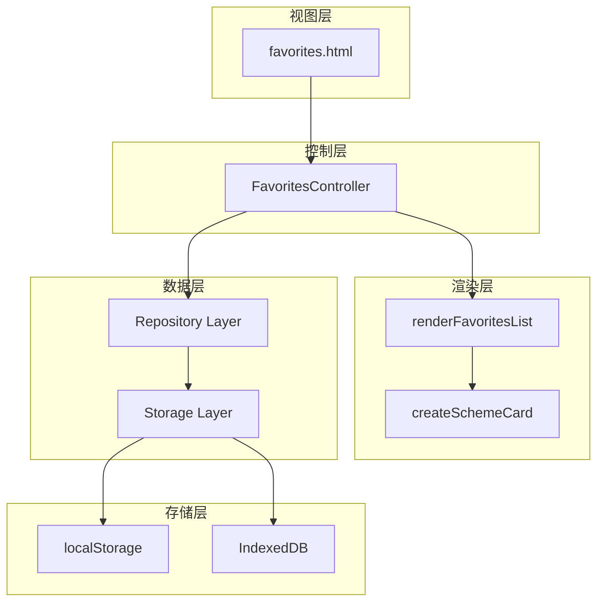
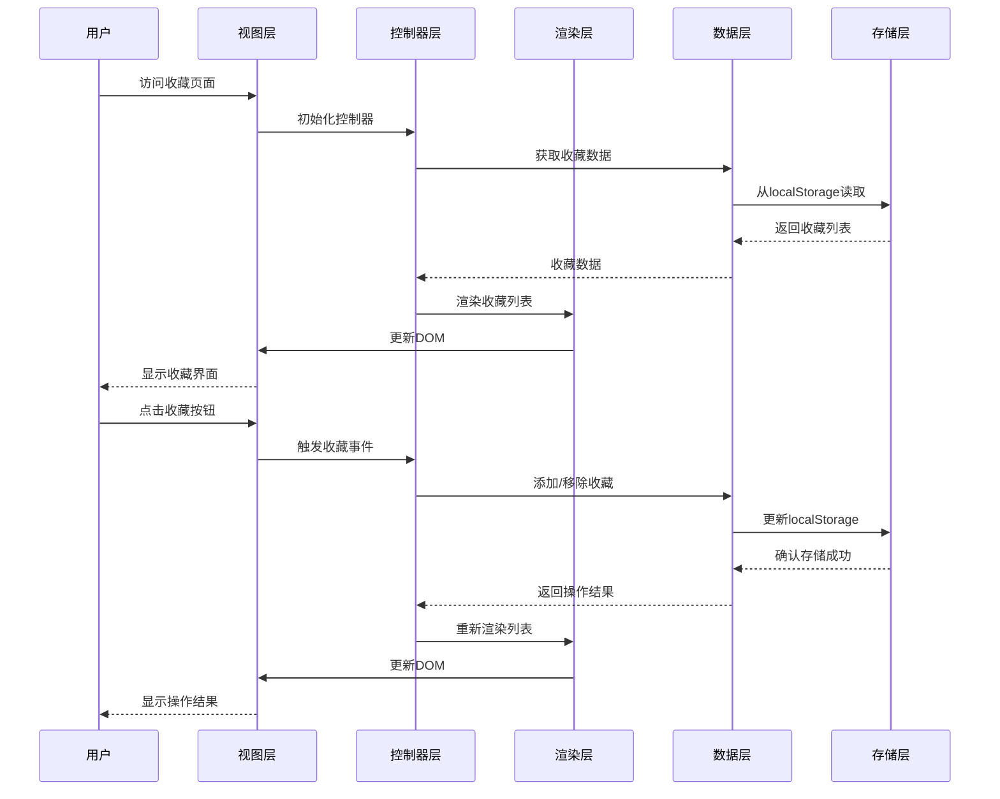
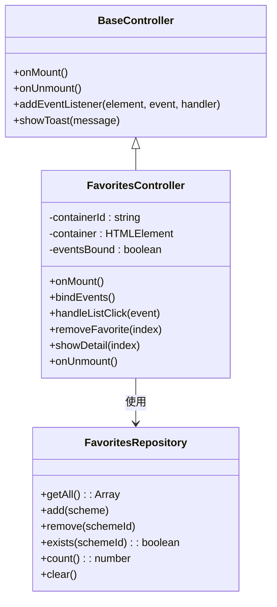
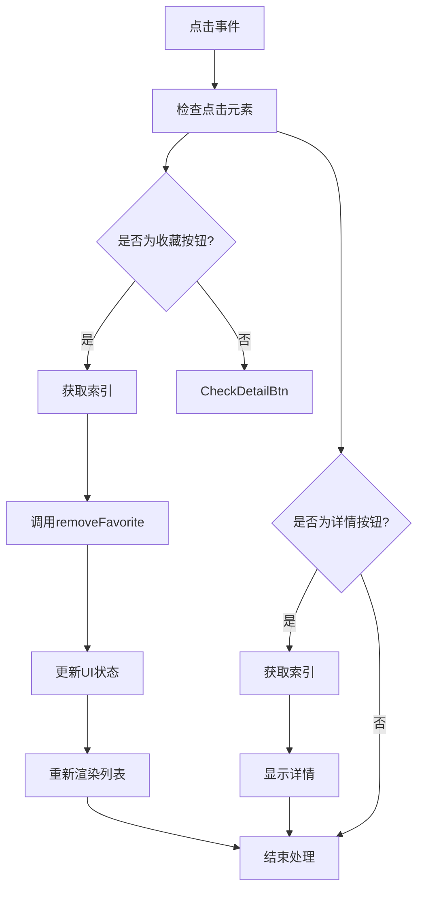
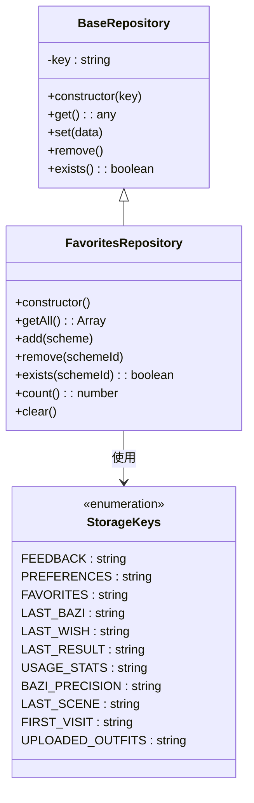
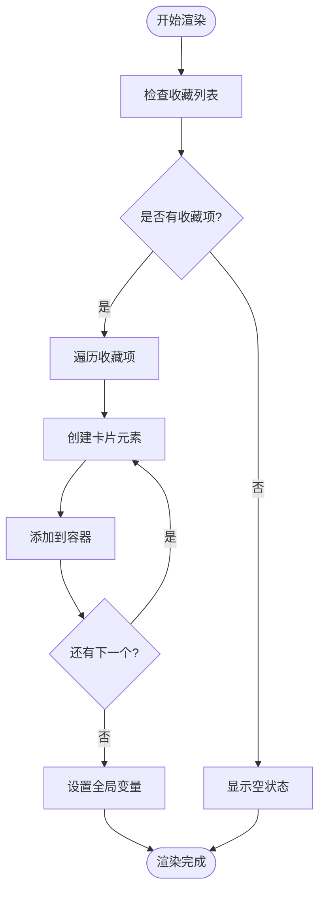
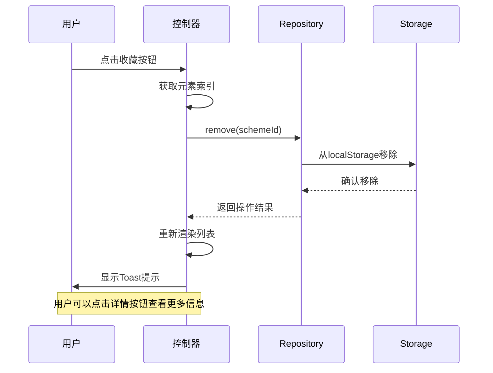
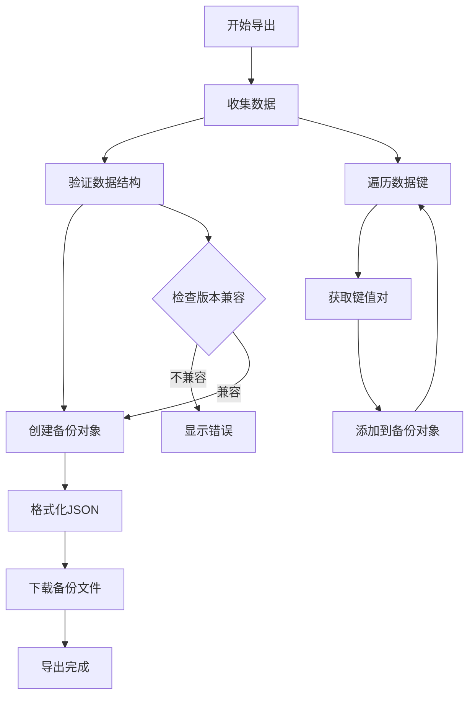
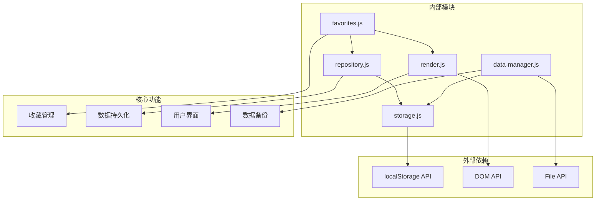

# 收藏管理页面 (Favorites Management)

<cite>
**本文档引用的文件**
- [favorites.html](file://views/favorites.html)
- [favorites.js](file://js/controllers/favorites.js)
- [storage.js](file://js/data/storage.js)
- [repository.js](file://js/data/repository.js)
- [render.js](file://js/utils/render.js)
- [store.js](file://js/core/store.js)
- [data-manager.js](file://js/data/data-manager.js)
- [main.css](file://css/main.css)
- [components.css](file://css/components.css)
</cite>

## 目录
1. [简介](#简介)
2. [项目结构](#项目结构)
3. [核心组件](#核心组件)
4. [架构概览](#架构概览)
5. [详细组件分析](#详细组件分析)
6. [依赖关系分析](#依赖关系分析)
7. [性能考虑](#性能考虑)
8. [故障排除指南](#故障排除指南)
9. [结论](#结论)

## 简介

收藏管理页面是五行为衣应用中的重要功能模块，负责管理用户收藏的搭配方案。该页面实现了完整的收藏生命周期管理，包括收藏的添加、删除、批量管理以及数据的本地持久化存储。本文档将深入分析收藏功能的实现细节，涵盖数据存储机制、用户交互设计、排序筛选功能以及数据导入导出备份机制。

## 项目结构

收藏管理功能涉及多个层次的模块协作，形成了清晰的分层架构：

**图表来源**
- [favorites.html](file://views/favorites.html#L1-L18)
- [favorites.js](file://js/controllers/favorites.js#L10-L30)
- [repository.js](file://js/data/repository.js#L86-L146)

**章节来源**
- [favorites.html](file://views/favorites.html#L1-L18)
- [favorites.js](file://js/controllers/favorites.js#L1-L89)

## 核心组件

收藏管理页面由以下核心组件构成：

### 视图组件
- **favorites.html**: 收藏页面的HTML模板，包含返回按钮、标题和收藏列表容器
- **样式定义**: 通过CSS类名控制布局和视觉效果

### 控制器组件
- **FavoritesController**: 收藏页面的主要控制器，负责事件绑定和业务逻辑处理

### 数据组件
- **Repository模式**: 提供统一的数据访问接口
- **Storage模块**: 实现本地存储的具体操作

### 渲染组件
- **renderFavoritesList**: 收藏列表的渲染函数
- **createSchemeCard**: 单个收藏项的卡片渲染

**章节来源**
- [favorites.html](file://views/favorites.html#L1-L18)
- [favorites.js](file://js/controllers/favorites.js#L10-L89)
- [repository.js](file://js/data/repository.js#L86-L146)
- [render.js](file://js/utils/render.js#L429-L452)

## 架构概览

收藏管理功能采用了经典的MVC架构模式，结合了Repository模式和模块化设计：

**图表来源**
- [favorites.js](file://js/controllers/favorites.js#L16-L30)
- [repository.js](file://js/data/repository.js#L95-L121)
- [render.js](file://js/utils/render.js#L429-L452)

## 详细组件分析

### 收藏控制器 (FavoritesController)

FavoritesController是收藏页面的核心控制器，负责处理用户交互和业务逻辑：

**图表来源**
- [favorites.js](file://js/controllers/favorites.js#L10-L89)
- [repository.js](file://js/data/repository.js#L86-L146)

#### 事件处理机制

控制器实现了事件委托模式，通过单一事件监听器处理多个子元素的点击事件：

**图表来源**
- [favorites.js](file://js/controllers/favorites.js#L54-L83)

**章节来源**
- [favorites.js](file://js/controllers/favorites.js#L10-L89)

### 数据存储与持久化

收藏数据采用多层存储策略，确保数据的安全性和可靠性：

#### Repository模式实现

**图表来源**
- [repository.js](file://js/data/repository.js#L46-L146)

#### 本地存储机制

系统提供了两种存储实现方式：

1. **直接localStorage访问** (`storage.js`)
2. **Repository抽象层** (`repository.js`)

两种方式都提供了相同的功能接口，但Repository模式提供了更好的封装性和扩展性。

**章节来源**
- [repository.js](file://js/data/repository.js#L86-L146)
- [storage.js](file://js/data/storage.js#L118-L144)

### 收藏列表渲染

收藏列表的渲染采用了高效的DOM操作策略：

#### 渲染流程

**图表来源**
- [render.js](file://js/utils/render.js#L429-L452)

#### 卡片组件设计

每个收藏项都渲染为一个完整的卡片组件，包含以下元素：

- **颜色条**: 显示方案的主要色彩
- **类型标签**: 显示方案类型（最佳匹配、同系替代等）
- **关键词**: 颜色、材质、感受等属性标签
- **操作按钮**: 收藏、分享、查看详情按钮
- **推荐理由**: 基于评分系统的详细解释

**章节来源**
- [render.js](file://js/utils/render.js#L429-L452)
- [render.js](file://js/utils/render.js#L137-L201)

### 用户交互设计

收藏页面的用户交互设计注重易用性和直观性：

#### 事件处理机制

**图表来源**
- [favorites.js](file://js/controllers/favorites.js#L54-L83)

#### 状态管理

收藏按钮的状态通过CSS类名进行切换，实现视觉反馈：

- **默认状态**: 灰色边框，空心爱心图标
- **收藏状态**: 红色填充，实心爱心图标
- **悬停效果**: 颜色变化和背景高亮

**章节来源**
- [favorites.js](file://js/controllers/favorites.js#L54-L83)
- [components.css](file://css/components.css#L421-L439)

### 数据导入导出与备份恢复

系统提供了完整的数据备份和恢复机制：

#### 导出功能

**图表来源**
- [data-manager.js](file://js/data/data-manager.js#L48-L72)

#### 导入功能

导入功能支持多种操作模式：

- **完全覆盖**: 清空现有数据后导入新数据
- **数据合并**: 将新数据与现有数据合并
- **预览模式**: 仅显示导入数据的预览信息

**章节来源**
- [data-manager.js](file://js/data/data-manager.js#L138-L184)

## 依赖关系分析

收藏管理功能的依赖关系清晰明确，遵循了单一职责原则：

**图表来源**
- [favorites.js](file://js/controllers/favorites.js#L5-L8)
- [repository.js](file://js/data/repository.js#L6-L7)
- [storage.js](file://js/data/storage.js#L5-L6)

**章节来源**
- [favorites.js](file://js/controllers/favorites.js#L5-L8)
- [repository.js](file://js/data/repository.js#L6-L7)
- [storage.js](file://js/data/storage.js#L5-L6)

## 性能考虑

收藏管理功能在设计时充分考虑了性能优化：

### 内存管理
- 使用事件委托减少内存占用
- 及时清理DOM元素引用
- 避免不必要的DOM操作

### 数据访问优化
- Repository模式提供缓存机制
- 批量操作减少存储访问次数
- 懒加载策略延迟非关键数据加载

### 渲染性能
- 虚拟滚动支持大量收藏项
- CSS动画优化用户体验
- 防抖处理频繁操作

## 故障排除指南

### 常见问题及解决方案

#### 收藏数据丢失
**症状**: 收藏列表显示为空
**原因**: localStorage数据损坏或被清空
**解决**: 
1. 检查浏览器存储权限
2. 使用数据恢复功能
3. 检查应用版本兼容性

#### 操作无响应
**症状**: 点击收藏按钮无反应
**原因**: JavaScript错误或事件绑定失败
**解决**:
1. 检查浏览器控制台错误
2. 重新加载页面
3. 清除浏览器缓存

#### 数据同步问题
**症状**: 多设备间收藏不同步
**解决**:
1. 确认使用同一浏览器
2. 检查跨域访问限制
3. 使用数据导出导入功能

**章节来源**
- [data-manager.js](file://js/data/data-manager.js#L106-L135)
- [favorites.js](file://js/controllers/favorites.js#L16-L30)

## 结论

收藏管理页面实现了完整的收藏功能，具有以下特点：

### 技术优势
- **模块化设计**: 清晰的分层架构便于维护和扩展
- **数据持久化**: 多层存储策略确保数据安全
- **用户友好**: 直观的界面设计和流畅的交互体验
- **数据备份**: 完整的导入导出机制支持数据迁移

### 功能完整性
- 支持收藏的添加、删除、查看和管理
- 提供数据备份和恢复功能
- 实现了响应式设计适配不同设备
- 包含完整的错误处理和用户反馈机制

### 扩展性考虑
- Repository模式为未来扩展预留空间
- 模块化设计支持功能增强
- 数据格式标准化便于版本升级

该收藏管理功能为用户提供了一个可靠、易用的收藏体验，是五行为衣应用的重要组成部分。