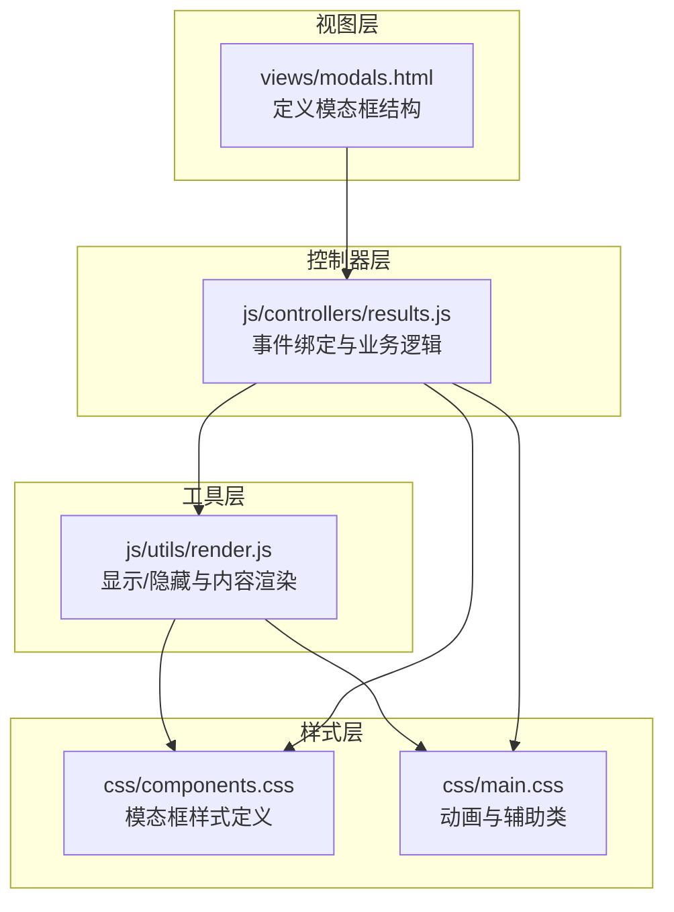
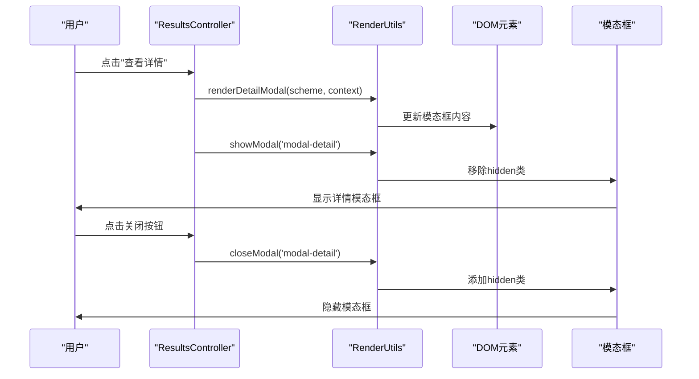
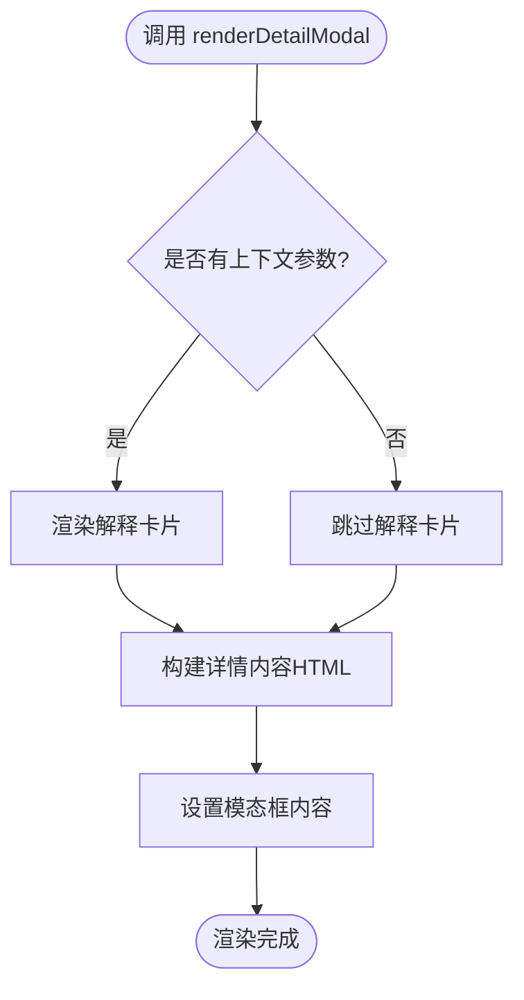
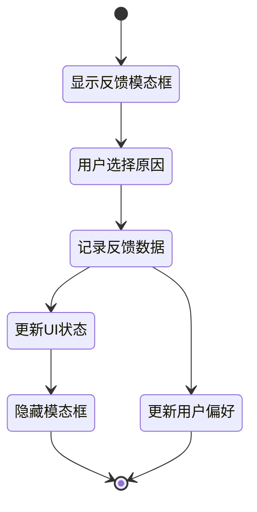
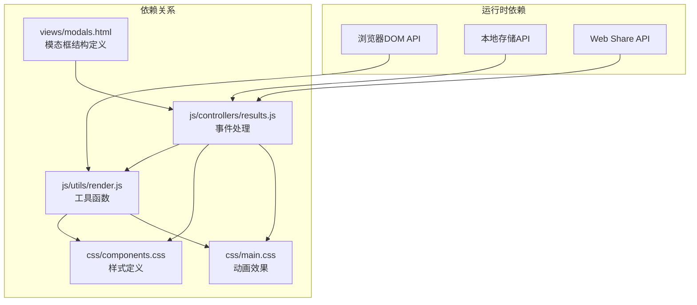

# 模态框组件 (Modal Components)

<cite>
**本文档引用的文件**
- [modals.html](file://views/modals.html)
- [render.js](file://js/utils/render.js)
- [results.js](file://js/controllers/results.js)
- [components.css](file://css/components.css)
- [main.css](file://css/main.css)
</cite>

## 目录
1. [简介](#简介)
2. [项目结构](#项目结构)
3. [核心组件](#核心组件)
4. [架构概览](#架构概览)
5. [详细组件分析](#详细组件分析)
6. [依赖关系分析](#依赖关系分析)
7. [性能考虑](#性能考虑)
8. [故障排除指南](#故障排除指南)
9. [结论](#结论)

## 简介
本文档全面介绍了项目中的模态框组件实现，重点解析了详情模态框、反馈模态框以及相关的交互逻辑。通过分析 HTML 结构、JavaScript 控制器和 CSS 样式，深入说明了模态框的显示/隐藏机制、内容渲染流程、动画效果以及无障碍访问支持。

## 项目结构
模态框相关的核心文件分布如下：
- 视图层：`views/modals.html` 定义了模态框的基本结构
- 控制器层：`js/controllers/results.js` 负责模态框的事件绑定和业务逻辑
- 工具层：`js/utils/render.js` 提供通用的模态框显示/隐藏和内容渲染方法
- 样式层：`css/components.css` 和 `css/main.css` 定义了模态框的视觉样式和动画效果

**图表来源**
- [modals.html](file://views/modals.html#L1-L17)
- [results.js](file://js/controllers/results.js#L255-L359)
- [render.js](file://js/utils/render.js#L383-L403)
- [components.css](file://css/components.css#L900-L932)
- [main.css](file://css/main.css#L303-L332)

**章节来源**
- [modals.html](file://views/modals.html#L1-L17)
- [results.js](file://js/controllers/results.js#L255-L359)
- [render.js](file://js/utils/render.js#L383-L403)
- [components.css](file://css/components.css#L900-L932)
- [main.css](file://css/main.css#L303-L332)

## 核心组件
本项目中的模态框主要由以下组件构成：
- 详情模态框：用于展示搭配方案的详细信息，包括色彩、材质、感受、五行解读和典籍出处等
- 反馈模态框：用于收集用户对搭配方案的反馈，支持多种反馈原因的选择
- 通用工具函数：提供模态框的显示/隐藏控制和内容渲染能力

关键实现要点：
- 使用 `hidden` 类控制模态框的显示状态
- 通过 `showModal()` 和 `closeModal()` 函数统一管理模态框状态
- 详情内容通过 `renderDetailModal()` 进行动态渲染
- 支持点击背景或关闭按钮进行模态框关闭

**章节来源**
- [modals.html](file://views/modals.html#L1-L17)
- [render.js](file://js/utils/render.js#L383-L403)
- [render.js](file://js/utils/render.js#L324-L365)
- [results.js](file://js/controllers/results.js#L316-L359)

## 架构概览
模态框系统的整体架构采用分层设计，确保关注点分离和代码复用：

**图表来源**
- [results.js](file://js/controllers/results.js#L596-L608)
- [render.js](file://js/utils/render.js#L324-L365)
- [render.js](file://js/utils/render.js#L386-L403)

## 详细组件分析

### 详情模态框组件
详情模态框是模态框系统中最复杂的组件，负责展示搭配方案的完整信息。

#### 结构组成
详情模态框包含以下核心区域：
- 标题区域：显示"穿搭详解"标题
- 关闭按钮：提供手动关闭功能
- 内容区域：动态渲染的详细信息

#### 数据渲染流程
详情模态框的内容通过 `renderDetailModal()` 函数进行渲染，支持两种渲染模式：
1. 基础信息渲染：包含色彩、材质、感受、五行解读和典籍出处
2. 上下文扩展渲染：当提供推荐上下文时，额外渲染解释卡片

**图表来源**
- [render.js](file://js/utils/render.js#L324-L365)

#### 样式设计
详情模态框采用卡片式设计，具有以下特点：
- 使用 `detail-section` 类组织内容区块
- `detail-label` 和 `detail-text` 提供清晰的标签-内容布局
- `detail-quote` 专门用于显示典籍引用内容
- 支持响应式设计，适配不同屏幕尺寸

**章节来源**
- [modals.html](file://views/modals.html#L1-L17)
- [render.js](file://js/utils/render.js#L324-L365)
- [components.css](file://css/components.css#L934-L962)

### 反馈模态框组件
反馈模态框用于收集用户对搭配方案的反馈，提供多种反馈原因供用户选择。

#### 功能特性
- 多种反馈原因：支持针对五行、颜色、材质等不同维度的反馈
- 即时状态更新：用户选择后立即更新对应方案卡片的状态
- 数据持久化：将反馈信息存储到本地存储中
- 偏好调整：根据用户反馈动态调整后续推荐算法

#### 交互流程

**图表来源**
- [results.js](file://js/controllers/results.js#L420-L462)

**章节来源**
- [results.js](file://js/controllers/results.js#L420-L462)
- [components.css](file://css/components.css#L526-L544)

### 通用模态框工具
通用工具提供了模态框的基础功能，包括显示、隐藏和内容管理。

#### 核心功能
- `showModal(modalId)`：显示指定ID的模态框
- `closeModal(modalId)`：关闭指定ID的模态框
- `renderDetailModal(scheme, context)`：渲染详情模态框内容

#### 状态管理
工具函数通过操作DOM元素的类名来控制模态框状态：
- 添加 `hidden` 类隐藏模态框
- 移除 `hidden` 类显示模态框
- 设置 `overflow: hidden` 防止背景滚动

**章节来源**
- [render.js](file://js/utils/render.js#L383-L403)
- [render.js](file://js/utils/render.js#L324-L365)

## 依赖关系分析
模态框组件之间的依赖关系体现了清晰的分层架构：

**图表来源**
- [modals.html](file://views/modals.html#L1-L17)
- [results.js](file://js/controllers/results.js#L1-L20)
- [render.js](file://js/utils/render.js#L1-L20)
- [components.css](file://css/components.css#L900-L932)
- [main.css](file://css/main.css#L303-L332)

**章节来源**
- [results.js](file://js/controllers/results.js#L1-L20)
- [render.js](file://js/utils/render.js#L1-L20)
- [components.css](file://css/components.css#L900-L932)

## 性能考虑
模态框系统在性能方面采用了多项优化策略：

### 渲染优化
- 内容按需渲染：详情内容仅在用户请求时才进行渲染
- DOM操作最小化：通过一次性设置 `innerHTML` 减少DOM操作次数
- 事件委托：使用事件委托减少事件监听器数量

### 动画性能
- CSS硬件加速：使用 `transform` 和 `opacity` 属性触发GPU加速
- 合理的动画时长：采用 `var(--duration-fast)` 和 `var(--duration-normal)` 确保流畅体验
- 动画缓动函数：使用 `var(--ease-spring)` 和 `var(--ease-out)` 提供自然的动画效果

### 内存管理
- 自动清理：Toast消息在显示完成后自动移除DOM节点
- 本地存储限制：反馈数据最多保留50条，防止内存泄漏

## 故障排除指南
常见问题及解决方案：

### 模态框无法显示
**症状**：点击"查看详情"按钮后模态框不显示
**排查步骤**：
1. 检查 `modal-detail` 元素是否存在
2. 确认 `showModal('modal-detail')` 调用是否执行
3. 验证 `hidden` 类是否正确移除

### 内容渲染异常
**症状**：模态框显示但内容为空
**排查步骤**：
1. 检查 `renderDetailModal()` 参数传递
2. 确认 `modal-detail-body` 元素存在
3. 验证数据格式是否正确

### 动画效果异常
**症状**：模态框显示时缺少动画效果
**排查步骤**：
1. 检查CSS关键帧定义是否正确
2. 确认 `fadeInScale` 和 `fadeIn` 动画类应用
3. 验证CSS变量定义

**章节来源**
- [render.js](file://js/utils/render.js#L386-L403)
- [render.js](file://js/utils/render.js#L457-L486)
- [main.css](file://css/main.css#L414-L421)

## 结论
本项目的模态框组件实现了完整的用户体验闭环，从基础的显示/隐藏控制到复杂的内容渲染和用户反馈收集。通过清晰的分层架构、合理的依赖管理和完善的性能优化，模态框系统为用户提供了流畅、直观的交互体验。

关键优势包括：
- 模块化设计便于维护和扩展
- 完善的无障碍访问支持
- 流畅的动画效果提升用户体验
- 灵活的内容渲染机制适应不同场景需求

未来可以考虑的方向：
- 增加键盘导航支持
- 扩展更多类型的模态框
- 实现模态框间的层级管理
- 添加更多的自定义配置选项