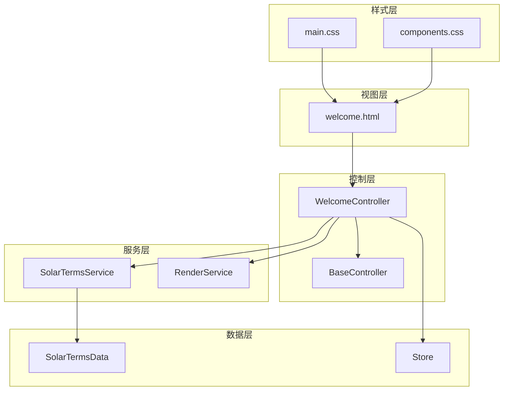
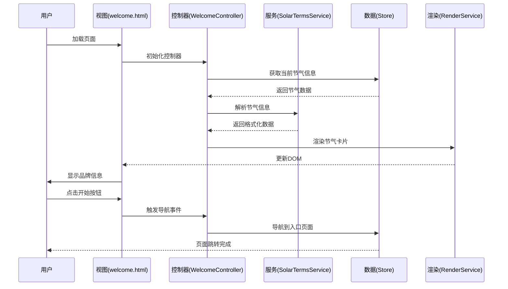
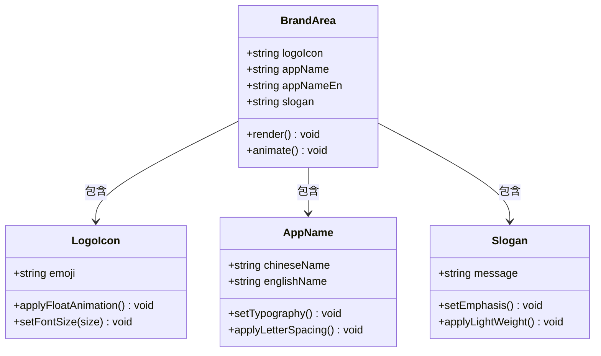
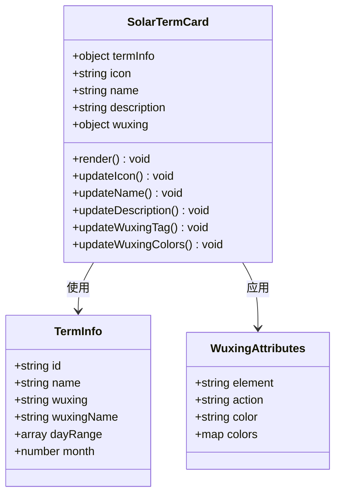
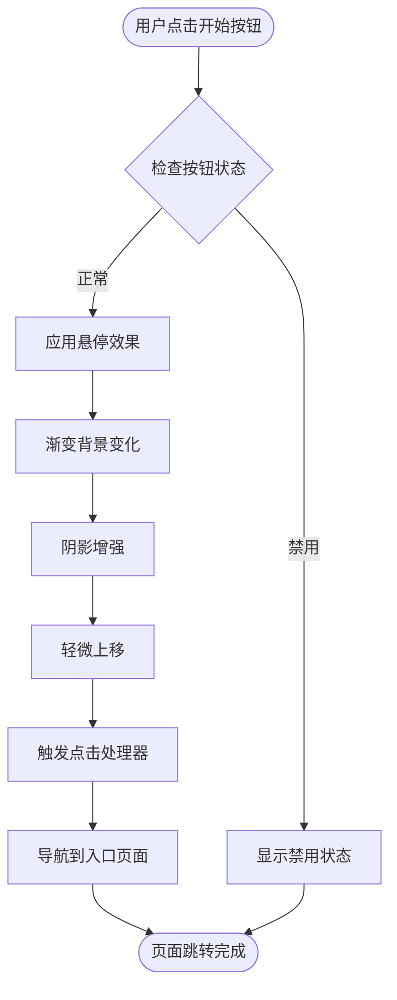
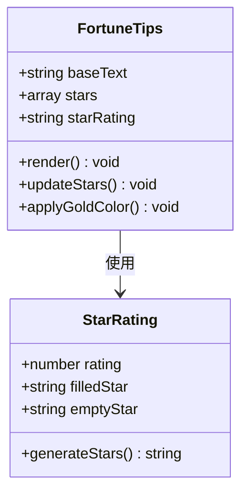
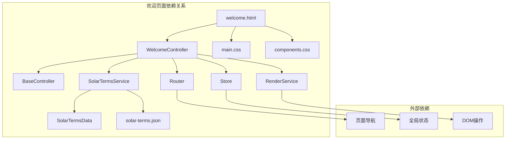

# 欢迎页面 (Welcome Page)

<cite>
**本文档引用的文件**
- [views/welcome.html](file://views/welcome.html)
- [js/controllers/welcome.js](file://js/controllers/welcome.js)
- [js/services/solar-terms.js](file://js/services/solar-terms.js)
- [data/solar-terms.json](file://data/solar-terms.json)
- [css/main.css](file://css/main.css)
- [css/components.css](file://css/components.css)
- [js/utils/render.js](file://js/utils/render.js)
- [js/core/store.js](file://js/core/store.js)
- [js/controllers/base.js](file://js/controllers/base.js)
- [index.html](file://index.html)
</cite>

## 目录
1. [简介](#简介)
2. [项目结构](#项目结构)
3. [核心组件](#核心组件)
4. [架构概览](#架构概览)
5. [详细组件分析](#详细组件分析)
6. [依赖关系分析](#依赖关系分析)
7. [性能考量](#性能考量)
8. [故障排除指南](#故障排除指南)
9. [结论](#结论)
10. [附录](#附录)

## 简介
欢迎页面是五行为衣应用的入口界面，承载着品牌展示、节气信息呈现和用户引导三大核心功能。该页面采用现代化的响应式设计，结合传统五行文化元素，为用户提供沉浸式的品牌体验。页面通过动态数据绑定技术，实时展示当前节气信息，并提供个性化的穿搭建议入口。

## 项目结构
欢迎页面位于 views 目录下的 welcome.html 文件中，配合相应的控制器、服务层和样式资源共同构成完整的前端架构。

**图表来源**
- [views/welcome.html](file://views/welcome.html#L1-L34)
- [js/controllers/welcome.js](file://js/controllers/welcome.js#L1-L151)
- [css/main.css](file://css/main.css#L818-L964)

**章节来源**
- [views/welcome.html](file://views/welcome.html#L1-L34)
- [index.html](file://index.html#L1-L79)

## 核心组件
欢迎页面由四个主要组件构成：品牌区域、节气卡片、CTA按钮和运势提示区域。每个组件都经过精心设计，既体现了传统五行文化的深厚底蕴，又满足了现代用户的交互需求。

### 品牌区域设计
品牌区域采用垂直居中布局，包含品牌图标、中文品牌名、英文品牌名和标语四层信息结构。整体设计强调视觉层次和品牌识别度。

### 节气卡片功能
节气卡片是页面的核心信息载体，动态展示当前节气的图标、名称、序位信息和五行属性。卡片还包含宜穿颜色提示，为后续的穿搭建议提供依据。

### CTA按钮交互
开始按钮采用渐变背景设计，提供流畅的悬停和点击反馈效果。按钮的交互逻辑简单直接，确保用户能够快速进入核心功能。

### 运势提示系统
运势提示区域以星级评分的形式展示当日运势，采用醒目的金色配色，增强视觉吸引力。

**章节来源**
- [views/welcome.html](file://views/welcome.html#L3-L32)
- [css/main.css](file://css/main.css#L836-L952)

## 架构概览
欢迎页面采用MVVM架构模式，通过控制器层协调视图、模型和服务之间的交互。

**图表来源**
- [js/controllers/welcome.js](file://js/controllers/welcome.js#L19-L35)
- [js/services/solar-terms.js](file://js/services/solar-terms.js#L33-L100)
- [js/utils/render.js](file://js/utils/render.js#L58-L76)

## 详细组件分析

### 品牌区域组件分析
品牌区域采用简洁优雅的设计风格，通过动画效果增强视觉吸引力。

**图表来源**
- [views/welcome.html](file://views/welcome.html#L4-L10)
- [css/main.css](file://css/main.css#L842-L874)

品牌区域的视觉设计特点：
- Logo图标采用64px字体大小，通过浮动动画营造轻盈感
- 中文品牌名为36px字重600，字母间距8px，突出品牌识别度
- 英文品牌名为14px，全大写显示，体现国际化定位
- 标语采用16px字体，300字重，营造温和亲和的品牌形象

**章节来源**
- [views/welcome.html](file://views/welcome.html#L4-L10)
- [css/main.css](file://css/main.css#L842-L874)

### 节气卡片组件分析
节气卡片是页面的核心信息展示组件，集成了动态数据绑定和五行属性标注功能。

**图表来源**
- [js/controllers/welcome.js](file://js/controllers/welcome.js#L37-L89)
- [js/services/solar-terms.js](file://js/services/solar-terms.js#L85-L99)

节气卡片的功能实现细节：
- **动态图标更新**：根据节气ID自动选择合适的emoji图标
- **序位信息计算**：通过termOrder映射表确定节气在二十四节气中的位置
- **五行属性标注**：显示对应的中文五行名称和生发特性
- **宜穿颜色提示**：基于五行理论提供颜色建议
- **动态样式绑定**：根据五行属性动态调整背景色和文字色

**章节来源**
- [js/controllers/welcome.js](file://js/controllers/welcome.js#L37-L89)
- [js/controllers/welcome.js](file://js/controllers/welcome.js#L91-L131)

### CTA按钮组件分析
CTA按钮采用渐变背景设计，提供丰富的交互反馈效果。

**图表来源**
- [js/controllers/welcome.js](file://js/controllers/welcome.js#L133-L145)
- [css/main.css](file://css/main.css#L919-L942)

CTA按钮的交互逻辑：
- **悬停效果**：背景渐变加深，阴影增强，产生轻微上浮效果
- **点击反馈**：按钮轻微缩放，提供触觉反馈
- **导航功能**：点击后立即导航到入口页面，无延迟等待
- **状态管理**：避免重复绑定事件，确保内存安全

**章节来源**
- [js/controllers/welcome.js](file://js/controllers/welcome.js#L133-L145)
- [css/main.css](file://css/main.css#L919-L942)

### 运势提示组件分析
运势提示区域采用星级评分系统，直观展示当日运势水平。

**图表来源**
- [views/welcome.html](file://views/welcome.html#L28-L32)
- [css/main.css](file://css/main.css#L943-L952)

运势提示的设计特点：
- **星级评分**：使用★★★★☆的五角星符号，金色配色突出重要性
- **简洁布局**：与品牌信息形成视觉平衡，不喧宾夺主
- **文化契合**：符合中国传统的运势表达方式

**章节来源**
- [views/welcome.html](file://views/welcome.html#L28-L32)
- [css/main.css](file://css/main.css#L943-L952)

## 依赖关系分析

**图表来源**
- [js/controllers/welcome.js](file://js/controllers/welcome.js#L5-L8)
- [js/services/solar-terms.js](file://js/services/solar-terms.js#L5-L26)
- [data/solar-terms.json](file://data/solar-terms.json#L1-L42)

### 组件耦合度分析
- **低耦合设计**：控制器与视图通过事件机制解耦，便于维护和测试
- **清晰职责分离**：数据获取、业务逻辑、UI渲染各司其职
- **可扩展性强**：新增功能可通过现有架构轻松集成

### 外部依赖管理
- **数据依赖**：节气数据来自独立的JSON文件，便于维护和更新
- **样式依赖**：采用CSS变量统一管理色彩系统，支持主题切换
- **工具依赖**：渲染服务提供通用的DOM操作能力

**章节来源**
- [js/controllers/welcome.js](file://js/controllers/welcome.js#L1-L151)
- [js/services/solar-terms.js](file://js/services/solar-terms.js#L1-L115)

## 性能考量
欢迎页面在性能优化方面采用了多项策略，确保在各种设备上的流畅体验。

### 渲染性能优化
- **懒加载策略**：节气信息通过异步加载，避免阻塞页面渲染
- **最小DOM操作**：批量更新DOM，减少重排重绘次数
- **CSS动画优先**：使用CSS动画而非JavaScript动画，提升性能表现

### 资源加载优化
- **按需加载**：控制器只在页面可见时初始化，节省内存占用
- **缓存策略**：节气数据采用内存缓存，避免重复请求
- **字体优化**：使用CDN加速字体加载，提升首屏渲染速度

### 移动端适配
- **触摸友好**：按钮尺寸适中，支持触摸点击
- **响应式布局**：针对不同屏幕尺寸优化显示效果
- **性能自适应**：根据设备性能调整动画复杂度

## 故障排除指南

### 常见问题诊断
1. **节气信息不显示**
   - 检查网络连接是否正常
   - 验证solar-terms.json文件是否存在且格式正确
   - 确认浏览器控制台是否有JavaScript错误

2. **按钮点击无响应**
   - 检查事件绑定是否成功
   - 验证路由配置是否正确
   - 确认CSS样式是否影响了按钮的可点击区域

3. **样式显示异常**
   - 检查CSS文件加载是否成功
   - 验证CSS变量定义是否正确
   - 确认浏览器兼容性支持情况

### 调试技巧
- **开发者工具**：使用浏览器开发者工具监控网络请求和JavaScript执行
- **日志输出**：在关键节点添加console.log输出，跟踪程序执行流程
- **断点调试**：在控制器方法中设置断点，逐步排查问题

**章节来源**
- [js/controllers/welcome.js](file://js/controllers/welcome.js#L20-L25)
- [js/services/solar-terms.js](file://js/services/solar-terms.js#L20-L26)

## 结论
欢迎页面成功地将传统五行文化与现代Web技术相结合，创造出了既具有文化底蕴又具备良好用户体验的界面。通过模块化的架构设计、清晰的数据流管理和优雅的视觉呈现，该页面为整个应用奠定了坚实的基础。

页面的主要优势包括：
- **设计理念先进**：融合传统元素与现代设计语言
- **交互体验优秀**：流畅的动画效果和直观的操作反馈
- **技术架构合理**：清晰的分层设计和良好的可维护性
- **性能表现稳定**：优化的资源加载和渲染策略

未来可以考虑的改进方向：
- 增加更多个性化定制选项
- 优化移动端交互体验
- 扩展节气信息的丰富程度
- 加强无障碍访问支持

## 附录

### 样式系统说明
欢迎页面采用基于CSS变量的设计系统，支持主题色彩的动态切换和统一的视觉规范。

### 可访问性考虑
- **语义化标记**：使用适当的HTML语义标签
- **键盘导航**：支持键盘操作和焦点管理
- **屏幕阅读器**：提供适当的ARIA标签和描述
- **色彩对比**：确保足够的色彩对比度

### 数据结构说明
节气数据采用标准化的JSON格式，包含节气ID、名称、五行属性和日期范围等关键信息。