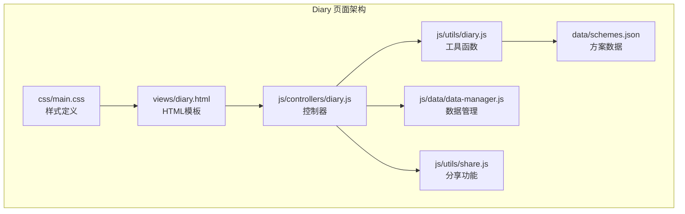
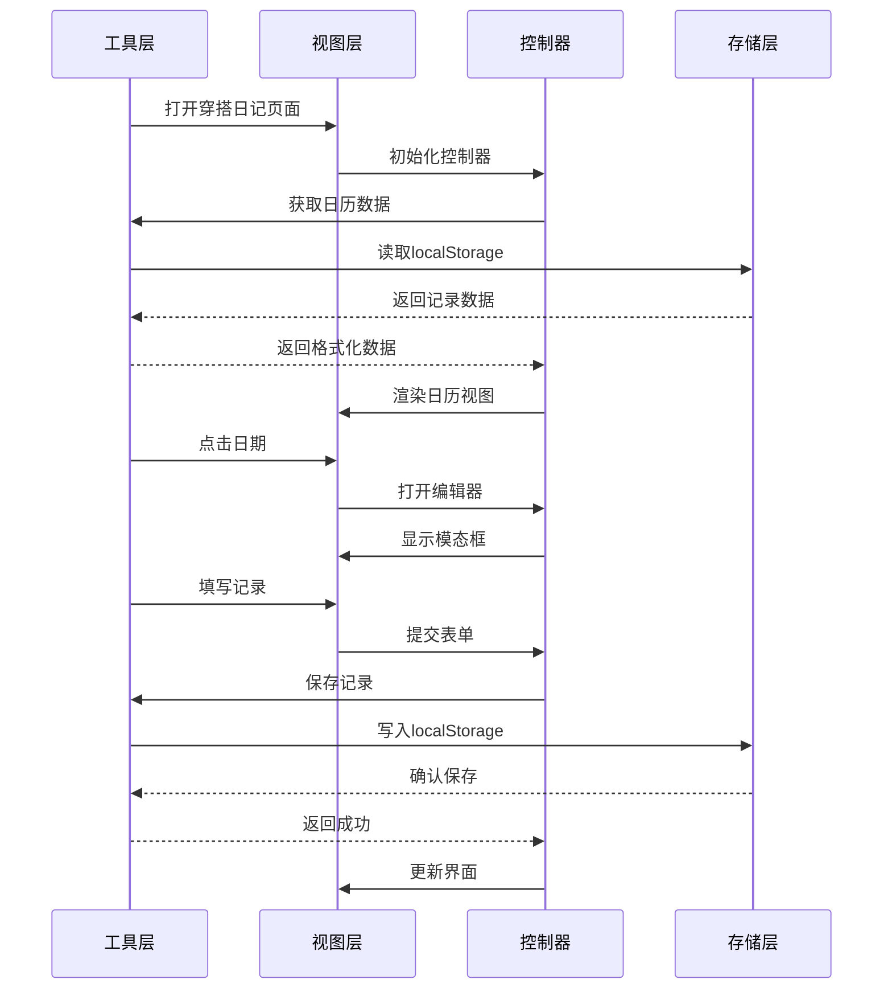
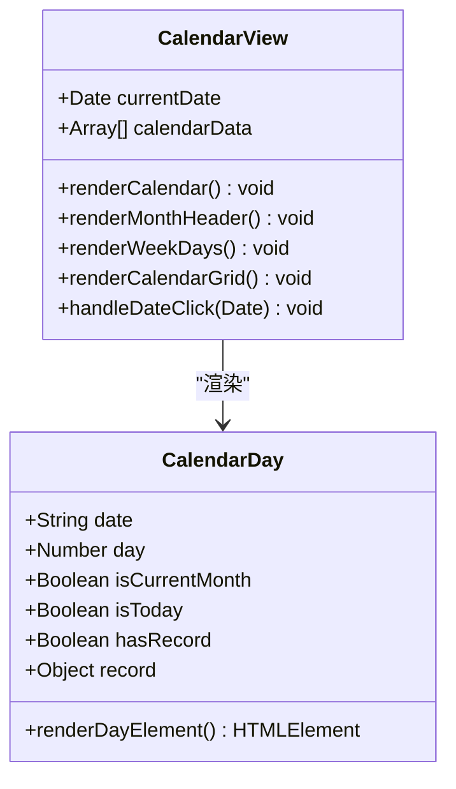
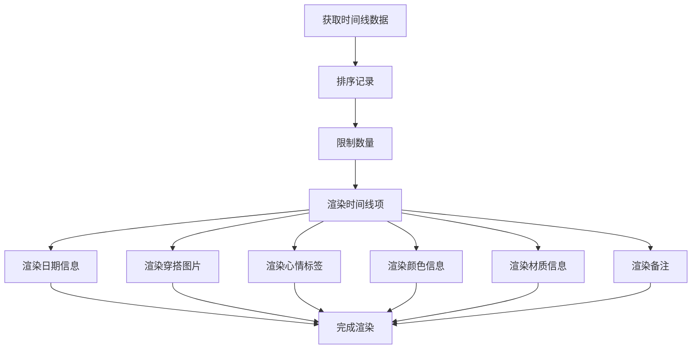
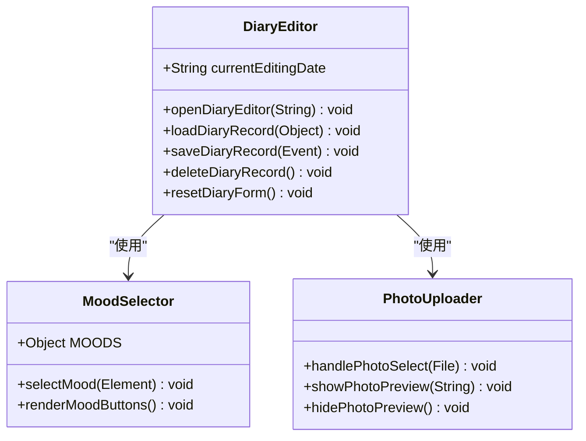
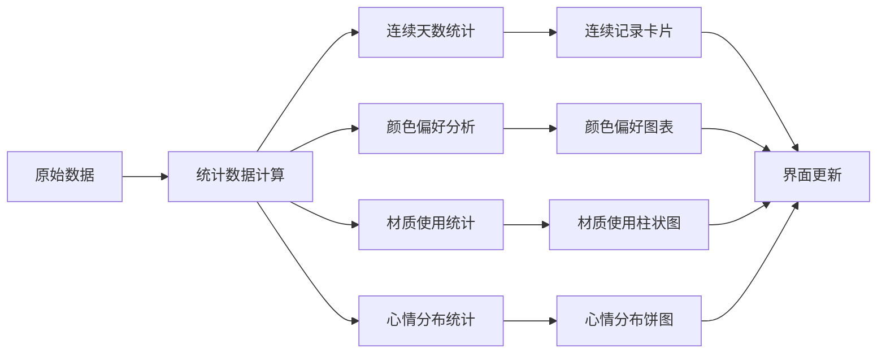
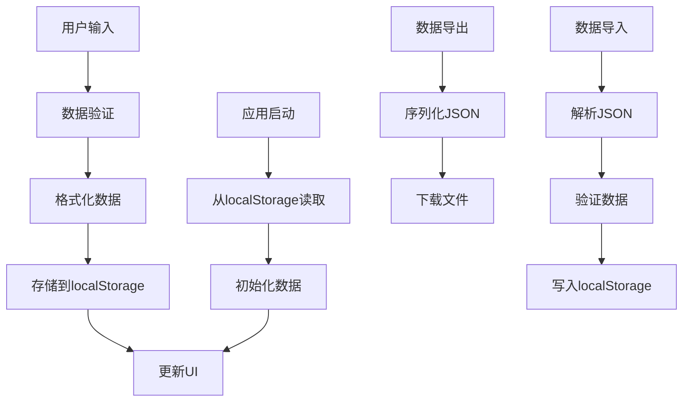
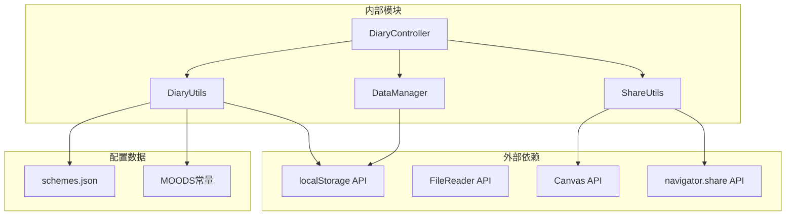

# 穿搭日记页面 (Diary Logging)

<cite>
**本文档引用的文件**
- [views/diary.html](file://views/diary.html)
- [js/controllers/diary.js](file://js/controllers/diary.js)
- [js/utils/diary.js](file://js/utils/diary.js)
- [data/schemes.json](file://data/schemes.json)
- [js/data/data-manager.js](file://js/data/data-manager.js)
- [js/utils/share.js](file://js/utils/share.js)
- [css/main.css](file://css/main.css)
</cite>

## 目录
1. [简介](#简介)
2. [项目结构](#项目结构)
3. [核心组件](#核心组件)
4. [架构概览](#架构概览)
5. [详细组件分析](#详细组件分析)
6. [依赖关系分析](#依赖关系分析)
7. [性能考虑](#性能考虑)
8. [故障排除指南](#故障排除指南)
9. [结论](#结论)

## 简介
穿搭日记页面是"五行穿搭建议"小程序中的核心功能模块，为用户提供了一个完整的穿搭记录、回顾和分析系统。该页面支持日历视图和时间线视图两种展示模式，提供丰富的统计数据和分析功能，以及便捷的分享和导出能力。

## 项目结构
Diary页面采用模块化架构设计，主要包含以下核心文件：

**图表来源**
- [views/diary.html](file://views/diary.html#L1-L159)
- [js/controllers/diary.js](file://js/controllers/diary.js#L1-L440)
- [js/utils/diary.js](file://js/utils/diary.js#L1-L242)

**章节来源**
- [views/diary.html](file://views/diary.html#L1-L159)
- [js/controllers/diary.js](file://js/controllers/diary.js#L1-L40)

## 核心组件
Diary页面由多个相互协作的组件构成，每个组件都有明确的职责分工：

### 视图层组件
- **日历视图**：提供月度日历展示，支持日期选择和记录标记
- **时间线视图**：按时间顺序展示所有穿搭记录
- **统计面板**：显示连续记录天数、总记录数等关键指标
- **颜色偏好分析**：可视化展示用户的颜色偏好分布

### 控制器组件
- **DiaryController**：协调各个组件的交互，处理用户事件
- **事件处理器**：绑定和响应各种用户操作
- **视图切换器**：在日历和时间线模式间切换

### 工具组件
- **数据持久化**：基于localStorage的安全存储
- **统计分析**：计算各种统计数据和趋势
- **格式化工具**：日期格式化、数据转换等

**章节来源**
- [js/controllers/diary.js](file://js/controllers/diary.js#L19-L440)
- [js/utils/diary.js](file://js/utils/diary.js#L1-L242)

## 架构概览

**图表来源**
- [js/controllers/diary.js](file://js/controllers/diary.js#L25-L85)
- [js/utils/diary.js](file://js/utils/diary.js#L57-L75)

## 详细组件分析

### 日历视图组件

日历视图是Diary页面的核心展示组件，提供了直观的月度视图来查看和管理穿搭记录。

**图表来源**
- [js/controllers/diary.js](file://js/controllers/diary.js#L163-L206)

日历视图的主要特性：
- **日期标记**：通过圆点标记有记录的日期
- **今日高亮**：特殊样式标识当前日期
- **月份导航**：支持上个月和下个月的切换
- **响应式布局**：适配不同屏幕尺寸

**章节来源**
- [js/controllers/diary.js](file://js/controllers/diary.js#L163-L206)

### 时间线视图组件

时间线视图提供了按时间倒序排列的记录展示方式，便于用户快速浏览历史记录。

**图表来源**
- [js/controllers/diary.js](file://js/controllers/diary.js#L208-L250)

时间线视图的关键功能：
- **自动排序**：按日期倒序排列
- **截断显示**：默认显示最近30条记录
- **丰富信息**：展示图片、心情、颜色、材质等多维度信息

**章节来源**
- [js/controllers/diary.js](file://js/controllers/diary.js#L208-L250)

### 记录编辑器组件

记录编辑器是一个模态框组件，提供完整的穿搭记录录入和编辑功能。

**图表来源**
- [js/controllers/diary.js](file://js/controllers/diary.js#L287-L396)

编辑器的核心功能：
- **多维度记录**：支持颜色、材质、备注、照片等多种信息
- **心情选择**：5种不同的心情状态可选
- **照片上传**：支持本地图片选择和预览
- **数据验证**：确保必填信息的完整性

**章节来源**
- [js/controllers/diary.js](file://js/controllers/diary.js#L287-L396)

### 统计分析组件

统计分析组件提供了丰富的数据洞察功能，帮助用户了解自己的穿搭习惯。

**图表来源**
- [js/utils/diary.js](file://js/utils/diary.js#L147-L182)

统计分析的主要指标：
- **连续记录天数**：计算最长连续穿搭天数
- **颜色偏好**：统计使用频率最高的颜色
- **材质分布**：分析不同材质的使用情况
- **心情趋势**：展示不同心情状态的分布

**章节来源**
- [js/utils/diary.js](file://js/utils/diary.js#L147-L182)

### 数据持久化组件

数据持久化组件负责将用户的穿搭记录安全地存储在浏览器中。

**图表来源**
- [js/utils/diary.js](file://js/utils/diary.js#L57-L75)

数据持久化的安全特性：
- **错误处理**：封装localStorage操作，防止异常
- **数据格式**：统一的JSON格式存储
- **版本控制**：支持数据格式升级
- **备份恢复**：提供完整的导入导出功能

**章节来源**
- [js/utils/diary.js](file://js/utils/diary.js#L19-L32)

## 依赖关系分析

**图表来源**
- [js/controllers/diary.js](file://js/controllers/diary.js#L5-L17)
- [js/utils/diary.js](file://js/utils/diary.js#L6-L17)

### 关键依赖关系

1. **控制器与工具层**：控制器通过ES6模块导入工具函数
2. **工具层与数据层**：工具函数封装localStorage访问
3. **分享功能独立**：分享功能相对独立，可复用性强
4. **配置数据分离**：方案数据独立存储，便于维护

**章节来源**
- [js/controllers/diary.js](file://js/controllers/diary.js#L5-L17)
- [js/utils/diary.js](file://js/utils/diary.js#L6-L17)

## 性能考虑

### 渲染优化
- **虚拟滚动**：时间线视图限制显示数量，避免大量DOM节点
- **懒加载**：图片采用延迟加载策略
- **事件委托**：使用事件委托减少监听器数量

### 数据处理优化
- **内存管理**：及时清理不需要的数据引用
- **批量更新**：一次性更新多个DOM元素
- **缓存策略**：缓存计算结果，避免重复计算

### 存储优化
- **增量更新**：只更新变化的数据部分
- **压缩存储**：对大数据进行压缩存储
- **异步操作**：避免阻塞主线程

## 故障排除指南

### 常见问题及解决方案

**问题1：记录无法保存**
- 检查localStorage权限设置
- 确认浏览器未禁用本地存储
- 查看控制台是否有错误信息

**问题2：日历显示异常**
- 验证日期格式是否正确
- 检查网络连接状态
- 清除浏览器缓存后重试

**问题3：图片上传失败**
- 确认文件类型是否为图片
- 检查文件大小限制
- 验证浏览器兼容性

**问题4：数据丢失**
- 检查浏览器隐私设置
- 确认未清除浏览器数据
- 及时进行数据备份

### 调试技巧
- 使用浏览器开发者工具监控localStorage变化
- 在控制台检查数据结构和格式
- 利用console.log跟踪执行流程

**章节来源**
- [js/utils/diary.js](file://js/utils/diary.js#L19-L32)
- [js/controllers/diary.js](file://js/controllers/diary.js#L427-L434)

## 结论

穿搭日记页面是一个功能完整、架构清晰的前端应用模块。它通过模块化的设计实现了良好的代码组织和可维护性，通过合理的数据流设计保证了用户体验的流畅性。

### 主要优势
- **模块化架构**：清晰的职责分离，便于维护和扩展
- **用户体验优秀**：直观的界面设计和流畅的操作体验
- **数据安全性**：完善的错误处理和数据保护机制
- **功能完整性**：涵盖记录、分析、分享、备份等完整功能链

### 改进建议
- **离线支持**：考虑添加Service Worker实现离线功能
- **数据同步**：支持多设备间的数据同步
- **高级分析**：增加更复杂的统计分析功能
- **个性化定制**：允许用户自定义视图和统计指标

该Diary页面为用户提供了完整的穿搭记录和分析解决方案，是"五行穿搭建议"小程序的重要组成部分。