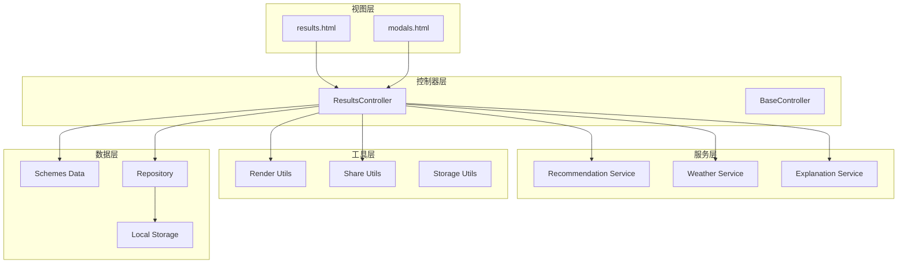
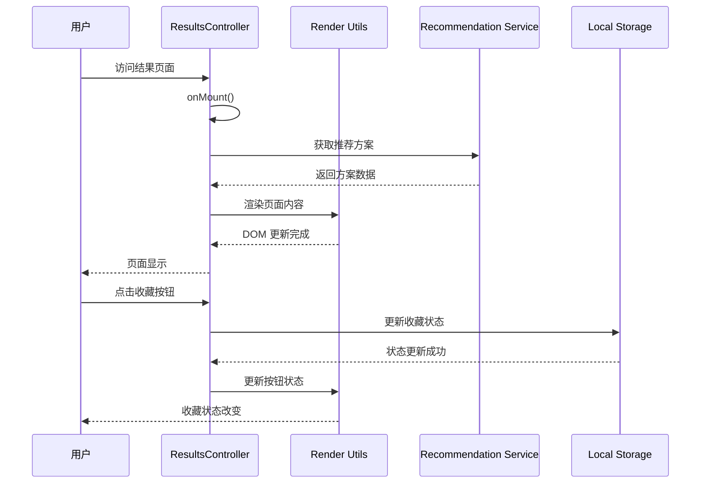
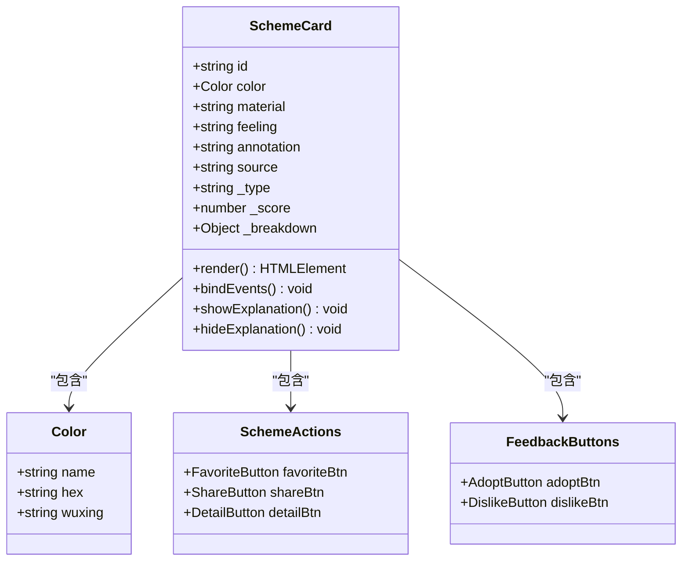
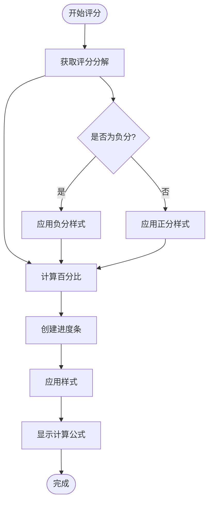
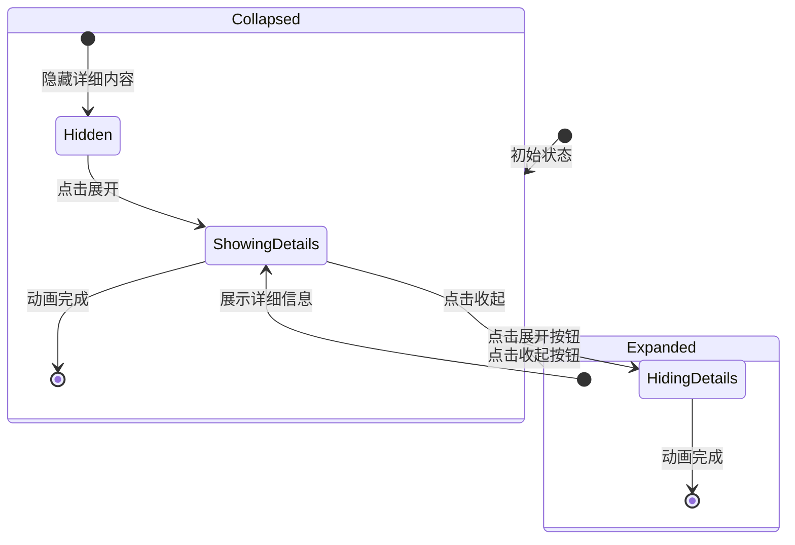
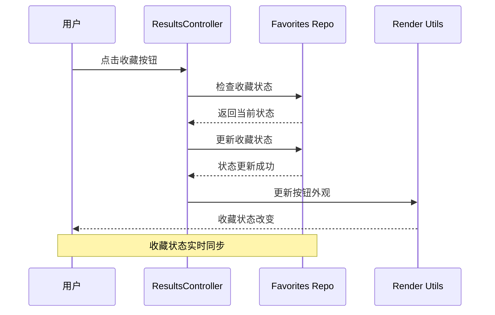
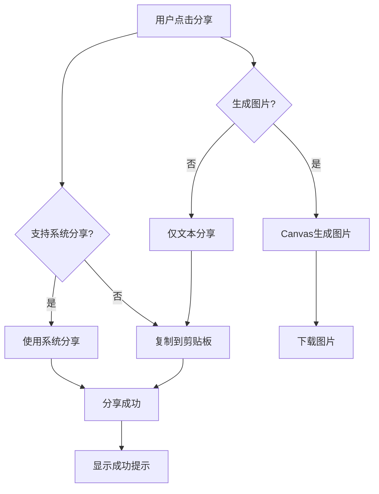
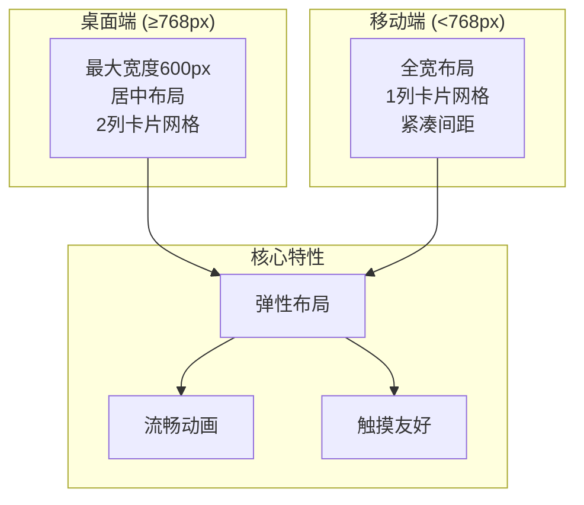
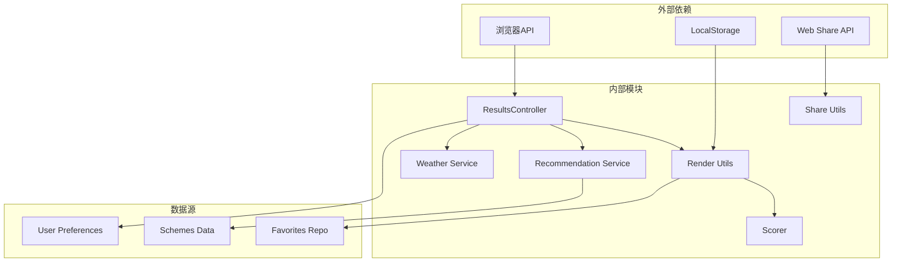

# 结果展示页面（Results Display）

<cite>
**本文档引用的文件**
- [views/results.html](file://views/results.html)
- [js/controllers/results.js](file://js/controllers/results.js)
- [js/utils/render.js](file://js/utils/render.js)
- [js/services/recommendation.js](file://js/services/recommendation.js)
- [js/core/scorer.js](file://js/core/scorer.js)
- [js/core/scoring-config.js](file://js/core/scoring-config.js)
- [js/utils/share.js](file://js/utils/share.js)
- [css/main.css](file://css/main.css)
- [css/components.css](file://css/components.css)
- [data/schemes.json](file://data/schemes.json)
</cite>

## 目录
1. [简介](#简介)
2. [项目结构](#项目结构)
3. [核心组件](#核心组件)
4. [架构概览](#架构概览)
5. [详细组件分析](#详细组件分析)
6. [依赖关系分析](#依赖关系分析)
7. [性能考虑](#性能考虑)
8. [故障排除指南](#故障排除指南)
9. [结论](#结论)

## 简介

结果展示页面是五行动漫穿搭推荐系统的核心界面，负责向用户呈现个性化的穿搭推荐方案。该页面实现了完整的推荐方案展示功能，包括方案卡片设计、评分系统可视化、详情展开机制以及完整的用户交互功能。

页面采用响应式设计，支持桌面端和移动端的无缝体验。通过智能评分算法和用户反馈机制，为用户提供精准的穿搭建议，并允许用户进行收藏、分享和查看详情等操作。

## 项目结构

结果展示页面位于 views 目录下的 results.html 文件中，配合相关的 JavaScript 控制器和工具模块实现完整的功能。

**图表来源**
- [views/results.html](file://views/results.html#L1-L128)
- [js/controllers/results.js](file://js/controllers/results.js#L1-L614)

**章节来源**
- [views/results.html](file://views/results.html#L1-L128)
- [js/controllers/results.js](file://js/controllers/results.js#L1-L614)

## 核心组件

### 页面结构组件

结果页面包含以下主要组件：

1. **头部导航区域** - 包含返回按钮、品牌标识和功能按钮
2. **标题区域** - 显示今日穿搭推荐标题和副标题
3. **运势卡片** - 展示当日穿搭运势和建议
4. **天气影响提示** - 基于天气条件的穿搭建议
5. **方案卡片容器** - 动态渲染推荐方案卡片
6. **操作按钮区** - 提供换一批和上传功能

### 推荐方案展示系统

页面采用卡片式设计展示推荐方案，每张卡片包含：
- 颜色条和关键词标签
- 方案详细描述和出处
- 推荐理由解释
- 用户交互按钮（收藏、分享、查看详情）

**章节来源**
- [views/results.html](file://views/results.html#L1-L128)
- [js/utils/render.js](file://js/utils/render.js#L119-L201)

## 架构概览

结果展示页面采用 MVC 架构模式，通过控制器协调视图、模型和服务层的交互。

**图表来源**
- [js/controllers/results.js](file://js/controllers/results.js#L20-L614)
- [js/utils/render.js](file://js/utils/render.js#L119-L132)

## 详细组件分析

### 推荐方案卡片系统

推荐方案卡片是页面的核心组件，采用模块化设计实现完整的展示功能。

#### 卡片结构设计

**图表来源**
- [js/utils/render.js](file://js/utils/render.js#L137-L201)
- [data/schemes.json](file://data/schemes.json#L1-L200)

#### 卡片渲染流程

卡片渲染过程包含多个步骤：

1. **数据准备** - 从全局变量获取方案数据
2. **DOM 创建** - 动态创建卡片元素
3. **内容填充** - 插入颜色条、关键词、描述等
4. **事件绑定** - 绑定收藏、分享、查看详情等事件
5. **动画应用** - 应用入场动画效果

**章节来源**
- [js/utils/render.js](file://js/utils/render.js#L119-L201)

### 推荐评分系统可视化

评分系统采用多层次的可视化设计，帮助用户理解推荐方案的评分构成。

#### 评分维度展示

**图表来源**
- [js/utils/render.js](file://js/utils/render.js#L223-L299)

#### 评分可视化组件

评分系统包含以下可视化元素：

1. **进度条** - 直观显示各维度得分占比
2. **计算公式** - 展示评分的具体构成
3. **综合得分** - 显示最终推荐分数
4. **展开/收起控制** - 切换详细评分信息

**章节来源**
- [js/utils/render.js](file://js/utils/render.js#L223-L299)

### 方案详情展开机制

详情展开机制提供了完整的方案解释和推荐理由展示。

#### 展开收起交互流程

**图表来源**
- [js/utils/render.js](file://js/utils/render.js#L304-L317)

#### 详情内容组织

详情模态框包含以下内容层次：

1. **基本信息** - 颜色、材质、感受等基础信息
2. **五行解读** - 详细的五行理论解释
3. **典籍出处** - 方案来源的经典文献
4. **推荐理由** - 基于评分系统的详细解释

**章节来源**
- [js/utils/render.js](file://js/utils/render.js#L324-L365)

### 用户操作功能实现

页面提供了完整的用户交互功能，包括收藏、分享、查看详情等操作。

#### 收藏功能实现

收藏功能通过本地存储实现，支持实时状态同步。

**图表来源**
- [js/controllers/results.js](file://js/controllers/results.js#L527-L566)

#### 分享功能实现

分享功能支持多种分享方式，包括系统分享、文本复制和图片生成。

**图表来源**
- [js/utils/share.js](file://js/utils/share.js#L66-L91)

**章节来源**
- [js/controllers/results.js](file://js/controllers/results.js#L568-L594)
- [js/utils/share.js](file://js/utils/share.js#L66-L91)

### 响应式设计和移动端适配

页面采用响应式设计，确保在不同设备上的良好用户体验。

#### 响应式布局策略

**图表来源**
- [css/main.css](file://css/main.css#L797-L812)

#### 移动端优化特性

1. **触摸交互优化** - 按钮大小适中，触摸目标明确
2. **滚动性能优化** - 使用硬件加速的动画效果
3. **字体适配** - 根据屏幕密度调整字体大小
4. **手势支持** - 支持滑动、点击等常见手势

**章节来源**
- [css/main.css](file://css/main.css#L797-L812)

## 依赖关系分析

结果展示页面涉及多个模块的协作，形成了完整的功能体系。

**图表来源**
- [js/controllers/results.js](file://js/controllers/results.js#L1-L614)
- [js/utils/render.js](file://js/utils/render.js#L1-L487)

### 核心依赖关系

1. **控制器依赖** - ResultsController 依赖多个服务模块
2. **渲染依赖** - 渲染模块依赖数据存储和解释服务
3. **服务依赖** - 推荐服务依赖评分配置和权重设置
4. **工具依赖** - 分享工具依赖浏览器原生 API

**章节来源**
- [js/controllers/results.js](file://js/controllers/results.js#L1-L614)
- [js/utils/render.js](file://js/utils/render.js#L1-L487)

## 性能考虑

结果展示页面在设计时充分考虑了性能优化，确保在各种设备上的流畅体验。

### 渲染性能优化

1. **批量DOM操作** - 使用文档片段减少重排重绘
2. **动画性能** - 使用transform和opacity属性优化动画
3. **懒加载机制** - 模态框内容按需加载
4. **事件委托** - 减少事件监听器数量

### 数据访问优化

1. **缓存策略** - 评分结果缓存避免重复计算
2. **增量更新** - 仅更新变化的DOM节点
3. **内存管理** - 及时清理事件监听器和定时器
4. **存储优化** - 合理使用localStorage避免溢出

## 故障排除指南

### 常见问题及解决方案

#### 页面无法显示推荐方案

**问题症状**：页面空白或仅显示加载状态

**可能原因**：
1. 推荐数据获取失败
2. DOM元素未正确渲染
3. JavaScript执行错误

**解决步骤**：
1. 检查网络连接和API可用性
2. 查看浏览器控制台错误信息
3. 验证数据格式和完整性
4. 确认DOM元素存在且可访问

#### 收藏功能异常

**问题症状**：收藏按钮状态不更新或收藏失败

**可能原因**：
1. 本地存储权限问题
2. 数据序列化/反序列化错误
3. 事件绑定失效

**解决步骤**：
1. 检查浏览器存储权限设置
2. 验证数据格式和键名
3. 重新绑定事件监听器
4. 清除相关localStorage数据

#### 分享功能失败

**问题症状**：分享按钮无响应或分享失败

**可能原因**：
1. 浏览器不支持Web Share API
2. 系统分享权限被拒绝
3. 剪贴板访问受限

**解决步骤**：
1. 检查浏览器兼容性
2. 验证系统分享功能
3. 检查剪贴板权限设置
4. 降级到文本复制方案

**章节来源**
- [js/controllers/results.js](file://js/controllers/results.js#L527-L566)
- [js/utils/share.js](file://js/utils/share.js#L36-L91)

## 结论

结果展示页面是一个功能完整、设计精良的推荐系统界面。通过模块化的架构设计、完善的用户交互功能和优秀的性能优化，为用户提供了优质的穿搭推荐体验。

页面的主要优势包括：

1. **完整的功能覆盖** - 从推荐展示到用户交互的全流程支持
2. **优秀的用户体验** - 响应式设计和流畅的动画效果
3. **强大的技术实现** - 基于现代Web技术的最佳实践
4. **良好的扩展性** - 模块化设计便于功能扩展和维护

未来可以考虑的改进方向：
- 增加更多个性化推荐算法
- 优化移动端交互体验
- 扩展社交分享功能
- 增强数据分析和反馈机制