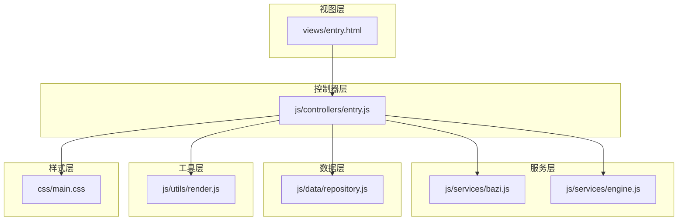
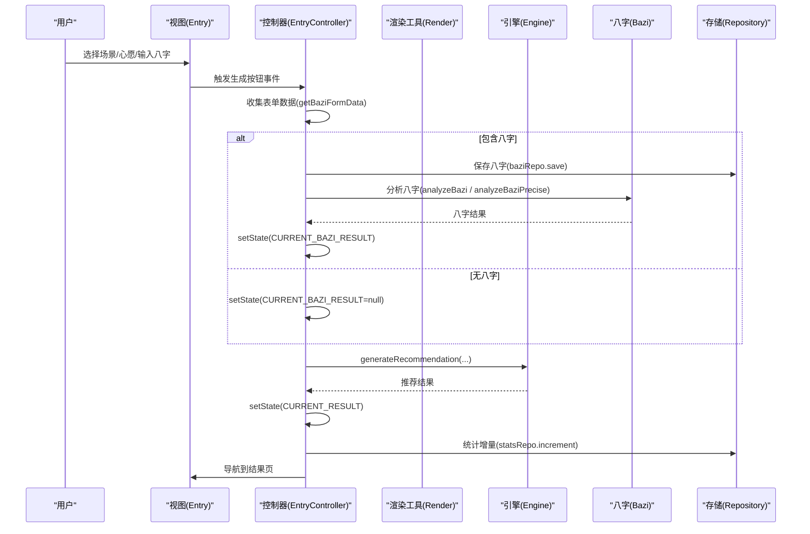
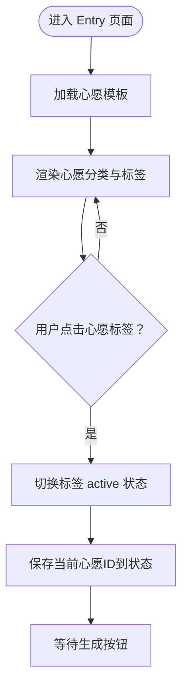
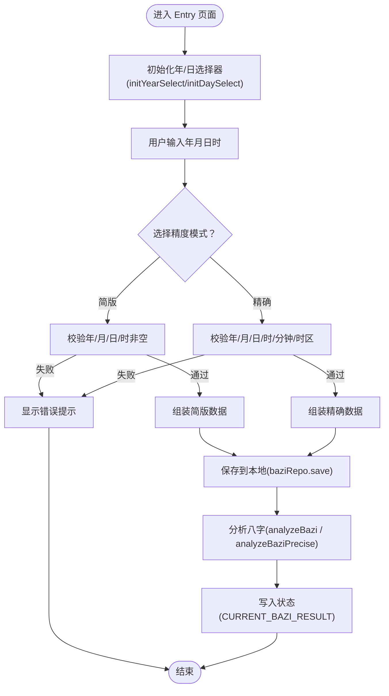
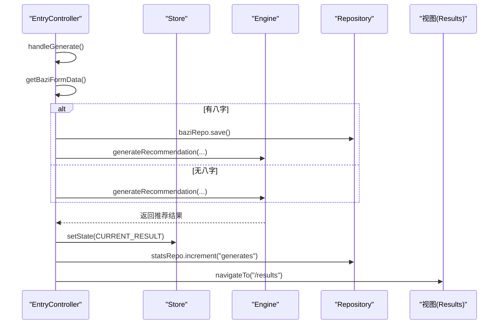
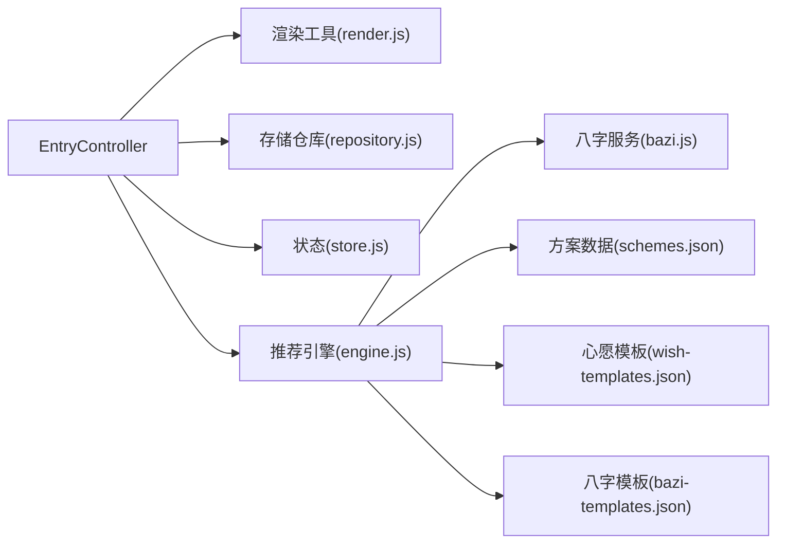

# 表单页面（Entry Form）

<cite>
**本文引用的文件**
- [views/entry.html](file://views/entry.html)
- [js/controllers/entry.js](file://js/controllers/entry.js)
- [js/utils/render.js](file://js/utils/render.js)
- [js/services/bazi.js](file://js/services/bazi.js)
- [js/data/repository.js](file://js/data/repository.js)
- [js/core/store.js](file://js/core/store.js)
- [js/services/engine.js](file://js/services/engine.js)
- [css/main.css](file://css/main.css)
- [data/wish-templates.json](file://data/wish-templates.json)
- [data/bazi-templates.json](file://data/bazi-templates.json)
- [data/schemes.json](file://data/schemes.json)
</cite>

## 目录
1. [简介](#简介)
2. [项目结构](#项目结构)
3. [核心组件](#核心组件)
4. [架构总览](#架构总览)
5. [详细组件分析](#详细组件分析)
6. [依赖关系分析](#依赖关系分析)
7. [性能考量](#性能考量)
8. [故障排查指南](#故障排查指南)
9. [结论](#结论)
10. [附录](#附录)

## 简介
本文件面向“表单页面（Entry Form）”的实现与使用，聚焦于 Entry.html 页面的数据收集功能，系统性解析以下内容：
- 心愿选择表单：场景分类、心愿类别与交互逻辑
- 八字信息录入表单：年月日时、精确模式与输入校验
- 生成推荐流程：数据采集、状态管理、提交与导航
- 样式与交互：表单元素的视觉与可用性设计
- 错误处理与用户反馈：Toast 提示与回退策略

## 项目结构
Entry 页面由视图、控制器、服务与数据层协同完成，采用模块化组织，职责清晰：
- 视图层：HTML 结构定义表单区域与交互元素
- 控制器层：EntryController 负责事件绑定、状态更新与导航
- 服务层：Bazi 服务负责八字计算，Engine 服务负责推荐生成
- 数据层：Repository 提供本地持久化与统计
- 工具层：Render 提供初始化与 UI 辅助方法

图表来源
- [views/entry.html](file://views/entry.html#L1-L234)
- [js/controllers/entry.js](file://js/controllers/entry.js#L1-L241)
- [js/services/bazi.js](file://js/services/bazi.js#L1-L267)
- [js/services/engine.js](file://js/services/engine.js#L1-L425)
- [js/data/repository.js](file://js/data/repository.js#L1-L394)
- [js/utils/render.js](file://js/utils/render.js#L1-L487)
- [css/main.css](file://css/main.css#L1-L200)

章节来源
- [views/entry.html](file://views/entry.html#L1-L234)
- [js/controllers/entry.js](file://js/controllers/entry.js#L1-L241)

## 核心组件
- EntryController：负责表单挂载、事件绑定、状态读写、导航跳转与生成推荐
- Render 工具：初始化年份/日期选择器、显示 Toast、渲染结果页标题与卡片
- Bazi 服务：提供简版/精确八字计算、五行分布与推荐
- Engine 服务：加载方案/心愿/八字模板，构建上下文并选择推荐方案
- Repository：提供本地存储（八字、偏好、统计）能力
- Store：全局状态管理，统一维护当前节气、心愿、八字结果与推荐结果

章节来源
- [js/controllers/entry.js](file://js/controllers/entry.js#L14-L241)
- [js/utils/render.js](file://js/utils/render.js#L23-L55)
- [js/services/bazi.js](file://js/services/bazi.js#L101-L183)
- [js/services/engine.js](file://js/services/engine.js#L323-L393)
- [js/data/repository.js](file://js/data/repository.js#L264-L287)
- [js/core/store.js](file://js/core/store.js#L30-L187)

## 架构总览
Entry 表单的端到端流程如下：
- 用户在场景与心愿区域进行选择
- 在八字区域输入年月日时，必要时切换精确模式
- 点击“生成今日穿搭”，控制器收集表单数据并调用服务层
- 服务层加载模板与数据，生成推荐方案
- 控制器保存状态并导航到结果页

图表来源
- [js/controllers/entry.js](file://js/controllers/entry.js#L131-L189)
- [js/services/engine.js](file://js/services/engine.js#L323-L393)
- [js/services/bazi.js](file://js/services/bazi.js#L241-L266)
- [js/data/repository.js](file://js/data/repository.js#L264-L287)

## 详细组件分析

### 心愿选择表单
- 设计目标：帮助用户表达短期愿望，影响推荐权重
- 分类结构：事业财运、情感人际、身心状态、健康平安四大类
- 交互逻辑：单选标签，点击切换 active 状态；控制器记录当前心愿 ID 并写入状态
- 数据来源：心愿模板（包含颜色/材质偏好与建议），用于后续匹配与解释

图表来源
- [views/entry.html](file://views/entry.html#L85-L130)
- [js/controllers/entry.js](file://js/controllers/entry.js#L105-L117)
- [data/wish-templates.json](file://data/wish-templates.json#L1-L47)

章节来源
- [views/entry.html](file://views/entry.html#L85-L130)
- [js/controllers/entry.js](file://js/controllers/entry.js#L105-L117)
- [data/wish-templates.json](file://data/wish-templates.json#L1-L47)

### 八字信息录入表单
- 字段构成：年、月、日、时（简版）；分钟、时区（精确模式）
- 输入校验：简版要求年、月、日、时均存在；精确模式额外校验分钟与时区
- 精度切换：通过“简版/精确”按钮切换，精确模式显示分钟与时区输入
- 数据保存：成功分析后将八字存入本地存储，便于下次恢复

图表来源
- [views/entry.html](file://views/entry.html#L132-L223)
- [js/utils/render.js](file://js/utils/render.js#L23-L55)
- [js/controllers/entry.js](file://js/controllers/entry.js#L194-L221)
- [js/services/bazi.js](file://js/services/bazi.js#L101-L183)
- [js/data/repository.js](file://js/data/repository.js#L264-L287)

章节来源
- [views/entry.html](file://views/entry.html#L132-L223)
- [js/utils/render.js](file://js/utils/render.js#L23-L55)
- [js/controllers/entry.js](file://js/controllers/entry.js#L194-L221)
- [js/services/bazi.js](file://js/services/bazi.js#L101-L183)
- [js/data/repository.js](file://js/data/repository.js#L264-L287)

### 生成推荐流程与状态管理
- 数据采集：控制器从 DOM 读取场景、心愿与八字，组装上下文
- 推荐生成：引擎加载方案/心愿/八字模板，构建上下文并选择梯度推荐方案
- 状态写入：将推荐结果写入全局状态，同时更新使用统计
- 导航跳转：成功后导航到结果页，失败显示 Toast 提示

图表来源
- [js/controllers/entry.js](file://js/controllers/entry.js#L131-L189)
- [js/services/engine.js](file://js/services/engine.js#L323-L393)
- [js/data/repository.js](file://js/data/repository.js#L292-L327)
- [js/core/store.js](file://js/core/store.js#L30-L187)

章节来源
- [js/controllers/entry.js](file://js/controllers/entry.js#L131-L189)
- [js/services/engine.js](file://js/services/engine.js#L323-L393)
- [js/data/repository.js](file://js/data/repository.js#L292-L327)
- [js/core/store.js](file://js/core/store.js#L30-L187)

### 表单数据验证规则与错误处理
- 八字验证规则
  - 简版：年、月、日、时均需选择
  - 精确：在简版基础上增加分钟与时区字段
- 错误处理
  - 生成失败时显示 Toast 提示
  - 八字计算异常时回退到简版模式
  - 网络/解析异常通过统一错误处理器捕获

章节来源
- [js/controllers/entry.js](file://js/controllers/entry.js#L194-L221)
- [js/services/bazi.js](file://js/services/bazi.js#L127-L183)
- [js/core/error-handler.js](file://js/core/error-handler.js#L1-L37)

### 表单元素样式设计与用户体验优化
- 选择器样式：自定义下拉箭头、聚焦态高亮、过渡动画
- 标签交互：active 状态切换、无障碍标签与 ARIA 属性
- 动画与反馈：Toast 消息、卡片入场动画、按钮交互反馈
- 可访问性：焦点可见轮廓、屏幕阅读器友好的标签与描述

章节来源
- [css/main.css](file://css/main.css#L205-L232)
- [css/main.css](file://css/main.css#L240-L243)
- [css/main.css](file://css/main.css#L303-L381)
- [views/entry.html](file://views/entry.html#L33-L82)
- [views/entry.html](file://views/entry.html#L92-L129)
- [views/entry.html](file://views/entry.html#L150-L222)
- [js/utils/render.js](file://js/utils/render.js#L457-L486)

## 依赖关系分析
- 控制器依赖
  - 渲染工具：初始化选择器、显示 Toast
  - 存储仓库：保存八字、统计使用次数
  - 状态管理：读写当前心愿、八字结果、推荐结果
  - 服务：调用八字分析与推荐生成
- 服务依赖
  - 引擎依赖模板数据（方案、心愿、八字模板）
  - 八字服务依赖农历库（精确模式），否则回退简版

图表来源
- [js/controllers/entry.js](file://js/controllers/entry.js#L1-L12)
- [js/services/engine.js](file://js/services/engine.js#L1-L85)
- [js/services/bazi.js](file://js/services/bazi.js#L1-L183)
- [data/schemes.json](file://data/schemes.json#L1-L509)
- [data/wish-templates.json](file://data/wish-templates.json#L1-L47)
- [data/bazi-templates.json](file://data/bazi-templates.json#L1-L103)

章节来源
- [js/controllers/entry.js](file://js/controllers/entry.js#L1-L12)
- [js/services/engine.js](file://js/services/engine.js#L1-L85)
- [js/services/bazi.js](file://js/services/bazi.js#L1-L183)
- [data/schemes.json](file://data/schemes.json#L1-L509)
- [data/wish-templates.json](file://data/wish-templates.json#L1-L47)
- [data/bazi-templates.json](file://data/bazi-templates.json#L1-L103)

## 性能考量
- 异步加载模板：引擎按需加载方案/心愿/八字模板，减少首屏压力
- 本地存储：八字与统计使用本地存储，避免重复网络请求
- 渲染优化：卡片入场动画与 Toast 使用 CSS 动画，保证流畅体验
- 计算回退：精确模式失败自动回退简版，确保稳定性

## 故障排查指南
- 八字生成失败
  - 检查输入完整性（简版/精确）
  - 确认农历库是否正确加载（精确模式）
  - 查看控制台错误日志与 Toast 提示
- 推荐为空
  - 确认当前节气与心愿模板数据加载成功
  - 检查上下文构建（天气、场景、运势）是否正常
- 本地存储异常
  - 检查浏览器隐私设置与存储配额
  - 使用安全存储包装器进行读写

章节来源
- [js/services/bazi.js](file://js/services/bazi.js#L127-L183)
- [js/services/engine.js](file://js/services/engine.js#L323-L393)
- [js/data/repository.js](file://js/data/repository.js#L24-L41)

## 结论
Entry 表单通过清晰的模块划分与稳健的服务链路，实现了从用户输入到推荐结果的闭环。其交互设计兼顾可用性与可访问性，状态管理与本地存储保障了体验的一致性与稳定性。建议在后续迭代中进一步完善输入校验与错误提示文案，并扩展心愿模板覆盖范围以提升个性化程度。

## 附录
- 相关数据源
  - 方案模板：包含色彩、材质、感受与注解
  - 心愿模板：包含颜色/材质偏好与建议
  - 八字模板：按日主五行与年份匹配的推荐

章节来源
- [data/schemes.json](file://data/schemes.json#L1-L509)
- [data/wish-templates.json](file://data/wish-templates.json#L1-L47)
- [data/bazi-templates.json](file://data/bazi-templates.json#L1-L103)