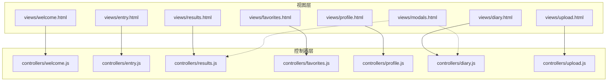
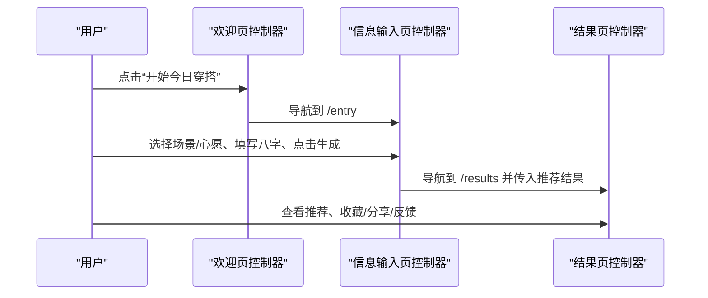
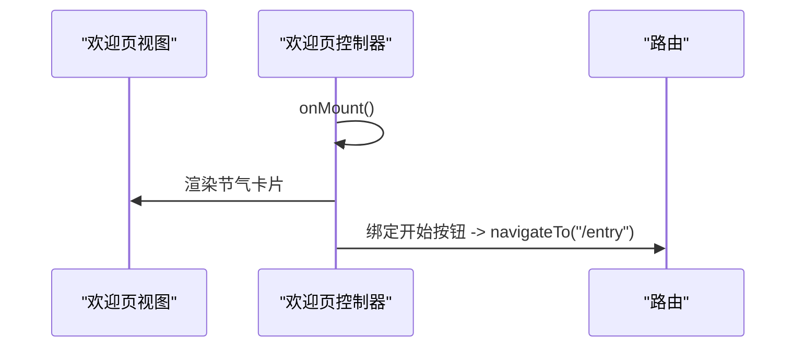
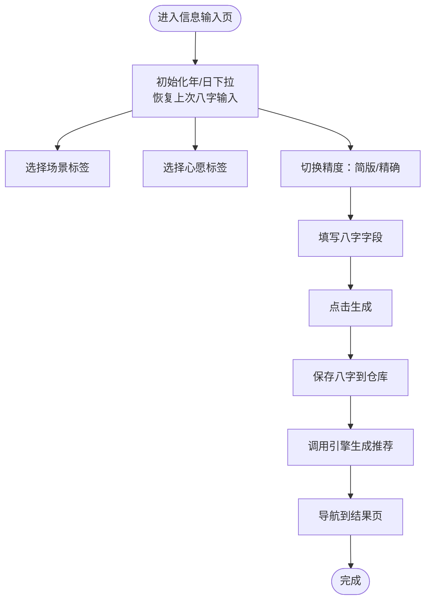
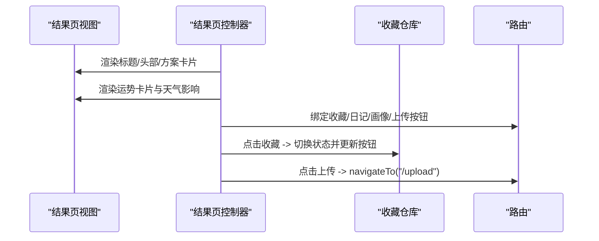
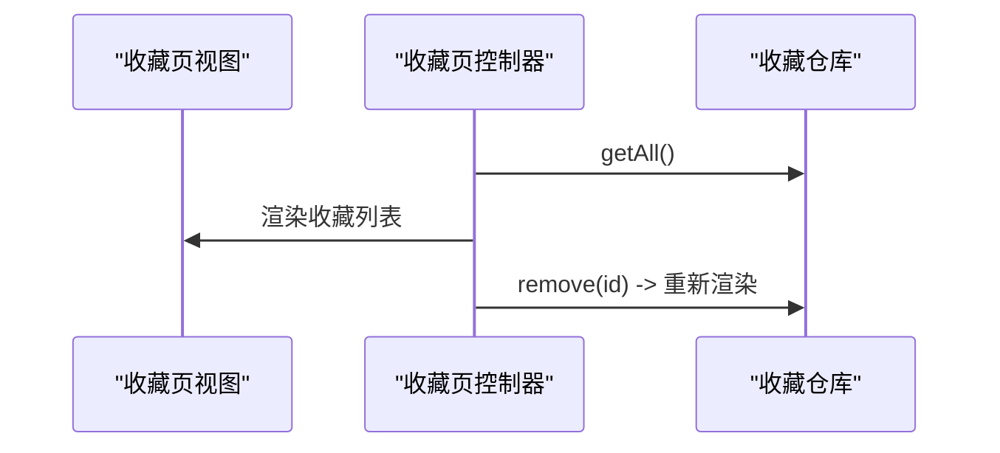
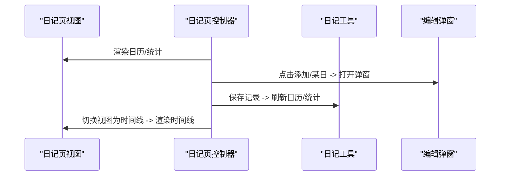
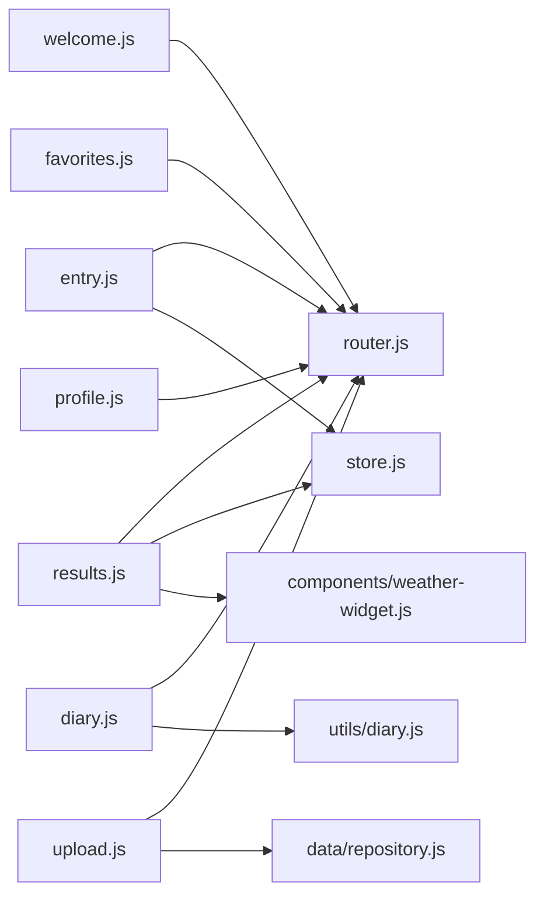

# 页面视图模板

<cite>
**本文引用的文件**
- [views/welcome.html](file://views/welcome.html)
- [views/entry.html](file://views/entry.html)
- [views/results.html](file://views/results.html)
- [views/favorites.html](file://views/favorites.html)
- [views/profile.html](file://views/profile.html)
- [views/diary.html](file://views/diary.html)
- [views/upload.html](file://views/upload.html)
- [views/modals.html](file://views/modals.html)
- [js/controllers/welcome.js](file://js/controllers/welcome.js)
- [js/controllers/entry.js](file://js/controllers/entry.js)
- [js/controllers/results.js](file://js/controllers/results.js)
- [js/controllers/favorites.js](file://js/controllers/favorites.js)
- [js/controllers/profile.js](file://js/controllers/profile.js)
- [js/controllers/diary.js](file://js/controllers/diary.js)
- [js/controllers/upload.js](file://js/controllers/upload.js)
</cite>

## 目录
1. [简介](#简介)
2. [项目结构](#项目结构)
3. [核心组件](#核心组件)
4. [架构总览](#架构总览)
5. [详细组件分析](#详细组件分析)
6. [依赖关系分析](#依赖关系分析)
7. [性能考虑](#性能考虑)
8. [故障排查指南](#故障排查指南)
9. [结论](#结论)
10. [附录](#附录)

## 简介
本文件系统性梳理“五行穿搭建议”项目中的页面视图模板，覆盖欢迎页、信息输入页、结果页、收藏页、个人资料页、穿搭日记页与上传页。文档从 HTML 结构、CSS 样式说明与 JavaScript 交互逻辑三个维度展开，重点阐述页面间的导航与数据传递机制，帮助开发者与产品人员快速理解与维护前端视图层。

## 项目结构
项目采用按视图与功能模块分离的组织方式：
- 视图层：views/*.html 定义各页面的结构骨架与占位区
- 控制器层：js/controllers/*.js 管理页面挂载、事件绑定与业务交互
- 工具与服务：js/utils/*、js/services/* 提供渲染、天气、推荐等能力
- 数据与仓库：js/data/*、data/*.json 提供本地数据与持久化接口
- 样式：css/*.css 提供通用样式与组件样式

图表来源
- [views/welcome.html](file://views/welcome.html#L1-L34)
- [views/entry.html](file://views/entry.html#L1-L234)
- [views/results.html](file://views/results.html#L1-L128)
- [views/favorites.html](file://views/favorites.html#L1-L18)
- [views/profile.html](file://views/profile.html#L1-L21)
- [views/diary.html](file://views/diary.html#L1-L159)
- [views/upload.html](file://views/upload.html#L1-L41)
- [views/modals.html](file://views/modals.html#L1-L18)
- [js/controllers/welcome.js](file://js/controllers/welcome.js#L1-L151)
- [js/controllers/entry.js](file://js/controllers/entry.js#L1-L241)
- [js/controllers/results.js](file://js/controllers/results.js#L1-L614)
- [js/controllers/favorites.js](file://js/controllers/favorites.js#L1-L89)
- [js/controllers/profile.js](file://js/controllers/profile.js#L1-L91)
- [js/controllers/diary.js](file://js/controllers/diary.js#L1-L440)
- [js/controllers/upload.js](file://js/controllers/upload.js#L1-L118)

章节来源
- [views/welcome.html](file://views/welcome.html#L1-L34)
- [views/entry.html](file://views/entry.html#L1-L234)
- [views/results.html](file://views/results.html#L1-L128)
- [views/favorites.html](file://views/favorites.html#L1-L18)
- [views/profile.html](file://views/profile.html#L1-L21)
- [views/diary.html](file://views/diary.html#L1-L159)
- [views/upload.html](file://views/upload.html#L1-L41)
- [views/modals.html](file://views/modals.html#L1-L18)

## 核心组件
- 欢迎页视图与控制器：负责节气信息渲染、品牌卡片展示与跳转入口
- 信息输入页视图与控制器：负责场景与心愿选择、八字输入、天气组件集成与生成推荐
- 结果页视图与控制器：负责推荐方案展示、运势卡片、天气影响、收藏/分享/反馈交互
- 收藏页视图与控制器：负责收藏列表渲染与删除
- 个人资料页视图与控制器：负责画像与数据管理入口
- 穿搭日记页视图与控制器：负责日历/时间线视图、记录编辑、统计与照片预览
- 上传页视图与控制器：负责图片上传、预览与反馈
- 模态框：详情与反馈弹窗的通用结构

章节来源
- [views/welcome.html](file://views/welcome.html#L1-L34)
- [js/controllers/welcome.js](file://js/controllers/welcome.js#L1-L151)
- [views/entry.html](file://views/entry.html#L1-L234)
- [js/controllers/entry.js](file://js/controllers/entry.js#L1-L241)
- [views/results.html](file://views/results.html#L1-L128)
- [js/controllers/results.js](file://js/controllers/results.js#L1-L614)
- [views/favorites.html](file://views/favorites.html#L1-L18)
- [js/controllers/favorites.js](file://js/controllers/favorites.js#L1-L89)
- [views/profile.html](file://views/profile.html#L1-L21)
- [js/controllers/profile.js](file://js/controllers/profile.js#L1-L91)
- [views/diary.html](file://views/diary.html#L1-L159)
- [js/controllers/diary.js](file://js/controllers/diary.js#L1-L440)
- [views/upload.html](file://views/upload.html#L1-L41)
- [js/controllers/upload.js](file://js/controllers/upload.js#L1-L118)
- [views/modals.html](file://views/modals.html#L1-L18)

## 架构总览
页面通过控制器在挂载时绑定事件、读取状态与仓库数据、调用工具函数渲染 UI。路由负责页面切换；状态与仓库提供数据持久化与共享；工具模块提供渲染、分享、上传等通用能力。

图表来源
- [js/controllers/welcome.js](file://js/controllers/welcome.js#L133-L145)
- [js/controllers/entry.js](file://js/controllers/entry.js#L96-L102)
- [js/controllers/results.js](file://js/controllers/results.js#L255-L306)

## 详细组件分析

### 欢迎页视图与控制器
- 视图结构要点
  - 品牌与标语区域、节气卡片、开始按钮、运势提示
  - 节气图标、名称、描述、五行标签与宜穿颜色
- 控制器职责
  - 动态渲染节气卡片，根据当前节气映射图标、序号、五行与宜色
  - 绑定“开始”按钮事件，导航至信息输入页
- 交互与状态
  - 通过状态键读取当前节气信息，渲染品牌节气卡片
  - 事件避免重复绑定，卸载时清理标志

图表来源
- [views/welcome.html](file://views/welcome.html#L1-L34)
- [js/controllers/welcome.js](file://js/controllers/welcome.js#L19-L35)
- [js/controllers/welcome.js](file://js/controllers/welcome.js#L133-L145)

章节来源
- [views/welcome.html](file://views/welcome.html#L1-L34)
- [js/controllers/welcome.js](file://js/controllers/welcome.js#L1-L151)

### 信息输入页视图与控制器
- 视图结构要点
  - 头部返回按钮、品牌标识、页面标题与副标题
  - 天气组件占位、场景分类标签组、心愿分类标签组
  - 八字输入区域（简版/精确）、生成按钮
- 控制器职责
  - 初始化年/日下拉、恢复上次八字输入
  - 场景与心愿选择、精度切换、生成推荐
  - 调用引擎生成推荐，保存结果与统计，导航至结果页
- 数据流
  - 八字数据按精度模式解析，保存至仓库
  - 生成推荐时合并节气、心愿、八字与场景信息

图表来源
- [views/entry.html](file://views/entry.html#L1-L234)
- [js/controllers/entry.js](file://js/controllers/entry.js#L23-L43)
- [js/controllers/entry.js](file://js/controllers/entry.js#L131-L189)

章节来源
- [views/entry.html](file://views/entry.html#L1-L234)
- [js/controllers/entry.js](file://js/controllers/entry.js#L1-L241)

### 结果页视图与控制器
- 视图结构要点
  - 头部导航、品牌标识、收藏/日记/画像入口
  - 页面标题、八字提示、今日运势卡片、天气影响提示
  - 推荐方案卡片集合、换一批/上传按钮
  - 详情与反馈弹窗
- 控制器职责
  - 渲染标题副标题、结果头部、方案卡片
  - 生成运势卡片内容与穿搭 Tip
  - 渲染天气影响、显示/隐藏八字提示
  - 收藏/分享/反馈、换一批占位、模态框交互
- 用户交互
  - 收藏/取消收藏、分享方案、查看详情
  - 反馈不喜欢的原因并更新偏好权重

图表来源
- [views/results.html](file://views/results.html#L1-L128)
- [js/controllers/results.js](file://js/controllers/results.js#L20-L46)
- [js/controllers/results.js](file://js/controllers/results.js#L255-L306)
- [js/controllers/results.js](file://js/controllers/results.js#L527-L566)

章节来源
- [views/results.html](file://views/results.html#L1-L128)
- [js/controllers/results.js](file://js/controllers/results.js#L1-L614)

### 收藏页视图与控制器
- 视图结构要点
  - 头部返回按钮、页面标题
  - 收藏列表容器
- 控制器职责
  - 读取收藏仓库，渲染收藏列表
  - 绑定列表项点击事件：收藏/取消收藏、查看详情
  - 删除收藏后重新渲染列表

图表来源
- [views/favorites.html](file://views/favorites.html#L1-L18)
- [js/controllers/favorites.js](file://js/controllers/favorites.js#L16-L30)
- [js/controllers/favorites.js](file://js/controllers/favorites.js#L54-L79)

章节来源
- [views/favorites.html](file://views/favorites.html#L1-L18)
- [js/controllers/favorites.js](file://js/controllers/favorites.js#L1-L89)

### 个人资料页视图与控制器
- 视图结构要点
  - 头部返回按钮、页面标题
  - 画像容器、数据管理容器
- 控制器职责
  - 渲染画像与数据管理入口
  - 绑定导出/导入/清空数据按钮事件（占位）

章节来源
- [views/profile.html](file://views/profile.html#L1-L21)
- [js/controllers/profile.js](file://js/controllers/profile.js#L1-L91)

### 穿搭日记页视图与控制器
- 视图结构要点
  - 头部返回按钮、页面标题、视图切换与添加记录按钮
  - 统计卡片、日历视图网格、时间线视图
  - 颜色统计区、日记编辑弹窗
- 控制器职责
  - 切换日历/时间线视图、渲染当月日历与统计数据
  - 打开/关闭编辑弹窗、加载/保存/删除记录
  - 照片选择与预览、心情选择、表单提交
- 数据流
  - 通过工具模块获取日历、时间线、统计与记录
  - 保存记录到本地存储并刷新视图

图表来源
- [views/diary.html](file://views/diary.html#L1-L159)
- [js/controllers/diary.js](file://js/controllers/diary.js#L163-L206)
- [js/controllers/diary.js](file://js/controllers/diary.js#L208-L250)
- [js/controllers/diary.js](file://js/controllers/diary.js#L287-L311)
- [js/controllers/diary.js](file://js/controllers/diary.js#L398-L425)

章节来源
- [views/diary.html](file://views/diary.html#L1-L159)
- [js/controllers/diary.js](file://js/controllers/diary.js#L1-L440)

### 上传页视图与控制器
- 视图结构要点
  - 头部返回按钮、页面标题
  - 上传区域（点击/拖拽）、预览区、移除按钮
  - 反馈区（文本域与保存按钮）
- 控制器职责
  - 绑定上传区域与文件选择事件
  - 读取今日上传记录并更新预览
  - 保存图片与反馈，移除图片

章节来源
- [views/upload.html](file://views/upload.html#L1-L41)
- [js/controllers/upload.js](file://js/controllers/upload.js#L1-L118)

### 模态框视图
- 视图结构要点
  - 详情模态框、反馈弹窗
  - 背景遮罩、关闭按钮、内容区
- 控制器交互
  - 结果页与日记页通过工具函数打开/关闭模态框

章节来源
- [views/modals.html](file://views/modals.html#L1-L18)
- [js/controllers/results.js](file://js/controllers/results.js#L316-L330)
- [js/controllers/results.js](file://js/controllers/results.js#L420-L434)
- [js/controllers/diary.js](file://js/controllers/diary.js#L98-L113)

## 依赖关系分析
- 视图与控制器的耦合
  - 控制器通过容器 ID 获取视图元素，避免直接操作 DOM，降低耦合
  - 事件委托与统一绑定/解绑策略，防止重复绑定与内存泄漏
- 数据与状态
  - 控制器通过状态键访问当前节气、心愿、八字结果与推荐结果
  - 仓库提供收藏、穿搭日记、上传记录的增删改查
- 工具与服务
  - 渲染工具负责卡片、模态框、头部等复用 UI 的生成
  - 分享工具、上传工具、天气影响计算等模块被控制器调用

图表来源
- [js/controllers/welcome.js](file://js/controllers/welcome.js#L6-L8)
- [js/controllers/entry.js](file://js/controllers/entry.js#L5-L11)
- [js/controllers/results.js](file://js/controllers/results.js#L5-L11)
- [js/controllers/favorites.js](file://js/controllers/favorites.js#L5-L8)
- [js/controllers/profile.js](file://js/controllers/profile.js#L5-L7)
- [js/controllers/diary.js](file://js/controllers/diary.js#L5-L16)
- [js/controllers/upload.js](file://js/controllers/upload.js#L5-L9)

章节来源
- [js/controllers/entry.js](file://js/controllers/entry.js#L1-L241)
- [js/controllers/results.js](file://js/controllers/results.js#L1-L614)
- [js/controllers/diary.js](file://js/controllers/diary.js#L1-L440)

## 性能考虑
- 事件绑定与解绑
  - 控制器在挂载时绑定事件，卸载时重置标志，避免重复绑定导致的性能与内存问题
- 懒渲染与条件渲染
  - 八字提示、天气影响、模态框等按条件显示，减少不必要的 DOM 操作
- 本地存储与缓存
  - 收藏、偏好、日记、上传记录均使用本地存储，避免频繁网络请求
- 图片处理
  - 上传页对图片进行本地读取与预览，避免大体积图片在网络传输中的开销

## 故障排查指南
- 页面无法渲染或空白
  - 检查控制器容器 ID 是否与视图一致，确认 onMount 中是否正确获取容器
  - 确认视图是否动态加载完成后再执行渲染
- 事件无效或重复触发
  - 检查 eventsBound 标志是否正确设置与清理
  - 确认事件委托目标是否存在且正确
- 数据未更新
  - 检查状态键与仓库写入逻辑，确保 setState 与仓库保存顺序正确
- 模态框无法关闭
  - 确认模态框背景遮罩与关闭按钮事件绑定是否生效
- 上传失败或预览异常
  - 检查文件类型与大小限制，确认 FileReader 成功回调与仓库保存流程

章节来源
- [js/controllers/welcome.js](file://js/controllers/welcome.js#L147-L149)
- [js/controllers/entry.js](file://js/controllers/entry.js#L45-L52)
- [js/controllers/results.js](file://js/controllers/results.js#L316-L330)
- [js/controllers/upload.js](file://js/controllers/upload.js#L80-L93)

## 结论
本项目以“视图 + 控制器 + 工具/服务 + 仓库”的分层架构实现页面模板与交互逻辑，通过统一的路由与状态管理实现页面间导航与数据传递。信息输入页承担数据收集与推荐生成的核心职责，结果页提供丰富的交互与反馈机制，收藏、日记与上传页完善了用户的长期使用体验。建议在后续迭代中补充“换一批”推荐逻辑、完善数据导出/导入与分享渠道，并持续优化图片处理与离线体验。

## 附录
- 页面导航路径
  - 欢迎页 → 信息输入页：/entry
  - 信息输入页 → 结果页：/results
  - 结果页 → 收藏页：/favorites
  - 结果页 → 个人资料页：/profile
  - 结果页 → 穿搭日记页：/diary
  - 结果页 → 上传页：/upload
  - 穿搭日记页 → 上传页：/upload（可选）
- 关键状态键
  - 当前节气信息、当前心愿 ID、当前八字结果、当前推荐结果
- 仓库与工具
  - 收藏仓库、穿搭日记仓库、上传仓库
  - 渲染工具、天气影响组件、分享工具、上传工具、日记工具