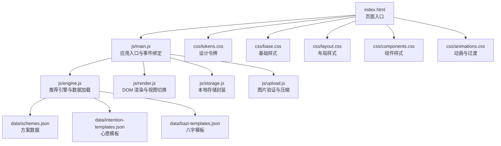
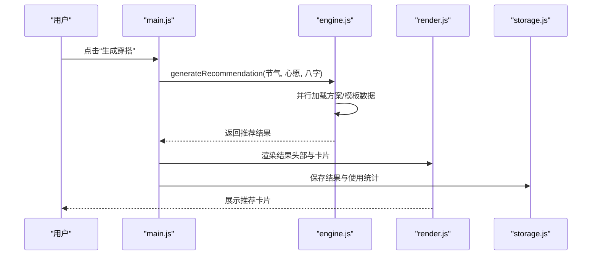
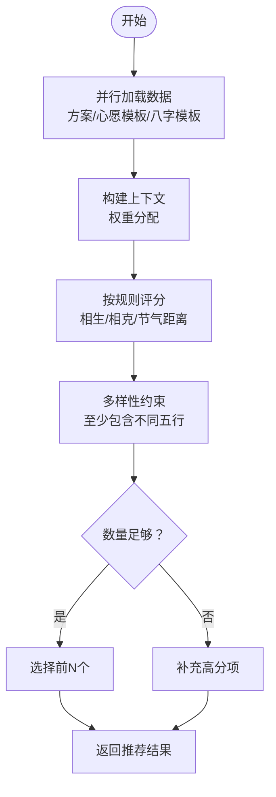
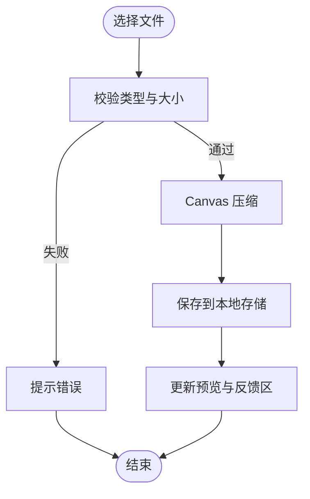
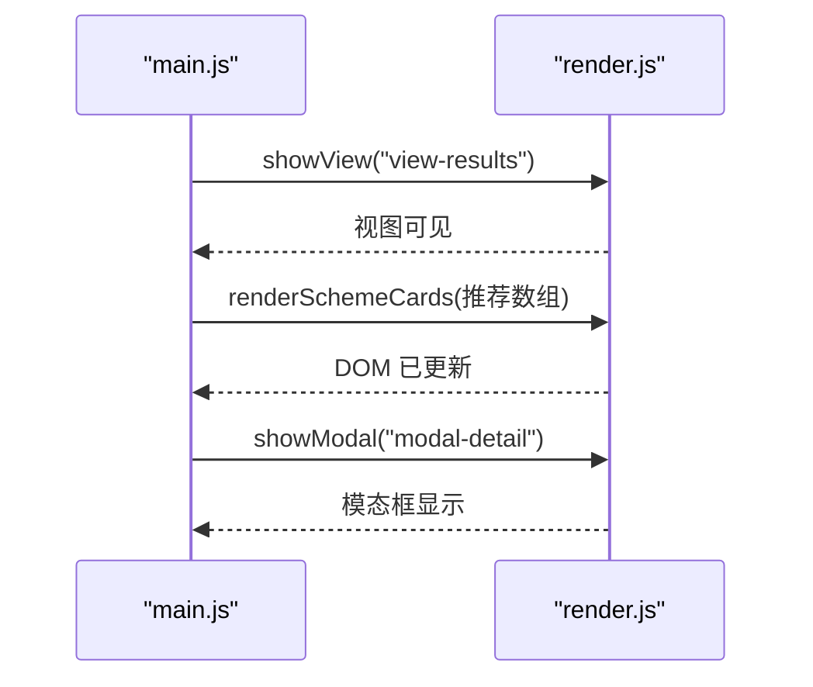
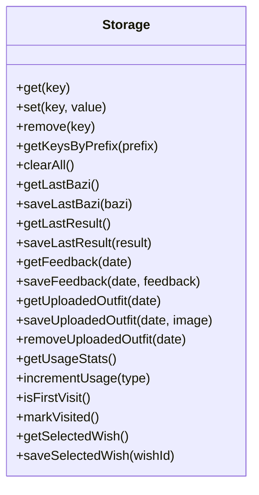
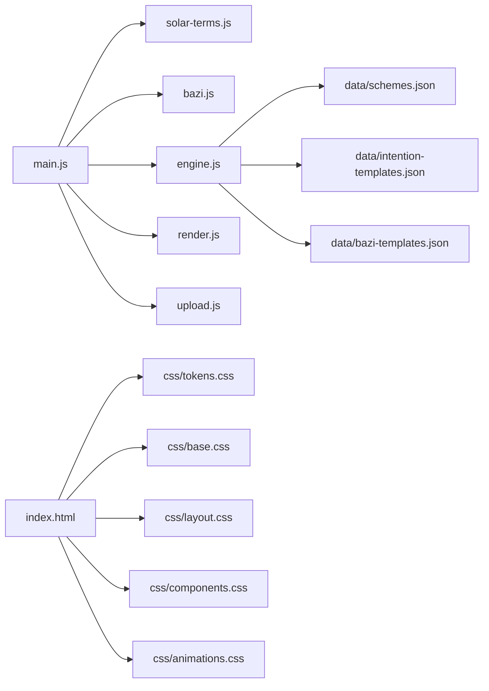

# 部署指南

<cite>
**本文档引用的文件**
- [index.html](file://index.html)
- [main.js](file://js/main.js)
- [engine.js](file://js/engine.js)
- [storage.js](file://js/storage.js)
- [render.js](file://js/render.js)
- [upload.js](file://js/upload.js)
- [schemes.json](file://data/schemes.json)
- [intention-templates.json](file://data/intention-templates.json)
- [bazi-templates.json](file://data/bazi-templates.json)
- [tokens.css](file://css/tokens.css)
- [base.css](file://css/base.css)
- [layout.css](file://css/layout.css)
- [components.css](file://css/components.css)
- [animations.css](file://css/animations.css)
</cite>

## 目录
1. [简介](#简介)
2. [项目结构](#项目结构)
3. [核心组件](#核心组件)
4. [架构总览](#架构总览)
5. [详细组件分析](#详细组件分析)
6. [依赖分析](#依赖分析)
7. [性能考虑](#性能考虑)
8. [故障排查指南](#故障排查指南)
9. [结论](#结论)
10. [附录](#附录)

## 简介
本指南面向“五行穿搭建议”项目的生产环境部署，覆盖服务器配置、静态资源部署、CDN与缓存优化、HTTPS与安全头、隐私保护、多平台部署（GitHub Pages、Vercel、Netlify）、性能监控与日志、用户反馈收集、自动化流水线与版本发布管理等。文档同时提供个人网站、企业级与多环境部署方案，确保应用在不同规模下稳定运行并具备良好用户体验。

## 项目结构
该项目为纯前端单页应用，采用模块化组织：
- HTML 页面负责视图与交互骨架
- JS 模块分别承担入口、引擎、渲染、存储、上传等功能
- CSS 采用设计令牌与分层样式，保证主题一致性与响应式布局
- 数据以 JSON 文件形式内嵌于 data 目录，便于静态部署与缓存

**图表来源**
- [index.html](file://index.html#L1-L236)
- [main.js](file://js/main.js#L1-L317)
- [engine.js](file://js/engine.js#L1-L335)
- [storage.js](file://js/storage.js#L1-L116)
- [render.js](file://js/render.js#L1-L272)
- [upload.js](file://js/upload.js#L1-L145)
- [schemes.json](file://data/schemes.json#L1-L509)
- [intention-templates.json](file://data/intention-templates.json#L1-L253)
- [bazi-templates.json](file://data/bazi-templates.json#L1-L103)
- [tokens.css](file://css/tokens.css#L1-L109)
- [base.css](file://css/base.css#L1-L168)
- [layout.css](file://css/layout.css#L1-L252)
- [components.css](file://css/components.css#L1-L338)
- [animations.css](file://css/animations.css#L1-L207)

**章节来源**
- [index.html](file://index.html#L1-L236)
- [main.js](file://js/main.js#L1-L317)
- [engine.js](file://js/engine.js#L1-L335)
- [storage.js](file://js/storage.js#L1-L116)
- [render.js](file://js/render.js#L1-L272)
- [upload.js](file://js/upload.js#L1-L145)
- [schemes.json](file://data/schemes.json#L1-L509)
- [intention-templates.json](file://data/intention-templates.json#L1-L253)
- [bazi-templates.json](file://data/bazi-templates.json#L1-L103)
- [tokens.css](file://css/tokens.css#L1-L109)
- [base.css](file://css/base.css#L1-L168)
- [layout.css](file://css/layout.css#L1-L252)
- [components.css](file://css/components.css#L1-L338)
- [animations.css](file://css/animations.css#L1-L207)

## 核心组件
- 应用入口与生命周期：初始化节气信息、恢复用户状态、绑定事件、初始化上传区、统计访问次数
- 推荐引擎：异步加载方案与模板数据，构建上下文权重，评分与筛选，生成/换一批推荐
- 渲染系统：视图切换、卡片渲染、模态框、上传预览、Toast 提示
- 本地存储：封装 localStorage，持久化用户偏好、结果、反馈、上传图片与使用统计
- 上传处理：文件校验、Canvas 压缩、拖拽与键盘支持、今日唯一标识

**章节来源**
- [main.js](file://js/main.js#L26-L67)
- [engine.js](file://js/engine.js#L268-L334)
- [render.js](file://js/render.js#L8-L271)
- [storage.js](file://js/storage.js#L51-L116)
- [upload.js](file://js/upload.js#L12-L144)

## 架构总览
应用为纯前端 SPA，数据来源于本地 JSON 文件与浏览器本地存储。推荐流程从入口模块触发，加载数据并交由引擎模块计算，再由渲染模块输出视图。

**图表来源**
- [main.js](file://js/main.js#L202-L244)
- [engine.js](file://js/engine.js#L268-L310)
- [render.js](file://js/render.js#L104-L127)
- [storage.js](file://js/storage.js#L60-L66)

## 详细组件分析

### 推荐引擎模块（engine.js）
- 数据加载：并行加载方案、心愿模板、八字模板，避免串行阻塞
- 上下文构建：根据节气、心愿、八字分别赋予权重
- 评分与筛选：依据五行相生相克与节气距离打分，保证多样性与高分优先
- 生成与换一批：支持排除已选 ID 的重新筛选

**图表来源**
- [engine.js](file://js/engine.js#L268-L334)

**章节来源**
- [engine.js](file://js/engine.js#L39-L79)
- [engine.js](file://js/engine.js#L157-L173)
- [engine.js](file://js/engine.js#L178-L259)

### 上传与压缩模块（upload.js）
- 文件校验：类型、大小限制
- Canvas 压缩：按最大边长缩放，循环降低 JPEG 质量直至达到目标字节数
- 上传区：点击、拖拽、键盘激活，支持重复选择同一文件

**图表来源**
- [upload.js](file://js/upload.js#L12-L82)
- [storage.js](file://js/storage.js#L79-L89)
- [render.js](file://js/render.js#L220-L237)

**章节来源**
- [upload.js](file://js/upload.js#L12-L82)
- [storage.js](file://js/storage.js#L79-L89)
- [render.js](file://js/render.js#L220-L237)

### 视图与渲染（render.js）
- 视图切换：隐藏/显示对应 section
- 卡片渲染：动态创建元素并注入注解与典籍出处
- 模态框：详情展示与遮罩层交互
- Toast：全局消息提示，自动消失

**图表来源**
- [render.js](file://js/render.js#L8-L215)

**章节来源**
- [render.js](file://js/render.js#L8-L127)
- [render.js](file://js/render.js#L159-L193)
- [render.js](file://js/render.js#L198-L215)
- [render.js](file://js/render.js#L242-L271)

### 本地存储（storage.js）
- 前缀化键名，避免冲突
- 用户偏好：心愿、八字、最后结果
- 反馈与上传：按日期键存储
- 使用统计：访问、生成、上传计数

**图表来源**
- [storage.js](file://js/storage.js#L1-L116)

**章节来源**
- [storage.js](file://js/storage.js#L51-L116)

## 依赖分析
- 内部模块依赖：main.js 依赖 storage、solar-terms、bazi、engine、render、upload
- 数据依赖：engine.js 依赖 data 目录下的三个 JSON 文件
- 样式依赖：tokens.css 定义变量，base/layout/components/animations 逐层叠加

**图表来源**
- [main.js](file://js/main.js#L5-L15)
- [engine.js](file://js/engine.js#L42-L79)
- [schemes.json](file://data/schemes.json#L1-L509)
- [intention-templates.json](file://data/intention-templates.json#L1-L253)
- [bazi-templates.json](file://data/bazi-templates.json#L1-L103)
- [index.html](file://index.html#L13-L18)
- [tokens.css](file://css/tokens.css#L5-L108)

**章节来源**
- [main.js](file://js/main.js#L5-L15)
- [engine.js](file://js/engine.js#L42-L79)
- [index.html](file://index.html#L13-L18)

## 性能考虑
- 静态资源优化
  - 使用 CDN 加速字体与样式（如 jsDelivr），减少首屏等待
  - 启用浏览器缓存与 HTTP 缓存控制，合理设置 Cache-Control 与 ETag
  - 对图片进行客户端压缩，降低带宽与服务器压力
- 运行时性能
  - 引擎模块并行加载数据，避免串行阻塞
  - 评分与筛选在内存完成，减少网络往返
  - 使用 CSS 动画与过渡，配合 prefers-reduced-motion 降级
- 存储与离线
  - 本地存储仅用于用户偏好与临时数据，避免超大数据占用
  - 上传图片按日期键存储，避免无限增长；提供清理接口或上限控制

[本节为通用指导，无需列出具体文件来源]

## 故障排查指南
- 推荐为空或失败
  - 检查 data 目录 JSON 是否可访问且格式正确
  - 查看控制台错误日志，确认 fetch 请求是否成功
- 上传失败
  - 校验文件类型与大小限制
  - 检查 Canvas 压缩过程中的异常
- 视图切换异常
  - 确认 DOM 节点存在且 ID 正确
  - 检查样式是否覆盖了显示逻辑
- 本地存储异常
  - 检查浏览器是否禁用 localStorage 或存储空间不足
  - 使用兜底逻辑避免崩溃

**章节来源**
- [engine.js](file://js/engine.js#L42-L48)
- [upload.js](file://js/upload.js#L12-L26)
- [render.js](file://js/render.js#L8-L16)
- [storage.js](file://js/storage.js#L7-L23)

## 结论
本项目适合静态部署与边缘加速，通过合理的缓存策略、CDN 与 HTTPS 配置，可在多平台上实现快速、稳定的用户体验。结合本地存储与数据内嵌，既满足隐私保护，又保持低延迟与高可用。

[本节为总结，无需列出具体文件来源]

## 附录

### 生产环境部署步骤
- 准备静态资源
  - 构建产物：HTML、CSS、JS、JSON、图片
  - 确保路径与导入一致，避免相对路径问题
- 服务器配置
  - 启用 gzip/br 压缩
  - 设置强缓存与版本化策略
  - 配置 CORS（如需要跨域）
- 域名与 HTTPS
  - 申请并部署 SSL 证书
  - 配置 HSTS、OCSP Stapling
  - 设置安全响应头（如 Content-Security-Policy、Referrer-Policy、Permissions-Policy）

[本节为通用步骤，无需列出具体文件来源]

### 静态文件部署策略与 CDN
- CDN 优选
  - 字体与公共资源托管于 CDN，提升首屏性能
  - 本地 JSON 与图片可缓存，减少回源
- 缓存优化
  - 静态资源设置长缓存（如一年）
  - HTML 设置短缓存或 no-cache
  - 通过查询参数版本号实现失效

[本节为通用指导，无需列出具体文件来源]

### HTTPS 证书与安全头
- 证书
  - 使用 Let’s Encrypt 或商业 CA
  - 自动续期与监控告警
- 安全头
  - Content-Security-Policy：限制脚本与资源来源
  - Referrer-Policy：最小化泄露
  - Permissions-Policy：明确权限范围
  - X-Frame-Options / X-Content-Type-Options / X-XSS-Protection（视情况）

[本节为通用指导，无需列出具体文件来源]

### 隐私保护措施
- 本地存储
  - 所有用户数据仅保存在本地，不上传至服务器
  - 提供一键清除功能，删除所有 wuxing_ 前缀键
- 数据最小化
  - 不收集访问日志与用户行为追踪
  - 上传图片仅保存当天，避免长期留存

**章节来源**
- [storage.js](file://js/storage.js#L40-L49)
- [index.html](file://index.html#L219-L230)

### GitHub Pages 部署
- 仓库设置
  - 在仓库 Settings → Pages 中选择分支与目录
  - 配置自定义域名与强制 HTTPS
- 构建与发布
  - 使用 CI 生成静态产物并推送到 gh-pages 分支
  - 或直接将构建产物提交到 docs 目录（如启用）

[本节为通用步骤，无需列出具体文件来源]

### Vercel 部署
- 连接仓库
  - 选择项目并配置构建输出目录
- 环境变量
  - 如需额外配置，通过 Vercel 仪表板设置
- 自定义域名与 SSL
  - 在 DNS 中添加 CNAME 记录，启用自动 SSL

[本节为通用步骤，无需列出具体文件来源]

### Netlify 部署
- 拖拽上传或连接 Git
  - 配置构建命令与发布目录
- Functions（如需后端）
  - 使用 Netlify Functions 提供简单 API
- CDN 与缓存
  - 在 Netlify.toml 中配置缓存与重写规则

[本节为通用步骤，无需列出具体文件来源]

### 性能监控与日志
- 性能监控
  - 使用 Web Vitals 工具采集 CLS、LCP、FID
  - 结合 CDN 日志分析资源命中率
- 错误日志
  - 浏览器控制台与服务端错误日志
  - 本地存储错误计数与上报（可选）
- 用户反馈
  - 上传反馈文本按日期保存
  - 支持导出或清理反馈数据

**章节来源**
- [storage.js](file://js/storage.js#L68-L77)
- [upload.js](file://js/upload.js#L289-L291)

### 自动化部署与 CI/CD
- 流水线建议
  - 触发条件：push 到 main 或创建标签
  - 步骤：安装依赖、构建、测试、部署到目标平台
  - 缓存：npm/yarn 缓存与构建缓存
- 版本发布
  - 使用语义化版本与 Git 标签
  - 发布说明与变更摘要

[本节为通用指导，无需列出具体文件来源]

### 多环境部署策略
- 个人网站
  - 使用免费平台（如 GitHub Pages/Vercel/Netlify）
  - 简化证书与监控
- 企业级部署
  - 自建 CDN 与边缘节点
  - 多地域镜像与健康检查
  - 完整的安全头与审计日志
- 多环境
  - dev/staging/prod 分支与环境变量
  - 自动化测试与灰度发布

[本节为通用指导，无需列出具体文件来源]