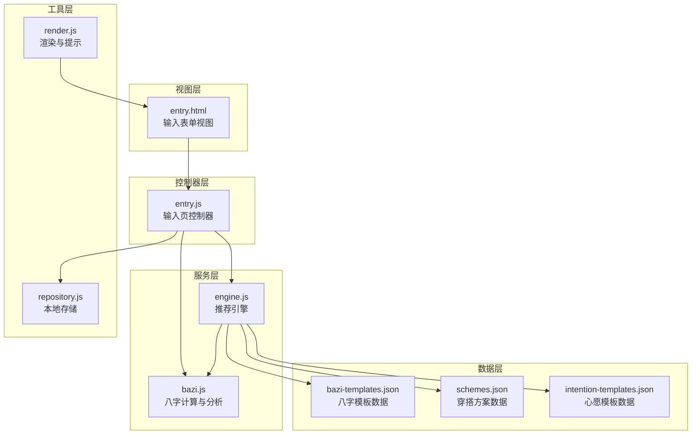
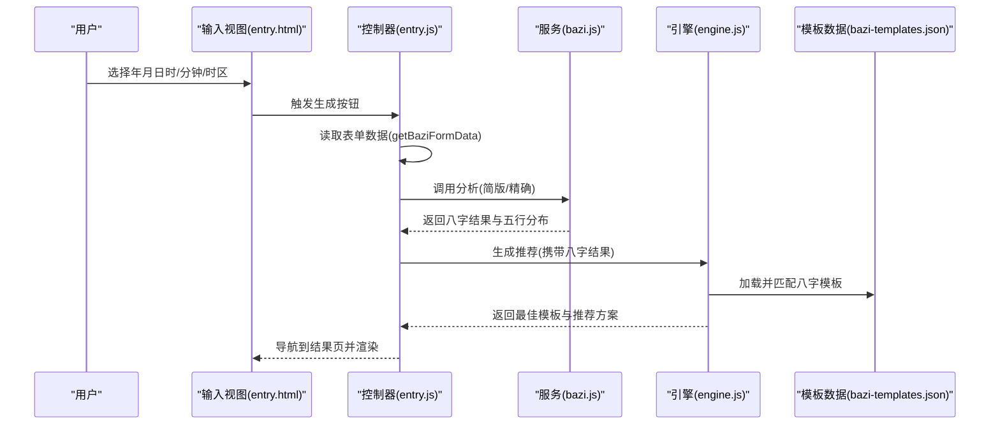
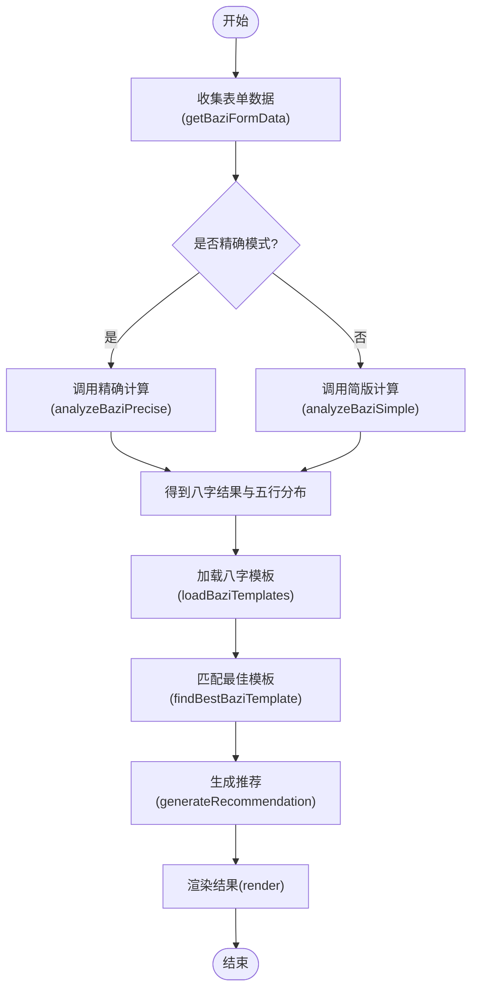
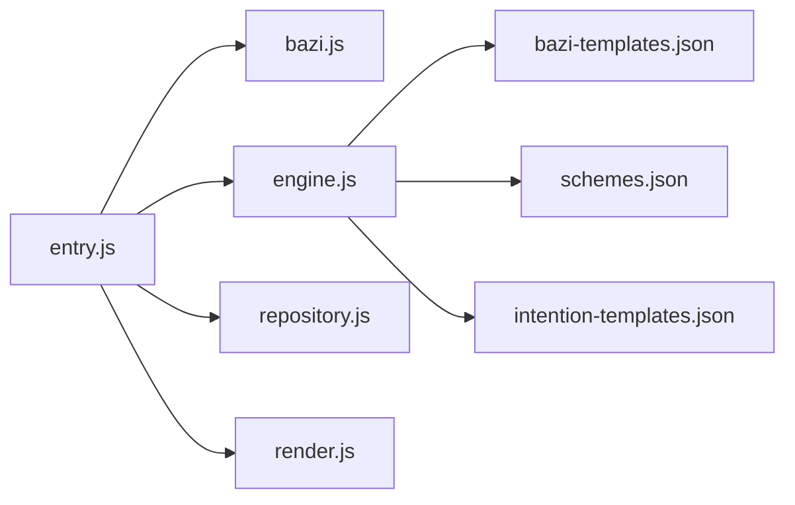

# 八字模板配置

<cite>
**本文引用的文件**
- [bazi-templates.json](file://data/bazi-templates.json)
- [bazi.js](file://js/services/bazi.js)
- [entry.js](file://js/controllers/entry.js)
- [entry.html](file://views/entry.html)
- [engine.js](file://js/services/engine.js)
- [repository.js](file://js/data/repository.js)
- [render.js](file://js/utils/render.js)
- [schemes.json](file://data/schemes.json)
- [intention-templates.json](file://data/intention-templates.json)
</cite>

## 目录
1. [简介](#简介)
2. [项目结构](#项目结构)
3. [核心组件](#核心组件)
4. [架构总览](#架构总览)
5. [详细组件分析](#详细组件分析)
6. [依赖关系分析](#依赖关系分析)
7. [性能考量](#性能考量)
8. [故障排查指南](#故障排查指南)
9. [结论](#结论)
10. [附录](#附录)

## 简介
本文件面向“八字模板配置”的设计与实现，围绕 bazi-templates.json 的数据结构与业务流程进行系统化说明。内容涵盖：
- 八字输入模板的数据结构与字段定义
- 表单字段配置选项（输入类型、默认值、可选范围、错误提示）
- 八字数据格式要求与验证逻辑
- 模板扩展指南（新增字段、修改规则、优化体验）
- 八字模板在命理分析中的应用（处理不完整信息与智能提示）
- 模板系统的集成方法与数据处理流程

## 项目结构
八字模板配置位于 data 目录下的 bazi-templates.json，配合服务层、控制器层、视图层与工具层共同完成从输入到推荐的全流程。

图表来源
- [bazi-templates.json](file://data/bazi-templates.json#L1-L103)
- [bazi.js](file://js/services/bazi.js#L1-L267)
- [engine.js](file://js/services/engine.js#L1-L425)
- [entry.js](file://js/controllers/entry.js#L1-L241)
- [entry.html](file://views/entry.html#L1-L234)
- [render.js](file://js/utils/render.js#L1-L487)
- [repository.js](file://js/data/repository.js#L1-L394)

章节来源
- [bazi-templates.json](file://data/bazi-templates.json#L1-L103)
- [entry.html](file://views/entry.html#L132-L223)

## 核心组件
- 八字模板数据源：bazi-templates.json，定义了按“日主强弱”和“年份”分类的模板条目，包含 baZiKey、solarTerm、color、material、feeling、annotation、source 等字段。
- 八字服务：bazi.js 提供简版与精确两种八字计算，以及五行分布统计与推荐元素。
- 推荐引擎：engine.js 加载模板数据，根据当前八字结果匹配最佳模板，并参与最终推荐。
- 输入控制器：entry.js 负责表单数据采集、精度模式切换、调用分析服务与导航。
- 视图与渲染：entry.html 定义表单结构，render.js 提供提示与UI交互。
- 本地存储：repository.js 提供八字数据持久化与恢复。

章节来源
- [bazi-templates.json](file://data/bazi-templates.json#L1-L103)
- [bazi.js](file://js/services/bazi.js#L101-L183)
- [engine.js](file://js/services/engine.js#L77-L158)
- [entry.js](file://js/controllers/entry.js#L191-L240)
- [entry.html](file://views/entry.html#L132-L223)
- [render.js](file://js/utils/render.js#L45-L55)
- [repository.js](file://js/data/repository.js#L261-L287)

## 架构总览
八字模板配置贯穿“输入—计算—匹配—推荐”的闭环：
- 输入层：entry.html 提供年、月、日、时（及分钟、时区）的选择器；精度切换控制精确模式字段显示。
- 控制层：entry.js 读取表单数据，保存到本地存储，调用 bazi.js 进行八字分析，再由 engine.js 加载模板并匹配最佳条目。
- 服务层：bazi.js 提供简版/精确八字计算与五行统计；engine.js 负责模板匹配与推荐组合。
- 数据层：bazi-templates.json、schemes.json、intention-templates.json 作为模板与方案数据源。

图表来源
- [entry.html](file://views/entry.html#L132-L223)
- [entry.js](file://js/controllers/entry.js#L131-L189)
- [bazi.js](file://js/services/bazi.js#L101-L183)
- [engine.js](file://js/services/engine.js#L323-L393)
- [bazi-templates.json](file://data/bazi-templates.json#L1-L103)

## 详细组件分析

### 八字模板数据结构与字段定义
- 模板条目字段
  - id：模板唯一标识
  - baZiKey：八字关键描述，包含“日主强弱”和“年份”信息
  - solarTerm：节气名称
  - color：推荐色彩名称与十六进制色值
  - material：推荐材质
  - feeling：推荐感受
  - annotation：五行解读与典故注释
  - source：典籍出处

- 字段约束与取值范围
  - baZiKey：必须包含“日主”关键词与“旺”或“弱”，并包含当前年份（例如“2024”或“2025”）
  - solarTerm：取值来自节气模板映射（见 engine.js 中 TERM_NAME_MAP 与 TERM_ORDER）
  - color/material/feeling/annotation/source：均为字符串，无强制长度限制

- 数据一致性
  - 模板按“日主强弱+年份”分组，引擎优先匹配“最强元素+当年”的模板，否则回退到“最强元素+任意年份”

章节来源
- [bazi-templates.json](file://data/bazi-templates.json#L1-L103)
- [engine.js](file://js/services/engine.js#L127-L158)

### 表单字段配置与验证规则
- 表单字段
  - 年：下拉选择，范围为1950年至当前年减16（至少16岁），由 render.js 的 initYearSelect 动态生成
  - 月：下拉选择，1-12
  - 日：下拉选择，1-31
  - 时：下拉选择，0-11（对应子时至亥时）
  - 精确模式额外字段
    - 分钟：0/15/30/45
    - 出生地：时区（默认8，可选6）

- 验证与必填
  - 简版：年、月、日、时均需选择
  - 精确：除上述外，分钟与时区可选，默认值分别为0与8
  - 控制器 getBaziFormData 在字段齐全时返回对象，否则返回空（触发提示）

- 错误提示与用户体验
  - 生成失败时通过 render.js 的 showToast 显示“生成失败，请重试”
  - 结果页若无八字，会显示“去填写”引导

章节来源
- [entry.html](file://views/entry.html#L151-L221)
- [entry.js](file://js/controllers/entry.js#L191-L221)
- [render.js](file://js/utils/render.js#L45-L55)
- [render.js](file://js/utils/render.js#L457-L486)

### 八字数据格式要求与验证逻辑
- 输入格式
  - 年：整数（1950~当前年-16）
  - 月：整数（1~12）
  - 日：整数（1~31）
  - 时：整数（0~11）
  - 精确模式：分钟（0/15/30/45）、时区（默认8，可选6）

- 验证逻辑
  - 控制器 getBaziFormData 对必填字段进行非空校验
  - 若精确模式开启，则读取分钟与时区并赋予默认值
  - 保存到本地存储（repository.js 的 BaziRepository），以便恢复

- 计算逻辑
  - 简版：基于年、月、日、时计算四柱（年柱、月柱、日柱、时柱），返回 fullBazi 与 precision=simple
  - 精确：尝试使用 lunar-javascript 库计算，若库缺失则回退到简版；成功时返回 fullBazi 与 precision=precise，并包含农历信息

- 五行统计与推荐
  - 统计天干与地支的五行分布，输出最弱与最强元素，并给出补充建议

章节来源
- [entry.js](file://js/controllers/entry.js#L191-L221)
- [repository.js](file://js/data/repository.js#L261-L287)
- [bazi.js](file://js/services/bazi.js#L101-L183)
- [bazi.js](file://js/services/bazi.js#L185-L266)

### 八字模板在命理分析中的应用
- 模板匹配策略
  - 引擎先获取当前年份与最强元素，优先匹配“最强元素+当年”的模板；若不存在则回退到“最强元素+任意年份”
  - 匹配成功后，模板中的 color、material、feeling、annotation、source 将参与推荐解释与展示

- 与其他数据的协同
  - 与节气模板（intention-templates.json）结合，形成“心愿+节气+八字”的多维评分
  - 与方案模板（schemes.json）结合，形成“穿搭方案+八字模板”的组合推荐

- 不完整信息处理
  - 若用户未填写八字，结果页会显示提示并引导跳转输入页
  - 引擎仍可基于其他维度（天气、心愿、场景）生成推荐，但会标注缺少八字

章节来源
- [engine.js](file://js/services/engine.js#L127-L158)
- [engine.js](file://js/services/engine.js#L323-L393)
- [intention-templates.json](file://data/intention-templates.json#L1-L493)
- [schemes.json](file://data/schemes.json#L1-L509)

### 模板扩展指南
- 新增模板字段
  - 在 bazi-templates.json 中新增条目，遵循现有字段命名与取值规范
  - 若需要更强的语义表达，可在 annotation/source 中补充典故与出处

- 修改验证规则
  - 若需调整输入范围（如年份上限/下限），修改 entry.html 的选项与 render.js 的初始化逻辑
  - 若需新增输入项（如性别、出生地经纬度），需在 entry.html 增加控件，在 entry.js 的 getBaziFormData 中读取并校验

- 优化用户体验
  - 增加智能提示：在用户选择月/日时，根据当前年份动态更新日范围（闰年2月29日）
  - 增加输入联动：选择“精确”模式时自动显示分钟与时区选项
  - 增加错误引导：针对无效日期（如2月30日）给出明确提示

- 性能优化
  - 模板数据加载：engine.js 已做并发加载（Promise.all），保持模板数据体积合理
  - 本地存储：使用 repository.js 的安全封装，避免异常导致页面崩溃

章节来源
- [bazi-templates.json](file://data/bazi-templates.json#L1-L103)
- [entry.html](file://views/entry.html#L151-L221)
- [entry.js](file://js/controllers/entry.js#L191-L221)
- [engine.js](file://js/services/engine.js#L323-L393)
- [repository.js](file://js/data/repository.js#L24-L41)

### 数据处理流程与集成方法
- 前端集成步骤
  - 在入口页引入 entry.html 的表单结构
  - 在控制器中绑定事件，读取表单数据并调用 bazi.js 分析
  - 将分析结果传递给 engine.js，加载模板并生成推荐
  - 使用 render.js 渲染结果与提示

- 关键流程节点
  - getBaziFormData：收集年、月、日、时（及分钟、时区）
  - analyzeBazi/analyzeBaziPrecise：生成四柱与五行分布
  - findBestBaziTemplate：匹配最佳八字模板
  - generateRecommendation：综合多维评分生成推荐

图表来源
- [entry.js](file://js/controllers/entry.js#L131-L189)
- [bazi.js](file://js/services/bazi.js#L101-L183)
- [engine.js](file://js/services/engine.js#L77-L158)
- [engine.js](file://js/services/engine.js#L323-L393)
- [render.js](file://js/utils/render.js#L119-L132)

## 依赖关系分析
- 模块耦合
  - engine.js 依赖 bazi-templates.json、schemes.json、intention-templates.json 与 bazi.js
  - entry.js 依赖 bazi.js、engine.js、repository.js、render.js
  - entry.html 与 entry.js 强耦合，负责表单交互与数据采集

- 外部依赖
  - lunar-javascript：精确模式依赖，缺失时回退简版
  - localStorage：repository.js 提供统一封装

图表来源
- [entry.js](file://js/controllers/entry.js#L1-L241)
- [bazi.js](file://js/services/bazi.js#L1-L267)
- [engine.js](file://js/services/engine.js#L1-L425)
- [bazi-templates.json](file://data/bazi-templates.json#L1-L103)
- [schemes.json](file://data/schemes.json#L1-L509)
- [intention-templates.json](file://data/intention-templates.json#L1-L493)
- [repository.js](file://js/data/repository.js#L1-L394)
- [render.js](file://js/utils/render.js#L1-L487)

章节来源
- [entry.js](file://js/controllers/entry.js#L1-L241)
- [engine.js](file://js/services/engine.js#L1-L425)

## 性能考量
- 模板加载：使用 Promise.all 并发加载多个模板文件，减少等待时间
- 计算回退：精确模式失败时自动回退简版，保证可用性
- 本地存储：使用安全封装避免异常，减少IO失败对主线程的影响
- 渲染优化：卡片渲染采用批量插入与延迟动画，提升首屏体验

[本节为通用指导，无需特定文件引用]

## 故障排查指南
- 症状：生成失败提示
  - 可能原因：表单字段不完整、精确模式计算异常、模板加载失败
  - 处理方式：检查 getBaziFormData 返回值、确认精确模式字段默认值、查看控制台错误日志

- 症状：未填写八字导致推荐不完整
  - 可能原因：本地存储无八字或结果页未检测到八字
  - 处理方式：在结果页点击“去填写”按钮跳转输入页；或在输入页恢复上次选择

- 症状：精确模式无法计算
  - 可能原因：lunar-javascript 未正确加载
  - 处理方式：检查资源加载路径，确认回退逻辑生效

章节来源
- [entry.js](file://js/controllers/entry.js#L131-L189)
- [entry.js](file://js/controllers/entry.js#L235-L253)
- [bazi.js](file://js/services/bazi.js#L127-L183)
- [render.js](file://js/utils/render.js#L457-L486)

## 结论
bazi-templates.json 作为八字模板的核心数据源，与输入表单、八字计算、模板匹配与推荐引擎紧密协作，形成了从“输入—计算—匹配—推荐”的完整链路。通过合理的字段设计、严格的验证规则与灵活的扩展机制，系统能够在保证准确性的同时，提供良好的用户体验与可维护性。建议在后续迭代中持续优化输入提示、增强错误引导，并保持模板数据的权威性与时效性。

[本节为总结性内容，无需特定文件引用]

## 附录
- 相关文件清单
  - 数据文件：bazi-templates.json、schemes.json、intention-templates.json
  - 服务文件：bazi.js、engine.js
  - 控制器文件：entry.js
  - 视图文件：entry.html
  - 工具文件：render.js、repository.js

[本节为概览性内容，无需特定文件引用]