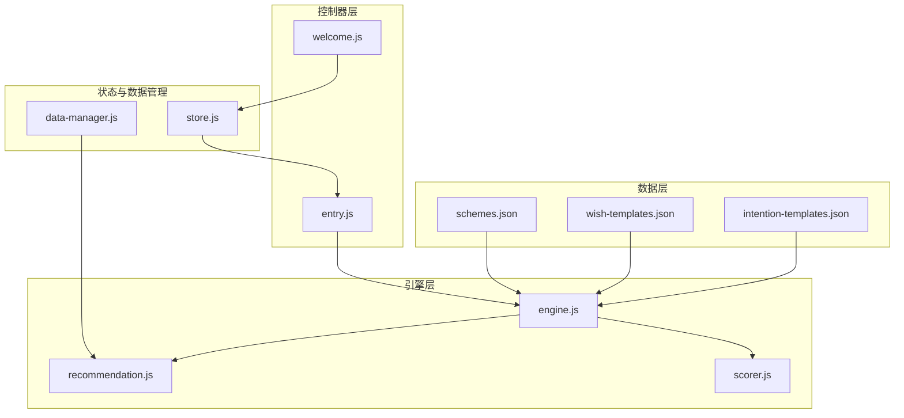
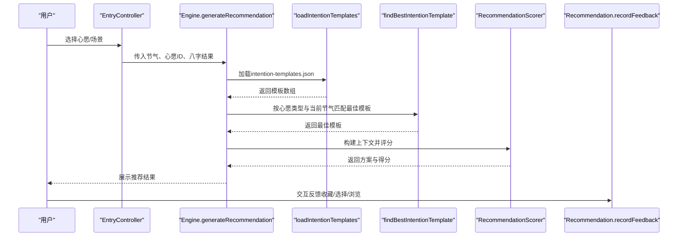
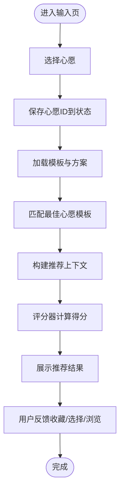
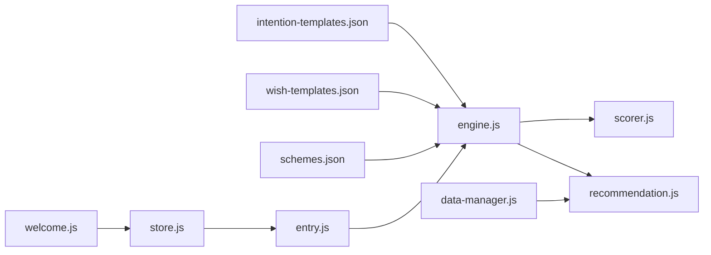

# 心愿模板配置

<cite>
**本文引用的文件**
- [intention-templates.json](file://data/intention-templates.json)
- [wish-templates.json](file://data/wish-templates.json)
- [schemes.json](file://data/schemes.json)
- [engine.js](file://js/services/engine.js)
- [recommendation.js](file://js/services/recommendation.js)
- [scorer.js](file://js/core/scorer.js)
- [store.js](file://js/core/store.js)
- [entry.js](file://js/controllers/entry.js)
- [welcome.js](file://js/controllers/welcome.js)
- [data-manager.js](file://js/data/data-manager.js)
</cite>

## 目录
1. [简介](#简介)
2. [项目结构](#项目结构)
3. [核心组件](#核心组件)
4. [架构总览](#架构总览)
5. [详细组件分析](#详细组件分析)
6. [依赖关系分析](#依赖关系分析)
7. [性能考量](#性能考量)
8. [故障排查指南](#故障排查指南)
9. [结论](#结论)
10. [附录](#附录)

## 简介
本文件面向“心愿模板配置”的设计与实现，聚焦于 data/intention-templates.json 的结构设计、模板变量系统、模板扩展方法、在用户引导流程中的应用、模板验证规则与数据格式要求，并提供可直接定位到源码位置的路径示例，帮助开发者快速理解与维护模板系统。

## 项目结构
与心愿模板相关的核心文件分布如下：
- 数据层：intention-templates.json（心愿模板）、schemes.json（方案模板）、wish-templates.json（心愿偏好模板）
- 引擎层：engine.js（模板加载与匹配）、recommendation.js（推荐与反馈）、scorer.js（评分器）
- 控制器层：entry.js（输入页控制器，负责收集用户心愿）、welcome.js（欢迎页控制器，渲染节气信息）
- 状态与数据管理：store.js（全局状态）、data-manager.js（数据导入导出）

图表来源
- [engine.js](file://js/services/engine.js#L67-L85)
- [recommendation.js](file://js/services/recommendation.js#L31-L58)
- [scorer.js](file://js/core/scorer.js#L14-L22)
- [entry.js](file://js/controllers/entry.js#L14-L21)
- [welcome.js](file://js/controllers/welcome.js#L13-L17)
- [store.js](file://js/core/store.js#L30-L63)
- [data-manager.js](file://js/data/data-manager.js#L6-L42)

章节来源
- [engine.js](file://js/services/engine.js#L67-L85)
- [entry.js](file://js/controllers/entry.js#L14-L21)
- [welcome.js](file://js/controllers/welcome.js#L13-L17)
- [store.js](file://js/core/store.js#L30-L63)
- [data-manager.js](file://js/data/data-manager.js#L6-L42)

## 核心组件
- 心愿模板数据模型（intention-templates.json）：定义了按心愿类型分类、按节气匹配的模板集合，包含模板标识、心愿类型、节气、颜色、材质、感受、注释与来源等字段。
- 心愿偏好模板（wish-templates.json）：定义了心愿类别、颜色与材质偏好、季节调节规则等，支撑个性化推荐。
- 推荐引擎（engine.js）：负责加载模板、匹配最佳模板、构建上下文并调用评分器生成推荐。
- 评分器（scorer.js）：封装评分维度与权重，输出每个方案的总分与分解说明。
- 用户引导流程（entry.js、welcome.js）：收集用户心愿与场景，渲染节气信息，驱动推荐生成。
- 全局状态（store.js）：集中管理当前节气、心愿ID、结果等状态。
- 数据管理（data-manager.js）：提供数据导入导出与校验能力。

章节来源
- [intention-templates.json](file://data/intention-templates.json#L1-L493)
- [wish-templates.json](file://data/wish-templates.json#L1-L47)
- [engine.js](file://js/services/engine.js#L323-L393)
- [scorer.js](file://js/core/scorer.js#L29-L75)
- [entry.js](file://js/controllers/entry.js#L105-L117)
- [welcome.js](file://js/controllers/welcome.js#L19-L35)
- [store.js](file://js/core/store.js#L30-L63)
- [data-manager.js](file://js/data/data-manager.js#L48-L72)

## 架构总览
模板系统围绕“模板加载—最佳模板匹配—上下文构建—评分—推荐”展开，关键流程如下：

图表来源
- [engine.js](file://js/services/engine.js#L323-L393)
- [engine.js](file://js/services/engine.js#L110-L125)
- [scorer.js](file://js/core/scorer.js#L266-L276)
- [recommendation.js](file://js/services/recommendation.js#L145-L184)

章节来源
- [engine.js](file://js/services/engine.js#L323-L393)
- [scorer.js](file://js/core/scorer.js#L266-L276)
- [recommendation.js](file://js/services/recommendation.js#L145-L184)

## 详细组件分析

### 心愿模板数据模型（intention-templates.json）
- 结构要点
  - 数组形式，每条模板包含：模板ID、心愿类型、节气、颜色、材质、感受、注释、来源。
  - 模板ID具有唯一性，便于在引擎中引用与追踪。
  - 心愿类型用于筛选匹配模板；节气字段用于与当前节气计算距离，选择最近模板。
- 关键字段语义
  - id：模板唯一标识
  - intention：心愿类型（如“求职”、“贵人运”、“远行顺利”等）
  - solarTerm：节气名称（与节气顺序映射配合）
  - color/material/feeling：颜色、材质、感受，作为推荐依据
  - annotation/source：注释与来源，用于解释与溯源
- 模板匹配策略
  - 引擎按心愿类型过滤模板，再按当前节气与模板节气的距离排序，取最近者作为最佳模板。

章节来源
- [intention-templates.json](file://data/intention-templates.json#L1-L493)
- [engine.js](file://js/services/engine.js#L110-L125)

### 心愿偏好模板（wish-templates.json）
- 结构要点
  - wishes：心愿类别数组，包含id、name、colorBias、materialBias、advice。
  - seasonModifiers：季节调节规则，定义五行的增益与忌讳关系。
- 作用
  - 为用户选择的心愿提供偏好权重与季节调节，辅助个性化推荐与解释。

章节来源
- [wish-templates.json](file://data/wish-templates.json#L1-L47)

### 模板变量系统与动态内容生成
- 占位符机制
  - 引擎在构建上下文时，会将最佳心愿模板注入到上下文中，供评分器与前端展示使用。
  - 评分器在计算“心愿契合”维度时，可结合模板中的五行、颜色、材质等属性进行评分。
- 动态内容生成
  - 引擎根据当前节气与心愿类型，选择最近的模板，从而实现“动态内容生成”（不同节气、不同心愿对应不同模板）。

章节来源
- [engine.js](file://js/services/engine.js#L187-L212)
- [engine.js](file://js/services/engine.js#L348-L353)
- [scorer.js](file://js/core/scorer.js#L198-L210)

### 模板扩展方法
- 添加新的心愿类型
  - 在 intention-templates.json 中新增模板条目，设置 intention 为新心愿类型，确保模板ID唯一。
  - 在 wish-templates.json 中为该心愿类型添加偏好配置（若需要）。
- 修改现有模板选项
  - 可调整 color、material、feeling 等字段，以适配新的推荐策略或节气变化。
- 调整模板优先级
  - 通过节气字段与模板ID命名规范，影响引擎按节气距离的排序优先级。
  - 若需更强控制，可在引擎中扩展匹配逻辑（例如引入权重或阈值）。

章节来源
- [intention-templates.json](file://data/intention-templates.json#L1-L493)
- [engine.js](file://js/services/engine.js#L110-L125)

### 模板在用户引导流程中的应用
- 欢迎页（welcome.js）
  - 渲染当前节气信息，为后续模板匹配提供上下文。
- 输入页（entry.js）
  - 收集用户选择的心愿ID，写入全局状态，驱动推荐生成。
- 推荐生成（engine.js）
  - 加载模板，匹配最佳心愿模板，构建上下文，调用评分器，返回推荐结果。

图表来源
- [entry.js](file://js/controllers/entry.js#L112-L117)
- [engine.js](file://js/services/engine.js#L323-L393)
- [scorer.js](file://js/core/scorer.js#L266-L276)
- [recommendation.js](file://js/services/recommendation.js#L145-L184)

章节来源
- [welcome.js](file://js/controllers/welcome.js#L19-L35)
- [entry.js](file://js/controllers/entry.js#L112-L117)
- [engine.js](file://js/services/engine.js#L323-L393)
- [scorer.js](file://js/core/scorer.js#L266-L276)
- [recommendation.js](file://js/services/recommendation.js#L145-L184)

### 模板验证规则与数据格式要求
- 数据完整性
  - 心愿模板数组不能为空；模板字段需包含 id、intention、solarTerm 等关键字段。
- 节气一致性
  - 模板的 solarTerm 应与节气顺序映射一致，以便正确计算距离。
- 唯一性约束
  - 模板ID需唯一，避免冲突。
- 个性化数据校验
  - 用户偏好与反馈数据需符合预期结构，导入导出时进行版本与结构校验。

章节来源
- [engine.js](file://js/services/engine.js#L89-L105)
- [data-manager.js](file://js/data/data-manager.js#L106-L135)

### 实际代码示例（路径定位）
- 加载并匹配心愿模板
  - [加载模板](file://js/services/engine.js#L70-L75)
  - [匹配最佳模板](file://js/services/engine.js#L110-L125)
- 构建上下文与评分
  - [构建上下文](file://js/services/engine.js#L187-L212)
  - [评分器评分](file://js/core/scorer.js#L29-L75)
- 用户引导与状态
  - [保存心愿ID](file://js/controllers/entry.js#L112-L117)
  - [全局状态键](file://js/core/store.js#L193-L202)

章节来源
- [engine.js](file://js/services/engine.js#L70-L75)
- [engine.js](file://js/services/engine.js#L110-L125)
- [engine.js](file://js/services/engine.js#L187-L212)
- [scorer.js](file://js/core/scorer.js#L29-L75)
- [entry.js](file://js/controllers/entry.js#L112-L117)
- [store.js](file://js/core/store.js#L193-L202)

## 依赖关系分析
- 模块耦合
  - engine.js 依赖 intention-templates.json 与 wish-templates.json，同时依赖 recommendation.js 与 scorer.js。
  - entry.js 与 welcome.js 通过 store.js 与 engine.js 间接耦合。
  - data-manager.js 提供数据导入导出能力，保障模板数据的可迁移性。
- 依赖可视化

图表来源
- [engine.js](file://js/services/engine.js#L67-L85)
- [scorer.js](file://js/core/scorer.js#L14-L22)
- [recommendation.js](file://js/services/recommendation.js#L31-L58)
- [entry.js](file://js/controllers/entry.js#L14-L21)
- [welcome.js](file://js/controllers/welcome.js#L13-L17)
- [store.js](file://js/core/store.js#L30-L63)
- [data-manager.js](file://js/data/data-manager.js#L6-L42)

章节来源
- [engine.js](file://js/services/engine.js#L67-L85)
- [scorer.js](file://js/core/scorer.js#L14-L22)
- [recommendation.js](file://js/services/recommendation.js#L31-L58)
- [entry.js](file://js/controllers/entry.js#L14-L21)
- [welcome.js](file://js/controllers/welcome.js#L13-L17)
- [store.js](file://js/core/store.js#L30-L63)
- [data-manager.js](file://js/data/data-manager.js#L6-L42)

## 性能考量
- 模板加载
  - 引擎采用懒加载策略，首次访问时才拉取模板数据，减少初始开销。
- 匹配效率
  - 模板匹配按心愿类型过滤后，再按节气距离排序，时间复杂度近似 O(n log n)，n 为同一心愿类型的模板数量。
- 评分缓存
  - 评分器内部使用缓存 Map 存储已计算方案的得分，避免重复计算。
- 建议优化
  - 对模板数组进行索引（按 intention 与 solarTerm），可进一步降低匹配成本。
  - 对评分器的权重与关系判断进行常量折叠与分支优化。

章节来源
- [engine.js](file://js/services/engine.js#L60-L65)
- [engine.js](file://js/services/engine.js#L110-L125)
- [scorer.js](file://js/core/scorer.js#L20-L22)

## 故障排查指南
- 模板加载失败
  - 检查 data/intention-templates.json 是否存在且格式合法。
  - 确认网络请求与 safeFetch 的异常处理是否生效。
- 匹配不到模板
  - 确认 intention 名称与 wish-templates.json 中的映射一致。
  - 检查 solarTerm 是否与节气顺序映射匹配。
- 评分异常
  - 检查评分器权重配置与上下文字段是否完整。
  - 确认用户偏好与反馈数据结构是否符合预期。
- 数据导入导出问题
  - 使用 data-manager.js 的校验函数检查导入数据版本与结构。

章节来源
- [engine.js](file://js/services/engine.js#L60-L65)
- [engine.js](file://js/services/engine.js#L110-L125)
- [scorer.js](file://js/core/scorer.js#L29-L75)
- [data-manager.js](file://js/data/data-manager.js#L106-L135)

## 结论
心愿模板配置通过明确的数据模型、清晰的匹配策略与可扩展的引擎架构，实现了“按节气与心愿类型动态生成推荐”的目标。通过对模板字段、匹配逻辑与评分维度的合理设计，系统既保证了推荐的准确性，又具备良好的可维护性与扩展性。建议在后续迭代中引入模板索引与权重配置化，以进一步提升性能与灵活性。

## 附录
- 心愿类型与模板ID命名建议
  - 采用“意图_节气”的命名方式，便于按节气排序与匹配。
- 模板字段清单（参考）
  - id、intention、solarTerm、color、material、feeling、annotation、source
- 相关实现路径
  - [模板加载与匹配](file://js/services/engine.js#L67-L125)
  - [上下文构建与评分](file://js/services/engine.js#L187-L212)
  - [评分器评分与解释](file://js/core/scorer.js#L29-L75)
  - [用户心愿选择与状态](file://js/controllers/entry.js#L112-L117)
  - [全局状态键定义](file://js/core/store.js#L193-L202)
  - [数据导入导出与校验](file://js/data/data-manager.js#L48-L135)