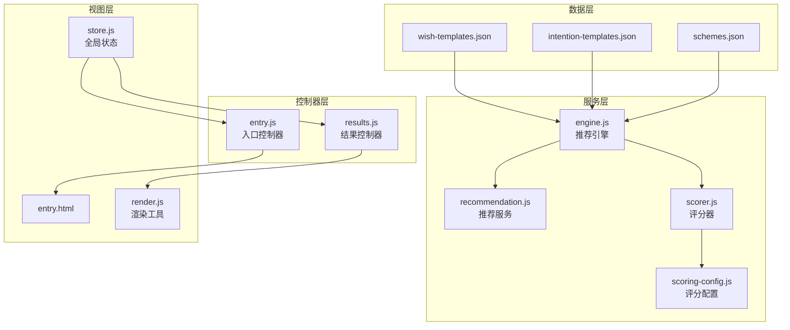
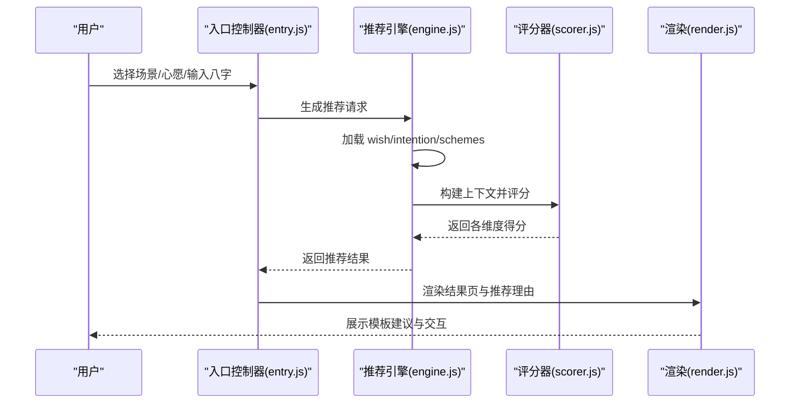
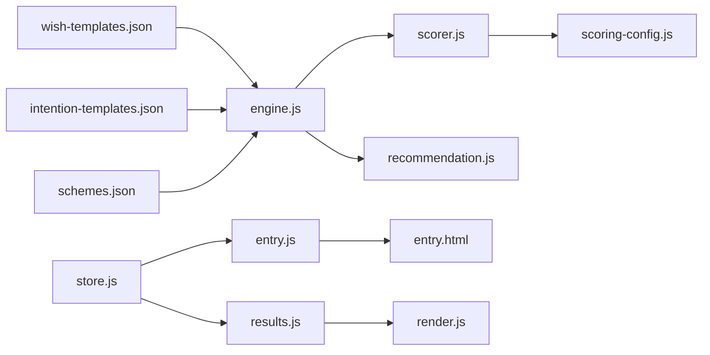

# 愿望模板配置

<cite>
**本文引用的文件**
- [wish-templates.json](file://data/wish-templates.json)
- [intention-templates.json](file://data/intention-templates.json)
- [schemes.json](file://data/schemes.json)
- [engine.js](file://js/services/engine.js)
- [recommendation.js](file://js/services/recommendation.js)
- [scorer.js](file://js/core/scorer.js)
- [scoring-config.js](file://js/core/scoring-config.js)
- [repository.js](file://js/data/repository.js)
- [store.js](file://js/core/store.js)
- [render.js](file://js/utils/render.js)
- [entry.html](file://views/entry.html)
- [entry.js](file://js/controllers/entry.js)
- [results.js](file://js/controllers/results.js)
</cite>

## 目录
1. [简介](#简介)
2. [项目结构](#项目结构)
3. [核心组件](#核心组件)
4. [架构总览](#架构总览)
5. [详细组件分析](#详细组件分析)
6. [依赖关系分析](#依赖关系分析)
7. [性能考量](#性能考量)
8. [故障排查指南](#故障排查指南)
9. [结论](#结论)
10. [附录](#附录)

## 简介
本文件围绕“愿望模板配置”展开，系统性解析 wish-templates.json 的数据模型、分类体系与使用方法，并结合项目中的意图模板、推荐引擎与渲染机制，说明模板如何驱动个性化推荐与前端展示。文档同时提供模板扩展、样式优化与性能改进的实践建议，帮助开发者在不破坏现有架构的前提下持续演进模板系统。

## 项目结构
该项目采用模块化前端架构，数据层、服务层、控制器层与视图层职责清晰：
- 数据层：wish-templates.json、intention-templates.json、schemes.json 等静态资源
- 服务层：推荐引擎、评分器、场景偏好、天气联动等
- 控制器层：入口页与结果页控制器，负责业务流程编排
- 视图层：HTML 页面与渲染工具，负责模板渲染与交互

图表来源
- [wish-templates.json](file://data/wish-templates.json#L1-L47)
- [intention-templates.json](file://data/intention-templates.json#L1-L493)
- [schemes.json](file://data/schemes.json#L1-L200)
- [engine.js](file://js/services/engine.js#L1-L441)
- [recommendation.js](file://js/services/recommendation.js#L1-L466)
- [scorer.js](file://js/core/scorer.js#L1-L317)
- [scoring-config.js](file://js/core/scoring-config.js#L1-L128)
- [entry.js](file://js/controllers/entry.js#L1-L241)
- [results.js](file://js/controllers/results.js#L1-L614)
- [render.js](file://js/utils/render.js#L1-L487)
- [entry.html](file://views/entry.html#L1-L234)

章节来源
- [wish-templates.json](file://data/wish-templates.json#L1-L47)
- [engine.js](file://js/services/engine.js#L1-L441)
- [scorer.js](file://js/core/scorer.js#L1-L317)
- [entry.html](file://views/entry.html#L1-L234)

## 核心组件
- 愿望模板数据模型（wish-templates.json）
  - 结构：包含 wishes 数组与 seasonModifiers 对象
  - 字段：id、name、colorBias、materialBias、advice
  - 用途：定义心愿类型及其对应的五行偏向与材质偏好，以及季节增益/避忌规则
- 意图模板（intention-templates.json）
  - 结构：按心愿类型与节气组合的模板集合
  - 字段：intention、solarTerm、color、material、feeling、annotation、source
  - 用途：为特定心愿在特定节气下提供具体方案建议
- 推荐引擎（engine.js）
  - 职责：加载模板与方案，构建上下文，调用评分器，选择方案
  - 关键流程：加载数据 -> 构建上下文 -> 评分器打分 -> 梯度推荐 -> 返回结果
- 评分器（scorer.js）
  - 职责：封装评分逻辑，支持分项得分与解释
  - 关键维度：节气、八字、场景、天气、心愿、历史偏好、今日运势
- 渲染与交互（render.js、entry.js、results.js）
  - 职责：页面渲染、事件绑定、模态框、收藏与反馈
  - 与模板的衔接：入口页选择心愿与场景，结果页展示模板建议与推荐理由

章节来源
- [wish-templates.json](file://data/wish-templates.json#L1-L47)
- [intention-templates.json](file://data/intention-templates.json#L1-L493)
- [engine.js](file://js/services/engine.js#L1-L441)
- [scorer.js](file://js/core/scorer.js#L1-L317)
- [render.js](file://js/utils/render.js#L1-L487)
- [entry.js](file://js/controllers/entry.js#L1-L241)
- [results.js](file://js/controllers/results.js#L1-L614)

## 架构总览
模板系统在推荐流程中的位置如下：

图表来源
- [entry.js](file://js/controllers/entry.js#L131-L189)
- [engine.js](file://js/services/engine.js#L339-L409)
- [scorer.js](file://js/core/scorer.js#L29-L75)
- [render.js](file://js/utils/render.js#L119-L132)

## 详细组件分析

### 愿望模板数据模型（wish-templates.json）
- 数据结构
  - wishes：心愿条目数组
    - id：心愿标识（如 career、guiren、travel、focus、health）
    - name：心愿名称（如 求职顺利、贵人运、远行顺利、静心专注、健康舒畅）
    - colorBias：颜色五行偏向（如 ["wood","fire"]）
    - materialBias：材质偏向（如 ["棉","麻"]）
    - advice：建议文案（如 选择清爽利落的色调，展现自信与活力）
  - seasonModifiers：季节增益/避忌规则
    - 以五行为基础，定义每种元素的 boost（增益）与 avoid（避忌）
- 设计要点
  - 通过 colorBias 与 materialBias 为后续评分提供基础权重
  - seasonModifiers 与节气模板配合，形成“节气-心愿-模板”的三层匹配
- 使用场景
  - 引擎在构建上下文时，可结合 wishId 与 wish-templates 中的偏好，辅助心愿维度评分
  - 结果页可展示 wish 的 advice 作为人性化建议

章节来源
- [wish-templates.json](file://data/wish-templates.json#L1-L47)

### 意图模板系统（intention-templates.json）
- 数据结构
  - 每条模板包含 intention（心愿）、solarTerm（节气）、color、material、feeling、annotation、source
- 匹配策略
  - 引擎根据 wishId 与当前节气，查找最接近的模板
  - 通过节气顺序与距离计算，优先选择与当前节气最接近的模板
- 价值
  - 将抽象的心愿转化为具体的色彩、材质与感受描述，指导方案生成与解释
  - 为“心愿契合”维度提供量化依据

章节来源
- [intention-templates.json](file://data/intention-templates.json#L1-L493)
- [engine.js](file://js/services/engine.js#L125-L141)

### 推荐引擎与模板集成
- 数据加载
  - 引擎异步加载 schemes、intention-templates、bazi-templates
  - wish-templates 通过 wishId 与 wish-templates.json 的 id 进行关联
- 上下文构建
  - context 包含 termWuxing、wishId、bazi、weather、intentionTemplate、scenePreferences、dailyLuck
  - wishId 与 intention-templates 的 intention 字段映射（INTENTION_MAP）
- 评分与选择
  - 评分器按维度计算得分，引擎选择最佳、替代与平衡方案
  - 结果包含 explanations，便于前端展示推荐理由

章节来源
- [engine.js](file://js/services/engine.js#L339-L409)
- [scorer.js](file://js/core/scorer.js#L29-L75)

### 评分器与模板维度
- 评分维度
  - solarTerm：节气与方案五行关系
  - bazi：八字喜用/忌神与方案五行关系
  - scene：场景偏好与方案匹配
  - weather：天气五行与温度调候
  - wish：心愿模板契合度
  - history：历史偏好加成
  - dailyLuck：今日运势加成
- 动态权重
  - 根据用户是否有八字、是否新用户，动态调整权重分配

章节来源
- [scorer.js](file://js/core/scorer.js#L29-L75)
- [scoring-config.js](file://js/core/scoring-config.js#L74-L92)

### 前端渲染与模板展示
- 入口页（entry.html + entry.js）
  - 提供场景与心愿选择，收集 wishId 与场景信息
  - 触发生成推荐，导航到结果页
- 结果页（results.js + render.js）
  - 渲染推荐卡片、解释面板、详情模态框
  - 展示今日运势、天气影响与心愿建议
  - 支持收藏、分享、反馈与收藏列表

章节来源
- [entry.html](file://views/entry.html#L85-L130)
- [entry.js](file://js/controllers/entry.js#L105-L117)
- [results.js](file://js/controllers/results.js#L30-L46)
- [render.js](file://js/utils/render.js#L119-L132)

### 模板渲染机制实现细节
- 方案卡片渲染
  - renderSchemeCards 遍历方案数组，逐个创建卡片
  - 卡片包含颜色条、关键词、注释、来源、解释与动作区
- 推荐理由生成
  - generateSchemeExplanation 基于评分器 breakdown 输出维度占比与得分
  - 支持展开/收起，显示计算公式与总分
- 详情模态框
  - renderDetailModal 展示色彩、材质、感受、注释与典籍出处
  - 可叠加解释卡（来自 explanation.js）

章节来源
- [render.js](file://js/utils/render.js#L119-L299)

### 模板分类系统
- 愿望类型分类
  - 事业财运：求职、升职加薪、签单顺利、贵人运、防小人避坑
  - 情感人际：桃花朵朵、家庭和睦、挽回缓和
  - 身心状态：精力充沛、安神助眠、增强自信、静心专注
  - 健康平安：健康舒畅、身体康复、出行平安、远行顺利
- 场景需求分类
  - 基础：日常、通勤、居家
  - 工作：面试/答辩、商务谈判
  - 情感：约会、初次见面、浪漫约会
  - 社交：聚会、朋友聚餐、重要庆典
  - 生活：运动、旅行/户外、考试/学习
  - 运势：本命年化煞
- 季节适应分类
  - seasonModifiers 定义五行增益/避忌，与 wish-templates 的 advice 协同
  - intention-templates 以节气为维度，提供具体方案建议

章节来源
- [entry.html](file://views/entry.html#L89-L129)
- [recommendation.js](file://js/services/recommendation.js#L32-L58)
- [wish-templates.json](file://data/wish-templates.json#L39-L45)

### 模板扩展方法
- 添加新的愿望类型
  - wish-templates.json：新增 wish 条目，定义 id、name、colorBias、materialBias、advice
  - entry.html：在心愿区域添加对应按钮与数据属性
  - engine.js：在 INTENTION_MAP 中映射 wishId 与 intention 名称
- 修改现有模板样式
  - wish-templates.json：调整 colorBias、materialBias 与 advice
  - intention-templates.json：调整 color、material、feeling、annotation、source
  - 渲染层：保持 render.js 的字段映射不变即可自动适配
- 优化模板加载性能
  - 将 wish-templates.json 与 intention-templates.json 缓存在内存中（当前已实现）
  - 使用懒加载策略，仅在需要时加载 schemes.json
  - 对模板匹配逻辑进行缓存（如按 wishId 与节气的组合结果）

章节来源
- [engine.js](file://js/services/engine.js#L16-L37)
- [entry.html](file://views/entry.html#L89-L129)
- [render.js](file://js/utils/render.js#L119-L132)

### 愿望模板与推荐系统的集成
- 心愿维度评分
  - wishId 与 intention-templates 的 intention 匹配，得到模板建议
  - wish-templates 的 colorBias/materialBias 作为基础权重参与评分
- 个性化权重
  - 用户偏好（来自 repository.js 与 recommendation.js）与 wish 维度结合
  - 历史反馈（recordFeedback）与用户偏好共同影响后续推荐
- 今日运势与天气联动
  - dailyLuck 与 weatherRecommendation 与 wish 维度协同，形成动态加成

章节来源
- [engine.js](file://js/services/engine.js#L364-L369)
- [recommendation.js](file://js/services/recommendation.js#L145-L184)
- [repository.js](file://js/data/repository.js#L151-L201)

### 模板渲染机制的实现细节
- DOM 结构
  - 方案卡片包含颜色条、关键词、注释、来源、解释与动作区
  - 解释面板支持展开/收起，显示维度占比与计算公式
- 事件绑定
  - 收藏、分享、查看详情、反馈等事件委托到卡片容器
  - 详情模态框与反馈弹窗的显示/隐藏逻辑
- 动画与交互
  - 卡片入场动画延迟，提升视觉层次
  - Toast 消息与模态框遮罩管理

章节来源
- [render.js](file://js/utils/render.js#L119-L199)
- [results.js](file://js/controllers/results.js#L360-L462)

## 依赖关系分析

图表来源
- [wish-templates.json](file://data/wish-templates.json#L1-L47)
- [intention-templates.json](file://data/intention-templates.json#L1-L493)
- [schemes.json](file://data/schemes.json#L1-L200)
- [engine.js](file://js/services/engine.js#L1-L441)
- [scorer.js](file://js/core/scorer.js#L1-L317)
- [scoring-config.js](file://js/core/scoring-config.js#L1-L128)
- [recommendation.js](file://js/services/recommendation.js#L1-L466)
- [entry.js](file://js/controllers/entry.js#L1-L241)
- [results.js](file://js/controllers/results.js#L1-L614)
- [render.js](file://js/utils/render.js#L1-L487)
- [entry.html](file://views/entry.html#L1-L234)
- [store.js](file://js/core/store.js#L1-L212)

章节来源
- [engine.js](file://js/services/engine.js#L339-L409)
- [scorer.js](file://js/core/scorer.js#L266-L276)
- [recommendation.js](file://js/services/recommendation.js#L247-L284)

## 性能考量
- 数据加载
  - wish-templates.json 与 intention-templates.json 已缓存，避免重复请求
  - schemes.json 采用按需加载，减少首屏压力
- 评分计算
  - 评分器内部使用 Map 缓存，避免重复计算
  - 动态权重计算仅在初始化时执行
- 渲染优化
  - 方案卡片批量渲染，统一设置动画延迟
  - 模态框与遮罩的显示/隐藏采用最小 DOM 操作
- 建议
  - 对 wish-templates.json 与 intention-templates.json 增加版本号与校验
  - 对模板匹配逻辑增加索引（如按 intention 与 solarTerm 的组合索引）

[本节为通用性能讨论，无需列出具体文件来源]

## 故障排查指南
- 模板未生效
  - 检查 wishId 与 wish-templates.json 的 id 是否一致
  - 检查 INTENTION_MAP 是否包含 wishId 映射
- 心愿建议缺失
  - 确认 intention-templates.json 中是否存在对应 intention 与当前节气的模板
  - 检查 engine.js 的 findBestIntentionTemplate 逻辑
- 评分异常
  - 检查评分器权重配置与动态权重计算
  - 确认用户偏好与历史反馈数据是否正确写入
- 渲染问题
  - 检查 render.js 的字段映射与 DOM 结构
  - 确认事件委托与模态框显示逻辑

章节来源
- [engine.js](file://js/services/engine.js#L125-L141)
- [scorer.js](file://js/core/scorer.js#L29-L75)
- [recommendation.js](file://js/services/recommendation.js#L145-L184)
- [render.js](file://js/utils/render.js#L119-L132)

## 结论
wish-templates.json 与 intention-templates.json 构成了模板系统的核心数据基础，通过 engine.js 与 scorer.js 的协作，实现了从心愿到方案的智能推荐。结合 entry.js 与 results.js 的交互流程，模板不仅驱动了推荐算法，也直接影响了前端的展示与用户体验。通过合理的扩展与优化策略，模板系统可以在保持稳定性的同时持续演进。

[本节为总结性内容，无需列出具体文件来源]

## 附录
- 实际使用流程示例（路径指引）
  - 选择心愿与场景：[入口控制器事件绑定](file://js/controllers/entry.js#L62-L103)
  - 生成推荐：[入口控制器生成逻辑](file://js/controllers/entry.js#L131-L189)
  - 渲染推荐卡片：[渲染工具卡片渲染](file://js/utils/render.js#L119-L132)
  - 展示推荐理由：[渲染工具解释生成](file://js/utils/render.js#L223-L299)
  - 记录反馈与偏好：[结果控制器反馈处理](file://js/controllers/results.js#L464-L525)
  - 评分器评分与解释：[评分器评分与解释](file://js/core/scorer.js#L29-L75)

[本节为流程指引，无需列出具体文件来源]