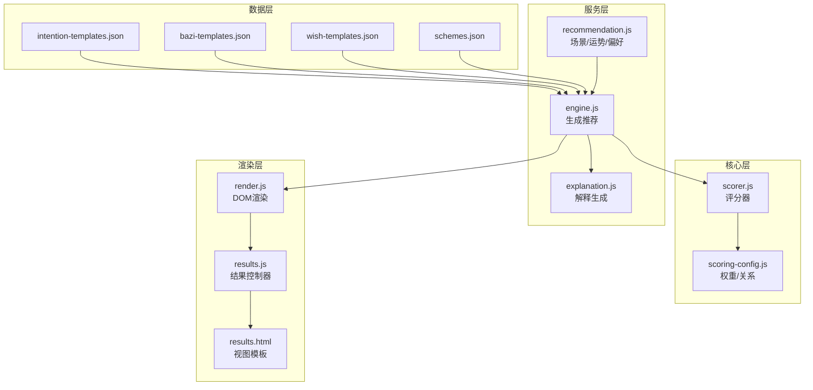
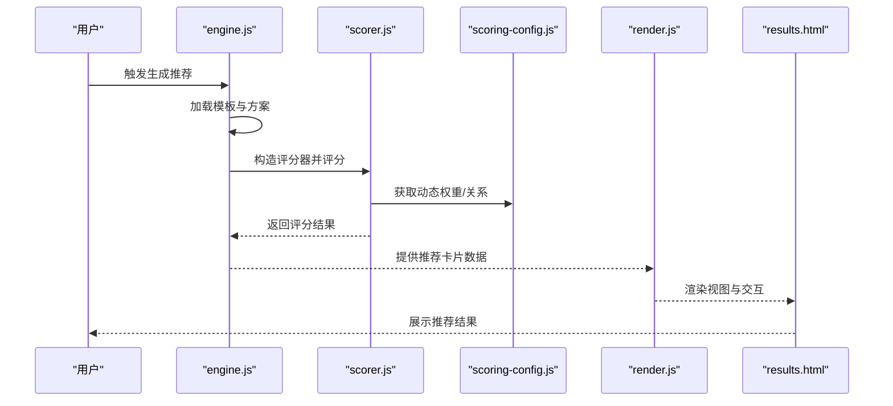
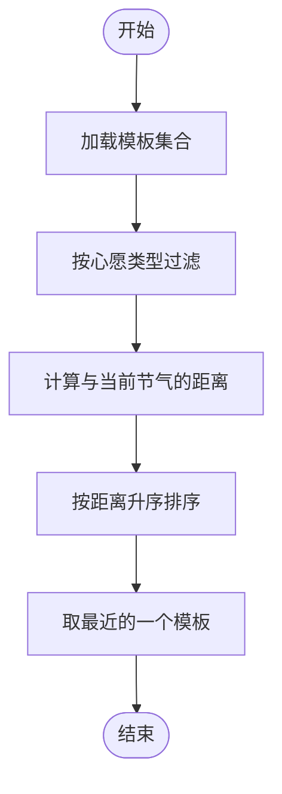
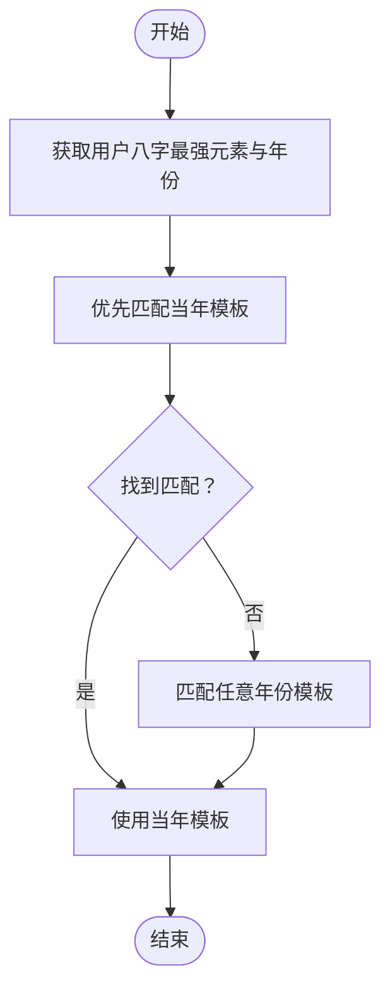
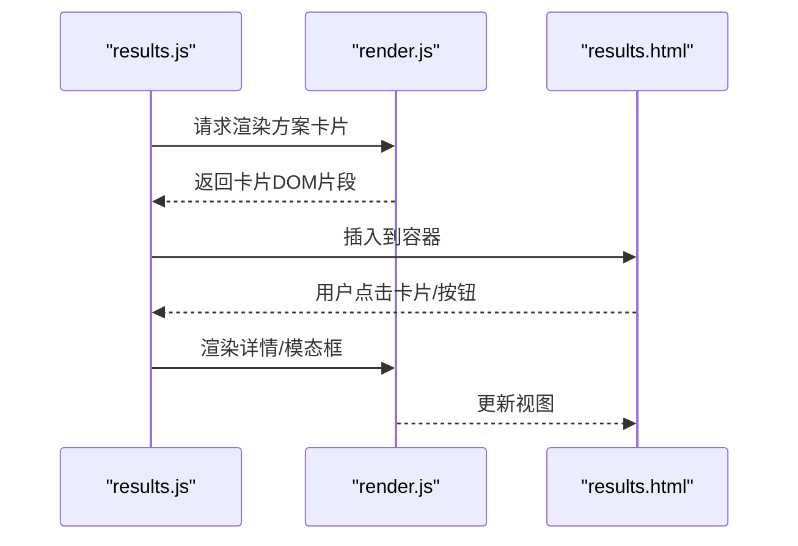
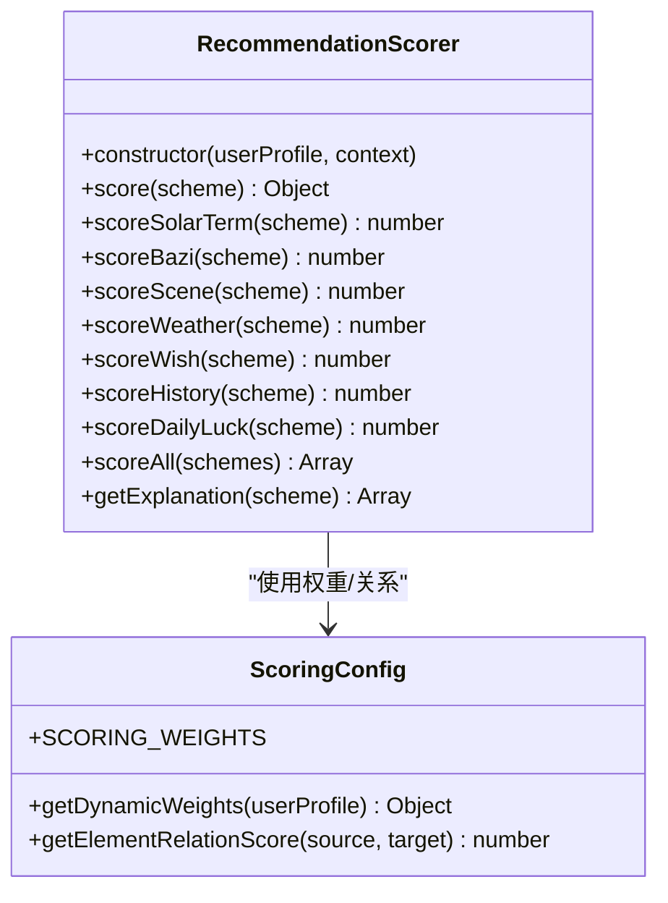
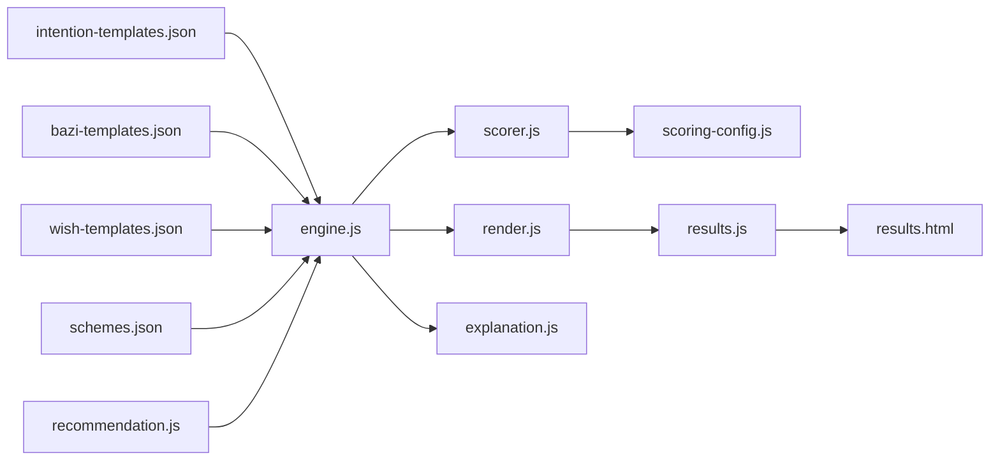

# 模板系统配置

<cite>
**本文档引用的文件**
- [intention-templates.json](file://data/intention-templates.json)
- [bazi-templates.json](file://data/bazi-templates.json)
- [wish-templates.json](file://data/wish-templates.json)
- [schemes.json](file://data/schemes.json)
- [engine.js](file://js/services/engine.js)
- [scorer.js](file://js/core/scorer.js)
- [scoring-config.js](file://js/core/scoring-config.js)
- [render.js](file://js/utils/render.js)
- [results.js](file://js/controllers/results.js)
- [results.html](file://views/results.html)
- [explanation.js](file://js/services/explanation.js)
- [recommendation.js](file://js/services/recommendation.js)
- [data-manager.js](file://js/data/data-manager.js)
</cite>

## 目录
1. [简介](#简介)
2. [项目结构](#项目结构)
3. [核心组件](#核心组件)
4. [架构总览](#架构总览)
5. [详细组件分析](#详细组件分析)
6. [依赖关系分析](#依赖关系分析)
7. [性能考虑](#性能考虑)
8. [故障排查指南](#故障排查指南)
9. [结论](#结论)
10. [附录](#附录)

## 简介
本文件系统性梳理模板系统的配置与实现，围绕三种模板文件展开：
- 心愿模板（intention-templates.json）：基于节气与心愿类型，输出色彩、材质、感受与注解，用于指导个性化推荐。
- 八字模板（bazi-templates.json）：根据日主强弱与年份，匹配五行建议与搭配方案，辅助命理适配。
- 愿望模板（wish-templates.json）：定义心愿类型、偏好倾向与季节调节规则，支撑用户偏好适配与展示优化。

同时，文档覆盖模板渲染机制、评分与推荐流程、扩展指南与最佳实践，帮助开发者与产品人员快速理解与维护模板系统。

## 项目结构
模板系统位于 data 目录下的 JSON 文件，配合 js/services 与 js/core 中的引擎与评分模块，以及 js/utils 的渲染模块共同完成模板加载、匹配、评分与前端展示。

图表来源
- [engine.js](file://js/services/engine.js#L323-L393)
- [scorer.js](file://js/core/scorer.js#L14-L75)
- [scoring-config.js](file://js/core/scoring-config.js#L7-L92)
- [render.js](file://js/utils/render.js#L119-L132)
- [results.js](file://js/controllers/results.js#L20-L46)
- [results.html](file://views/results.html#L1-L128)

章节来源
- [engine.js](file://js/services/engine.js#L323-L393)
- [render.js](file://js/utils/render.js#L119-L132)
- [results.js](file://js/controllers/results.js#L20-L46)

## 核心组件
- 模板数据源：三种 JSON 模板文件分别承载心愿、八字与愿望偏好信息。
- 推荐引擎：负责加载模板、构建上下文、选择方案与生成推荐结果。
- 评分器：封装评分逻辑，支持权重配置、五行关系与个性化加成。
- 渲染模块：负责视图切换、卡片渲染、模态框展示与交互事件绑定。
- 解释模块：生成推荐理由与五行分析，增强用户体验。

章节来源
- [engine.js](file://js/services/engine.js#L323-L393)
- [scorer.js](file://js/core/scorer.js#L14-L75)
- [render.js](file://js/utils/render.js#L119-L132)
- [explanation.js](file://js/services/explanation.js#L25-L111)

## 架构总览
模板系统采用“模板加载—上下文构建—评分—选择—渲染”的流水线式架构。模板文件作为静态数据源，通过引擎模块进行动态匹配与评分，最终由渲染模块在前端视图中呈现。

图表来源
- [engine.js](file://js/services/engine.js#L323-L393)
- [scorer.js](file://js/core/scorer.js#L29-L75)
- [scoring-config.js](file://js/core/scoring-config.js#L74-L92)
- [render.js](file://js/utils/render.js#L119-L132)
- [results.html](file://views/results.html#L70-L91)

## 详细组件分析

### 心愿模板 intention-templates.json
- 模板结构
  - 每个条目包含唯一 id、心愿类型、节气、色彩、材质、感受、注解与来源。
  - 通过节气与心愿类型筛选，再按当前节气距离排序，选取最近的模板。
- 变量占位与动态内容
  - 引擎根据当前节气 id 与模板节气名称映射，计算循环距离，实现“就近匹配”。
- 个性化选项
  - 与 wish-templates.json 的心愿偏好结合，形成“心愿契合”维度评分。
- 使用方法
  - 在生成推荐时，通过 wishId 映射到心愿类型，再在模板集合中筛选匹配条目，返回最佳模板。

图表来源
- [engine.js](file://js/services/engine.js#L109-L125)

章节来源
- [intention-templates.json](file://data/intention-templates.json#L1-L493)
- [engine.js](file://js/services/engine.js#L109-L125)

### 八字模板 bazi-templates.json
- 模板结构
  - 每个条目包含唯一 id、八字关键信息（日主强弱与年份）、节气、色彩、材质、感受、注解与来源。
- 输入字段与规则
  - 通过日主最强元素与年份匹配，优先匹配“当年”，否则回退到“任意年份”。
- 数据格式与交互
  - 引擎在构建上下文时，将模板与用户八字结果关联，形成“八字喜用”维度评分。
- 使用方法
  - 在生成推荐时，若存在八字结果，则查找最佳模板；否则跳过该维度。

图表来源
- [engine.js](file://js/services/engine.js#L129-L158)

章节来源
- [bazi-templates.json](file://data/bazi-templates.json#L1-L103)
- [engine.js](file://js/services/engine.js#L129-L158)

### 愿望模板 wish-templates.json
- 模板类型与分类
  - wishes 数组定义多种心愿类型（如求职、贵人运、远行顺利、静心专注、健康舒畅等）。
  - 每个心愿包含 id、name、colorBias（色彩偏好）、materialBias（材质偏好）与 advice（建议）。
- 内容结构与适配
  - seasonModifiers 定义五行增益/避忌关系，用于季节性调节与个性化推荐。
- 展示效果优化
  - 渲染模块根据心愿信息生成“今日运势卡片”，包含场景、心愿、幸运色系、解析与穿搭建议。

章节来源
- [wish-templates.json](file://data/wish-templates.json#L1-L47)
- [results.js](file://js/controllers/results.js#L57-L93)

### 模板渲染机制与前端集成
- 视图切换与初始化
  - 渲染模块提供 showView、initYearSelect、initDaySelect 等工具函数，支持页面级初始化与视图切换。
- 方案卡片渲染
  - renderSchemeCards 将评分后的方案数组渲染为卡片，包含色彩条、关键词、注解、来源与推荐理由。
- 详情模态框
  - renderDetailModal 展示方案的详细信息，支持解释卡片嵌入。
- 事件绑定与交互
  - 结果控制器绑定收藏、分享、查看详情、反馈等事件，统一处理用户交互。

图表来源
- [results.js](file://js/controllers/results.js#L30-L46)
- [render.js](file://js/utils/render.js#L119-L132)
- [results.html](file://views/results.html#L70-L91)

章节来源
- [render.js](file://js/utils/render.js#L119-L132)
- [results.js](file://js/controllers/results.js#L30-L46)
- [results.html](file://views/results.html#L70-L91)

### 评分与推荐流程
- 评分器类
  - RecommendationScorer 负责计算各项得分：节气、八字、场景、天气、心愿、历史偏好、今日运势。
  - 支持缓存与权重动态调整，保证性能与个性化。
- 权重与关系
  - scoring-config.js 提供基础权重、五行相生相克关系、天气与温度对应五行，以及动态权重计算。
- 选择策略
  - engine.js 的 selectSchemes 实现梯度推荐：最佳匹配 + 保守替代 + 平衡方案 + 补充方案，兼顾多样性与平衡。

图表来源
- [scorer.js](file://js/core/scorer.js#L14-L75)
- [scoring-config.js](file://js/core/scoring-config.js#L7-L92)

章节来源
- [scorer.js](file://js/core/scorer.js#L29-L75)
- [scoring-config.js](file://js/core/scoring-config.js#L74-L92)
- [engine.js](file://js/services/engine.js#L218-L299)

## 依赖关系分析
- 模板依赖
  - intention-templates.json 与 wish-templates.json 共同决定“心愿契合”维度。
  - bazi-templates.json 与用户八字结果共同决定“八字喜用”维度。
- 引擎依赖
  - engine.js 依赖 recommendation.js 的场景与运势模块，依赖 render.js 的 DOM 渲染能力。
- 渲染依赖
  - results.js 依赖 render.js 的卡片与模态框渲染，依赖 explanation.js 的解释卡片生成。

图表来源
- [engine.js](file://js/services/engine.js#L323-L393)
- [scorer.js](file://js/core/scorer.js#L14-L75)
- [scoring-config.js](file://js/core/scoring-config.js#L7-L92)
- [render.js](file://js/utils/render.js#L119-L132)
- [results.js](file://js/controllers/results.js#L20-L46)
- [results.html](file://views/results.html#L1-L128)
- [explanation.js](file://js/services/explanation.js#L218-L241)
- [recommendation.js](file://js/services/recommendation.js#L32-L87)

章节来源
- [engine.js](file://js/services/engine.js#L323-L393)
- [render.js](file://js/utils/render.js#L119-L132)
- [results.js](file://js/controllers/results.js#L20-L46)

## 性能考虑
- 缓存策略
  - 评分器内部使用 Map 缓存计算结果，避免重复评分。
- 动态权重
  - 根据用户画像动态调整权重，减少无效维度计算。
- 选择策略
  - 梯度推荐减少遍历次数，优先选择高分方案，提升响应速度。
- 数据加载
  - 引擎使用 Promise.all 并行加载模板与方案，缩短首屏时间。

章节来源
- [scorer.js](file://js/core/scorer.js#L20-L22)
- [scoring-config.js](file://js/core/scoring-config.js#L74-L92)
- [engine.js](file://js/services/engine.js#L327-L331)

## 故障排查指南
- 模板加载失败
  - 检查 data 目录下 JSON 文件是否存在语法错误；确认 engine.js 的 safeFetch 与 safeJsonParse 是否正常。
- 评分异常
  - 检查 scoring-config.js 的权重与关系映射是否正确；确认用户偏好与历史反馈是否写入 localStorage。
- 渲染问题
  - 检查 render.js 的 DOM 查询与事件绑定；确认 results.html 的容器 ID 与类名一致。
- 数据导入导出
  - 使用 data-manager.js 的导出/导入功能进行备份与恢复；注意版本兼容性与数据完整性。

章节来源
- [engine.js](file://js/services/engine.js#L60-L65)
- [scoring-config.js](file://js/core/scoring-config.js#L7-L92)
- [render.js](file://js/utils/render.js#L119-L132)
- [data-manager.js](file://js/data/data-manager.js#L48-L99)

## 结论
模板系统通过结构化的 JSON 模板与可扩展的评分/渲染机制，实现了“节气—心愿—八字—场景—天气—运势—偏好”的多维融合推荐。建议在新增模板类型时遵循现有结构与命名规范，确保权重与关系映射一致，并通过单元测试与可视化调试工具保障稳定性与性能。

## 附录

### 模板扩展指南
- 新增心愿类型
  - 在 wish-templates.json 的 wishes 数组中添加新条目，定义 id、name、colorBias、materialBias 与 advice。
  - 在 engine.js 的 INTENTION_MAP 中映射 wishId 到心愿类型，确保模板匹配逻辑生效。
- 修改现有模板结构
  - 保持 id、intention/solarTerm、color、material、feeling、annotation、source 等字段不变，避免破坏匹配逻辑。
  - 如需新增字段，需同步更新引擎与渲染模块的读取与展示逻辑。
- 优化模板性能
  - 控制模板数量与复杂度，避免在渲染阶段进行重型计算。
  - 使用缓存与并行加载策略，减少首屏等待时间。

章节来源
- [wish-templates.json](file://data/wish-templates.json#L1-L47)
- [engine.js](file://js/services/engine.js#L16-L37)

### 模板渲染实现细节
- 动态加载与显示
  - 引擎加载模板与方案后，通过 render.js 的 renderSchemeCards 与 renderDetailModal 动态生成 DOM。
  - 结果控制器 results.js 绑定事件，处理收藏、分享、反馈与查看详情等交互。
- 展示效果优化
  - 使用 getSchemeTypeLabel 为不同类型的推荐卡片添加标签（最佳匹配、保守替代、平衡之选、备选方案）。
  - 通过 generateSchemeExplanation 动态生成推荐理由与百分比条，提升透明度与信任度。

章节来源
- [render.js](file://js/utils/render.js#L119-L132)
- [render.js](file://js/utils/render.js#L223-L299)
- [results.js](file://js/controllers/results.js#L366-L392)

### 实际使用流程与最佳实践
- 完整使用流程
  - 用户输入或选择心愿与场景，引擎加载模板与方案，评分器计算得分，选择器生成梯度推荐，渲染模块展示结果与解释。
- 最佳实践
  - 保持模板字段一致性，避免跨模板差异导致匹配失败。
  - 通过 recommendation.js 的场景偏好与运势模块，结合用户历史反馈持续优化权重。
  - 使用 data-manager.js 进行数据备份与迁移，保障用户数据安全。

章节来源
- [engine.js](file://js/services/engine.js#L323-L393)
- [recommendation.js](file://js/services/recommendation.js#L32-L87)
- [data-manager.js](file://js/data/data-manager.js#L48-L99)