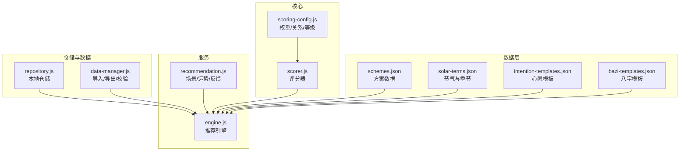
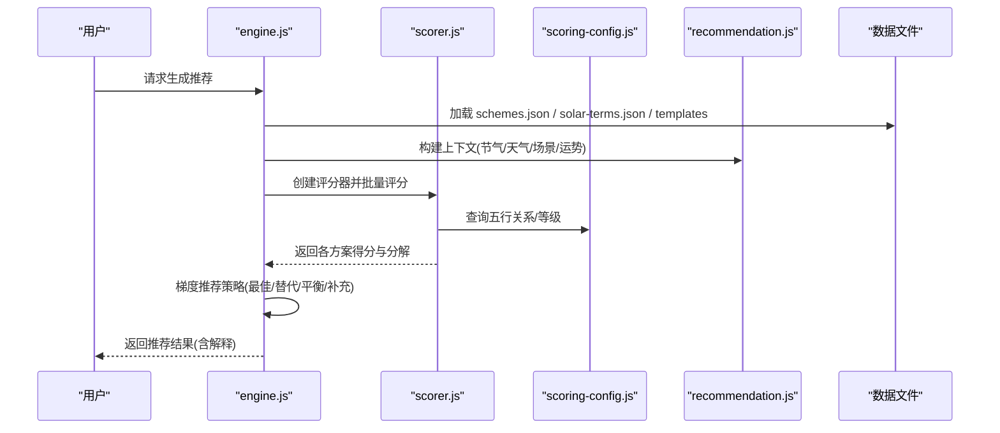
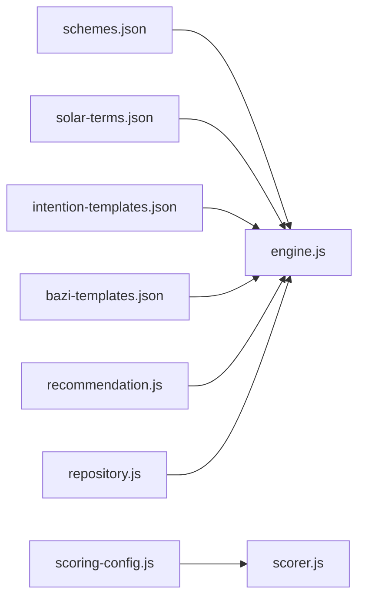

# 穿搭方案数据

<cite>
**本文引用的文件**
- [schemes.json](file://data/schemes.json)
- [solar-terms.json](file://data/solar-terms.json)
- [scorer.js](file://js/core/scorer.js)
- [scoring-config.js](file://js/core/scoring-config.js)
- [engine.js](file://js/services/engine.js)
- [recommendation.js](file://js/services/recommendation.js)
- [repository.js](file://js/data/repository.js)
- [data-manager.js](file://js/data/data-manager.js)
- [intention-templates.json](file://data/intention-templates.json)
- [bazi-templates.json](file://data/bazi-templates.json)
</cite>

## 目录
1. [简介](#简介)
2. [项目结构](#项目结构)
3. [核心组件](#核心组件)
4. [架构总览](#架构总览)
5. [详细组件分析](#详细组件分析)
6. [依赖分析](#依赖分析)
7. [性能考虑](#性能考虑)
8. [故障排查指南](#故障排查指南)
9. [结论](#结论)
10. [附录](#附录)

## 简介
本文件面向“穿搭方案数据系统”，围绕 schemes.json 的完整结构设计进行深入解析，涵盖：
- 每个穿搭方案的数据字段定义与语义
- 与二十四节气的对应关系及色彩/材质选择逻辑
- 数据格式验证规则（必填字段、数据类型、取值范围）
- 添加新方案的完整流程
- 在推荐引擎中的使用方式与评分机制
- 方案评分与优先级排序逻辑

## 项目结构
该系统采用“数据文件 + 核心评分器 + 引擎服务 + 仓储与数据管理”的分层架构：
- 数据层：schemes.json、solar-terms.json、intention-templates.json、bazi-templates.json
- 评分与配置：scoring-config.js、scorer.js
- 推荐引擎：engine.js、recommendation.js
- 仓储与数据管理：repository.js、data-manager.js

图表来源
- [schemes.json](file://data/schemes.json#L1-L509)
- [solar-terms.json](file://data/solar-terms.json#L1-L42)
- [scoring-config.js](file://js/core/scoring-config.js#L1-L128)
- [scorer.js](file://js/core/scorer.js#L1-L317)
- [engine.js](file://js/services/engine.js#L1-L425)
- [recommendation.js](file://js/services/recommendation.js#L1-L466)
- [repository.js](file://js/data/repository.js#L1-L394)
- [data-manager.js](file://js/data/data-manager.js#L1-L376)

章节来源
- [schemes.json](file://data/schemes.json#L1-L509)
- [solar-terms.json](file://data/solar-terms.json#L1-L42)
- [scoring-config.js](file://js/core/scoring-config.js#L1-L128)
- [scorer.js](file://js/core/scorer.js#L1-L317)
- [engine.js](file://js/services/engine.js#L1-L425)
- [recommendation.js](file://js/services/recommendation.js#L1-L466)
- [repository.js](file://js/data/repository.js#L1-L394)
- [data-manager.js](file://js/data/data-manager.js#L1-L376)

## 核心组件
- 穿搭方案数据模型：定义在 schemes.json 中，包含 id、termId、rank、color、material、feeling、annotation、source 等字段。
- 节气与季节映射：solar-terms.json 提供节气的五行属性、月份与日期范围，以及按季节分组的节气集合。
- 评分配置：scoring-config.js 定义五行相生/相克关系、天气与温度对应的五行、评分等级与动态权重。
- 评分器：scorer.js 实现多维度评分（节气、八字、场景、天气、心愿、历史、运势）与总分计算。
- 推荐引擎：engine.js 负责加载数据、构建上下文、调用评分器并执行梯度推荐策略。
- 场景与运势：recommendation.js 提供场景偏好、今日运势因子与反馈记录。
- 仓储与数据管理：repository.js 提供本地存储抽象；data-manager.js 提供导入/导出与校验。

章节来源
- [schemes.json](file://data/schemes.json#L1-L509)
- [solar-terms.json](file://data/solar-terms.json#L1-L42)
- [scoring-config.js](file://js/core/scoring-config.js#L1-L128)
- [scorer.js](file://js/core/scorer.js#L1-L317)
- [engine.js](file://js/services/engine.js#L1-L425)
- [recommendation.js](file://js/services/recommendation.js#L1-L466)
- [repository.js](file://js/data/repository.js#L1-L394)
- [data-manager.js](file://js/data/data-manager.js#L1-L376)

## 架构总览
推荐流程概览如下：

图表来源
- [engine.js](file://js/services/engine.js#L323-L393)
- [scorer.js](file://js/core/scorer.js#L29-L75)
- [scoring-config.js](file://js/core/scoring-config.js#L120-L127)
- [recommendation.js](file://js/services/recommendation.js#L18-L137)

## 详细组件分析

### 穿搭方案数据模型（schemes.json）
- 结构概览
  - 根对象包含数组 schemes，每个元素为一个方案对象。
- 字段说明
  - id：方案唯一标识符，形如“节气缩写_序号”，例如 "lichun_01"。
  - termId：所属节气的标识符，与 solar-terms.json 的 terms[].id 对应。
  - rank：排序权重，数值越小优先级越高（同节气内排序）。
  - color：颜色配置对象，包含：
    - name：颜色名称（如“嫩芽绿”）
    - hex：十六进制色值（如“#8FBE8E”）
    - wuxing：五行属性（wood/fire/earth/metal/water）
  - material：材质类型（如“天丝棉”、“桑蚕丝”等）
  - feeling：触感描述（如“轻盈感”、“温润感”等）
  - annotation：方案注释（文化/医学依据）
  - source：文献来源（如《礼记·月令》）
- 示例路径
  - [方案条目示例](file://data/schemes.json#L3-L9)
  - [更多示例](file://data/schemes.json#L10-L509)

字段来源
- [schemes.json](file://data/schemes.json#L1-L509)

章节来源
- [schemes.json](file://data/schemes.json#L1-L509)

### 节气与二十四节气映射（solar-terms.json）
- 结构概览
  - terms：节气数组，每项包含 id、name、wuxing、month、dayRange。
  - seasons：按季节分组的节气集合，包含 wuxing 与 terms 列表。
  - wuxingNames：五行名称映射。
- 节气与方案的对应关系
  - schemes.json 的 termId 与 solar-terms.json 的 terms[].id 一一对应，用于筛选当前节气下的方案。
- 示例路径
  - [节气定义](file://data/solar-terms.json#L2-L27)
  - [季节分组](file://data/solar-terms.json#L28-L33)
  - [五行名称](file://data/solar-terms.json#L34-L41)

字段来源
- [solar-terms.json](file://data/solar-terms.json#L1-L42)

章节来源
- [solar-terms.json](file://data/solar-terms.json#L1-L42)

### 评分配置与关系（scoring-config.js）
- 五行关系
  - 相生：wood→fire→earth→metal→water→wood
  - 相克：wood→earth、earth→water、water→fire、fire→metal、metal→wood
- 天气与温度映射
  - 天气类型映射到五行：sunny/clear→fire，cloudy→metal，rain/snow/fog/storm→water
  - 温度等级映射到五行：hot/warm→fire，comfortable→earth，cool→metal，cold→water
- 评分等级
  - PERFECT=100、EXCELLENT=80、GOOD=60、FAIR=40、POOR=20、BAD=0
- 动态权重
  - 当无八字时，将 bazi 权重平分给节气与场景；新用户会调整权重分布。

字段来源
- [scoring-config.js](file://js/core/scoring-config.js#L21-L127)

章节来源
- [scoring-config.js](file://js/core/scoring-config.js#L1-L128)

### 评分器（scorer.js）
- 评分维度
  - solarTerm：节气与方案颜色五行匹配程度
  - bazi：八字喜用神/忌神与方案五行关系
  - scene：场景偏好（五行与材质）
  - weather：天气联动与温度调候
  - wish：心愿契合（模板匹配）
  - history：历史偏好加成
  - dailyLuck：今日运势加成
- 计算流程
  - 为每个维度计算得分并乘以权重，累加得到总分，保留整数。
  - 提供 getExplanation 用于输出前三个最高分维度及其占比。
- 排序策略
  - scoreAll 对方案批量评分并按总分降序排列。

字段来源
- [scorer.js](file://js/core/scorer.js#L29-L75)
- [scorer.js](file://js/core/scorer.js#L81-L116)
- [scorer.js](file://js/core/scorer.js#L121-L147)
- [scorer.js](file://js/core/scorer.js#L152-L193)
- [scorer.js](file://js/core/scorer.js#L198-L210)
- [scorer.js](file://js/core/scorer.js#L215-L237)
- [scorer.js](file://js/core/scoring-config.js#L120-L127)

章节来源
- [scorer.js](file://js/core/scorer.js#L1-L317)
- [scoring-config.js](file://js/core/scoring-config.js#L1-L128)

### 推荐引擎（engine.js）
- 数据加载
  - 异步加载 schemes.json、intention-templates.json、bazi-templates.json。
- 上下文构建
  - 包含节气五行、心愿ID、用户八字、天气信息、场景偏好、今日运势等。
- 评分与选择
  - 使用 RecommendationScorer 批量评分，执行梯度推荐策略：
    - 最佳匹配（最高分）
    - 保守替代（同五行不同方案）
    - 平衡方案（不同五行，相克或平衡节气）
    - 补充方案（补齐数量）
- 输出
  - 返回推荐方案列表、解释信息（含类型、得分、分解）。

字段来源
- [engine.js](file://js/services/engine.js#L323-L393)
- [engine.js](file://js/services/engine.js#L218-L299)

章节来源
- [engine.js](file://js/services/engine.js#L1-L425)

### 场景与运势（recommendation.js）
- 场景偏好
  - SCENE_PREFERENCES 定义不同场景的五行偏好与材质偏好。
- 今日运势
  - 基于日期生成随机种子，打乱五行顺序，确定幸运/增益五行。
- 反馈与偏好更新
  - recordFeedback 记录用户对方案的交互行为，更新用户偏好。

字段来源
- [recommendation.js](file://js/services/recommendation.js#L32-L87)
- [recommendation.js](file://js/services/recommendation.js#L93-L137)
- [recommendation.js](file://js/services/recommendation.js#L145-L184)
- [recommendation.js](file://js/services/recommendation.js#L192-L218)

章节来源
- [recommendation.js](file://js/services/recommendation.js#L1-L466)

### 仓储与数据管理（repository.js、data-manager.js）
- 仓储
  - 提供 Favorites、Preferences、Feedback、Bazi、Stats、Outfit 等仓库类，封装本地存储操作。
- 数据管理
  - 导出/导入用户偏好与反馈数据，包含版本校验与预览功能。

字段来源
- [repository.js](file://js/data/repository.js#L86-L201)
- [repository.js](file://js/data/repository.js#L206-L259)
- [repository.js](file://js/data/repository.js#L264-L337)
- [repository.js](file://js/data/repository.js#L342-L385)
- [data-manager.js](file://js/data/data-manager.js#L48-L99)
- [data-manager.js](file://js/data/data-manager.js#L106-L135)
- [data-manager.js](file://js/data/data-manager.js#L143-L184)

章节来源
- [repository.js](file://js/data/repository.js#L1-L394)
- [data-manager.js](file://js/data/data-manager.js#L1-L376)

### 心愿与八字模板（intention-templates.json、bazi-templates.json）
- 心愿模板
  - 按心愿类型与节气匹配，指导方案选择。
- 八字模板
  - 按日主五行与年份匹配，辅助推荐。

字段来源
- [intention-templates.json](file://data/intention-templates.json#L1-L493)
- [bazi-templates.json](file://data/bazi-templates.json#L1-L103)

章节来源
- [intention-templates.json](file://data/intention-templates.json#L1-L493)
- [bazi-templates.json](file://data/bazi-templates.json#L1-L103)

## 依赖分析
- 数据依赖
  - engine.js 依赖 schemes.json、solar-terms.json、intention-templates.json、bazi-templates.json。
- 评分依赖
  - scorer.js 依赖 scoring-config.js 的关系与等级。
- 上下文依赖
  - engine.js 依赖 recommendation.js 的场景偏好、今日运势与反馈。
- 本地存储依赖
  - recommendation.js 与 repository.js 共同维护用户偏好与反馈。

图表来源
- [engine.js](file://js/services/engine.js#L60-L85)
- [scorer.js](file://js/core/scorer.js#L6-L12)
- [recommendation.js](file://js/services/recommendation.js#L32-L87)
- [repository.js](file://js/data/repository.js#L86-L201)

章节来源
- [engine.js](file://js/services/engine.js#L1-L425)
- [scorer.js](file://js/core/scorer.js#L1-L317)
- [recommendation.js](file://js/services/recommendation.js#L1-L466)
- [repository.js](file://js/data/repository.js#L1-L394)

## 性能考虑
- 数据加载
  - 使用异步加载 schemes.json 与模板，避免阻塞主线程。
- 评分缓存
  - scorer.js 内置 Map 缓存，避免重复计算相同方案得分。
- 排序与策略
  - 批量评分后一次性排序，减少多次遍历成本。
- 本地存储
  - repository.js 与 data-manager.js 提供安全的 localStorage 操作，避免异常导致应用崩溃。

[本节为通用性能讨论，无需特定文件引用]

## 故障排查指南
- 数据为空或加载失败
  - 检查 schemes.json、solar-terms.json 是否存在且可访问。
  - 确认 engine.js 的加载函数返回有效数据。
- 评分异常
  - 检查 color.wuxing 是否属于五种取值之一。
  - 确认 weather/current/tempLevel 正确映射到 TEMPERATURE_ELEMENT。
- 今日运势不稳定
  - 确认 getDailyLuckSeed 与 seededRandom 的实现一致，避免种子不一致。
- 导入/导出问题
  - 使用 data-manager.js 的 validateImportData 检查版本与结构完整性。

章节来源
- [engine.js](file://js/services/engine.js#L323-L336)
- [scoring-config.js](file://js/core/scoring-config.js#L50-L57)
- [recommendation.js](file://js/services/recommendation.js#L93-L137)
- [data-manager.js](file://js/data/data-manager.js#L106-L135)

## 结论
本系统通过结构化的方案数据与严谨的评分配置，实现了“节气—五行—颜色—材质—场景—运势”的多维智能推荐。schemes.json 的字段设计与 solar-terms.json 的节气映射共同构成了推荐的基础；scorer.js 与 engine.js 将这些规则转化为可执行的评分与选择策略；repository.js 与 data-manager.js 则保障了用户偏好与数据的持久化与迁移能力。整体架构清晰、扩展性强，适合持续迭代与优化。

[本节为总结性内容，无需特定文件引用]

## 附录

### 数据格式验证规则
- 必填字段
  - id：字符串，唯一标识
  - termId：字符串，与 solar-terms.json 的 terms[].id 对应
  - rank：数字，数值越小优先级越高
  - color：对象，包含 name、hex、wuxing
  - material：字符串
  - feeling：字符串
  - annotation：字符串
  - source：字符串
- 数据类型
  - id、termId、material、feeling、annotation、source：字符串
  - rank：数字
  - color.hex：十六进制颜色字符串
  - color.wuxing：枚举值（wood/fire/earth/metal/water）
- 取值范围
  - rank：通常为 1~N 的正整数
  - color.wuxing：限定于五种取值
  - color.hex：标准十六进制颜色码
- 节气一致性
  - schemes.json 的 termId 必须与 solar-terms.json 的 terms[].id 一致
- 导入/导出校验
  - data-manager.js 提供版本与结构校验，确保导入数据兼容

章节来源
- [schemes.json](file://data/schemes.json#L1-L509)
- [solar-terms.json](file://data/solar-terms.json#L1-L42)
- [data-manager.js](file://js/data/data-manager.js#L106-L135)

### 添加新方案的完整流程
- 设计阶段
  - 确定节气（termId）与排序权重（rank）
  - 选择颜色（name、hex、wuxing），确保与节气五行协调
  - 选择材质（material），考虑季节与天气适用性
  - 描述触感（feeling）与注释（annotation），注明来源（source）
- 数据录入
  - 在 schemes.json 的 schemes 数组中新增对象，遵循字段规范
- 验证与测试
  - 确认 termId 与 solar-terms.json 对应
  - 使用推荐引擎运行一次生成，观察评分与解释
- 归档与发布
  - 如需备份，使用 data-manager.js 导出数据
  - 如需导入，使用 validateImportData 校验后再导入

章节来源
- [schemes.json](file://data/schemes.json#L1-L509)
- [solar-terms.json](file://data/solar-terms.json#L1-L42)
- [engine.js](file://js/services/engine.js#L323-L393)
- [data-manager.js](file://js/data/data-manager.js#L48-L99)

### 在推荐引擎中的使用示例（代码片段路径）
- 加载方案数据
  - [加载方案](file://js/services/engine.js#L60-L65)
- 构建上下文
  - [构建上下文](file://js/services/engine.js#L187-L212)
- 评分与选择
  - [评分器构造与批量评分](file://js/services/engine.js#L218-L223)
  - [梯度推荐策略](file://js/services/engine.js#L218-L299)
- 今日运势与场景偏好
  - [今日运势因子](file://js/services/recommendation.js#L124-L137)
  - [场景偏好](file://js/services/recommendation.js#L61-L87)

章节来源
- [engine.js](file://js/services/engine.js#L60-L212)
- [recommendation.js](file://js/services/recommendation.js#L61-L137)

### 方案评分机制与优先级排序逻辑
- 评分维度与权重
  - 基础权重来自 scoring-config.js，动态权重可根据用户画像调整
- 评分计算
  - 每个维度按关系得分（相生/相克/平衡）与等级映射，乘以权重累加
- 排序策略
  - 先按总分降序，再按 rank 升序（同分时优先 rank 更小的）
- 推荐策略
  - 最佳匹配（最高分）
  - 保守替代（同五行不同方案）
  - 平衡方案（不同五行，相克或平衡节气）
  - 补充方案（补齐数量）

章节来源
- [scoring-config.js](file://js/core/scoring-config.js#L7-L19)
- [scorer.js](file://js/core/scorer.js#L29-L75)
- [scorer.js](file://js/core/scorer.js#L266-L276)
- [engine.js](file://js/services/engine.js#L218-L299)