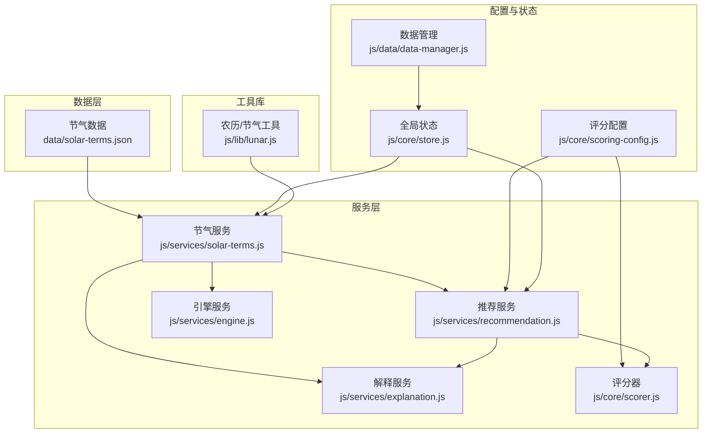
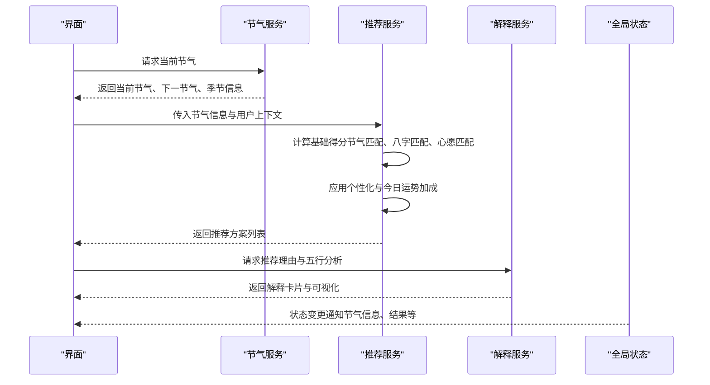
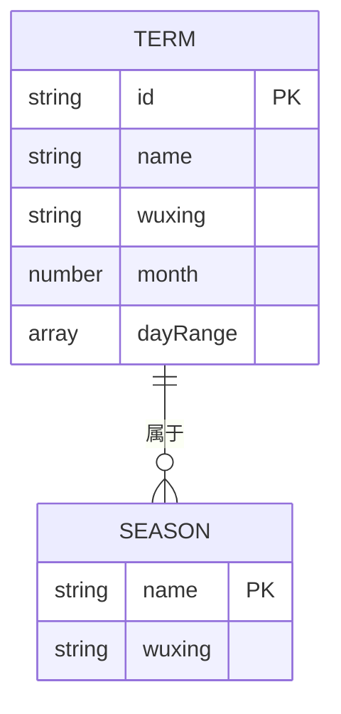
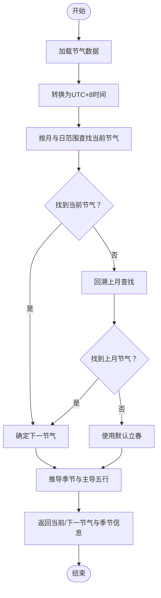
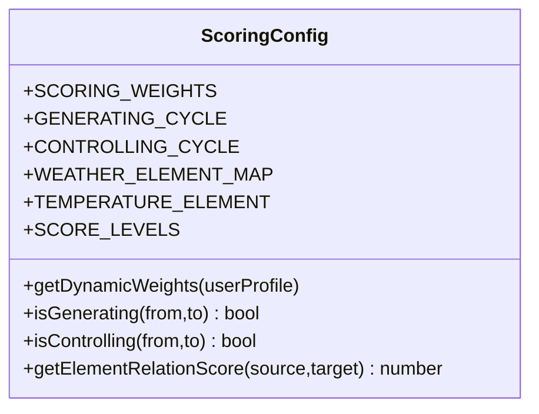
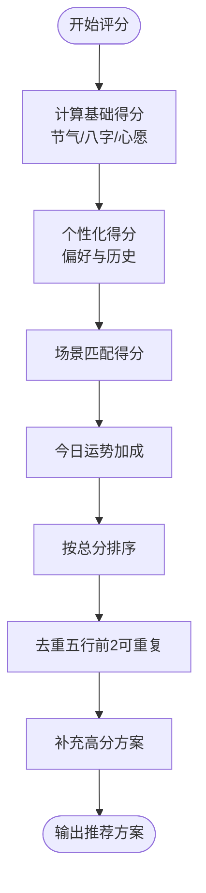
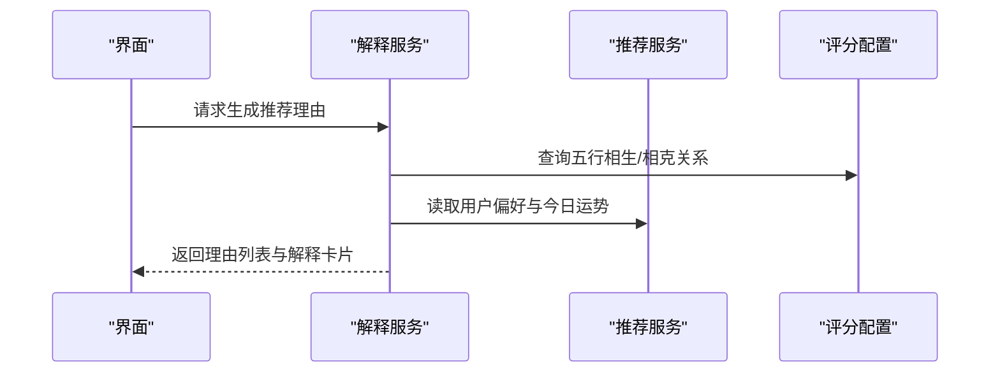
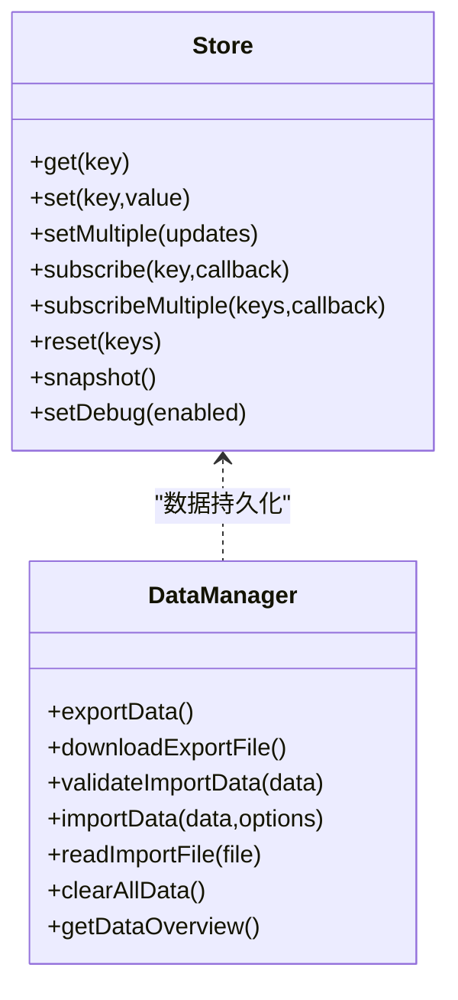
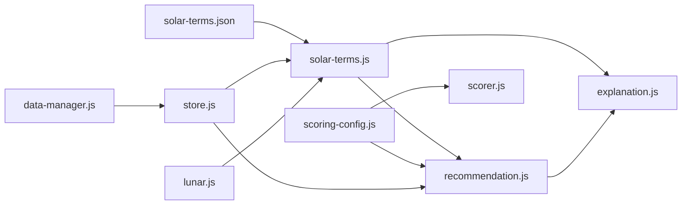

# 节气数据配置

<cite>
**本文档引用的文件**
- [solar-terms.json](file://data/solar-terms.json)
- [solar-terms.js](file://js/services/solar-terms.js)
- [scoring-config.js](file://js/core/scoring-config.js)
- [recommendation.js](file://js/services/recommendation.js)
- [explanation.js](file://js/services/explanation.js)
- [store.js](file://js/core/store.js)
- [data-manager.js](file://js/data/data-manager.js)
- [engine.js](file://js/services/engine.js)
- [scorer.js](file://js/core/scorer.js)
- [lunar.js](file://js/lib/lunar.js)
</cite>

## 目录
1. [简介](#简介)
2. [项目结构](#项目结构)
3. [核心组件](#核心组件)
4. [架构总览](#架构总览)
5. [详细组件分析](#详细组件分析)
6. [依赖关系分析](#依赖关系分析)
7. [性能考量](#性能考量)
8. [故障排除指南](#故障排除指南)
9. [结论](#结论)
10. [附录](#附录)

## 简介
本文件面向“节气数据配置系统”，围绕 `solar-terms.json` 的结构设计与实现原理展开，系统性解析二十四节气的数据模型（名称、时间边界、五行属性、季节划分），阐述其与推荐系统的集成方式（权重、评分、解释），并提供扩展与维护指南。文档同时覆盖数据格式规范、验证规则以及在业务逻辑中的使用示例路径，帮助开发者在不直接阅读源码的情况下快速理解与应用。

## 项目结构
该系统采用前端模块化组织，节气数据位于 `data/solar-terms.json`，节气识别与查询由 `js/services/solar-terms.js` 提供，评分与推荐体系由 `js/core/scoring-config.js`、`js/services/recommendation.js`、`js/services/explanation.js` 等模块协同完成，全局状态通过 `js/core/store.js` 管理，数据导入导出由 `js/data/data-manager.js` 实现。

图表来源
- [solar-terms.json](file://data/solar-terms.json#L1-L42)
- [solar-terms.js](file://js/services/solar-terms.js#L1-L115)
- [scoring-config.js](file://js/core/scoring-config.js#L1-L128)
- [recommendation.js](file://js/services/recommendation.js#L1-L466)
- [explanation.js](file://js/services/explanation.js#L1-L298)
- [engine.js](file://js/services/engine.js#L255-L313)
- [scorer.js](file://js/core/scorer.js#L58-L316)
- [store.js](file://js/core/store.js#L1-L212)
- [data-manager.js](file://js/data/data-manager.js#L1-L376)
- [lunar.js](file://js/lib/lunar.js#L1-L800)

章节来源
- [solar-terms.json](file://data/solar-terms.json#L1-L42)
- [solar-terms.js](file://js/services/solar-terms.js#L1-L115)
- [scoring-config.js](file://js/core/scoring-config.js#L1-L128)
- [recommendation.js](file://js/services/recommendation.js#L1-L466)
- [explanation.js](file://js/services/explanation.js#L1-L298)
- [engine.js](file://js/services/engine.js#L255-L313)
- [scorer.js](file://js/core/scorer.js#L58-L316)
- [store.js](file://js/core/store.js#L1-L212)
- [data-manager.js](file://js/data/data-manager.js#L1-L376)
- [lunar.js](file://js/lib/lunar.js#L1-L800)

## 核心组件
- 节气数据模型：包含节气条目、季节分组、五行名称映射。
- 节气识别服务：加载数据、定位当前节气、推导下一个节气、附加季节信息与五行名称。
- 评分配置：定义权重、五行相生相克关系、天气与温度的五行映射。
- 推荐服务：结合节气、八字、场景、天气、心愿、历史偏好与今日运势进行综合评分与选择。
- 解释服务：生成推荐理由、五行分析与可视化解释卡片。
- 全局状态：集中管理节气信息、用户输入、推荐结果与UI状态。
- 数据管理：支持用户数据的导出/导入/校验/清理。

章节来源
- [solar-terms.json](file://data/solar-terms.json#L1-L42)
- [solar-terms.js](file://js/services/solar-terms.js#L1-L115)
- [scoring-config.js](file://js/core/scoring-config.js#L1-L128)
- [recommendation.js](file://js/services/recommendation.js#L1-L466)
- [explanation.js](file://js/services/explanation.js#L1-L298)
- [store.js](file://js/core/store.js#L1-L212)
- [data-manager.js](file://js/data/data-manager.js#L1-L376)

## 架构总览
节气数据作为推荐系统的基础输入之一，贯穿“识别—评分—解释—呈现”的完整链路。识别阶段由节气服务负责，评分阶段由评分配置与推荐服务共同完成，解释阶段输出用户可理解的理由与可视化分析，最终由全局状态驱动UI渲染。

图表来源
- [solar-terms.js](file://js/services/solar-terms.js#L33-L100)
- [recommendation.js](file://js/services/recommendation.js#L323-L379)
- [explanation.js](file://js/services/explanation.js#L25-L111)
- [store.js](file://js/core/store.js#L54-L141)

## 详细组件分析

### 节气数据模型（solar-terms.json）
- 结构组成
  - terms：按顺序排列的24个节气条目，每条包含：
    - id：节气标识（如 "lichun"）
    - name：中文名称（如 "立春"）
    - wuxing：所属五行（wood/fire/earth/metal/water）
    - month：节气所在公历月份
    - dayRange：节气起止日期范围（闭区间）
  - seasons：按四季分组，每季包含：
    - wuxing：该季的主导五行
    - terms：该季包含的节气id列表
  - wuxingNames：五行英文到中文的映射
- 设计要点
  - 顺序严格遵循二十四节气的自然流转，便于循环查找与相邻节气推导。
  - 通过 month 与 dayRange 精确限定节气边界，避免跨年误差。
  - 季节分组便于按季进行策略调整与展示。

图表来源
- [solar-terms.json](file://data/solar-terms.json#L2-L26)
- [solar-terms.json](file://data/solar-terms.json#L28-L33)

章节来源
- [solar-terms.json](file://data/solar-terms.json#L1-L42)

### 节气识别服务（solar-terms.js）
- 主要职责
  - 加载节气数据（首次访问缓存）。
  - 将 UTC+0 时间转换为 UTC+8（北京时间）。
  - 基于当前日期在 terms 中定位当前节气与下一节气。
  - 若未找到，则回溯上月或默认使用第一个节气。
  - 从 seasons 中推导当前节气所属季节及其主导五行。
  - 提供五行颜色映射辅助UI渲染。
- 关键流程

图表来源
- [solar-terms.js](file://js/services/solar-terms.js#L20-L100)

章节来源
- [solar-terms.js](file://js/services/solar-terms.js#L1-L115)

### 评分配置与五行关系（scoring-config.js）
- 权重体系
  - 基础权重：solarTerm（节气匹配）、bazi（八字喜用）、scene（场景匹配）、weather（天气联动）、wish（心愿匹配）。
  - 奖励权重：history（历史偏好）、dailyLuck（今日运势）。
- 五行关系
  - 相生：wood→fire→earth→metal→water→wood
  - 相克：wood→earth、earth→water、water→fire、fire→metal、metal→wood
  - 天气→五行：晴/多云→火，阴/雨/雪/雾→水，风→金，日照→火
  - 温度→五行：热/暖→火，舒适→土，凉→金，冷→水
- 关系得分
  - 相同：完美；相生（目标生源）：优秀；相生（源生目标）：良好；相克（源克目标）：一般；相克（目标克源）：较差；其他：很差。

图表来源
- [scoring-config.js](file://js/core/scoring-config.js#L6-L128)

章节来源
- [scoring-config.js](file://js/core/scoring-config.js#L1-L128)

### 推荐系统中的节气应用（recommendation.js）
- 评分维度
  - 基础得分：节气匹配（最高50分）、八字匹配（最高30分）、心愿匹配（最高20分）。
  - 个性化得分：基于用户偏好与历史反馈。
  - 场景匹配：按场景偏好（五行与材质）进行加分。
  - 今日运势：基于随机种子生成幸运/增益五行，提供额外加成。
- 选择策略
  - 对候选方案计算综合得分，按得分排序。
  - 前两个方案允许重复五行，后续方案需保证五行多样性。
  - 不足数量时补充高分方案，确保输出稳定性。

图表来源
- [recommendation.js](file://js/services/recommendation.js#L323-L379)
- [recommendation.js](file://js/services/recommendation.js#L387-L417)

章节来源
- [recommendation.js](file://js/services/recommendation.js#L1-L466)

### 解释服务与可视化（explanation.js）
- 推荐理由
  - 节气相应/相生：依据节气与方案五行关系生成理由。
  - 八字补益/相生：依据八字喜用与方案五行关系生成理由。
  - 场景适配：依据场景偏好生成材质与感受描述。
  - 今日运势：依据幸运/增益五行生成加成说明。
  - 个性化：依据用户偏好生成“符合您习惯”的理由。
- 可视化
  - 生成解释卡片HTML，包含理由列表与简化五行雷达图（标注当前节气、八字、运势所处的五行）。

图表来源
- [explanation.js](file://js/services/explanation.js#L25-L111)
- [explanation.js](file://js/services/explanation.js#L218-L298)

章节来源
- [explanation.js](file://js/services/explanation.js#L1-L298)

### 全局状态与数据管理（store.js、data-manager.js）
- 全局状态
  - 集中管理当前节气信息、用户输入、推荐结果、收藏列表、UI状态等。
  - 通过响应式代理与订阅机制实现状态变更通知。
- 数据管理
  - 导出/导入用户数据，支持预览、合并、清理。
  - 数据版本控制与结构校验，保障兼容性与完整性。

图表来源
- [store.js](file://js/core/store.js#L30-L187)
- [data-manager.js](file://js/data/data-manager.js#L48-L184)

章节来源
- [store.js](file://js/core/store.js#L1-L212)
- [data-manager.js](file://js/data/data-manager.js#L1-L376)

### 引擎与评分器（engine.js、scorer.js）
- 引擎服务
  - 在推荐主流程之外，提供“平衡方案”策略：选择与节气五行相克或不同以平衡能量的方案。
- 评分器
  - 将节气评分、八字评分、场景评分、天气评分、心愿评分、历史偏好评分、今日运势评分按权重聚合。
  - 提供解释维度占比，帮助用户理解得分构成。

章节来源
- [engine.js](file://js/services/engine.js#L255-L313)
- [scorer.js](file://js/core/scorer.js#L58-L316)

## 依赖关系分析
- 数据依赖
  - 节气识别服务依赖节气数据文件，提供当前/下一节气与季节信息。
  - 评分配置提供权重与五行关系，被推荐服务与评分器广泛使用。
- 服务依赖
  - 推荐服务依赖节气信息、用户偏好、场景定义、天气与温度映射。
  - 解释服务依赖推荐服务输出与评分配置，生成理由与可视化。
- 状态依赖
  - 全局状态驱动UI渲染与交互，接收节气识别与推荐结果更新。
- 工具依赖
  - 农历/节气工具库提供节气计算与验证，辅助节气边界与日期处理。

图表来源
- [solar-terms.json](file://data/solar-terms.json#L1-L42)
- [solar-terms.js](file://js/services/solar-terms.js#L1-L115)
- [scoring-config.js](file://js/core/scoring-config.js#L1-L128)
- [recommendation.js](file://js/services/recommendation.js#L1-L466)
- [explanation.js](file://js/services/explanation.js#L1-L298)
- [store.js](file://js/core/store.js#L1-L212)
- [data-manager.js](file://js/data/data-manager.js#L1-L376)
- [lunar.js](file://js/lib/lunar.js#L1-L800)

章节来源
- [solar-terms.json](file://data/solar-terms.json#L1-L42)
- [solar-terms.js](file://js/services/solar-terms.js#L1-L115)
- [scoring-config.js](file://js/core/scoring-config.js#L1-L128)
- [recommendation.js](file://js/services/recommendation.js#L1-L466)
- [explanation.js](file://js/services/explanation.js#L1-L298)
- [store.js](file://js/core/store.js#L1-L212)
- [data-manager.js](file://js/data/data-manager.js#L1-L376)
- [lunar.js](file://js/lib/lunar.js#L1-L800)

## 性能考量
- 数据加载
  - 节气数据仅在首次请求时加载并缓存，避免重复IO。
- 计算复杂度
  - 节气识别为线性扫描，terms 数组长度固定为24，时间复杂度 O(1)。
  - 推荐评分与排序受候选方案数量影响，建议限制候选规模或采用分页/懒加载。
- 内存占用
  - 评分配置与解释服务均为纯函数与静态映射，内存开销极低。
- I/O 优化
  - 数据导入导出使用Blob与URL对象，避免大对象序列化造成的阻塞。

[本节为通用性能讨论，无需特定文件引用]

## 故障排除指南
- 节气识别异常
  - 现象：无法识别当前节气或返回默认节气。
  - 排查：确认当前日期是否为UTC+8时间；检查节气数据 month 与 dayRange 是否正确；确认数据文件可正常加载。
  - 参考路径：[节气识别流程](file://js/services/solar-terms.js#L33-L100)
- 评分异常
  - 现象：推荐结果不符合预期或分数异常。
  - 排查：核对权重配置与五行关系；检查用户偏好与历史反馈数据；确认场景偏好与材质映射。
  - 参考路径：[评分维度与加成](file://js/services/recommendation.js#L387-L417)，[评分器聚合](file://js/core/scorer.js#L58-L75)
- 解释内容不符
  - 现象：推荐理由与实际不符。
  - 排查：检查解释服务中的五行相生/相克判断与映射表；核对今日运势生成逻辑。
  - 参考路径：[解释生成](file://js/services/explanation.js#L25-L111)
- 数据导入失败
  - 现象：导入报错或数据丢失。
  - 排查：确认导入文件为合法JSON；检查版本兼容性；查看验证结果与错误提示。
  - 参考路径：[导入校验与处理](file://js/data/data-manager.js#L106-L184)

章节来源
- [solar-terms.js](file://js/services/solar-terms.js#L33-L100)
- [recommendation.js](file://js/services/recommendation.js#L387-L417)
- [scorer.js](file://js/core/scorer.js#L58-L75)
- [explanation.js](file://js/services/explanation.js#L25-L111)
- [data-manager.js](file://js/data/data-manager.js#L106-L184)

## 结论
本节气数据配置系统以简洁稳定的JSON结构为基础，配合识别、评分、解释与状态管理模块，实现了从节气识别到推荐解释的完整闭环。通过明确的边界与权重设计，系统既能满足传统节气文化表达，又能灵活适配现代个性化推荐需求。建议在扩展时严格遵循数据格式与验证规则，确保一致性与可维护性。

[本节为总结性内容，无需特定文件引用]

## 附录

### 数据格式示例与验证规则
- 文件位置：data/solar-terms.json
- 结构要求
  - terms：数组，包含24个节气对象，每个对象包含 id、name、wuxing、month、dayRange。
  - seasons：对象，包含 spring、summer、autumn、winter四个键，每个值包含 wuxing 与 terms 数组。
  - wuxingNames：对象，包含 wood、fire、earth、metal、water 到中文名称的映射。
- 验证规则
  - month 为1-12的整数；dayRange 为长度为2的数组，元素为1-31的整数，且首元素不大于尾元素。
  - terms 顺序与 seasons 中 terms 一一对应，且按节气自然流转排列。
  - wuxing 仅允许 wood、fire、earth、metal、water。
- 示例路径
  - [节气条目示例](file://data/solar-terms.json#L2-L26)
  - [季节分组示例](file://data/solar-terms.json#L28-L33)
  - [五行名称映射示例](file://data/solar-terms.json#L34-L40)

章节来源
- [solar-terms.json](file://data/solar-terms.json#L1-L42)

### 扩展方法与最佳实践
- 添加新节气
  - 在 terms 末尾追加新节气对象，确保 month 与 dayRange 合法。
  - 如需新增季节，更新 seasons 对象并在对应季 terms 中加入新id。
  - 参考路径：[节气条目结构](file://data/solar-terms.json#L2-L26)，[季节分组结构](file://data/solar-terms.json#L28-L33)
- 修改现有节气参数
  - 调整 dayRange 以修正节气边界；修改 wuxing 以反映文化或学术差异（需同步更新 seasons 与相关评分逻辑）。
  - 参考路径：[节气识别逻辑](file://js/services/solar-terms.js#L44-L74)
- 调整节气边界
  - 优先通过节气数据文件修正；若涉及农历节气计算，可参考农历工具库。
  - 参考路径：[农历节气工具](file://js/lib/lunar.js#L630-L800)

章节来源
- [solar-terms.json](file://data/solar-terms.json#L1-L42)
- [solar-terms.js](file://js/services/solar-terms.js#L44-L74)
- [lunar.js](file://js/lib/lunar.js#L630-L800)

### 在业务逻辑中的使用示例（路径指引）
- 获取当前节气信息
  - 调用节气服务的检测函数，传入可选日期，默认使用当前时间。
  - 参考路径：[检测当前节气](file://js/services/solar-terms.js#L33-L100)
- 在推荐中应用节气
  - 将节气五行作为基础评分维度，结合八字、场景、心愿与今日运势进行综合评分。
  - 参考路径：[基础评分](file://js/services/recommendation.js#L387-L417)，[评分器聚合](file://js/core/scorer.js#L58-L75)
- 生成推荐解释
  - 使用解释服务生成理由与可视化卡片，提升用户体验。
  - 参考路径：[解释生成](file://js/services/explanation.js#L25-L111)，[解释卡片渲染](file://js/services/explanation.js#L218-L298)
- 管理用户数据
  - 通过数据管理模块进行导出/导入/清理，确保数据安全与可迁移。
  - 参考路径：[数据导出/导入](file://js/data/data-manager.js#L48-L184)

章节来源
- [solar-terms.js](file://js/services/solar-terms.js#L33-L100)
- [recommendation.js](file://js/services/recommendation.js#L387-L417)
- [scorer.js](file://js/core/scorer.js#L58-L75)
- [explanation.js](file://js/services/explanation.js#L25-L111)
- [explanation.js](file://js/services/explanation.js#L218-L298)
- [data-manager.js](file://js/data/data-manager.js#L48-L184)