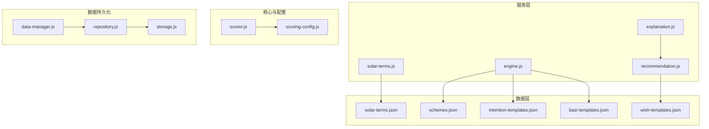
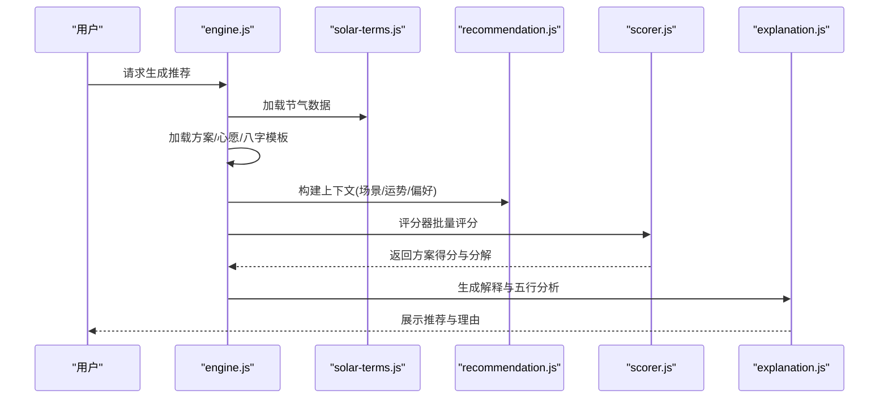
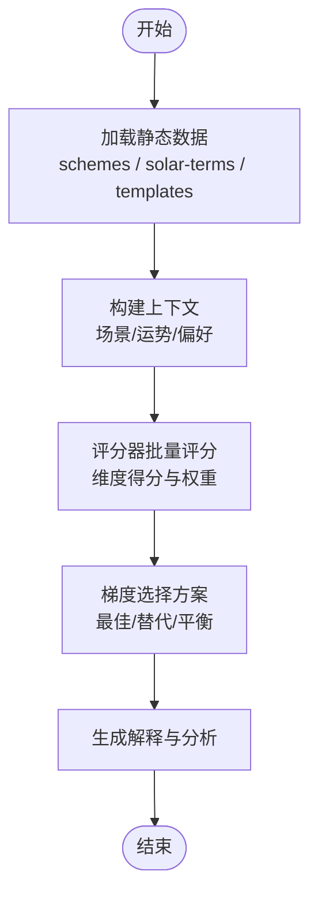
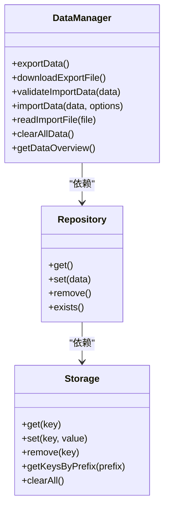
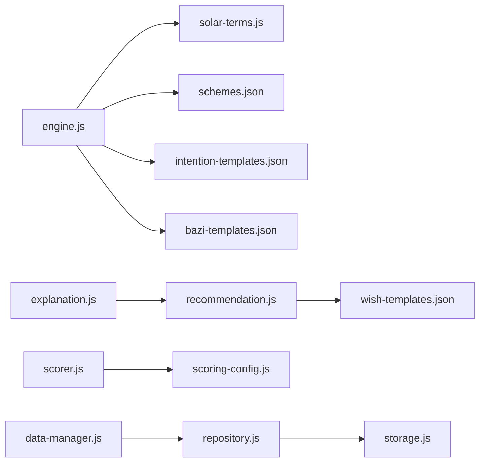

# 配置与数据

<cite>
**本文引用的文件**
- [schemes.json](file://data/schemes.json)
- [solar-terms.json](file://data/solar-terms.json)
- [intention-templates.json](file://data/intention-templates.json)
- [bazi-templates.json](file://data/bazi-templates.json)
- [wish-templates.json](file://data/wish-templates.json)
- [solar-terms.js](file://js/services/solar-terms.js)
- [engine.js](file://js/services/engine.js)
- [recommendation.js](file://js/services/recommendation.js)
- [explanation.js](file://js/services/explanation.js)
- [scorer.js](file://js/core/scorer.js)
- [scoring-config.js](file://js/core/scoring-config.js)
- [data-manager.js](file://js/data/data-manager.js)
- [repository.js](file://js/data/repository.js)
- [storage.js](file://js/data/storage.js)
</cite>

## 目录
1. [简介](#简介)
2. [项目结构](#项目结构)
3. [核心组件](#核心组件)
4. [架构总览](#架构总览)
5. [详细组件分析](#详细组件分析)
6. [依赖分析](#依赖分析)
7. [性能考量](#性能考量)
8. [故障排查指南](#故障排查指南)
9. [结论](#结论)
10. [附录](#附录)

## 简介
本文件面向“五行穿搭建议”项目，系统性梳理配置与数据系统，重点覆盖以下静态数据与模板：
- Schemes.json：二十四节气下的穿搭方案集合，包含方案ID、节气关联、五行归属、材质、触感、注解与来源。
- SolarTerms.json：二十四节气定义、季节分组及五行名称映射。
- IntentionTemplates.json：心愿模板，按心愿类型与节气匹配，提供颜色、材质、触感与注解。
- BaziTemplates.json：八字模板，按日主强弱与年份匹配，给出对应颜色、材质与注解。
- WishTemplates.json：愿望模板，定义愿望类别、颜色与材质偏好、建议语句及季节调节表。

同时，文档解释数据加载、评分与推荐流程、数据版本管理与迁移策略，以及如何安全地扩展与维护这些配置。

## 项目结构
数据与配置主要位于 data/ 目录，运行时通过 js/services 与 js/core 中的服务与评分器加载与消费；用户偏好与历史反馈等动态数据通过 js/data 下的仓库与存储模块持久化。

图表来源
- [solar-terms.js](file://js/services/solar-terms.js#L20-L26)
- [engine.js](file://js/services/engine.js#L60-L85)
- [recommendation.js](file://js/services/recommendation.js#L31-L87)
- [scorer.js](file://js/core/scorer.js#L14-L22)
- [scoring-config.js](file://js/core/scoring-config.js#L6-L19)
- [data-manager.js](file://js/data/data-manager.js#L48-L72)
- [repository.js](file://js/data/repository.js#L8-L41)
- [storage.js](file://js/data/storage.js#L7-L27)

章节来源
- [schemes.json](file://data/schemes.json#L1-L509)
- [solar-terms.json](file://data/solar-terms.json#L1-L42)
- [intention-templates.json](file://data/intention-templates.json#L1-L493)
- [bazi-templates.json](file://data/bazi-templates.json#L1-L103)
- [wish-templates.json](file://data/wish-templates.json#L1-L47)

## 核心组件
- 静态数据与模板
  - Schemes.json：按节气分组的穿搭方案，每条包含颜色、材质、触感、注解与来源。
  - SolarTerms.json：节气定义、季节分组与五行名称映射。
  - IntentionTemplates.json：心愿模板，按心愿类型与节气匹配。
  - BaziTemplates.json：八字模板，按日主强弱与年份匹配。
  - WishTemplates.json：愿望模板，定义颜色/材质偏好与建议语句。
- 数据加载与服务
  - solar-terms.js：加载节气数据。
  - engine.js：加载方案、心愿模板、八字模板，构建上下文并选择方案。
  - recommendation.js：场景偏好、今日运势、个性化权重与反馈闭环。
  - explanation.js：生成推荐解释与五行分析。
  - scorer.js + scoring-config.js：评分器与权重配置，封装评分逻辑。
- 数据持久化与版本管理
  - data-manager.js：导出/导入/校验用户数据，版本控制。
  - repository.js：仓库抽象，统一读写用户偏好、收藏、反馈等。
  - storage.js：带前缀的本地存储封装。

章节来源
- [solar-terms.js](file://js/services/solar-terms.js#L20-L26)
- [engine.js](file://js/services/engine.js#L60-L85)
- [recommendation.js](file://js/services/recommendation.js#L31-L87)
- [explanation.js](file://js/services/explanation.js#L25-L111)
- [scorer.js](file://js/core/scorer.js#L14-L75)
- [scoring-config.js](file://js/core/scoring-config.js#L6-L19)
- [data-manager.js](file://js/data/data-manager.js#L8-L22)
- [repository.js](file://js/data/repository.js#L8-L41)
- [storage.js](file://js/data/storage.js#L7-L27)

## 架构总览
推荐流程概览：系统从 data/ 加载静态数据，结合用户输入（心愿、八字、场景）与实时天气，通过评分器计算方案总分，输出三套梯度推荐与解释。

图表来源
- [engine.js](file://js/services/engine.js#L323-L393)
- [solar-terms.js](file://js/services/solar-terms.js#L20-L26)
- [recommendation.js](file://js/services/recommendation.js#L187-L218)
- [scorer.js](file://js/core/scorer.js#L266-L276)
- [explanation.js](file://js/services/explanation.js#L218-L241)

## 详细组件分析

### Schemes.json：穿搭方案数据结构
- 结构要点
  - schemes 数组：每条方案包含
    - id：唯一标识，格式为“节气缩写_序号”，便于快速定位与排序。
    - termId：所属节气ID，与 SolarTerms.json 对应。
    - rank：在该节气内的优先级排序。
    - color：包含名称、十六进制色值与 wuxing（五行）。
    - material：材质名称。
    - feeling：触感描述。
    - annotation：注解与来源，体现文化依据。
    - source：出处文献。
- 设计意图
  - 以节气为单位组织方案，保证“时令相应”的原则。
  - 通过 rank 与 color.wuxing 实现与节气五行的直接映射，便于评分器与用户偏好融合。
  - annotation/source 提供文化背书，提升可信度与可传播性。

章节来源
- [schemes.json](file://data/schemes.json#L1-L509)

### SolarTerms.json：节气数据实现
- 结构要点
  - terms：节气数组，包含 id、name、wuxing、month、dayRange。
  - seasons：按季节分组，包含 wuxing 与 terms 列表。
  - wuxingNames：五行名称映射（中文字）。
- 实现细节
  - TERM_NAME_MAP 与 TERM_ORDER 在 engine.js 中用于节气顺序与距离计算。
  - loadTermsData 在 solar-terms.js 中异步加载并缓存。

章节来源
- [solar-terms.json](file://data/solar-terms.json#L1-L42)
- [solar-terms.js](file://js/services/solar-terms.js#L20-L26)
- [engine.js](file://js/services/engine.js#L39-L55)

### IntentionTemplates.json：心愿模板设计
- 结构要点
  - 数组元素包含：
    - id：模板唯一标识。
    - intention：心愿类型（如求职、贵人运、远行顺利等）。
    - solarTerm：匹配的节气。
    - color/material/feeling/annotation/source：与方案一致的模板化字段。
- 匹配策略
  - engine.js 中按 intention 名称与当前节气计算距离，选择最近的模板作为参考。

章节来源
- [intention-templates.json](file://data/intention-templates.json#L1-L493)
- [engine.js](file://js/services/engine.js#L108-L125)

### BaziTemplates.json：八字模板配置
- 结构要点
  - 数组元素包含：
    - id：模板唯一标识。
    - baZiKey：包含日主强弱与年份的关键字。
    - solarTerm：匹配节气。
    - color/material/feeling/annotation/source：模板字段。
- 匹配策略
  - engine.js 中按用户八字结果的最强元素与年份进行匹配，优先当年模板，否则回退到任意年份。

章节来源
- [bazi-templates.json](file://data/bazi-templates.json#L1-L103)
- [engine.js](file://js/services/engine.js#L127-L158)

### WishTemplates.json：愿望模板实现
- 结构要点
  - wishes：愿望类别数组，包含 id、name、colorBias、materialBias、advice。
  - seasonModifiers：季节调节表，定义每种五行的“增益/避免”组合。
- 用途
  - recommendation.js 中的 SCENE_PREFERENCES 与 wish 的偏好共同影响场景匹配得分。

章节来源
- [wish-templates.json](file://data/wish-templates.json#L1-L47)
- [recommendation.js](file://js/services/recommendation.js#L61-L87)

### 评分与推荐流程
- 评分器（scorer.js）
  - 分维度评分：节气、八字、场景、天气、心愿、历史偏好、今日运势。
  - 动态权重：根据用户是否有八字、是否新用户调整权重。
  - 缓存：对单个方案评分结果进行缓存，提升批量评分效率。
- 上下文构建（engine.js）
  - 加载数据、构建 termWuxing、scenePreferences、dailyLuck 等上下文。
  - 选择方案：梯度策略（最佳匹配 + 保守替代 + 平衡方案）。
- 解释生成（explanation.js）
  - 输出推荐理由、五行分析与分数解释，帮助用户理解。

图表来源
- [engine.js](file://js/services/engine.js#L323-L393)
- [scorer.js](file://js/core/scorer.js#L266-L276)
- [explanation.js](file://js/services/explanation.js#L218-L241)

章节来源
- [scorer.js](file://js/core/scorer.js#L14-L75)
- [scoring-config.js](file://js/core/scoring-config.js#L6-L19)
- [engine.js](file://js/services/engine.js#L187-L212)
- [explanation.js](file://js/services/explanation.js#L25-L111)

### 数据持久化与版本管理
- data-manager.js
  - 导出/导入/校验用户数据，版本号固定为 1.0。
  - 支持预览导入、合并导入与清理。
- repository.js
  - 仓库抽象，统一管理收藏、偏好、反馈、八字、统计、上传照片等。
- storage.js
  - 带前缀的本地存储封装，提供便捷的业务方法。

图表来源
- [data-manager.js](file://js/data/data-manager.js#L48-L184)
- [repository.js](file://js/data/repository.js#L46-L81)
- [storage.js](file://js/data/storage.js#L9-L27)

章节来源
- [data-manager.js](file://js/data/data-manager.js#L8-L22)
- [repository.js](file://js/data/repository.js#L8-L41)
- [storage.js](file://js/data/storage.js#L7-L27)

## 依赖分析
- 数据依赖
  - engine.js 依赖 solar-terms.js 提供的节气数据；依赖 data/ 下的 JSON 文件。
  - recommendation.js 依赖 wish-templates.json 的偏好与场景定义。
  - scorer.js 依赖 scoring-config.js 的权重与五行关系。
- 运行时依赖
  - explanation.js 依赖 recommendation.js 的今日运势与场景定义。
  - data-manager.js 依赖 repository.js 与 storage.js 进行数据导出/导入。

图表来源
- [engine.js](file://js/services/engine.js#L60-L85)
- [solar-terms.js](file://js/services/solar-terms.js#L20-L26)
- [recommendation.js](file://js/services/recommendation.js#L31-L87)
- [scorer.js](file://js/core/scorer.js#L6-L12)
- [scoring-config.js](file://js/core/scoring-config.js#L6-L19)
- [explanation.js](file://js/services/explanation.js#L6)
- [data-manager.js](file://js/data/data-manager.js#L48-L72)
- [repository.js](file://js/data/repository.js#L8-L41)
- [storage.js](file://js/data/storage.js#L7-L27)

章节来源
- [engine.js](file://js/services/engine.js#L60-L85)
- [recommendation.js](file://js/services/recommendation.js#L31-L87)
- [scorer.js](file://js/core/scorer.js#L6-L12)
- [data-manager.js](file://js/data/data-manager.js#L48-L72)

## 性能考量
- 缓存与去重
  - engine.js 中对节气、方案、模板数据进行内存缓存，避免重复请求。
  - scorer.js 对单个方案评分结果进行缓存，批量评分时显著降低重复计算。
- 异步加载
  - 通过 Promise.all 并行加载多类模板数据，缩短首屏等待。
- 评分维度裁剪
  - 动态权重在无八字或新用户时自动调整，减少无效计算。

章节来源
- [engine.js](file://js/services/engine.js#L60-L85)
- [scorer.js](file://js/core/scorer.js#L20-L22)

## 故障排查指南
- 数据加载失败
  - 检查 data/ 下 JSON 文件路径与命名是否正确，确认服务端可访问。
  - 关注 solar-terms.js 与 engine.js 的 safeFetch/safeJsonParse 错误处理。
- 节气匹配异常
  - 确认 TERM_NAME_MAP 与 TERM_ORDER 与 solar-terms.json 的 id 一致。
  - 检查 getTermDistance 的循环距离计算逻辑。
- 评分异常
  - 检查 scoring-config.js 的权重与五行关系映射是否符合预期。
  - 确认 scorer.js 的动态权重与缓存逻辑。
- 用户数据导入失败
  - 使用 data-manager.js 的 validateImportData 校验版本与结构。
  - 导入前可先预览，确认 keys 与统计信息。

章节来源
- [solar-terms.js](file://js/services/solar-terms.js#L20-L26)
- [engine.js](file://js/services/engine.js#L88-L105)
- [scoring-config.js](file://js/core/scoring-config.js#L74-L92)
- [scorer.js](file://js/core/scorer.js#L266-L276)
- [data-manager.js](file://js/data/data-manager.js#L106-L135)

## 结论
本项目通过严谨的静态数据与模板体系，结合动态评分与解释机制，实现了“时令相应、命理适配、场景适配、个性偏好”的智能穿搭推荐。数据版本管理与导出/导入能力保障了用户数据的可迁移性与可维护性。未来扩展可在保持现有结构与评分框架的前提下，逐步完善模板类型与权重配置。

## 附录

### 数据配置指南（新增/修改）
- 新增方案（Schemes.json）
  - 在 schemes 数组中追加一条方案，确保：
    - id 唯一且遵循“节气缩写_序号”的命名规范；
    - termId 与 solar-terms.json 中的 id 一致；
    - color.wuxing 与节气五行相生/相克关系合理；
    - annotation/source 提供文化依据。
  - 示例路径：[schemes.json](file://data/schemes.json#L1-L509)
- 修改节气信息（SolarTerms.json）
  - 更新 terms 中的 month 与 dayRange，确保与实际节气日期一致；
  - 如需新增节气，补充 seasons 与 wuxingNames。
  - 示例路径：[solar-terms.json](file://data/solar-terms.json#L1-L42)
- 扩展心愿模板（IntentionTemplates.json）
  - 在数组中新增模板，设置 intention、solarTerm、color、material、feeling、annotation、source；
  - 在 engine.js 中的 INTENTION_MAP 或模板匹配逻辑中保持一致性。
  - 示例路径：[intention-templates.json](file://data/intention-templates.json#L1-L493)
- 扩展八字模板（BaziTemplates.json）
  - 新增 baZiKey（包含日主强弱与年份）、solarTerm、color、material、feeling、annotation、source；
  - 在 engine.js 的 findBestBaziTemplate 中确保匹配逻辑覆盖新模板。
  - 示例路径：[bazi-templates.json](file://data/bazi-templates.json#L1-L103)
- 扩展愿望模板（WishTemplates.json）
  - 在 wishes 中新增愿望类别，设置 colorBias、materialBias、advice；
  - 在 recommendation.js 的 SCENE_PREFERENCES 中补充场景偏好，使评分更贴合场景。
  - 示例路径：[wish-templates.json](file://data/wish-templates.json#L1-L47)

### 数据格式示例（路径）
- 方案示例：[schemes.json](file://data/schemes.json#L1-L509)
- 节气示例：[solar-terms.json](file://data/solar-terms.json#L1-L42)
- 心愿模板示例：[intention-templates.json](file://data/intention-templates.json#L1-L493)
- 八字模板示例：[bazi-templates.json](file://data/bazi-templates.json#L1-L103)
- 愿望模板示例：[wish-templates.json](file://data/wish-templates.json#L1-L47)

### 验证规则说明
- JSON 语法：确保文件为合法 JSON，键名与类型与现有结构一致。
- 唯一性：方案 id、模板 id 唯一；节气 id 与名称映射一致。
- 文化一致性：annotation/source 应与方案色彩、材质、触感相匹配。
- 评分一致性：五行关系与 scoring-config.js 的相生/相克映射一致。

### 数据迁移方法
- 导出备份：使用 data-manager.js 的导出功能生成包含版本号与统计信息的 JSON 文件。
- 导入恢复：通过 validateImportData 校验版本与结构，支持预览、合并或覆盖导入。
- 清理数据：支持一键清除用户数据，便于重新初始化。

章节来源
- [data-manager.js](file://js/data/data-manager.js#L48-L184)