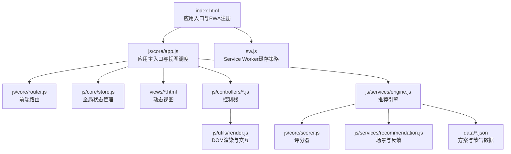
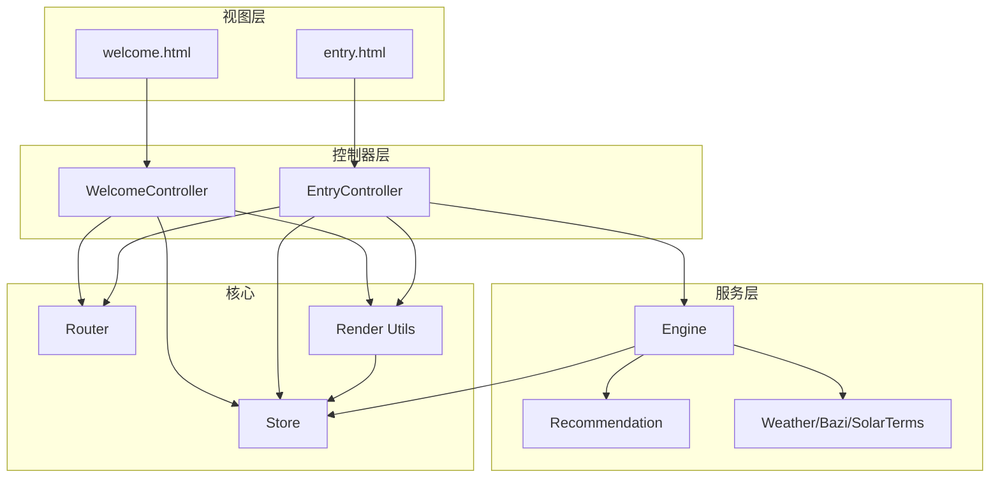
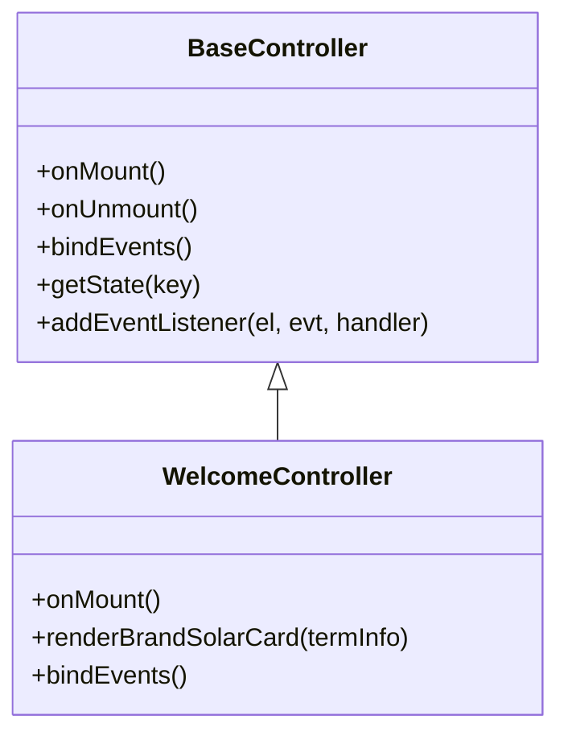
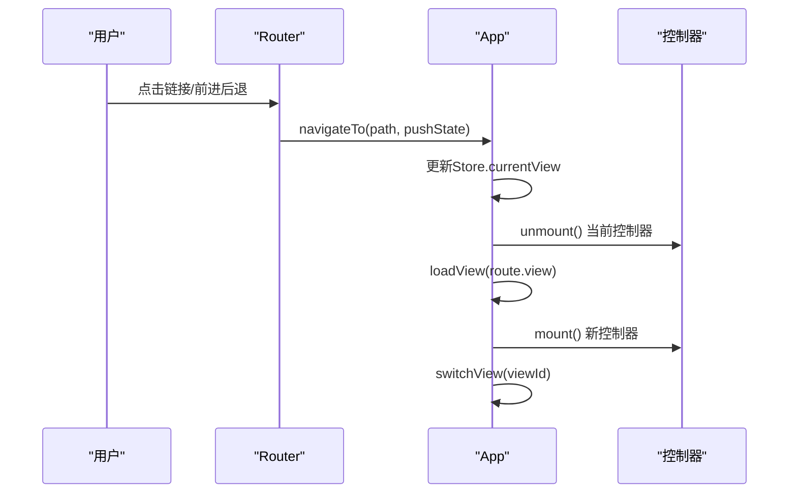
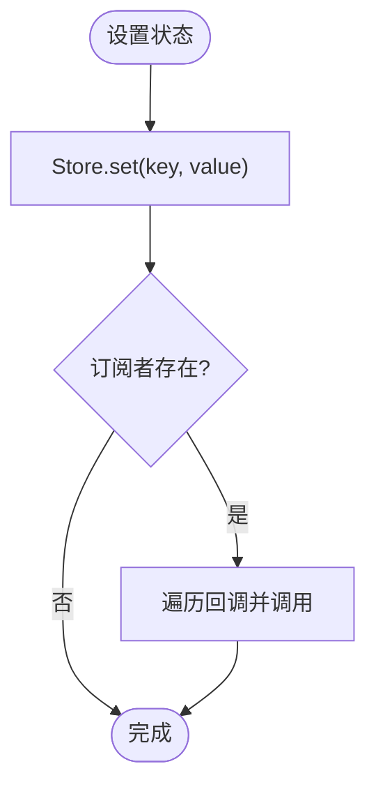
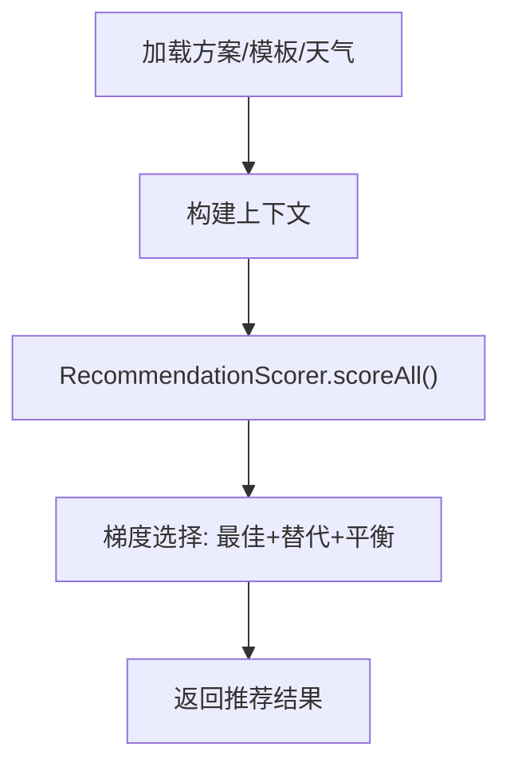
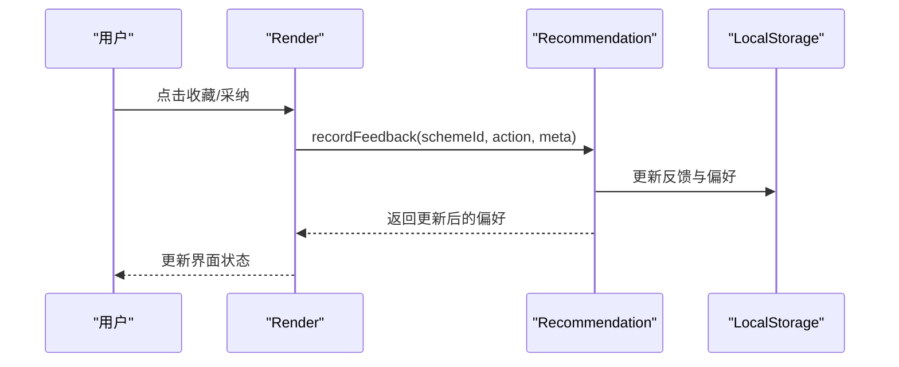
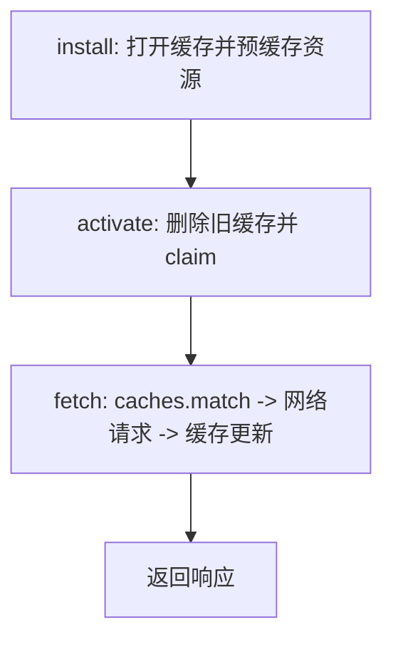
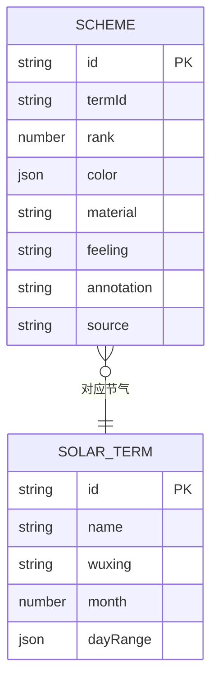
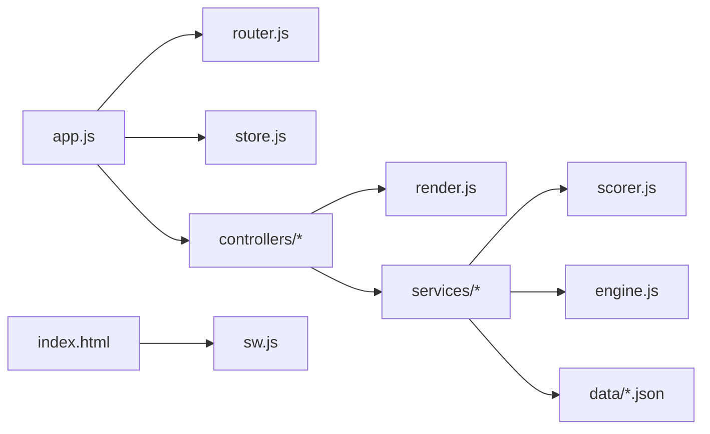

# 项目概述

<cite>
**本文档引用的文件**
- [index.html](file://index.html)
- [sw.js](file://sw.js)
- [app.js](file://js/core/app.js)
- [router.js](file://js/core/router.js)
- [store.js](file://js/core/store.js)
- [scorer.js](file://js/core/scorer.js)
- [engine.js](file://js/services/engine.js)
- [recommendation.js](file://js/services/recommendation.js)
- [render.js](file://js/utils/render.js)
- [welcome.js](file://js/controllers/welcome.js)
- [schemes.json](file://data/schemes.json)
- [solar-terms.json](file://data/solar-terms.json)
- [entry.html](file://views/entry.html)
- [welcome.html](file://views/welcome.html)
</cite>

## 目录
1. [引言](#引言)
2. [项目结构](#项目结构)
3. [核心组件](#核心组件)
4. [架构总览](#架构总览)
5. [详细组件分析](#详细组件分析)
6. [依赖分析](#依赖分析)
7. [性能考虑](#性能考虑)
8. [故障排查指南](#故障排查指南)
9. [结论](#结论)
10. [附录](#附录)

## 引言
“五行穿搭建议”是一个融合中国传统五行理论与二十四节气文化，结合现代前端技术的智能穿搭推荐系统。项目以纯前端实现为核心，通过MVC架构、模块化设计与PWA技术，提供无需服务器、可离线使用的个性化穿搭建议体验。用户可在“欢迎页”了解当季节气与五行属性，在“信息输入页”选择场景、心愿与生辰八字，系统基于节气、天气、个人命理与今日运势生成三套推荐方案，并支持收藏、分享与反馈闭环。

## 项目结构
项目采用“视图-控制器-服务-工具-数据”分层组织，配合Service Worker实现PWA离线能力与静态资源缓存。

图表来源
- [index.html](file://index.html#L1-L79)
- [app.js](file://js/core/app.js#L1-L206)
- [router.js](file://js/core/router.js#L1-L142)
- [store.js](file://js/core/store.js#L1-L212)
- [engine.js](file://js/services/engine.js#L1-L425)
- [scorer.js](file://js/core/scorer.js#L1-L317)
- [recommendation.js](file://js/services/recommendation.js#L1-L466)
- [render.js](file://js/utils/render.js#L1-L487)
- [schemes.json](file://data/schemes.json#L1-L509)
- [solar-terms.json](file://data/solar-terms.json#L1-L42)
- [sw.js](file://sw.js#L1-L165)

章节来源
- [index.html](file://index.html#L1-L79)
- [app.js](file://js/core/app.js#L1-L206)
- [router.js](file://js/core/router.js#L1-L142)
- [store.js](file://js/core/store.js#L1-L212)
- [engine.js](file://js/services/engine.js#L1-L425)
- [scorer.js](file://js/core/scorer.js#L1-L317)
- [recommendation.js](file://js/services/recommendation.js#L1-L466)
- [render.js](file://js/utils/render.js#L1-L487)
- [schemes.json](file://data/schemes.json#L1-L509)
- [solar-terms.json](file://data/solar-terms.json#L1-L42)
- [sw.js](file://sw.js#L1-L165)

## 核心组件
- 应用主入口与视图调度：负责初始化路由、全局错误处理、首屏视图预加载与控制器生命周期管理。
- 前端路由：支持浏览器前进后退、URL状态同步与链接拦截，驱动视图切换。
- 全局状态管理：集中管理节气、用户输入、推荐结果、收藏列表与UI状态，支持订阅与批量更新。
- 推荐引擎：加载方案与模板数据，构建上下文（节气、心愿、八字、天气、运势），使用评分器进行梯度推荐。
- 评分器：封装评分维度与权重，支持缓存、解释生成与多场景适配。
- 场景与反馈：定义丰富场景偏好、记录用户反馈并更新个性化权重。
- 渲染工具：统一渲染卡片、模态框、Toast提示与收藏列表，支持展开/收起推荐理由。
- 数据与视图：方案与节气数据JSON，动态视图HTML按需加载。

章节来源
- [app.js](file://js/core/app.js#L1-L206)
- [router.js](file://js/core/router.js#L1-L142)
- [store.js](file://js/core/store.js#L1-L212)
- [engine.js](file://js/services/engine.js#L1-L425)
- [scorer.js](file://js/core/scorer.js#L1-L317)
- [recommendation.js](file://js/services/recommendation.js#L1-L466)
- [render.js](file://js/utils/render.js#L1-L487)

## 架构总览
系统遵循MVC与模块化设计，视图通过控制器与服务交互，状态通过Store集中管理，推荐流程贯穿数据加载、上下文构建、评分与选择策略。

图表来源
- [welcome.html](file://views/welcome.html#L1-L37)
- [entry.html](file://views/entry.html#L1-L234)
- [welcome.js](file://js/controllers/welcome.js#L1-L134)
- [router.js](file://js/core/router.js#L1-L142)
- [store.js](file://js/core/store.js#L1-L212)
- [render.js](file://js/utils/render.js#L1-L487)
- [engine.js](file://js/services/engine.js#L1-L425)
- [recommendation.js](file://js/services/recommendation.js#L1-L466)

## 详细组件分析

### MVC与模块化设计
- 视图：通过动态加载方式按需引入，减少首屏负担；控制器负责事件绑定与视图渲染。
- 控制器：继承基类，统一挂载/卸载生命周期，与路由、状态与渲染工具协作。
- 服务：独立模块封装业务逻辑（推荐、天气、场景偏好、反馈），便于测试与复用。
- 工具：渲染、分享、上传、个人资料等工具函数，职责单一，便于维护。

图表来源
- [welcome.js](file://js/controllers/welcome.js#L1-L134)

章节来源
- [welcome.js](file://js/controllers/welcome.js#L1-L134)

### 前端路由与视图切换
- 路由监听 popstate 与链接点击，维护当前路由与浏览器历史，派发自定义事件驱动控制器切换。
- 应用在初始化时预加载首屏视图，后续视图按需加载，提升首屏性能。

图表来源
- [router.js](file://js/core/router.js#L1-L142)
- [app.js](file://js/core/app.js#L145-L184)

章节来源
- [router.js](file://js/core/router.js#L1-L142)
- [app.js](file://js/core/app.js#L1-L206)

### 全局状态管理与订阅
- Store 提供响应式状态、订阅机制与重置能力；控制器与服务通过键名常量读写状态，保证一致性。
- 支持批量设置与调试快照，便于开发与问题定位。

图表来源
- [store.js](file://js/core/store.js#L1-L212)

章节来源
- [store.js](file://js/core/store.js#L1-L212)

### 推荐引擎与评分器
- 推荐引擎加载方案与模板，构建上下文（节气、天气、心愿、八字、运势），使用评分器对方案进行多维评分与梯度选择。
- 评分器支持缓存、解释生成与权重动态调整，解释维度包括节气匹配、八字喜用、场景适配、天气调候、心愿契合、历史偏好、今日运势。

图表来源
- [engine.js](file://js/services/engine.js#L323-L393)
- [scorer.js](file://js/core/scorer.js#L266-L276)

章节来源
- [engine.js](file://js/services/engine.js#L1-L425)
- [scorer.js](file://js/core/scorer.js#L1-L317)

### 场景偏好与反馈闭环
- 场景偏好定义了不同场景下的五行与材质倾向，用于提升推荐的场景适配度。
- 反馈记录用户对方案的行为（浏览、收藏、采纳、忽略），更新个性化权重，形成持续优化的闭环。

图表来源
- [recommendation.js](file://js/services/recommendation.js#L145-L218)
- [render.js](file://js/utils/render.js#L1-L487)

章节来源
- [recommendation.js](file://js/services/recommendation.js#L1-L466)
- [render.js](file://js/utils/render.js#L1-L487)

### PWA与离线缓存
- Service Worker 预缓存核心脚本、样式、数据与视图，安装阶段清理旧缓存，激活阶段 claim 控制页面，fetch 阶段采用 Stale-While-Revalidate 策略。
- 应用在 index.html 中注册 SW，确保离线可用与快速回退。

图表来源
- [sw.js](file://sw.js#L52-L155)

章节来源
- [sw.js](file://sw.js#L1-L165)
- [index.html](file://index.html#L64-L76)

### 数据模型与方案来源
- 方案数据包含节气ID、排名、色彩（名称、十六进制、五行）、材质、感受、注解与典籍出处，覆盖二十四节气与五运六气的对应关系。
- 节气数据定义了每个节气的五行属性与季节归属，用于推荐上下文构建。

图表来源
- [schemes.json](file://data/schemes.json#L1-L509)
- [solar-terms.json](file://data/solar-terms.json#L1-L42)

章节来源
- [schemes.json](file://data/schemes.json#L1-L509)
- [solar-terms.json](file://data/solar-terms.json#L1-L42)

## 依赖分析
- 控制器依赖路由与状态，渲染工具依赖状态与服务，引擎依赖评分器与服务模块，Service Worker 依赖预缓存清单。
- 模块间耦合低，通过导出接口与常量键名降低耦合风险；控制器与服务通过事件与Store交互，避免直接互相引用。

图表来源
- [app.js](file://js/core/app.js#L1-L206)
- [router.js](file://js/core/router.js#L1-L142)
- [store.js](file://js/core/store.js#L1-L212)
- [render.js](file://js/utils/render.js#L1-L487)
- [engine.js](file://js/services/engine.js#L1-L425)
- [scorer.js](file://js/core/scorer.js#L1-L317)
- [index.html](file://index.html#L1-L79)
- [sw.js](file://sw.js#L1-L165)

章节来源
- [app.js](file://js/core/app.js#L1-L206)
- [router.js](file://js/core/router.js#L1-L142)
- [store.js](file://js/core/store.js#L1-L212)
- [render.js](file://js/utils/render.js#L1-L487)
- [engine.js](file://js/services/engine.js#L1-L425)
- [scorer.js](file://js/core/scorer.js#L1-L317)
- [index.html](file://index.html#L1-L79)
- [sw.js](file://sw.js#L1-L165)

## 性能考虑
- 按需加载：视图与控制器按需加载，首屏仅加载必要资源，减少初始包体。
- 缓存策略：Service Worker 预缓存与 Stale-While-Revalidate，显著提升离线与弱网体验。
- 渲染优化：卡片动画延迟、解释展开/收起、Toast 消息复用，避免频繁重排。
- 评分缓存：评分器内部缓存计算结果，减少重复评分成本。
- 数据体积：方案与节气数据以JSON形式内嵌，便于快速解析与离线使用。

## 故障排查指南
- 路由异常：检查路由初始化与 popstate 监听，确认自定义事件是否正确派发。
- 视图不显示：确认视图容器是否存在、switchView 是否正确切换隐藏类。
- 推荐为空：检查数据加载（方案/模板/天气）是否成功，上下文构建是否包含必要字段。
- 收藏/反馈无效：确认本地存储可用，反馈记录函数是否被调用，偏好更新逻辑是否执行。
- 离线不可用：检查 Service Worker 注册与缓存清单，确认 install/activate 步骤是否成功。

章节来源
- [router.js](file://js/core/router.js#L1-L142)
- [app.js](file://js/core/app.js#L174-L184)
- [engine.js](file://js/services/engine.js#L323-L393)
- [recommendation.js](file://js/services/recommendation.js#L145-L218)
- [sw.js](file://sw.js#L52-L155)

## 结论
本项目以纯前端实现为基础，结合MVC与模块化设计，将中国传统的五行与节气文化与现代推荐算法、PWA技术融合，实现了无需服务器、可离线运行、可扩展的智能穿搭推荐系统。通过清晰的分层与职责划分，既满足初学者的理解需求，也为经验丰富的开发者提供了良好的扩展空间与实践范式。

## 附录
- 实际使用场景示例
  - 用户在“欢迎页”看到当季节气与五行提示，点击“开始今日穿搭”进入“信息输入页”。
  - 在“信息输入页”选择场景（如职场/约会）、心愿（如升职加薪/桃花朵朵），填写生辰八字（可选）。
  - 点击“生成今日穿搭”，系统基于节气、天气、八字与今日运势生成三套推荐方案，支持收藏、分享与查看详情。
  - 在“我的收藏”查看已收藏方案；在“我的画像”查看个人偏好与反馈统计。

章节来源
- [welcome.html](file://views/welcome.html#L1-L37)
- [entry.html](file://views/entry.html#L1-L234)
- [engine.js](file://js/services/engine.js#L323-L393)
- [render.js](file://js/utils/render.js#L119-L132)