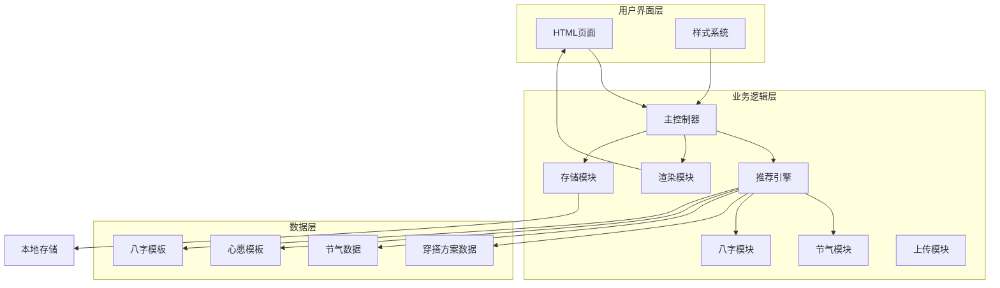
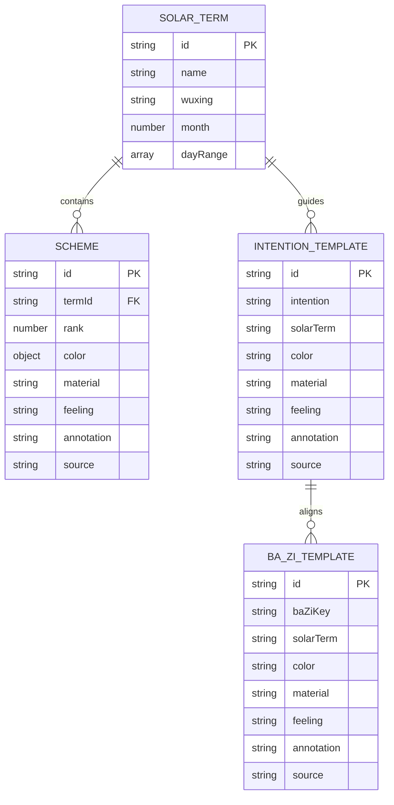
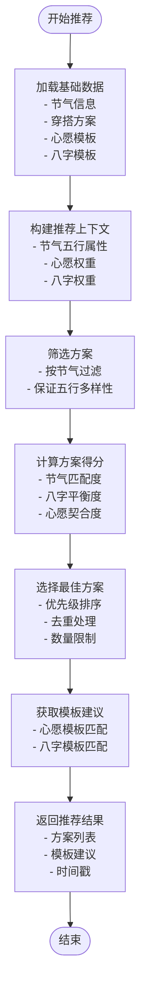

# 项目概述

<cite>
**本文档引用的文件**
- [index.html](file://index.html)
- [main.js](file://js/main.js)
- [engine.js](file://js/engine.js)
- [solar-terms.js](file://js/solar-terms.js)
- [bazi.js](file://js/bazi.js)
- [render.js](file://js/render.js)
- [storage.js](file://js/storage.js)
- [upload.js](file://js/upload.js)
- [schemes.json](file://data/schemes.json)
- [solar-terms.json](file://data/solar-terms.json)
- [intention-templates.json](file://data/intention-templates.json)
- [bazi-templates.json](file://data/bazi-templates.json)
- [base.css](file://css/base.css)
</cite>

## 目录
1. [项目简介](#项目简介)
2. [核心目标与设计理念](#核心目标与设计理念)
3. [技术架构概览](#技术架构概览)
4. [核心功能特性](#核心功能特性)
5. [数据模型与算法](#数据模型与算法)
6. [用户体验价值](#用户体验价值)
7. [技术选型与实现特色](#技术选型与实现特色)
8. [与其他应用的差异化优势](#与其他应用的差异化优势)
9. [使用场景与适用人群](#使用场景与适用人群)
10. [总结](#总结)

## 项目简介

"五行穿搭建议"是一个基于中国传统文化五行理论和二十四节气文化的智能穿搭推荐系统。该项目旨在帮助用户在不同节气和时节中，做出更符合自然规律和个人需求的穿搭选择，实现"以衣养身"的理念。

项目通过现代Web技术实现了一个完整的前端应用，无需服务器端支持即可运行，所有数据都存储在用户的本地设备中，确保了隐私安全和离线可用性。

## 核心目标与设计理念

### 核心目标
- **传承文化**：将传统五行理论与现代生活相结合，让用户在日常穿搭中体验传统文化智慧
- **科学指导**：基于二十四节气的自然变化规律，为用户提供科学合理的穿搭建议
- **个性化服务**：结合用户个人的生辰八字，提供更加精准的个性化推荐
- **实用价值**：帮助用户在不同季节、不同情境下选择最适合的服装搭配

### 设计理念
- **天人合一**：强调人与自然的和谐统一，让穿搭与自然节律同步
- **循序渐进**：从简单的节气推荐开始，逐步引入更复杂的个性化分析
- **易用性优先**：提供直观的操作界面和流畅的用户体验
- **文化传承**：在保持实用性的同时，注重传统文化的传播和教育价值

## 技术架构概览

**架构图来源**
- [main.js](file://js/main.js#L1-L317)
- [engine.js](file://js/engine.js#L1-L335)
- [solar-terms.js](file://js/solar-terms.js#L1-L118)
- [bazi.js](file://js/bazi.js#L1-L193)

### 分层架构特点
- **单页应用(SPA)**：采用单页应用模式，提供流畅的用户体验
- **模块化设计**：每个功能模块职责明确，便于维护和扩展
- **数据驱动**：通过JSON数据文件驱动内容展示，易于更新和定制
- **本地化存储**：所有用户数据存储在本地，确保隐私安全

## 核心功能特性

### 1. 节气智能识别
系统能够自动检测当前的二十四节气，包括：
- 实时节气状态显示
- 当前节气与下一个节气的对比
- 五行属性的动态展示
- 季节性的色彩建议

### 2. 个性化八字分析
提供简化的八字计算功能：
- 年柱、月柱、日柱、时柱的计算
- 五行分布统计分析
- 强弱五行识别与推荐
- 个性化的五行补充建议

### 3. 智能穿搭推荐
基于多维度因素的推荐算法：
- 节气五行匹配度计算
- 个人八字五行平衡考虑
- 心愿目标的个性化调整
- 材质、触感、色彩的综合考量

### 4. 互动式上传反馈
用户可以分享和记录自己的穿搭体验：
- 穿搭照片上传与压缩
- 当日穿搭感受记录
- 个性化反馈收集
- 数据本地化存储

### 5. 文化知识普及
每个推荐都配有详细的文化背景：
- 典籍出处说明
- 五行理论解读
- 传统医学观点
- 生活实践指导

**功能特性来源**
- [index.html](file://index.html#L24-L196)
- [main.js](file://js/main.js#L26-L67)
- [engine.js](file://js/engine.js#L268-L310)

## 数据模型与算法

### 数据结构设计

**数据模型图来源**
- [schemes.json](file://data/schemes.json#L1-L509)
- [solar-terms.json](file://data/solar-terms.json#L1-L42)
- [intention-templates.json](file://data/intention-templates.json#L1-L253)
- [bazi-templates.json](file://data/bazi-templates.json#L1-L103)

### 推荐算法流程

**算法流程图来源**
- [engine.js](file://js/engine.js#L268-L310)
- [engine.js](file://js/engine.js#L218-L259)

### 评分机制设计

推荐系统采用多权重评分机制：

| 评分维度 | 权重 | 计算方式 | 说明 |
|---------|------|----------|------|
| 节气匹配 | 50% | 完全匹配=100%，相生=60% | 体现与当前节气的契合度 |
| 八字平衡 | 20% | 完全匹配=100%，相生=60% | 体现对个人五行的调节作用 |
| 心愿契合 | 30% | 按节气距离加权 | 体现对特定目标的支持程度 |

**评分机制来源**
- [engine.js](file://js/engine.js#L157-L173)
- [engine.js](file://js/engine.js#L178-L199)

## 用户体验价值

### 1. 文化教育价值
- **传统智慧传承**：让用户在日常生活中体验和学习传统文化
- **科学认知提升**：通过实际应用加深对五行理论的理解
- **文化自信培养**：增强对中华优秀传统文化的认同感

### 2. 实用指导价值
- **科学穿搭建议**：基于自然规律的实用指导
- **个性化服务**：针对个人特点的定制化建议
- **成本效益**：避免盲目购买，提高穿搭效率

### 3. 交互体验价值
- **简洁直观**：清晰的操作流程和界面设计
- **即时反馈**：实时的节气信息和推荐结果
- **情感连接**：通过心愿功能建立用户参与感

### 4. 社会价值
- **文化传播**：通过数字化手段推广传统文化
- **健康意识**：促进人们对自然规律和身体健康的关注
- **创新融合**：传统与现代科技的有机结合

## 技术选型与实现特色

### 前端技术栈
- **纯前端实现**：无需服务器，直接在浏览器中运行
- **模块化JavaScript**：采用ES6模块规范，代码结构清晰
- **原生DOM操作**：避免第三方框架依赖，提高性能和稳定性
- **响应式设计**：适配各种移动设备和桌面环境

### 数据存储策略
- **本地存储**：所有用户数据存储在localStorage中
- **数据持久化**：支持心愿偏好、历史记录、上传图片等
- **隐私保护**：数据完全在用户本地，不涉及云端传输
- **数据迁移**：支持跨设备的数据备份和恢复

### 性能优化措施
- **懒加载机制**：按需加载数据文件，减少初始加载时间
- **图片压缩**：自动压缩上传的图片，控制存储空间
- **动画优化**：使用CSS3硬件加速，确保流畅的视觉效果
- **内存管理**：及时清理不需要的DOM元素和事件监听器

### 可访问性设计
- **语义化HTML**：使用正确的HTML标签和ARIA属性
- **键盘导航**：支持完整的键盘操作体验
- **屏幕阅读器**：为视障用户提供良好的辅助功能
- **色彩对比**：确保足够的色彩对比度，便于阅读

**技术实现来源**
- [main.js](file://js/main.js#L1-L317)
- [storage.js](file://js/storage.js#L1-L116)
- [upload.js](file://js/upload.js#L1-L145)

## 与其他应用的差异化优势

### 1. 文化深度优势
- **理论基础扎实**：基于完整的五行理论体系和二十四节气文化
- **典籍支撑**：每个推荐都有明确的古典文献出处
- **哲学内涵**：不仅提供穿搭建议，更传递深层的文化智慧

### 2. 个性化程度优势
- **八字分析**：提供简化的八字计算和分析功能
- **心愿定制**：支持用户设定特定的心愿目标
- **动态调整**：根据用户反馈不断优化推荐算法

### 3. 技术实现优势
- **纯前端架构**：无需服务器，部署简单，运行稳定
- **本地化存储**：确保用户隐私和数据安全
- **离线可用**：网络不佳时仍可正常使用核心功能

### 4. 用户体验优势
- **简洁直观**：操作流程简单，学习成本低
- **即时反馈**：实时显示节气信息和推荐结果
- **文化沉浸**：通过界面设计营造传统文化氛围

### 5. 教育价值优势
- **寓教于乐**：在使用过程中自然学习传统文化知识
- **实践导向**：将理论知识转化为实际的生活指导
- **持续学习**：用户可以通过使用不断提升相关认知

## 使用场景与适用人群

### 主要使用场景

#### 1. 日常穿搭决策
- **季节转换**：春夏秋冬不同季节的服装选择
- **特殊场合**：工作面试、社交活动、运动健身等场景
- **个人状态**：根据身体状况和心情变化调整穿搭

#### 2. 文化学习体验
- **传统文化爱好者**：希望深入了解五行理论和节气文化
- **养生关注者**：希望通过穿搭改善身体健康状况
- **美学追求者**：注重色彩搭配和材质选择的美感体验

#### 3. 生活实践应用
- **健康管理**：通过合适的穿搭调节身体状态
- **心理调节**：利用色彩和材质影响情绪和精神状态
- **社交礼仪**：在不同场合选择合适的着装风格

### 适用人群特征

#### 1. 年龄层次
- **青少年群体**：对传统文化感兴趣，愿意尝试新的生活方式
- **成年白领**：注重生活品质，追求科学合理的生活方式
- **中老年群体**：关注养生保健，重视传统文化的价值

#### 2. 教育背景
- **文化素养较高**：对传统文化有一定了解和兴趣
- **科学思维较强**：希望用科学方法验证传统智慧
- **实用主义倾向**：注重实际效果和生活便利性

#### 3. 生活方式
- **慢生活倡导者**：享受慢慢品味生活的乐趣
- **健康生活追求者**：注重身心健康的平衡发展
- **文化传承支持者**：愿意为传统文化的传承贡献力量

## 总结

"五行穿搭建议"项目成功地将深厚的中华传统文化与现代科技手段相结合，创造出了一个既具有文化价值又具备实用功能的创新应用。项目通过以下核心优势，为用户提供了独特的价值体验：

### 核心价值体现

**文化传承价值**：项目不仅是简单的穿搭工具，更是传统文化传承的重要载体，让用户在日常生活中自然地接触和学习传统文化知识。

**科学指导价值**：基于严谨的五行理论和二十四节气文化，为用户提供科学合理的穿搭建议，体现了传统智慧与现代科学的完美结合。

**个性化服务价值**：通过简化的八字分析和心愿设置，为不同用户提供量身定制的穿搭方案，满足了现代人对个性化服务的需求。

**技术创新价值**：采用纯前端架构和本地化存储的技术方案，在保证用户体验的同时，确保了数据安全和隐私保护。

### 发展前景展望

随着人们对传统文化的重视程度不断提高，以及对个性化服务需求的日益增长，"五行穿搭建议"项目具有广阔的发展前景。未来可以在以下方面进一步完善和发展：

- **算法优化**：持续改进推荐算法，提高推荐的准确性和个性化程度
- **功能扩展**：增加更多实用功能，如天气联动、品牌推荐等
- **社区建设**：建立用户社区，促进经验分享和文化交流
- **产品化**：探索商业化模式，为更多用户提供优质服务

该项目不仅为用户提供了实用的穿搭指导，更重要的是为中华优秀传统文化的传承和发展贡献了新的力量，体现了传统智慧在现代社会中的价值和意义。